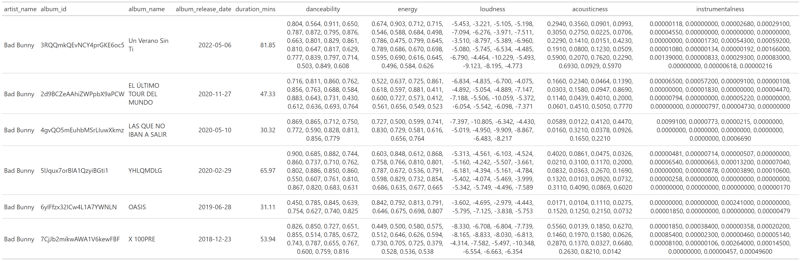
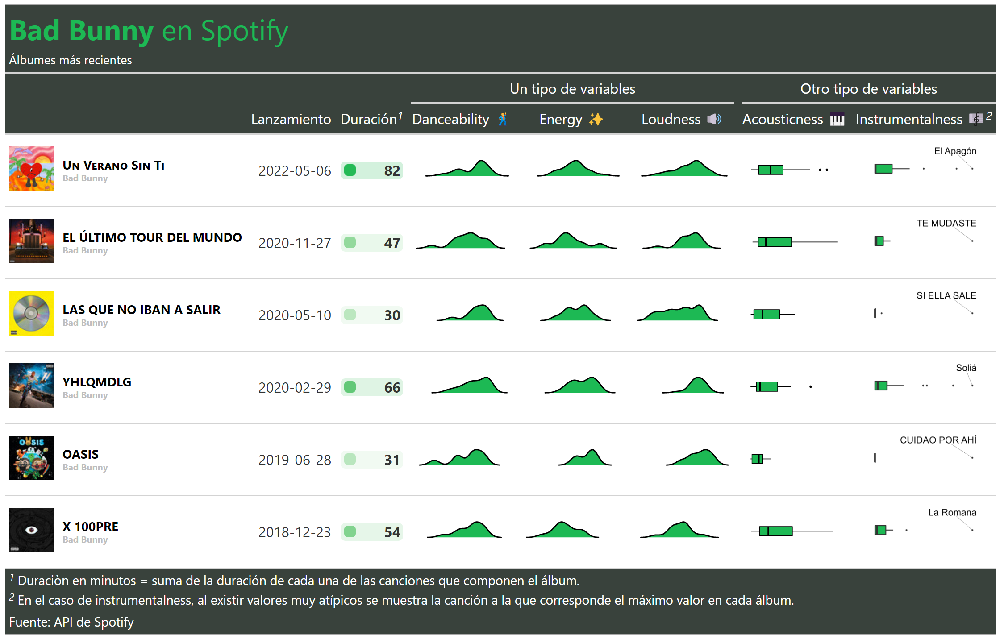
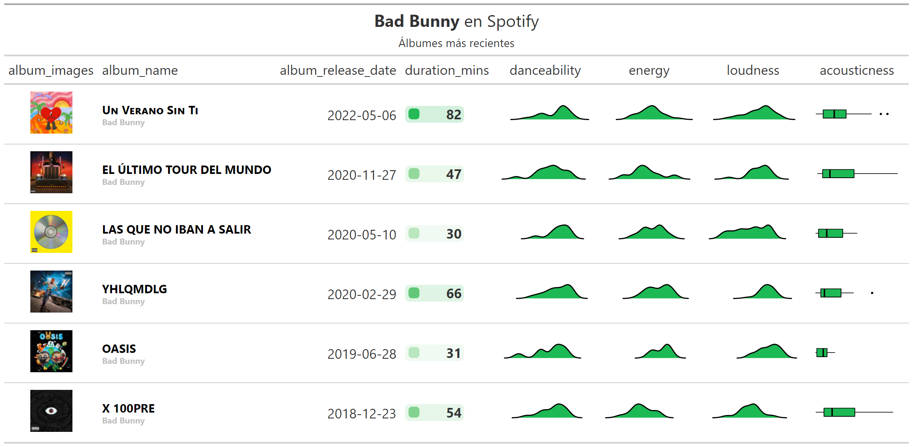
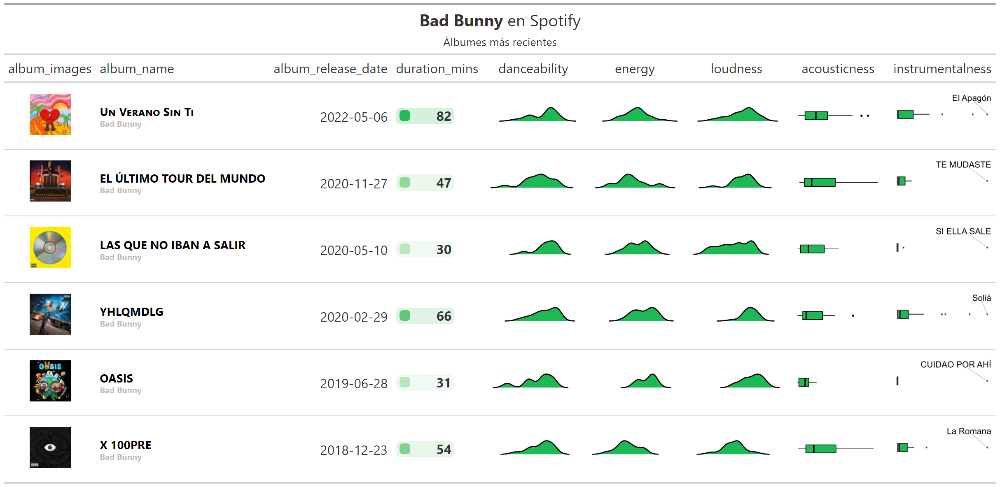
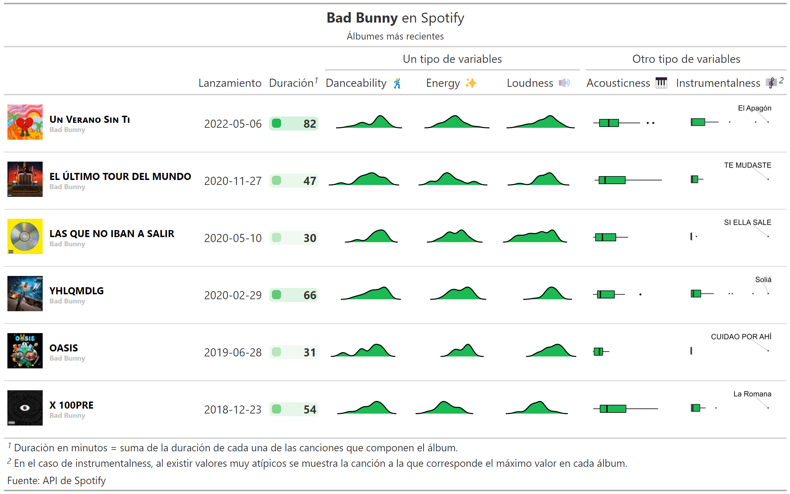

Tablas GT y Spotify
================
RLadies BA
2022-07-30

# 1. Librerías

Se definen los paquetes 📦 a utilizar:

``` r
library(tidyverse) # Manipulación de datos
library(gt)        # Tablas gt: grammar of tables
library(gtExtras)  # Extras de tablas gt
library(spotifyr)  # API de spotify
library(gtrendsR)  # Google trends API
library("rjson")
```

## 2. API Spotify - Credenciales

Se cuenta con un archivo **(credentials..json)**, que contiene las
siguientes variables obtenidas de la página de desarrolladores de
Spotify:

- SPOTIFY_CLIENT_ID

- SPOTIFY_CLIENT_SECRET

El formato del archivo **credentials.json** está incluido en el
.gitignore del repositorio. Esto permite mantener las credenciales
anónimas (sin publicar en repositorios), dado que son personales y no
deben compartirse. A continuación se muestra el formato de este archivo:

``` r
{
  "SPOTIFY_CLIENT_ID" : "SPOTIFY_CLIENT_ID",
  "SPOTIFY_CLIENT_SECRET" : "SPOTIFY_CLIENT_SECRET"

}
```

Se realiza la lectura de las credenciales mediante la función
fromJSON(). Luego, se setean como variables de entorno:

``` r
credentials <- fromJSON(file = "credentials.json")

Sys.setenv(SPOTIFY_CLIENT_ID = credentials$SPOTIFY_CLIENT_ID)
Sys.setenv(SPOTIFY_CLIENT_SECRET = credentials$SPOTIFY_CLIENT_SECRET)
```

Se utiliza la función **get_spotify_access_token**() del paquete
{**spotifyr**} 📦para autenticarse a la API\>

``` r
access_token <- get_spotify_access_token()
```

Para verificar que la autenticación haya sido exitosa, se realiza una
consulta de los artistas más escuchados:

``` r
tabla_user <- get_my_top_artists_or_tracks(
    type = 'artists', 
    time_range = 'short_term', #'short_term', # 'medium_term', 'long_term' 
    limit = 10) %>%
  select(name, genres) %>%
  rowwise() %>%
  mutate(genres = paste(genres, collapse = ', ')) %>%
  ungroup %>%
  gt()
```

# Caso: análisis de un artista particular

Se define el artista a utilizar:

``` r
ARTISTA = 'bad bunny'
```

Para este artista, se genera una búsqueda de variables:

``` r
vars_audio = c(
  'danceability', 'energy', 'loudness', 'acousticness', 'instrumentalness'
)
```

``` r
tracks_features <- get_artist_audio_features(artist = ARTISTA) %>%
  
  select(
    artist_id, artist_name, album_id, album_name,
    album_release_date, album_images, track_name, duration_ms,

    # Variables vinculadas al audio:
    all_of(vars_audio)       
  ) %>% 
  
  arrange(desc(album_release_date))
```

``` r
# tracks_features %>% saveRDS('tracks_features.rds')
tracks_features <- readRDS('tracks_features.rds')
```

Se cuenta con un df de variables vinculadas a cada canción de cada álbum
del artista seleccionado:

``` r
tracks_features %>% 
  glimpse()
```

    ## Rows: 92
    ## Columns: 13
    ## $ artist_id          <chr> "4q3ewBCX7sLwd24euuV69X", "4q3ewBCX7sLwd24euuV69X",…
    ## $ artist_name        <chr> "Bad Bunny", "Bad Bunny", "Bad Bunny", "Bad Bunny",…
    ## $ album_id           <chr> "3RQQmkQEvNCY4prGKE6oc5", "3RQQmkQEvNCY4prGKE6oc5",…
    ## $ album_name         <chr> "Un Verano Sin Ti", "Un Verano Sin Ti", "Un Verano …
    ## $ album_release_date <chr> "2022-05-06", "2022-05-06", "2022-05-06", "2022-05-…
    ## $ album_images       <list> [<data.frame[3 x 3]>], [<data.frame[3 x 3]>], [<da…
    ## $ track_name         <chr> "Moscow Mule", "Después de la Playa", "Me Porto Bon…
    ## $ duration_ms        <int> 245939, 230400, 178567, 243716, 176936, 230704, 237…
    ## $ danceability       <dbl> 0.804, 0.564, 0.911, 0.650, 0.787, 0.872, 0.795, 0.…
    ## $ energy             <dbl> 0.674, 0.903, 0.712, 0.715, 0.546, 0.588, 0.684, 0.…
    ## $ loudness           <dbl> -5.453, -3.221, -5.105, -5.198, -7.094, -6.276, -3.…
    ## $ acousticness       <dbl> 0.2940, 0.3560, 0.0901, 0.0993, 0.3050, 0.2750, 0.0…
    ## $ instrumentalness   <dbl> 0.00000118, 0.00000000, 0.00002680, 0.00029100, 0.0…

# 3. The grammar of tables (gt)

## 3.1 Intro a gt

``` r
tabla <- tracks_features %>% 
  head() %>% 
  select(artist_name, album_name, all_of(vars_audio)) %>% 
  gt()
```

``` r
tabla
```

``` r
knitr::include_graphics('tablas/tabla_1.png')
```

<!-- -->

Notar que las variables numéricas aparecen con muchos decimales. Una
forma sencilla de arreglar esto en {gt} es la siguiente. En este caso,
dejando 4 decimales para visualizar la variable instrumentalness:

``` r
tabla %>% 
  fmt_number(columns = where(is.numeric), decimals=4)
```

<div id="mqxndbawkt" style="overflow-x:auto;overflow-y:auto;width:auto;height:auto;">
<style>html {
  font-family: -apple-system, BlinkMacSystemFont, 'Segoe UI', Roboto, Oxygen, Ubuntu, Cantarell, 'Helvetica Neue', 'Fira Sans', 'Droid Sans', Arial, sans-serif;
}

#mqxndbawkt .gt_table {
  display: table;
  border-collapse: collapse;
  margin-left: auto;
  margin-right: auto;
  color: #333333;
  font-size: 16px;
  font-weight: normal;
  font-style: normal;
  background-color: #FFFFFF;
  width: auto;
  border-top-style: solid;
  border-top-width: 2px;
  border-top-color: #A8A8A8;
  border-right-style: none;
  border-right-width: 2px;
  border-right-color: #D3D3D3;
  border-bottom-style: solid;
  border-bottom-width: 2px;
  border-bottom-color: #A8A8A8;
  border-left-style: none;
  border-left-width: 2px;
  border-left-color: #D3D3D3;
}

#mqxndbawkt .gt_heading {
  background-color: #FFFFFF;
  text-align: center;
  border-bottom-color: #FFFFFF;
  border-left-style: none;
  border-left-width: 1px;
  border-left-color: #D3D3D3;
  border-right-style: none;
  border-right-width: 1px;
  border-right-color: #D3D3D3;
}

#mqxndbawkt .gt_title {
  color: #333333;
  font-size: 125%;
  font-weight: initial;
  padding-top: 4px;
  padding-bottom: 4px;
  padding-left: 5px;
  padding-right: 5px;
  border-bottom-color: #FFFFFF;
  border-bottom-width: 0;
}

#mqxndbawkt .gt_subtitle {
  color: #333333;
  font-size: 85%;
  font-weight: initial;
  padding-top: 0;
  padding-bottom: 6px;
  padding-left: 5px;
  padding-right: 5px;
  border-top-color: #FFFFFF;
  border-top-width: 0;
}

#mqxndbawkt .gt_bottom_border {
  border-bottom-style: solid;
  border-bottom-width: 2px;
  border-bottom-color: #D3D3D3;
}

#mqxndbawkt .gt_col_headings {
  border-top-style: solid;
  border-top-width: 2px;
  border-top-color: #D3D3D3;
  border-bottom-style: solid;
  border-bottom-width: 2px;
  border-bottom-color: #D3D3D3;
  border-left-style: none;
  border-left-width: 1px;
  border-left-color: #D3D3D3;
  border-right-style: none;
  border-right-width: 1px;
  border-right-color: #D3D3D3;
}

#mqxndbawkt .gt_col_heading {
  color: #333333;
  background-color: #FFFFFF;
  font-size: 100%;
  font-weight: normal;
  text-transform: inherit;
  border-left-style: none;
  border-left-width: 1px;
  border-left-color: #D3D3D3;
  border-right-style: none;
  border-right-width: 1px;
  border-right-color: #D3D3D3;
  vertical-align: bottom;
  padding-top: 5px;
  padding-bottom: 6px;
  padding-left: 5px;
  padding-right: 5px;
  overflow-x: hidden;
}

#mqxndbawkt .gt_column_spanner_outer {
  color: #333333;
  background-color: #FFFFFF;
  font-size: 100%;
  font-weight: normal;
  text-transform: inherit;
  padding-top: 0;
  padding-bottom: 0;
  padding-left: 4px;
  padding-right: 4px;
}

#mqxndbawkt .gt_column_spanner_outer:first-child {
  padding-left: 0;
}

#mqxndbawkt .gt_column_spanner_outer:last-child {
  padding-right: 0;
}

#mqxndbawkt .gt_column_spanner {
  border-bottom-style: solid;
  border-bottom-width: 2px;
  border-bottom-color: #D3D3D3;
  vertical-align: bottom;
  padding-top: 5px;
  padding-bottom: 5px;
  overflow-x: hidden;
  display: inline-block;
  width: 100%;
}

#mqxndbawkt .gt_group_heading {
  padding-top: 8px;
  padding-bottom: 8px;
  padding-left: 5px;
  padding-right: 5px;
  color: #333333;
  background-color: #FFFFFF;
  font-size: 100%;
  font-weight: initial;
  text-transform: inherit;
  border-top-style: solid;
  border-top-width: 2px;
  border-top-color: #D3D3D3;
  border-bottom-style: solid;
  border-bottom-width: 2px;
  border-bottom-color: #D3D3D3;
  border-left-style: none;
  border-left-width: 1px;
  border-left-color: #D3D3D3;
  border-right-style: none;
  border-right-width: 1px;
  border-right-color: #D3D3D3;
  vertical-align: middle;
}

#mqxndbawkt .gt_empty_group_heading {
  padding: 0.5px;
  color: #333333;
  background-color: #FFFFFF;
  font-size: 100%;
  font-weight: initial;
  border-top-style: solid;
  border-top-width: 2px;
  border-top-color: #D3D3D3;
  border-bottom-style: solid;
  border-bottom-width: 2px;
  border-bottom-color: #D3D3D3;
  vertical-align: middle;
}

#mqxndbawkt .gt_from_md > :first-child {
  margin-top: 0;
}

#mqxndbawkt .gt_from_md > :last-child {
  margin-bottom: 0;
}

#mqxndbawkt .gt_row {
  padding-top: 8px;
  padding-bottom: 8px;
  padding-left: 5px;
  padding-right: 5px;
  margin: 10px;
  border-top-style: solid;
  border-top-width: 1px;
  border-top-color: #D3D3D3;
  border-left-style: none;
  border-left-width: 1px;
  border-left-color: #D3D3D3;
  border-right-style: none;
  border-right-width: 1px;
  border-right-color: #D3D3D3;
  vertical-align: middle;
  overflow-x: hidden;
}

#mqxndbawkt .gt_stub {
  color: #333333;
  background-color: #FFFFFF;
  font-size: 100%;
  font-weight: initial;
  text-transform: inherit;
  border-right-style: solid;
  border-right-width: 2px;
  border-right-color: #D3D3D3;
  padding-left: 5px;
  padding-right: 5px;
}

#mqxndbawkt .gt_stub_row_group {
  color: #333333;
  background-color: #FFFFFF;
  font-size: 100%;
  font-weight: initial;
  text-transform: inherit;
  border-right-style: solid;
  border-right-width: 2px;
  border-right-color: #D3D3D3;
  padding-left: 5px;
  padding-right: 5px;
  vertical-align: top;
}

#mqxndbawkt .gt_row_group_first td {
  border-top-width: 2px;
}

#mqxndbawkt .gt_summary_row {
  color: #333333;
  background-color: #FFFFFF;
  text-transform: inherit;
  padding-top: 8px;
  padding-bottom: 8px;
  padding-left: 5px;
  padding-right: 5px;
}

#mqxndbawkt .gt_first_summary_row {
  border-top-style: solid;
  border-top-color: #D3D3D3;
}

#mqxndbawkt .gt_first_summary_row.thick {
  border-top-width: 2px;
}

#mqxndbawkt .gt_last_summary_row {
  padding-top: 8px;
  padding-bottom: 8px;
  padding-left: 5px;
  padding-right: 5px;
  border-bottom-style: solid;
  border-bottom-width: 2px;
  border-bottom-color: #D3D3D3;
}

#mqxndbawkt .gt_grand_summary_row {
  color: #333333;
  background-color: #FFFFFF;
  text-transform: inherit;
  padding-top: 8px;
  padding-bottom: 8px;
  padding-left: 5px;
  padding-right: 5px;
}

#mqxndbawkt .gt_first_grand_summary_row {
  padding-top: 8px;
  padding-bottom: 8px;
  padding-left: 5px;
  padding-right: 5px;
  border-top-style: double;
  border-top-width: 6px;
  border-top-color: #D3D3D3;
}

#mqxndbawkt .gt_striped {
  background-color: rgba(128, 128, 128, 0.05);
}

#mqxndbawkt .gt_table_body {
  border-top-style: solid;
  border-top-width: 2px;
  border-top-color: #D3D3D3;
  border-bottom-style: solid;
  border-bottom-width: 2px;
  border-bottom-color: #D3D3D3;
}

#mqxndbawkt .gt_footnotes {
  color: #333333;
  background-color: #FFFFFF;
  border-bottom-style: none;
  border-bottom-width: 2px;
  border-bottom-color: #D3D3D3;
  border-left-style: none;
  border-left-width: 2px;
  border-left-color: #D3D3D3;
  border-right-style: none;
  border-right-width: 2px;
  border-right-color: #D3D3D3;
}

#mqxndbawkt .gt_footnote {
  margin: 0px;
  font-size: 90%;
  padding-left: 4px;
  padding-right: 4px;
  padding-left: 5px;
  padding-right: 5px;
}

#mqxndbawkt .gt_sourcenotes {
  color: #333333;
  background-color: #FFFFFF;
  border-bottom-style: none;
  border-bottom-width: 2px;
  border-bottom-color: #D3D3D3;
  border-left-style: none;
  border-left-width: 2px;
  border-left-color: #D3D3D3;
  border-right-style: none;
  border-right-width: 2px;
  border-right-color: #D3D3D3;
}

#mqxndbawkt .gt_sourcenote {
  font-size: 90%;
  padding-top: 4px;
  padding-bottom: 4px;
  padding-left: 5px;
  padding-right: 5px;
}

#mqxndbawkt .gt_left {
  text-align: left;
}

#mqxndbawkt .gt_center {
  text-align: center;
}

#mqxndbawkt .gt_right {
  text-align: right;
  font-variant-numeric: tabular-nums;
}

#mqxndbawkt .gt_font_normal {
  font-weight: normal;
}

#mqxndbawkt .gt_font_bold {
  font-weight: bold;
}

#mqxndbawkt .gt_font_italic {
  font-style: italic;
}

#mqxndbawkt .gt_super {
  font-size: 65%;
}

#mqxndbawkt .gt_footnote_marks {
  font-style: italic;
  font-weight: normal;
  font-size: 75%;
  vertical-align: 0.4em;
}

#mqxndbawkt .gt_asterisk {
  font-size: 100%;
  vertical-align: 0;
}

#mqxndbawkt .gt_indent_1 {
  text-indent: 5px;
}

#mqxndbawkt .gt_indent_2 {
  text-indent: 10px;
}

#mqxndbawkt .gt_indent_3 {
  text-indent: 15px;
}

#mqxndbawkt .gt_indent_4 {
  text-indent: 20px;
}

#mqxndbawkt .gt_indent_5 {
  text-indent: 25px;
}
</style>
<table class="gt_table">
  
  <thead class="gt_col_headings">
    <tr>
      <th class="gt_col_heading gt_columns_bottom_border gt_left" rowspan="1" colspan="1" scope="col">artist_name</th>
      <th class="gt_col_heading gt_columns_bottom_border gt_left" rowspan="1" colspan="1" scope="col">album_name</th>
      <th class="gt_col_heading gt_columns_bottom_border gt_right" rowspan="1" colspan="1" scope="col">danceability</th>
      <th class="gt_col_heading gt_columns_bottom_border gt_right" rowspan="1" colspan="1" scope="col">energy</th>
      <th class="gt_col_heading gt_columns_bottom_border gt_right" rowspan="1" colspan="1" scope="col">loudness</th>
      <th class="gt_col_heading gt_columns_bottom_border gt_right" rowspan="1" colspan="1" scope="col">acousticness</th>
      <th class="gt_col_heading gt_columns_bottom_border gt_right" rowspan="1" colspan="1" scope="col">instrumentalness</th>
    </tr>
  </thead>
  <tbody class="gt_table_body">
    <tr><td class="gt_row gt_left">Bad Bunny</td>
<td class="gt_row gt_left">Un Verano Sin Ti</td>
<td class="gt_row gt_right">0.8040</td>
<td class="gt_row gt_right">0.6740</td>
<td class="gt_row gt_right">−5.4530</td>
<td class="gt_row gt_right">0.2940</td>
<td class="gt_row gt_right">0.0000</td></tr>
    <tr><td class="gt_row gt_left">Bad Bunny</td>
<td class="gt_row gt_left">Un Verano Sin Ti</td>
<td class="gt_row gt_right">0.5640</td>
<td class="gt_row gt_right">0.9030</td>
<td class="gt_row gt_right">−3.2210</td>
<td class="gt_row gt_right">0.3560</td>
<td class="gt_row gt_right">0.0000</td></tr>
    <tr><td class="gt_row gt_left">Bad Bunny</td>
<td class="gt_row gt_left">Un Verano Sin Ti</td>
<td class="gt_row gt_right">0.9110</td>
<td class="gt_row gt_right">0.7120</td>
<td class="gt_row gt_right">−5.1050</td>
<td class="gt_row gt_right">0.0901</td>
<td class="gt_row gt_right">0.0000</td></tr>
    <tr><td class="gt_row gt_left">Bad Bunny</td>
<td class="gt_row gt_left">Un Verano Sin Ti</td>
<td class="gt_row gt_right">0.6500</td>
<td class="gt_row gt_right">0.7150</td>
<td class="gt_row gt_right">−5.1980</td>
<td class="gt_row gt_right">0.0993</td>
<td class="gt_row gt_right">0.0003</td></tr>
    <tr><td class="gt_row gt_left">Bad Bunny</td>
<td class="gt_row gt_left">Un Verano Sin Ti</td>
<td class="gt_row gt_right">0.7870</td>
<td class="gt_row gt_right">0.5460</td>
<td class="gt_row gt_right">−7.0940</td>
<td class="gt_row gt_right">0.3050</td>
<td class="gt_row gt_right">0.0000</td></tr>
    <tr><td class="gt_row gt_left">Bad Bunny</td>
<td class="gt_row gt_left">Un Verano Sin Ti</td>
<td class="gt_row gt_right">0.8720</td>
<td class="gt_row gt_right">0.5880</td>
<td class="gt_row gt_right">−6.2760</td>
<td class="gt_row gt_right">0.2750</td>
<td class="gt_row gt_right">0.0000</td></tr>
  </tbody>
  
  
</table>
</div>

## 3.2 Tabla a nivel álbumes

Se agregan los datos a nivel de cada álbum. Notar que, en el caso de las
variables de audio, se decidió convertirlas en una lista (N
observaciones numéricas que representan cada una de las canciones
incluidas en el álbum). En los próximos pasos se explicará el por qué de
la decisión:

``` r
df_albums <- tracks_features %>%
  
  group_by(
    album_images, artist_name, album_id, album_name, album_release_date
  ) %>%
  
  summarise(
    # Duración del álbum: suma de duración de cada canción
    duration_mins = sum(duration_ms/(1000*60)),
    
    # Lista de cada variable de audio
    across(all_of(vars_audio), ~ list(.x)),
  ) %>% 
  
  ungroup()
```

``` r
tabla_albums <- df_albums %>% 
  select(-album_images) %>% 
  gt() 
```

``` r
tabla_albums
```

``` r

```

<!-- -->

## 3.3 Imágenes en tablas gt

Se quiere añadir la imagen del álbum. Para ello, se construye la
siguiente función. Para cada álbum se cuenta con distintos tamaños de
imágenes, donde cada imagen se encuentra representada por un url. Se
decide seleccionar la imagen de tamaño=64, extrayendo el url:

``` r
get_imagen = function(album_images){
  album_images %>% 
    data.frame() %>% 
    filter(height==64) %>% 
    pull(url) %>% 
    as.character()
}
```

Se aplica la función al dataframe. Para ello, se utiliza la función
**map()** del paquete {purrr} 📦:

``` r
df_albums <- df_albums %>% 
  mutate(album_images = map(album_images, ~get_imagen(album_images=.x))) %>% 
  distinct()
```

Para visualizar los urls como imagenes, se utiliza la función
**text_transform()** de {gt}. Además, la función **tab_header()**
permite añadir título y subtítulo.

``` r
tabla_albums <- df_albums %>%  select(-album_id) %>% 

  gt() %>% 
  
  tab_header(
    title = md(glue::glue('**{str_to_title(ARTISTA)}** en Spotify')),
    subtitle = 'Álbumes más recientes'
  ) %>% 
  
  text_transform(
    locations = cells_body(columns = c(album_images)),
    fn = function(album_images) {
      lapply(album_images, web_image, height = 50)
    }
  ) 
```

<!-- -->

Otra función útil para visualizar este tipo de información es
**gt_merge_stack()** que permite concatenar dos variables en una única:

``` r
tabla_albums <- tabla_albums %>%  

  gt_merge_stack(
    col1 = album_name, 
    col2 = artist_name) 
```

``` r
tabla_albums %>% cols_hide(all_of(vars_audio)) 
```

<!-- -->

Para visualizar las variables de audio, se utilizarán algunas
funcionalidades del paquete {gtExtras} 📦:

``` r
tabla_albums <- tabla_albums %>% 
  
  gt_color_box(columns = duration_mins, 
               palette=c('white', color_spotify), 
               domain=c(0,round(max(df_albums$duration_mins))+1)) %>% 
  
  gt_plt_dist(column = danceability, 
              type = "density", line_color = "black", 
              fill_color = color_spotify) %>% 
  
  gt_plt_dist(column = energy, 
              type = "density", line_color = "black", 
              fill_color = color_spotify) %>% 
  
  gt_plt_dist(column = loudness,
              type = "density", line_color = "black", 
              fill_color = color_spotify) %>% 
  
  gt_plt_dist(column = acousticness,
              type = "boxplot", line_color = "black", 
              fill_color = color_spotify)
```

``` r
tabla_albums %>% cols_hide('instrumentalness')
```

<!-- -->

## 3.4 GGplot en gt

Notar que si se agregara el boxplot para el caso de la variable
instrumentalness, se observa, para todos los álbumes, distribuciones con
valores atípicos:

``` r
tabla_albums %>%
  gt_plt_dist(column = instrumentalness,
              type = "boxplot", line_color = "black", 
              fill_color = color_spotify) 
```

<div id="cxajqhxbso" style="overflow-x:auto;overflow-y:auto;width:auto;height:auto;">
<style>html {
  font-family: -apple-system, BlinkMacSystemFont, 'Segoe UI', Roboto, Oxygen, Ubuntu, Cantarell, 'Helvetica Neue', 'Fira Sans', 'Droid Sans', Arial, sans-serif;
}

#cxajqhxbso .gt_table {
  display: table;
  border-collapse: collapse;
  margin-left: auto;
  margin-right: auto;
  color: #333333;
  font-size: 16px;
  font-weight: normal;
  font-style: normal;
  background-color: #FFFFFF;
  width: auto;
  border-top-style: solid;
  border-top-width: 2px;
  border-top-color: #A8A8A8;
  border-right-style: none;
  border-right-width: 2px;
  border-right-color: #D3D3D3;
  border-bottom-style: solid;
  border-bottom-width: 2px;
  border-bottom-color: #A8A8A8;
  border-left-style: none;
  border-left-width: 2px;
  border-left-color: #D3D3D3;
}

#cxajqhxbso .gt_heading {
  background-color: #FFFFFF;
  text-align: center;
  border-bottom-color: #FFFFFF;
  border-left-style: none;
  border-left-width: 1px;
  border-left-color: #D3D3D3;
  border-right-style: none;
  border-right-width: 1px;
  border-right-color: #D3D3D3;
}

#cxajqhxbso .gt_title {
  color: #333333;
  font-size: 125%;
  font-weight: initial;
  padding-top: 4px;
  padding-bottom: 4px;
  padding-left: 5px;
  padding-right: 5px;
  border-bottom-color: #FFFFFF;
  border-bottom-width: 0;
}

#cxajqhxbso .gt_subtitle {
  color: #333333;
  font-size: 85%;
  font-weight: initial;
  padding-top: 0;
  padding-bottom: 6px;
  padding-left: 5px;
  padding-right: 5px;
  border-top-color: #FFFFFF;
  border-top-width: 0;
}

#cxajqhxbso .gt_bottom_border {
  border-bottom-style: solid;
  border-bottom-width: 2px;
  border-bottom-color: #D3D3D3;
}

#cxajqhxbso .gt_col_headings {
  border-top-style: solid;
  border-top-width: 2px;
  border-top-color: #D3D3D3;
  border-bottom-style: solid;
  border-bottom-width: 2px;
  border-bottom-color: #D3D3D3;
  border-left-style: none;
  border-left-width: 1px;
  border-left-color: #D3D3D3;
  border-right-style: none;
  border-right-width: 1px;
  border-right-color: #D3D3D3;
}

#cxajqhxbso .gt_col_heading {
  color: #333333;
  background-color: #FFFFFF;
  font-size: 100%;
  font-weight: normal;
  text-transform: inherit;
  border-left-style: none;
  border-left-width: 1px;
  border-left-color: #D3D3D3;
  border-right-style: none;
  border-right-width: 1px;
  border-right-color: #D3D3D3;
  vertical-align: bottom;
  padding-top: 5px;
  padding-bottom: 6px;
  padding-left: 5px;
  padding-right: 5px;
  overflow-x: hidden;
}

#cxajqhxbso .gt_column_spanner_outer {
  color: #333333;
  background-color: #FFFFFF;
  font-size: 100%;
  font-weight: normal;
  text-transform: inherit;
  padding-top: 0;
  padding-bottom: 0;
  padding-left: 4px;
  padding-right: 4px;
}

#cxajqhxbso .gt_column_spanner_outer:first-child {
  padding-left: 0;
}

#cxajqhxbso .gt_column_spanner_outer:last-child {
  padding-right: 0;
}

#cxajqhxbso .gt_column_spanner {
  border-bottom-style: solid;
  border-bottom-width: 2px;
  border-bottom-color: #D3D3D3;
  vertical-align: bottom;
  padding-top: 5px;
  padding-bottom: 5px;
  overflow-x: hidden;
  display: inline-block;
  width: 100%;
}

#cxajqhxbso .gt_group_heading {
  padding-top: 8px;
  padding-bottom: 8px;
  padding-left: 5px;
  padding-right: 5px;
  color: #333333;
  background-color: #FFFFFF;
  font-size: 100%;
  font-weight: initial;
  text-transform: inherit;
  border-top-style: solid;
  border-top-width: 2px;
  border-top-color: #D3D3D3;
  border-bottom-style: solid;
  border-bottom-width: 2px;
  border-bottom-color: #D3D3D3;
  border-left-style: none;
  border-left-width: 1px;
  border-left-color: #D3D3D3;
  border-right-style: none;
  border-right-width: 1px;
  border-right-color: #D3D3D3;
  vertical-align: middle;
}

#cxajqhxbso .gt_empty_group_heading {
  padding: 0.5px;
  color: #333333;
  background-color: #FFFFFF;
  font-size: 100%;
  font-weight: initial;
  border-top-style: solid;
  border-top-width: 2px;
  border-top-color: #D3D3D3;
  border-bottom-style: solid;
  border-bottom-width: 2px;
  border-bottom-color: #D3D3D3;
  vertical-align: middle;
}

#cxajqhxbso .gt_from_md > :first-child {
  margin-top: 0;
}

#cxajqhxbso .gt_from_md > :last-child {
  margin-bottom: 0;
}

#cxajqhxbso .gt_row {
  padding-top: 8px;
  padding-bottom: 8px;
  padding-left: 5px;
  padding-right: 5px;
  margin: 10px;
  border-top-style: solid;
  border-top-width: 1px;
  border-top-color: #D3D3D3;
  border-left-style: none;
  border-left-width: 1px;
  border-left-color: #D3D3D3;
  border-right-style: none;
  border-right-width: 1px;
  border-right-color: #D3D3D3;
  vertical-align: middle;
  overflow-x: hidden;
}

#cxajqhxbso .gt_stub {
  color: #333333;
  background-color: #FFFFFF;
  font-size: 100%;
  font-weight: initial;
  text-transform: inherit;
  border-right-style: solid;
  border-right-width: 2px;
  border-right-color: #D3D3D3;
  padding-left: 5px;
  padding-right: 5px;
}

#cxajqhxbso .gt_stub_row_group {
  color: #333333;
  background-color: #FFFFFF;
  font-size: 100%;
  font-weight: initial;
  text-transform: inherit;
  border-right-style: solid;
  border-right-width: 2px;
  border-right-color: #D3D3D3;
  padding-left: 5px;
  padding-right: 5px;
  vertical-align: top;
}

#cxajqhxbso .gt_row_group_first td {
  border-top-width: 2px;
}

#cxajqhxbso .gt_summary_row {
  color: #333333;
  background-color: #FFFFFF;
  text-transform: inherit;
  padding-top: 8px;
  padding-bottom: 8px;
  padding-left: 5px;
  padding-right: 5px;
}

#cxajqhxbso .gt_first_summary_row {
  border-top-style: solid;
  border-top-color: #D3D3D3;
}

#cxajqhxbso .gt_first_summary_row.thick {
  border-top-width: 2px;
}

#cxajqhxbso .gt_last_summary_row {
  padding-top: 8px;
  padding-bottom: 8px;
  padding-left: 5px;
  padding-right: 5px;
  border-bottom-style: solid;
  border-bottom-width: 2px;
  border-bottom-color: #D3D3D3;
}

#cxajqhxbso .gt_grand_summary_row {
  color: #333333;
  background-color: #FFFFFF;
  text-transform: inherit;
  padding-top: 8px;
  padding-bottom: 8px;
  padding-left: 5px;
  padding-right: 5px;
}

#cxajqhxbso .gt_first_grand_summary_row {
  padding-top: 8px;
  padding-bottom: 8px;
  padding-left: 5px;
  padding-right: 5px;
  border-top-style: double;
  border-top-width: 6px;
  border-top-color: #D3D3D3;
}

#cxajqhxbso .gt_striped {
  background-color: rgba(128, 128, 128, 0.05);
}

#cxajqhxbso .gt_table_body {
  border-top-style: solid;
  border-top-width: 2px;
  border-top-color: #D3D3D3;
  border-bottom-style: solid;
  border-bottom-width: 2px;
  border-bottom-color: #D3D3D3;
}

#cxajqhxbso .gt_footnotes {
  color: #333333;
  background-color: #FFFFFF;
  border-bottom-style: none;
  border-bottom-width: 2px;
  border-bottom-color: #D3D3D3;
  border-left-style: none;
  border-left-width: 2px;
  border-left-color: #D3D3D3;
  border-right-style: none;
  border-right-width: 2px;
  border-right-color: #D3D3D3;
}

#cxajqhxbso .gt_footnote {
  margin: 0px;
  font-size: 90%;
  padding-left: 4px;
  padding-right: 4px;
  padding-left: 5px;
  padding-right: 5px;
}

#cxajqhxbso .gt_sourcenotes {
  color: #333333;
  background-color: #FFFFFF;
  border-bottom-style: none;
  border-bottom-width: 2px;
  border-bottom-color: #D3D3D3;
  border-left-style: none;
  border-left-width: 2px;
  border-left-color: #D3D3D3;
  border-right-style: none;
  border-right-width: 2px;
  border-right-color: #D3D3D3;
}

#cxajqhxbso .gt_sourcenote {
  font-size: 90%;
  padding-top: 4px;
  padding-bottom: 4px;
  padding-left: 5px;
  padding-right: 5px;
}

#cxajqhxbso .gt_left {
  text-align: left;
}

#cxajqhxbso .gt_center {
  text-align: center;
}

#cxajqhxbso .gt_right {
  text-align: right;
  font-variant-numeric: tabular-nums;
}

#cxajqhxbso .gt_font_normal {
  font-weight: normal;
}

#cxajqhxbso .gt_font_bold {
  font-weight: bold;
}

#cxajqhxbso .gt_font_italic {
  font-style: italic;
}

#cxajqhxbso .gt_super {
  font-size: 65%;
}

#cxajqhxbso .gt_footnote_marks {
  font-style: italic;
  font-weight: normal;
  font-size: 75%;
  vertical-align: 0.4em;
}

#cxajqhxbso .gt_asterisk {
  font-size: 100%;
  vertical-align: 0;
}

#cxajqhxbso .gt_indent_1 {
  text-indent: 5px;
}

#cxajqhxbso .gt_indent_2 {
  text-indent: 10px;
}

#cxajqhxbso .gt_indent_3 {
  text-indent: 15px;
}

#cxajqhxbso .gt_indent_4 {
  text-indent: 20px;
}

#cxajqhxbso .gt_indent_5 {
  text-indent: 25px;
}
</style>
<table class="gt_table">
  <thead class="gt_header">
    <tr>
      <td colspan="9" class="gt_heading gt_title gt_font_normal" style><strong>Bad Bunny</strong> en Spotify</td>
    </tr>
    <tr>
      <td colspan="9" class="gt_heading gt_subtitle gt_font_normal gt_bottom_border" style>Álbumes más recientes</td>
    </tr>
  </thead>
  <thead class="gt_col_headings">
    <tr>
      <th class="gt_col_heading gt_columns_bottom_border gt_center" rowspan="1" colspan="1" scope="col">album_images</th>
      <th class="gt_col_heading gt_columns_bottom_border gt_left" rowspan="1" colspan="1" scope="col">album_name</th>
      <th class="gt_col_heading gt_columns_bottom_border gt_right" rowspan="1" colspan="1" scope="col">album_release_date</th>
      <th class="gt_col_heading gt_columns_bottom_border gt_right" rowspan="1" colspan="1" scope="col">duration_mins</th>
      <th class="gt_col_heading gt_columns_bottom_border gt_center" rowspan="1" colspan="1" scope="col">danceability</th>
      <th class="gt_col_heading gt_columns_bottom_border gt_center" rowspan="1" colspan="1" scope="col">energy</th>
      <th class="gt_col_heading gt_columns_bottom_border gt_center" rowspan="1" colspan="1" scope="col">loudness</th>
      <th class="gt_col_heading gt_columns_bottom_border gt_center" rowspan="1" colspan="1" scope="col">acousticness</th>
      <th class="gt_col_heading gt_columns_bottom_border gt_center" rowspan="1" colspan="1" scope="col">instrumentalness</th>
    </tr>
  </thead>
  <tbody class="gt_table_body">
    <tr><td class="gt_row gt_center"></td>
<td class="gt_row gt_left"><div style='line-height:14px'><span style='font-weight:bold;font-variant:small-caps;color:#000000;font-size:14px'>Un Verano Sin Ti</div>
<div style='line-height:10px'><span style ='font-weight:bold;color:#BEBEBE;font-size:10px'>Bad Bunny</span></div></td>
<td class="gt_row gt_right">2022-05-06</td>
<td class="gt_row gt_right"><div>
  <div style="height: 20px;width:70px; background-color: #25BA5633;border-radius:5px;)">
    <div style="height: 13px;width: 13px;background-color: #25BA56;display: inline-block;border-radius:4px;float:left;position:relative;top:17%;left:6%;"></div>
    <div style="display: inline-block;float:right;line-height:20px; font-weight: bold;padding: 0px 2.5px;">82</div>
  </div>
</div></td>
<td class="gt_row gt_center"><?xml version='1.0' encoding='UTF-8' ?><svg xmlns='http://www.w3.org/2000/svg' xmlns:xlink='http://www.w3.org/1999/xlink' class='svglite' width='85.04pt' height='14.17pt' viewBox='0 0 85.04 14.17'><defs>  <style type='text/css'><![CDATA[    .svglite line, .svglite polyline, .svglite polygon, .svglite path, .svglite rect, .svglite circle {      fill: none;      stroke: #000000;      stroke-linecap: round;      stroke-linejoin: round;      stroke-miterlimit: 10.00;    }    .svglite text {      white-space: pre;    }  ]]></style></defs><rect width='100%' height='100%' style='stroke: none; fill: none;'/><defs>  <clipPath id='cpMC4wMHw4NS4wNHwwLjAwfDE0LjE3'>    <rect x='0.00' y='0.00' width='85.04' height='14.17' />  </clipPath></defs><g clip-path='url(#cpMC4wMHw4NS4wNHwwLjAwfDE0LjE3)'><polygon points='11.75,13.52 11.88,13.51 12.02,13.51 12.16,13.51 12.29,13.51 12.43,13.51 12.56,13.51 12.70,13.50 12.84,13.50 12.97,13.50 13.11,13.50 13.24,13.49 13.38,13.49 13.52,13.49 13.65,13.48 13.79,13.48 13.92,13.47 14.06,13.47 14.19,13.46 14.33,13.46 14.47,13.45 14.60,13.45 14.74,13.44 14.87,13.43 15.01,13.43 15.15,13.42 15.28,13.41 15.42,13.40 15.55,13.39 15.69,13.39 15.82,13.38 15.96,13.37 16.10,13.35 16.23,13.34 16.37,13.33 16.50,13.32 16.64,13.31 16.78,13.29 16.91,13.28 17.05,13.26 17.18,13.25 17.32,13.23 17.46,13.21 17.59,13.20 17.73,13.18 17.86,13.16 18.00,13.14 18.13,13.12 18.27,13.10 18.41,13.08 18.54,13.06 18.68,13.04 18.81,13.01 18.95,12.99 19.09,12.97 19.22,12.94 19.36,12.92 19.49,12.89 19.63,12.87 19.76,12.84 19.90,12.81 20.04,12.79 20.17,12.76 20.31,12.73 20.44,12.71 20.58,12.68 20.72,12.65 20.85,12.62 20.99,12.59 21.12,12.57 21.26,12.54 21.39,12.51 21.53,12.48 21.67,12.45 21.80,12.42 21.94,12.40 22.07,12.37 22.21,12.34 22.35,12.31 22.48,12.29 22.62,12.26 22.75,12.23 22.89,12.21 23.03,12.18 23.16,12.15 23.30,12.13 23.43,12.10 23.57,12.08 23.70,12.05 23.84,12.03 23.98,12.01 24.11,11.98 24.25,11.96 24.38,11.94 24.52,11.92 24.66,11.90 24.79,11.88 24.93,11.86 25.06,11.84 25.20,11.82 25.33,11.80 25.47,11.78 25.61,11.76 25.74,11.74 25.88,11.72 26.01,11.70 26.15,11.68 26.29,11.67 26.42,11.65 26.56,11.63 26.69,11.61 26.83,11.59 26.97,11.57 27.10,11.55 27.24,11.54 27.37,11.52 27.51,11.50 27.64,11.48 27.78,11.46 27.92,11.44 28.05,11.41 28.19,11.39 28.32,11.37 28.46,11.35 28.60,11.32 28.73,11.30 28.87,11.27 29.00,11.25 29.14,11.22 29.27,11.19 29.41,11.16 29.55,11.14 29.68,11.10 29.82,11.07 29.95,11.04 30.09,11.01 30.23,10.97 30.36,10.94 30.50,10.90 30.63,10.86 30.77,10.82 30.91,10.78 31.04,10.74 31.18,10.70 31.31,10.66 31.45,10.61 31.58,10.57 31.72,10.52 31.86,10.47 31.99,10.42 32.13,10.37 32.26,10.32 32.40,10.27 32.54,10.21 32.67,10.16 32.81,10.10 32.94,10.04 33.08,9.99 33.21,9.93 33.35,9.87 33.49,9.81 33.62,9.75 33.76,9.68 33.89,9.62 34.03,9.56 34.17,9.50 34.30,9.43 34.44,9.37 34.57,9.30 34.71,9.24 34.85,9.17 34.98,9.11 35.12,9.05 35.25,8.98 35.39,8.92 35.52,8.85 35.66,8.79 35.80,8.73 35.93,8.67 36.07,8.61 36.20,8.55 36.34,8.49 36.48,8.44 36.61,8.38 36.75,8.33 36.88,8.28 37.02,8.23 37.15,8.18 37.29,8.14 37.43,8.10 37.56,8.06 37.70,8.02 37.83,7.98 37.97,7.95 38.11,7.92 38.24,7.89 38.38,7.87 38.51,7.85 38.65,7.83 38.79,7.81 38.92,7.80 39.06,7.79 39.19,7.79 39.33,7.78 39.46,7.78 39.60,7.79 39.74,7.79 39.87,7.80 40.01,7.82 40.14,7.83 40.28,7.85 40.42,7.88 40.55,7.90 40.69,7.93 40.82,7.96 40.96,7.99 41.09,8.03 41.23,8.07 41.37,8.11 41.50,8.16 41.64,8.20 41.77,8.25 41.91,8.30 42.05,8.35 42.18,8.40 42.32,8.46 42.45,8.52 42.59,8.57 42.73,8.63 42.86,8.69 43.00,8.75 43.13,8.81 43.27,8.87 43.40,8.93 43.54,8.99 43.68,9.05 43.81,9.11 43.95,9.17 44.08,9.23 44.22,9.28 44.36,9.34 44.49,9.40 44.63,9.45 44.76,9.50 44.90,9.55 45.03,9.60 45.17,9.64 45.31,9.69 45.44,9.73 45.58,9.76 45.71,9.80 45.85,9.83 45.99,9.86 46.12,9.89 46.26,9.91 46.39,9.93 46.53,9.94 46.67,9.95 46.80,9.96 46.94,9.96 47.07,9.96 47.21,9.96 47.34,9.95 47.48,9.93 47.62,9.91 47.75,9.89 47.89,9.86 48.02,9.83 48.16,9.79 48.30,9.74 48.43,9.70 48.57,9.64 48.70,9.58 48.84,9.52 48.97,9.45 49.11,9.37 49.25,9.29 49.38,9.21 49.52,9.11 49.65,9.02 49.79,8.92 49.93,8.81 50.06,8.70 50.20,8.58 50.33,8.46 50.47,8.33 50.61,8.20 50.74,8.06 50.88,7.92 51.01,7.77 51.15,7.62 51.28,7.47 51.42,7.31 51.56,7.15 51.69,6.98 51.83,6.82 51.96,6.65 52.10,6.47 52.24,6.30 52.37,6.12 52.51,5.94 52.64,5.76 52.78,5.57 52.91,5.39 53.05,5.21 53.19,5.02 53.32,4.84 53.46,4.65 53.59,4.47 53.73,4.29 53.87,4.11 54.00,3.93 54.14,3.75 54.27,3.57 54.41,3.40 54.55,3.23 54.68,3.07 54.82,2.90 54.95,2.75 55.09,2.59 55.22,2.44 55.36,2.30 55.50,2.16 55.63,2.02 55.77,1.89 55.90,1.77 56.04,1.65 56.18,1.54 56.31,1.43 56.45,1.33 56.58,1.24 56.72,1.15 56.85,1.07 56.99,1.00 57.13,0.93 57.26,0.87 57.40,0.82 57.53,0.77 57.67,0.73 57.81,0.70 57.94,0.68 58.08,0.66 58.21,0.65 58.35,0.64 58.49,0.64 58.62,0.65 58.76,0.67 58.89,0.69 59.03,0.72 59.16,0.75 59.30,0.79 59.44,0.84 59.57,0.89 59.71,0.94 59.84,1.01 59.98,1.07 60.12,1.15 60.25,1.22 60.39,1.31 60.52,1.39 60.66,1.48 60.79,1.58 60.93,1.68 61.07,1.78 61.20,1.88 61.34,1.99 61.47,2.11 61.61,2.22 61.75,2.34 61.88,2.46 62.02,2.59 62.15,2.71 62.29,2.84 62.43,2.98 62.56,3.11 62.70,3.25 62.83,3.38 62.97,3.52 63.10,3.66 63.24,3.80 63.38,3.95 63.51,4.09 63.65,4.24 63.78,4.38 63.92,4.53 64.06,4.68 64.19,4.83 64.33,4.98 64.46,5.13 64.60,5.28 64.73,5.43 64.87,5.58 65.01,5.73 65.14,5.88 65.28,6.03 65.41,6.18 65.55,6.33 65.69,6.48 65.82,6.63 65.96,6.78 66.09,6.93 66.23,7.07 66.37,7.22 66.50,7.37 66.64,7.51 66.77,7.65 66.91,7.80 67.04,7.94 67.18,8.08 67.32,8.22 67.45,8.36 67.59,8.49 67.72,8.63 67.86,8.76 68.00,8.89 68.13,9.02 68.27,9.15 68.40,9.28 68.54,9.41 68.67,9.53 68.81,9.65 68.95,9.77 69.08,9.89 69.22,10.01 69.35,10.12 69.49,10.23 69.63,10.34 69.76,10.45 69.90,10.56 70.03,10.66 70.17,10.76 70.31,10.86 70.44,10.96 70.58,11.05 70.71,11.15 70.85,11.24 70.98,11.33 71.12,11.41 71.26,11.50 71.39,11.58 71.53,11.66 71.66,11.73 71.80,11.81 71.94,11.88 72.07,11.95 72.21,12.02 72.34,12.09 72.48,12.15 72.61,12.22 72.75,12.28 72.89,12.34 73.02,12.39 73.16,12.45 73.29,12.50 73.43,12.55 73.57,12.60 73.70,12.65 73.84,12.69 73.97,12.74 74.11,12.78 74.25,12.82 74.38,12.86 74.52,12.89 74.65,12.93 74.79,12.96 74.92,12.99 75.06,13.03 75.20,13.05 75.33,13.08 75.47,13.11 75.60,13.13 75.74,13.16 75.88,13.18 76.01,13.20 76.15,13.22 76.28,13.24 76.42,13.26 76.55,13.28 76.69,13.30 76.83,13.31 76.96,13.33 77.10,13.34 77.23,13.35 77.37,13.37 77.51,13.38 77.64,13.39 77.78,13.40 77.91,13.41 78.05,13.42 78.18,13.43 78.32,13.43 78.46,13.44 78.59,13.45 78.73,13.45 78.86,13.46 79.00,13.47 79.14,13.47 79.27,13.48 79.41,13.48 79.54,13.48 79.68,13.49 79.82,13.49 79.95,13.49 80.09,13.50 80.22,13.50 80.36,13.50 80.49,13.51 80.63,13.51 80.77,13.51 80.90,13.51 81.04,13.51 81.17,13.51 81.17,13.53 81.04,13.53 80.90,13.53 80.77,13.53 80.63,13.53 80.49,13.53 80.36,13.53 80.22,13.53 80.09,13.53 79.95,13.53 79.82,13.53 79.68,13.53 79.54,13.53 79.41,13.53 79.27,13.53 79.14,13.53 79.00,13.53 78.86,13.53 78.73,13.53 78.59,13.53 78.46,13.53 78.32,13.53 78.18,13.53 78.05,13.53 77.91,13.53 77.78,13.53 77.64,13.53 77.51,13.53 77.37,13.53 77.23,13.53 77.10,13.53 76.96,13.53 76.83,13.53 76.69,13.53 76.55,13.53 76.42,13.53 76.28,13.53 76.15,13.53 76.01,13.53 75.88,13.53 75.74,13.53 75.60,13.53 75.47,13.53 75.33,13.53 75.20,13.53 75.06,13.53 74.92,13.53 74.79,13.53 74.65,13.53 74.52,13.53 74.38,13.53 74.25,13.53 74.11,13.53 73.97,13.53 73.84,13.53 73.70,13.53 73.57,13.53 73.43,13.53 73.29,13.53 73.16,13.53 73.02,13.53 72.89,13.53 72.75,13.53 72.61,13.53 72.48,13.53 72.34,13.53 72.21,13.53 72.07,13.53 71.94,13.53 71.80,13.53 71.66,13.53 71.53,13.53 71.39,13.53 71.26,13.53 71.12,13.53 70.98,13.53 70.85,13.53 70.71,13.53 70.58,13.53 70.44,13.53 70.31,13.53 70.17,13.53 70.03,13.53 69.90,13.53 69.76,13.53 69.63,13.53 69.49,13.53 69.35,13.53 69.22,13.53 69.08,13.53 68.95,13.53 68.81,13.53 68.67,13.53 68.54,13.53 68.40,13.53 68.27,13.53 68.13,13.53 68.00,13.53 67.86,13.53 67.72,13.53 67.59,13.53 67.45,13.53 67.32,13.53 67.18,13.53 67.04,13.53 66.91,13.53 66.77,13.53 66.64,13.53 66.50,13.53 66.37,13.53 66.23,13.53 66.09,13.53 65.96,13.53 65.82,13.53 65.69,13.53 65.55,13.53 65.41,13.53 65.28,13.53 65.14,13.53 65.01,13.53 64.87,13.53 64.73,13.53 64.60,13.53 64.46,13.53 64.33,13.53 64.19,13.53 64.06,13.53 63.92,13.53 63.78,13.53 63.65,13.53 63.51,13.53 63.38,13.53 63.24,13.53 63.10,13.53 62.97,13.53 62.83,13.53 62.70,13.53 62.56,13.53 62.43,13.53 62.29,13.53 62.15,13.53 62.02,13.53 61.88,13.53 61.75,13.53 61.61,13.53 61.47,13.53 61.34,13.53 61.20,13.53 61.07,13.53 60.93,13.53 60.79,13.53 60.66,13.53 60.52,13.53 60.39,13.53 60.25,13.53 60.12,13.53 59.98,13.53 59.84,13.53 59.71,13.53 59.57,13.53 59.44,13.53 59.30,13.53 59.16,13.53 59.03,13.53 58.89,13.53 58.76,13.53 58.62,13.53 58.49,13.53 58.35,13.53 58.21,13.53 58.08,13.53 57.94,13.53 57.81,13.53 57.67,13.53 57.53,13.53 57.40,13.53 57.26,13.53 57.13,13.53 56.99,13.53 56.85,13.53 56.72,13.53 56.58,13.53 56.45,13.53 56.31,13.53 56.18,13.53 56.04,13.53 55.90,13.53 55.77,13.53 55.63,13.53 55.50,13.53 55.36,13.53 55.22,13.53 55.09,13.53 54.95,13.53 54.82,13.53 54.68,13.53 54.55,13.53 54.41,13.53 54.27,13.53 54.14,13.53 54.00,13.53 53.87,13.53 53.73,13.53 53.59,13.53 53.46,13.53 53.32,13.53 53.19,13.53 53.05,13.53 52.91,13.53 52.78,13.53 52.64,13.53 52.51,13.53 52.37,13.53 52.24,13.53 52.10,13.53 51.96,13.53 51.83,13.53 51.69,13.53 51.56,13.53 51.42,13.53 51.28,13.53 51.15,13.53 51.01,13.53 50.88,13.53 50.74,13.53 50.61,13.53 50.47,13.53 50.33,13.53 50.20,13.53 50.06,13.53 49.93,13.53 49.79,13.53 49.65,13.53 49.52,13.53 49.38,13.53 49.25,13.53 49.11,13.53 48.97,13.53 48.84,13.53 48.70,13.53 48.57,13.53 48.43,13.53 48.30,13.53 48.16,13.53 48.02,13.53 47.89,13.53 47.75,13.53 47.62,13.53 47.48,13.53 47.34,13.53 47.21,13.53 47.07,13.53 46.94,13.53 46.80,13.53 46.67,13.53 46.53,13.53 46.39,13.53 46.26,13.53 46.12,13.53 45.99,13.53 45.85,13.53 45.71,13.53 45.58,13.53 45.44,13.53 45.31,13.53 45.17,13.53 45.03,13.53 44.90,13.53 44.76,13.53 44.63,13.53 44.49,13.53 44.36,13.53 44.22,13.53 44.08,13.53 43.95,13.53 43.81,13.53 43.68,13.53 43.54,13.53 43.40,13.53 43.27,13.53 43.13,13.53 43.00,13.53 42.86,13.53 42.73,13.53 42.59,13.53 42.45,13.53 42.32,13.53 42.18,13.53 42.05,13.53 41.91,13.53 41.77,13.53 41.64,13.53 41.50,13.53 41.37,13.53 41.23,13.53 41.09,13.53 40.96,13.53 40.82,13.53 40.69,13.53 40.55,13.53 40.42,13.53 40.28,13.53 40.14,13.53 40.01,13.53 39.87,13.53 39.74,13.53 39.60,13.53 39.46,13.53 39.33,13.53 39.19,13.53 39.06,13.53 38.92,13.53 38.79,13.53 38.65,13.53 38.51,13.53 38.38,13.53 38.24,13.53 38.11,13.53 37.97,13.53 37.83,13.53 37.70,13.53 37.56,13.53 37.43,13.53 37.29,13.53 37.15,13.53 37.02,13.53 36.88,13.53 36.75,13.53 36.61,13.53 36.48,13.53 36.34,13.53 36.20,13.53 36.07,13.53 35.93,13.53 35.80,13.53 35.66,13.53 35.52,13.53 35.39,13.53 35.25,13.53 35.12,13.53 34.98,13.53 34.85,13.53 34.71,13.53 34.57,13.53 34.44,13.53 34.30,13.53 34.17,13.53 34.03,13.53 33.89,13.53 33.76,13.53 33.62,13.53 33.49,13.53 33.35,13.53 33.21,13.53 33.08,13.53 32.94,13.53 32.81,13.53 32.67,13.53 32.54,13.53 32.40,13.53 32.26,13.53 32.13,13.53 31.99,13.53 31.86,13.53 31.72,13.53 31.58,13.53 31.45,13.53 31.31,13.53 31.18,13.53 31.04,13.53 30.91,13.53 30.77,13.53 30.63,13.53 30.50,13.53 30.36,13.53 30.23,13.53 30.09,13.53 29.95,13.53 29.82,13.53 29.68,13.53 29.55,13.53 29.41,13.53 29.27,13.53 29.14,13.53 29.00,13.53 28.87,13.53 28.73,13.53 28.60,13.53 28.46,13.53 28.32,13.53 28.19,13.53 28.05,13.53 27.92,13.53 27.78,13.53 27.64,13.53 27.51,13.53 27.37,13.53 27.24,13.53 27.10,13.53 26.97,13.53 26.83,13.53 26.69,13.53 26.56,13.53 26.42,13.53 26.29,13.53 26.15,13.53 26.01,13.53 25.88,13.53 25.74,13.53 25.61,13.53 25.47,13.53 25.33,13.53 25.20,13.53 25.06,13.53 24.93,13.53 24.79,13.53 24.66,13.53 24.52,13.53 24.38,13.53 24.25,13.53 24.11,13.53 23.98,13.53 23.84,13.53 23.70,13.53 23.57,13.53 23.43,13.53 23.30,13.53 23.16,13.53 23.03,13.53 22.89,13.53 22.75,13.53 22.62,13.53 22.48,13.53 22.35,13.53 22.21,13.53 22.07,13.53 21.94,13.53 21.80,13.53 21.67,13.53 21.53,13.53 21.39,13.53 21.26,13.53 21.12,13.53 20.99,13.53 20.85,13.53 20.72,13.53 20.58,13.53 20.44,13.53 20.31,13.53 20.17,13.53 20.04,13.53 19.90,13.53 19.76,13.53 19.63,13.53 19.49,13.53 19.36,13.53 19.22,13.53 19.09,13.53 18.95,13.53 18.81,13.53 18.68,13.53 18.54,13.53 18.41,13.53 18.27,13.53 18.13,13.53 18.00,13.53 17.86,13.53 17.73,13.53 17.59,13.53 17.46,13.53 17.32,13.53 17.18,13.53 17.05,13.53 16.91,13.53 16.78,13.53 16.64,13.53 16.50,13.53 16.37,13.53 16.23,13.53 16.10,13.53 15.96,13.53 15.82,13.53 15.69,13.53 15.55,13.53 15.42,13.53 15.28,13.53 15.15,13.53 15.01,13.53 14.87,13.53 14.74,13.53 14.60,13.53 14.47,13.53 14.33,13.53 14.19,13.53 14.06,13.53 13.92,13.53 13.79,13.53 13.65,13.53 13.52,13.53 13.38,13.53 13.24,13.53 13.11,13.53 12.97,13.53 12.84,13.53 12.70,13.53 12.56,13.53 12.43,13.53 12.29,13.53 12.16,13.53 12.02,13.53 11.88,13.53 11.75,13.53 ' style='stroke-width: 0.00; stroke: none; fill: #1DB954;' /><polyline points='11.75,13.52 11.88,13.51 12.02,13.51 12.16,13.51 12.29,13.51 12.43,13.51 12.56,13.51 12.70,13.50 12.84,13.50 12.97,13.50 13.11,13.50 13.24,13.49 13.38,13.49 13.52,13.49 13.65,13.48 13.79,13.48 13.92,13.47 14.06,13.47 14.19,13.46 14.33,13.46 14.47,13.45 14.60,13.45 14.74,13.44 14.87,13.43 15.01,13.43 15.15,13.42 15.28,13.41 15.42,13.40 15.55,13.39 15.69,13.39 15.82,13.38 15.96,13.37 16.10,13.35 16.23,13.34 16.37,13.33 16.50,13.32 16.64,13.31 16.78,13.29 16.91,13.28 17.05,13.26 17.18,13.25 17.32,13.23 17.46,13.21 17.59,13.20 17.73,13.18 17.86,13.16 18.00,13.14 18.13,13.12 18.27,13.10 18.41,13.08 18.54,13.06 18.68,13.04 18.81,13.01 18.95,12.99 19.09,12.97 19.22,12.94 19.36,12.92 19.49,12.89 19.63,12.87 19.76,12.84 19.90,12.81 20.04,12.79 20.17,12.76 20.31,12.73 20.44,12.71 20.58,12.68 20.72,12.65 20.85,12.62 20.99,12.59 21.12,12.57 21.26,12.54 21.39,12.51 21.53,12.48 21.67,12.45 21.80,12.42 21.94,12.40 22.07,12.37 22.21,12.34 22.35,12.31 22.48,12.29 22.62,12.26 22.75,12.23 22.89,12.21 23.03,12.18 23.16,12.15 23.30,12.13 23.43,12.10 23.57,12.08 23.70,12.05 23.84,12.03 23.98,12.01 24.11,11.98 24.25,11.96 24.38,11.94 24.52,11.92 24.66,11.90 24.79,11.88 24.93,11.86 25.06,11.84 25.20,11.82 25.33,11.80 25.47,11.78 25.61,11.76 25.74,11.74 25.88,11.72 26.01,11.70 26.15,11.68 26.29,11.67 26.42,11.65 26.56,11.63 26.69,11.61 26.83,11.59 26.97,11.57 27.10,11.55 27.24,11.54 27.37,11.52 27.51,11.50 27.64,11.48 27.78,11.46 27.92,11.44 28.05,11.41 28.19,11.39 28.32,11.37 28.46,11.35 28.60,11.32 28.73,11.30 28.87,11.27 29.00,11.25 29.14,11.22 29.27,11.19 29.41,11.16 29.55,11.14 29.68,11.10 29.82,11.07 29.95,11.04 30.09,11.01 30.23,10.97 30.36,10.94 30.50,10.90 30.63,10.86 30.77,10.82 30.91,10.78 31.04,10.74 31.18,10.70 31.31,10.66 31.45,10.61 31.58,10.57 31.72,10.52 31.86,10.47 31.99,10.42 32.13,10.37 32.26,10.32 32.40,10.27 32.54,10.21 32.67,10.16 32.81,10.10 32.94,10.04 33.08,9.99 33.21,9.93 33.35,9.87 33.49,9.81 33.62,9.75 33.76,9.68 33.89,9.62 34.03,9.56 34.17,9.50 34.30,9.43 34.44,9.37 34.57,9.30 34.71,9.24 34.85,9.17 34.98,9.11 35.12,9.05 35.25,8.98 35.39,8.92 35.52,8.85 35.66,8.79 35.80,8.73 35.93,8.67 36.07,8.61 36.20,8.55 36.34,8.49 36.48,8.44 36.61,8.38 36.75,8.33 36.88,8.28 37.02,8.23 37.15,8.18 37.29,8.14 37.43,8.10 37.56,8.06 37.70,8.02 37.83,7.98 37.97,7.95 38.11,7.92 38.24,7.89 38.38,7.87 38.51,7.85 38.65,7.83 38.79,7.81 38.92,7.80 39.06,7.79 39.19,7.79 39.33,7.78 39.46,7.78 39.60,7.79 39.74,7.79 39.87,7.80 40.01,7.82 40.14,7.83 40.28,7.85 40.42,7.88 40.55,7.90 40.69,7.93 40.82,7.96 40.96,7.99 41.09,8.03 41.23,8.07 41.37,8.11 41.50,8.16 41.64,8.20 41.77,8.25 41.91,8.30 42.05,8.35 42.18,8.40 42.32,8.46 42.45,8.52 42.59,8.57 42.73,8.63 42.86,8.69 43.00,8.75 43.13,8.81 43.27,8.87 43.40,8.93 43.54,8.99 43.68,9.05 43.81,9.11 43.95,9.17 44.08,9.23 44.22,9.28 44.36,9.34 44.49,9.40 44.63,9.45 44.76,9.50 44.90,9.55 45.03,9.60 45.17,9.64 45.31,9.69 45.44,9.73 45.58,9.76 45.71,9.80 45.85,9.83 45.99,9.86 46.12,9.89 46.26,9.91 46.39,9.93 46.53,9.94 46.67,9.95 46.80,9.96 46.94,9.96 47.07,9.96 47.21,9.96 47.34,9.95 47.48,9.93 47.62,9.91 47.75,9.89 47.89,9.86 48.02,9.83 48.16,9.79 48.30,9.74 48.43,9.70 48.57,9.64 48.70,9.58 48.84,9.52 48.97,9.45 49.11,9.37 49.25,9.29 49.38,9.21 49.52,9.11 49.65,9.02 49.79,8.92 49.93,8.81 50.06,8.70 50.20,8.58 50.33,8.46 50.47,8.33 50.61,8.20 50.74,8.06 50.88,7.92 51.01,7.77 51.15,7.62 51.28,7.47 51.42,7.31 51.56,7.15 51.69,6.98 51.83,6.82 51.96,6.65 52.10,6.47 52.24,6.30 52.37,6.12 52.51,5.94 52.64,5.76 52.78,5.57 52.91,5.39 53.05,5.21 53.19,5.02 53.32,4.84 53.46,4.65 53.59,4.47 53.73,4.29 53.87,4.11 54.00,3.93 54.14,3.75 54.27,3.57 54.41,3.40 54.55,3.23 54.68,3.07 54.82,2.90 54.95,2.75 55.09,2.59 55.22,2.44 55.36,2.30 55.50,2.16 55.63,2.02 55.77,1.89 55.90,1.77 56.04,1.65 56.18,1.54 56.31,1.43 56.45,1.33 56.58,1.24 56.72,1.15 56.85,1.07 56.99,1.00 57.13,0.93 57.26,0.87 57.40,0.82 57.53,0.77 57.67,0.73 57.81,0.70 57.94,0.68 58.08,0.66 58.21,0.65 58.35,0.64 58.49,0.64 58.62,0.65 58.76,0.67 58.89,0.69 59.03,0.72 59.16,0.75 59.30,0.79 59.44,0.84 59.57,0.89 59.71,0.94 59.84,1.01 59.98,1.07 60.12,1.15 60.25,1.22 60.39,1.31 60.52,1.39 60.66,1.48 60.79,1.58 60.93,1.68 61.07,1.78 61.20,1.88 61.34,1.99 61.47,2.11 61.61,2.22 61.75,2.34 61.88,2.46 62.02,2.59 62.15,2.71 62.29,2.84 62.43,2.98 62.56,3.11 62.70,3.25 62.83,3.38 62.97,3.52 63.10,3.66 63.24,3.80 63.38,3.95 63.51,4.09 63.65,4.24 63.78,4.38 63.92,4.53 64.06,4.68 64.19,4.83 64.33,4.98 64.46,5.13 64.60,5.28 64.73,5.43 64.87,5.58 65.01,5.73 65.14,5.88 65.28,6.03 65.41,6.18 65.55,6.33 65.69,6.48 65.82,6.63 65.96,6.78 66.09,6.93 66.23,7.07 66.37,7.22 66.50,7.37 66.64,7.51 66.77,7.65 66.91,7.80 67.04,7.94 67.18,8.08 67.32,8.22 67.45,8.36 67.59,8.49 67.72,8.63 67.86,8.76 68.00,8.89 68.13,9.02 68.27,9.15 68.40,9.28 68.54,9.41 68.67,9.53 68.81,9.65 68.95,9.77 69.08,9.89 69.22,10.01 69.35,10.12 69.49,10.23 69.63,10.34 69.76,10.45 69.90,10.56 70.03,10.66 70.17,10.76 70.31,10.86 70.44,10.96 70.58,11.05 70.71,11.15 70.85,11.24 70.98,11.33 71.12,11.41 71.26,11.50 71.39,11.58 71.53,11.66 71.66,11.73 71.80,11.81 71.94,11.88 72.07,11.95 72.21,12.02 72.34,12.09 72.48,12.15 72.61,12.22 72.75,12.28 72.89,12.34 73.02,12.39 73.16,12.45 73.29,12.50 73.43,12.55 73.57,12.60 73.70,12.65 73.84,12.69 73.97,12.74 74.11,12.78 74.25,12.82 74.38,12.86 74.52,12.89 74.65,12.93 74.79,12.96 74.92,12.99 75.06,13.03 75.20,13.05 75.33,13.08 75.47,13.11 75.60,13.13 75.74,13.16 75.88,13.18 76.01,13.20 76.15,13.22 76.28,13.24 76.42,13.26 76.55,13.28 76.69,13.30 76.83,13.31 76.96,13.33 77.10,13.34 77.23,13.35 77.37,13.37 77.51,13.38 77.64,13.39 77.78,13.40 77.91,13.41 78.05,13.42 78.18,13.43 78.32,13.43 78.46,13.44 78.59,13.45 78.73,13.45 78.86,13.46 79.00,13.47 79.14,13.47 79.27,13.48 79.41,13.48 79.54,13.48 79.68,13.49 79.82,13.49 79.95,13.49 80.09,13.50 80.22,13.50 80.36,13.50 80.49,13.51 80.63,13.51 80.77,13.51 80.90,13.51 81.04,13.51 81.17,13.51 ' style='stroke-width: 1.07;' /></g></svg></td>
<td class="gt_row gt_center"><?xml version='1.0' encoding='UTF-8' ?><svg xmlns='http://www.w3.org/2000/svg' xmlns:xlink='http://www.w3.org/1999/xlink' class='svglite' width='85.04pt' height='14.17pt' viewBox='0 0 85.04 14.17'><defs>  <style type='text/css'><![CDATA[    .svglite line, .svglite polyline, .svglite polygon, .svglite path, .svglite rect, .svglite circle {      fill: none;      stroke: #000000;      stroke-linecap: round;      stroke-linejoin: round;      stroke-miterlimit: 10.00;    }    .svglite text {      white-space: pre;    }  ]]></style></defs><rect width='100%' height='100%' style='stroke: none; fill: none;'/><defs>  <clipPath id='cpMC4wMHw4NS4wNHwwLjAwfDE0LjE3'>    <rect x='0.00' y='0.00' width='85.04' height='14.17' />  </clipPath></defs><g clip-path='url(#cpMC4wMHw4NS4wNHwwLjAwfDE0LjE3)'><polygon points='13.36,13.51 13.49,13.51 13.62,13.50 13.75,13.50 13.89,13.50 14.02,13.50 14.15,13.49 14.28,13.49 14.42,13.49 14.55,13.48 14.68,13.48 14.82,13.47 14.95,13.47 15.08,13.46 15.21,13.46 15.35,13.45 15.48,13.44 15.61,13.44 15.74,13.43 15.88,13.42 16.01,13.41 16.14,13.40 16.28,13.39 16.41,13.38 16.54,13.37 16.67,13.36 16.81,13.34 16.94,13.33 17.07,13.31 17.20,13.30 17.34,13.28 17.47,13.26 17.60,13.24 17.74,13.22 17.87,13.20 18.00,13.18 18.13,13.16 18.27,13.13 18.40,13.11 18.53,13.08 18.66,13.05 18.80,13.02 18.93,12.99 19.06,12.96 19.20,12.92 19.33,12.89 19.46,12.85 19.59,12.81 19.73,12.77 19.86,12.73 19.99,12.68 20.12,12.64 20.26,12.59 20.39,12.54 20.52,12.49 20.66,12.44 20.79,12.38 20.92,12.33 21.05,12.27 21.19,12.21 21.32,12.15 21.45,12.09 21.58,12.03 21.72,11.97 21.85,11.90 21.98,11.83 22.12,11.77 22.25,11.70 22.38,11.63 22.51,11.56 22.65,11.48 22.78,11.41 22.91,11.34 23.04,11.26 23.18,11.19 23.31,11.11 23.44,11.03 23.58,10.96 23.71,10.88 23.84,10.80 23.97,10.73 24.11,10.65 24.24,10.57 24.37,10.50 24.50,10.42 24.64,10.34 24.77,10.27 24.90,10.19 25.03,10.12 25.17,10.05 25.30,9.98 25.43,9.91 25.57,9.84 25.70,9.77 25.83,9.70 25.96,9.64 26.10,9.57 26.23,9.51 26.36,9.45 26.49,9.39 26.63,9.33 26.76,9.28 26.89,9.22 27.03,9.17 27.16,9.12 27.29,9.07 27.42,9.02 27.56,8.98 27.69,8.93 27.82,8.89 27.95,8.85 28.09,8.81 28.22,8.77 28.35,8.73 28.49,8.70 28.62,8.66 28.75,8.63 28.88,8.60 29.02,8.57 29.15,8.54 29.28,8.51 29.41,8.48 29.55,8.45 29.68,8.42 29.81,8.40 29.95,8.37 30.08,8.34 30.21,8.32 30.34,8.29 30.48,8.26 30.61,8.23 30.74,8.20 30.87,8.17 31.01,8.14 31.14,8.11 31.27,8.08 31.41,8.05 31.54,8.01 31.67,7.98 31.80,7.94 31.94,7.90 32.07,7.86 32.20,7.82 32.33,7.77 32.47,7.73 32.60,7.68 32.73,7.63 32.87,7.58 33.00,7.53 33.13,7.47 33.26,7.41 33.40,7.35 33.53,7.29 33.66,7.23 33.79,7.16 33.93,7.10 34.06,7.03 34.19,6.96 34.33,6.88 34.46,6.81 34.59,6.73 34.72,6.66 34.86,6.58 34.99,6.50 35.12,6.41 35.25,6.33 35.39,6.24 35.52,6.16 35.65,6.07 35.78,5.98 35.92,5.89 36.05,5.80 36.18,5.71 36.32,5.62 36.45,5.52 36.58,5.43 36.71,5.34 36.85,5.24 36.98,5.15 37.11,5.05 37.24,4.95 37.38,4.86 37.51,4.76 37.64,4.67 37.78,4.57 37.91,4.47 38.04,4.38 38.17,4.28 38.31,4.19 38.44,4.09 38.57,4.00 38.70,3.90 38.84,3.81 38.97,3.71 39.10,3.62 39.24,3.52 39.37,3.43 39.50,3.34 39.63,3.25 39.77,3.16 39.90,3.07 40.03,2.97 40.16,2.89 40.30,2.80 40.43,2.71 40.56,2.62 40.70,2.53 40.83,2.45 40.96,2.36 41.09,2.28 41.23,2.20 41.36,2.11 41.49,2.03 41.62,1.95 41.76,1.87 41.89,1.80 42.02,1.72 42.16,1.65 42.29,1.58 42.42,1.50 42.55,1.44 42.69,1.37 42.82,1.30 42.95,1.24 43.08,1.18 43.22,1.12 43.35,1.07 43.48,1.02 43.62,0.97 43.75,0.92 43.88,0.88 44.01,0.84 44.15,0.80 44.28,0.77 44.41,0.74 44.54,0.71 44.68,0.69 44.81,0.67 44.94,0.66 45.08,0.65 45.21,0.64 45.34,0.64 45.47,0.65 45.61,0.66 45.74,0.67 45.87,0.69 46.00,0.72 46.14,0.75 46.27,0.78 46.40,0.82 46.53,0.86 46.67,0.92 46.80,0.97 46.93,1.03 47.07,1.10 47.20,1.17 47.33,1.24 47.46,1.32 47.60,1.41 47.73,1.49 47.86,1.59 47.99,1.69 48.13,1.79 48.26,1.90 48.39,2.01 48.53,2.12 48.66,2.24 48.79,2.36 48.92,2.49 49.06,2.61 49.19,2.74 49.32,2.87 49.45,3.01 49.59,3.15 49.72,3.28 49.85,3.42 49.99,3.56 50.12,3.71 50.25,3.85 50.38,3.99 50.52,4.13 50.65,4.27 50.78,4.42 50.91,4.56 51.05,4.70 51.18,4.84 51.31,4.98 51.45,5.11 51.58,5.25 51.71,5.38 51.84,5.51 51.98,5.64 52.11,5.77 52.24,5.89 52.37,6.01 52.51,6.13 52.64,6.24 52.77,6.36 52.91,6.47 53.04,6.57 53.17,6.68 53.30,6.78 53.44,6.87 53.57,6.97 53.70,7.06 53.83,7.15 53.97,7.23 54.10,7.32 54.23,7.40 54.37,7.47 54.50,7.55 54.63,7.62 54.76,7.69 54.90,7.76 55.03,7.83 55.16,7.89 55.29,7.95 55.43,8.01 55.56,8.07 55.69,8.13 55.83,8.19 55.96,8.24 56.09,8.30 56.22,8.35 56.36,8.40 56.49,8.46 56.62,8.51 56.75,8.56 56.89,8.62 57.02,8.67 57.15,8.72 57.28,8.77 57.42,8.83 57.55,8.88 57.68,8.94 57.82,8.99 57.95,9.05 58.08,9.10 58.21,9.16 58.35,9.22 58.48,9.28 58.61,9.34 58.74,9.40 58.88,9.46 59.01,9.52 59.14,9.58 59.28,9.64 59.41,9.71 59.54,9.77 59.67,9.84 59.81,9.90 59.94,9.97 60.07,10.03 60.20,10.10 60.34,10.16 60.47,10.23 60.60,10.29 60.74,10.36 60.87,10.42 61.00,10.49 61.13,10.55 61.27,10.61 61.40,10.67 61.53,10.74 61.66,10.80 61.80,10.86 61.93,10.91 62.06,10.97 62.20,11.03 62.33,11.08 62.46,11.13 62.59,11.18 62.73,11.23 62.86,11.28 62.99,11.33 63.12,11.37 63.26,11.41 63.39,11.45 63.52,11.49 63.66,11.53 63.79,11.57 63.92,11.60 64.05,11.63 64.19,11.66 64.32,11.69 64.45,11.72 64.58,11.75 64.72,11.77 64.85,11.79 64.98,11.82 65.12,11.84 65.25,11.85 65.38,11.87 65.51,11.89 65.65,11.90 65.78,11.92 65.91,11.93 66.04,11.94 66.18,11.95 66.31,11.97 66.44,11.98 66.58,11.99 66.71,12.00 66.84,12.01 66.97,12.01 67.11,12.02 67.24,12.03 67.37,12.04 67.50,12.05 67.64,12.06 67.77,12.07 67.90,12.08 68.04,12.09 68.17,12.10 68.30,12.11 68.43,12.12 68.57,12.13 68.70,12.14 68.83,12.15 68.96,12.17 69.10,12.18 69.23,12.19 69.36,12.21 69.49,12.22 69.63,12.24 69.76,12.26 69.89,12.28 70.03,12.29 70.16,12.31 70.29,12.33 70.42,12.35 70.56,12.37 70.69,12.39 70.82,12.41 70.95,12.44 71.09,12.46 71.22,12.48 71.35,12.51 71.49,12.53 71.62,12.55 71.75,12.58 71.88,12.60 72.02,12.63 72.15,12.65 72.28,12.68 72.41,12.70 72.55,12.73 72.68,12.75 72.81,12.78 72.95,12.80 73.08,12.82 73.21,12.85 73.34,12.87 73.48,12.90 73.61,12.92 73.74,12.94 73.87,12.97 74.01,12.99 74.14,13.01 74.27,13.03 74.41,13.05 74.54,13.07 74.67,13.09 74.80,13.11 74.94,13.13 75.07,13.15 75.20,13.17 75.33,13.19 75.47,13.21 75.60,13.22 75.73,13.24 75.87,13.25 76.00,13.27 76.13,13.28 76.26,13.30 76.40,13.31 76.53,13.32 76.66,13.33 76.79,13.34 76.93,13.36 77.06,13.37 77.19,13.38 77.33,13.39 77.46,13.40 77.59,13.40 77.72,13.41 77.86,13.42 77.99,13.43 78.12,13.43 78.25,13.44 78.39,13.45 78.52,13.45 78.65,13.46 78.79,13.46 78.92,13.47 79.05,13.47 79.18,13.48 79.32,13.48 79.45,13.48 79.58,13.49 79.71,13.49 79.85,13.49 79.98,13.50 80.11,13.50 80.24,13.50 80.38,13.50 80.51,13.51 80.64,13.51 80.78,13.51 80.91,13.51 81.04,13.51 81.17,13.51 81.17,13.53 81.04,13.53 80.91,13.53 80.78,13.53 80.64,13.53 80.51,13.53 80.38,13.53 80.24,13.53 80.11,13.53 79.98,13.53 79.85,13.53 79.71,13.53 79.58,13.53 79.45,13.53 79.32,13.53 79.18,13.53 79.05,13.53 78.92,13.53 78.79,13.53 78.65,13.53 78.52,13.53 78.39,13.53 78.25,13.53 78.12,13.53 77.99,13.53 77.86,13.53 77.72,13.53 77.59,13.53 77.46,13.53 77.33,13.53 77.19,13.53 77.06,13.53 76.93,13.53 76.79,13.53 76.66,13.53 76.53,13.53 76.40,13.53 76.26,13.53 76.13,13.53 76.00,13.53 75.87,13.53 75.73,13.53 75.60,13.53 75.47,13.53 75.33,13.53 75.20,13.53 75.07,13.53 74.94,13.53 74.80,13.53 74.67,13.53 74.54,13.53 74.41,13.53 74.27,13.53 74.14,13.53 74.01,13.53 73.87,13.53 73.74,13.53 73.61,13.53 73.48,13.53 73.34,13.53 73.21,13.53 73.08,13.53 72.95,13.53 72.81,13.53 72.68,13.53 72.55,13.53 72.41,13.53 72.28,13.53 72.15,13.53 72.02,13.53 71.88,13.53 71.75,13.53 71.62,13.53 71.49,13.53 71.35,13.53 71.22,13.53 71.09,13.53 70.95,13.53 70.82,13.53 70.69,13.53 70.56,13.53 70.42,13.53 70.29,13.53 70.16,13.53 70.03,13.53 69.89,13.53 69.76,13.53 69.63,13.53 69.49,13.53 69.36,13.53 69.23,13.53 69.10,13.53 68.96,13.53 68.83,13.53 68.70,13.53 68.57,13.53 68.43,13.53 68.30,13.53 68.17,13.53 68.04,13.53 67.90,13.53 67.77,13.53 67.64,13.53 67.50,13.53 67.37,13.53 67.24,13.53 67.11,13.53 66.97,13.53 66.84,13.53 66.71,13.53 66.58,13.53 66.44,13.53 66.31,13.53 66.18,13.53 66.04,13.53 65.91,13.53 65.78,13.53 65.65,13.53 65.51,13.53 65.38,13.53 65.25,13.53 65.12,13.53 64.98,13.53 64.85,13.53 64.72,13.53 64.58,13.53 64.45,13.53 64.32,13.53 64.19,13.53 64.05,13.53 63.92,13.53 63.79,13.53 63.66,13.53 63.52,13.53 63.39,13.53 63.26,13.53 63.12,13.53 62.99,13.53 62.86,13.53 62.73,13.53 62.59,13.53 62.46,13.53 62.33,13.53 62.20,13.53 62.06,13.53 61.93,13.53 61.80,13.53 61.66,13.53 61.53,13.53 61.40,13.53 61.27,13.53 61.13,13.53 61.00,13.53 60.87,13.53 60.74,13.53 60.60,13.53 60.47,13.53 60.34,13.53 60.20,13.53 60.07,13.53 59.94,13.53 59.81,13.53 59.67,13.53 59.54,13.53 59.41,13.53 59.28,13.53 59.14,13.53 59.01,13.53 58.88,13.53 58.74,13.53 58.61,13.53 58.48,13.53 58.35,13.53 58.21,13.53 58.08,13.53 57.95,13.53 57.82,13.53 57.68,13.53 57.55,13.53 57.42,13.53 57.28,13.53 57.15,13.53 57.02,13.53 56.89,13.53 56.75,13.53 56.62,13.53 56.49,13.53 56.36,13.53 56.22,13.53 56.09,13.53 55.96,13.53 55.83,13.53 55.69,13.53 55.56,13.53 55.43,13.53 55.29,13.53 55.16,13.53 55.03,13.53 54.90,13.53 54.76,13.53 54.63,13.53 54.50,13.53 54.37,13.53 54.23,13.53 54.10,13.53 53.97,13.53 53.83,13.53 53.70,13.53 53.57,13.53 53.44,13.53 53.30,13.53 53.17,13.53 53.04,13.53 52.91,13.53 52.77,13.53 52.64,13.53 52.51,13.53 52.37,13.53 52.24,13.53 52.11,13.53 51.98,13.53 51.84,13.53 51.71,13.53 51.58,13.53 51.45,13.53 51.31,13.53 51.18,13.53 51.05,13.53 50.91,13.53 50.78,13.53 50.65,13.53 50.52,13.53 50.38,13.53 50.25,13.53 50.12,13.53 49.99,13.53 49.85,13.53 49.72,13.53 49.59,13.53 49.45,13.53 49.32,13.53 49.19,13.53 49.06,13.53 48.92,13.53 48.79,13.53 48.66,13.53 48.53,13.53 48.39,13.53 48.26,13.53 48.13,13.53 47.99,13.53 47.86,13.53 47.73,13.53 47.60,13.53 47.46,13.53 47.33,13.53 47.20,13.53 47.07,13.53 46.93,13.53 46.80,13.53 46.67,13.53 46.53,13.53 46.40,13.53 46.27,13.53 46.14,13.53 46.00,13.53 45.87,13.53 45.74,13.53 45.61,13.53 45.47,13.53 45.34,13.53 45.21,13.53 45.08,13.53 44.94,13.53 44.81,13.53 44.68,13.53 44.54,13.53 44.41,13.53 44.28,13.53 44.15,13.53 44.01,13.53 43.88,13.53 43.75,13.53 43.62,13.53 43.48,13.53 43.35,13.53 43.22,13.53 43.08,13.53 42.95,13.53 42.82,13.53 42.69,13.53 42.55,13.53 42.42,13.53 42.29,13.53 42.16,13.53 42.02,13.53 41.89,13.53 41.76,13.53 41.62,13.53 41.49,13.53 41.36,13.53 41.23,13.53 41.09,13.53 40.96,13.53 40.83,13.53 40.70,13.53 40.56,13.53 40.43,13.53 40.30,13.53 40.16,13.53 40.03,13.53 39.90,13.53 39.77,13.53 39.63,13.53 39.50,13.53 39.37,13.53 39.24,13.53 39.10,13.53 38.97,13.53 38.84,13.53 38.70,13.53 38.57,13.53 38.44,13.53 38.31,13.53 38.17,13.53 38.04,13.53 37.91,13.53 37.78,13.53 37.64,13.53 37.51,13.53 37.38,13.53 37.24,13.53 37.11,13.53 36.98,13.53 36.85,13.53 36.71,13.53 36.58,13.53 36.45,13.53 36.32,13.53 36.18,13.53 36.05,13.53 35.92,13.53 35.78,13.53 35.65,13.53 35.52,13.53 35.39,13.53 35.25,13.53 35.12,13.53 34.99,13.53 34.86,13.53 34.72,13.53 34.59,13.53 34.46,13.53 34.33,13.53 34.19,13.53 34.06,13.53 33.93,13.53 33.79,13.53 33.66,13.53 33.53,13.53 33.40,13.53 33.26,13.53 33.13,13.53 33.00,13.53 32.87,13.53 32.73,13.53 32.60,13.53 32.47,13.53 32.33,13.53 32.20,13.53 32.07,13.53 31.94,13.53 31.80,13.53 31.67,13.53 31.54,13.53 31.41,13.53 31.27,13.53 31.14,13.53 31.01,13.53 30.87,13.53 30.74,13.53 30.61,13.53 30.48,13.53 30.34,13.53 30.21,13.53 30.08,13.53 29.95,13.53 29.81,13.53 29.68,13.53 29.55,13.53 29.41,13.53 29.28,13.53 29.15,13.53 29.02,13.53 28.88,13.53 28.75,13.53 28.62,13.53 28.49,13.53 28.35,13.53 28.22,13.53 28.09,13.53 27.95,13.53 27.82,13.53 27.69,13.53 27.56,13.53 27.42,13.53 27.29,13.53 27.16,13.53 27.03,13.53 26.89,13.53 26.76,13.53 26.63,13.53 26.49,13.53 26.36,13.53 26.23,13.53 26.10,13.53 25.96,13.53 25.83,13.53 25.70,13.53 25.57,13.53 25.43,13.53 25.30,13.53 25.17,13.53 25.03,13.53 24.90,13.53 24.77,13.53 24.64,13.53 24.50,13.53 24.37,13.53 24.24,13.53 24.11,13.53 23.97,13.53 23.84,13.53 23.71,13.53 23.58,13.53 23.44,13.53 23.31,13.53 23.18,13.53 23.04,13.53 22.91,13.53 22.78,13.53 22.65,13.53 22.51,13.53 22.38,13.53 22.25,13.53 22.12,13.53 21.98,13.53 21.85,13.53 21.72,13.53 21.58,13.53 21.45,13.53 21.32,13.53 21.19,13.53 21.05,13.53 20.92,13.53 20.79,13.53 20.66,13.53 20.52,13.53 20.39,13.53 20.26,13.53 20.12,13.53 19.99,13.53 19.86,13.53 19.73,13.53 19.59,13.53 19.46,13.53 19.33,13.53 19.20,13.53 19.06,13.53 18.93,13.53 18.80,13.53 18.66,13.53 18.53,13.53 18.40,13.53 18.27,13.53 18.13,13.53 18.00,13.53 17.87,13.53 17.74,13.53 17.60,13.53 17.47,13.53 17.34,13.53 17.20,13.53 17.07,13.53 16.94,13.53 16.81,13.53 16.67,13.53 16.54,13.53 16.41,13.53 16.28,13.53 16.14,13.53 16.01,13.53 15.88,13.53 15.74,13.53 15.61,13.53 15.48,13.53 15.35,13.53 15.21,13.53 15.08,13.53 14.95,13.53 14.82,13.53 14.68,13.53 14.55,13.53 14.42,13.53 14.28,13.53 14.15,13.53 14.02,13.53 13.89,13.53 13.75,13.53 13.62,13.53 13.49,13.53 13.36,13.53 ' style='stroke-width: 0.00; stroke: none; fill: #1DB954;' /><polyline points='13.36,13.51 13.49,13.51 13.62,13.50 13.75,13.50 13.89,13.50 14.02,13.50 14.15,13.49 14.28,13.49 14.42,13.49 14.55,13.48 14.68,13.48 14.82,13.47 14.95,13.47 15.08,13.46 15.21,13.46 15.35,13.45 15.48,13.44 15.61,13.44 15.74,13.43 15.88,13.42 16.01,13.41 16.14,13.40 16.28,13.39 16.41,13.38 16.54,13.37 16.67,13.36 16.81,13.34 16.94,13.33 17.07,13.31 17.20,13.30 17.34,13.28 17.47,13.26 17.60,13.24 17.74,13.22 17.87,13.20 18.00,13.18 18.13,13.16 18.27,13.13 18.40,13.11 18.53,13.08 18.66,13.05 18.80,13.02 18.93,12.99 19.06,12.96 19.20,12.92 19.33,12.89 19.46,12.85 19.59,12.81 19.73,12.77 19.86,12.73 19.99,12.68 20.12,12.64 20.26,12.59 20.39,12.54 20.52,12.49 20.66,12.44 20.79,12.38 20.92,12.33 21.05,12.27 21.19,12.21 21.32,12.15 21.45,12.09 21.58,12.03 21.72,11.97 21.85,11.90 21.98,11.83 22.12,11.77 22.25,11.70 22.38,11.63 22.51,11.56 22.65,11.48 22.78,11.41 22.91,11.34 23.04,11.26 23.18,11.19 23.31,11.11 23.44,11.03 23.58,10.96 23.71,10.88 23.84,10.80 23.97,10.73 24.11,10.65 24.24,10.57 24.37,10.50 24.50,10.42 24.64,10.34 24.77,10.27 24.90,10.19 25.03,10.12 25.17,10.05 25.30,9.98 25.43,9.91 25.57,9.84 25.70,9.77 25.83,9.70 25.96,9.64 26.10,9.57 26.23,9.51 26.36,9.45 26.49,9.39 26.63,9.33 26.76,9.28 26.89,9.22 27.03,9.17 27.16,9.12 27.29,9.07 27.42,9.02 27.56,8.98 27.69,8.93 27.82,8.89 27.95,8.85 28.09,8.81 28.22,8.77 28.35,8.73 28.49,8.70 28.62,8.66 28.75,8.63 28.88,8.60 29.02,8.57 29.15,8.54 29.28,8.51 29.41,8.48 29.55,8.45 29.68,8.42 29.81,8.40 29.95,8.37 30.08,8.34 30.21,8.32 30.34,8.29 30.48,8.26 30.61,8.23 30.74,8.20 30.87,8.17 31.01,8.14 31.14,8.11 31.27,8.08 31.41,8.05 31.54,8.01 31.67,7.98 31.80,7.94 31.94,7.90 32.07,7.86 32.20,7.82 32.33,7.77 32.47,7.73 32.60,7.68 32.73,7.63 32.87,7.58 33.00,7.53 33.13,7.47 33.26,7.41 33.40,7.35 33.53,7.29 33.66,7.23 33.79,7.16 33.93,7.10 34.06,7.03 34.19,6.96 34.33,6.88 34.46,6.81 34.59,6.73 34.72,6.66 34.86,6.58 34.99,6.50 35.12,6.41 35.25,6.33 35.39,6.24 35.52,6.16 35.65,6.07 35.78,5.98 35.92,5.89 36.05,5.80 36.18,5.71 36.32,5.62 36.45,5.52 36.58,5.43 36.71,5.34 36.85,5.24 36.98,5.15 37.11,5.05 37.24,4.95 37.38,4.86 37.51,4.76 37.64,4.67 37.78,4.57 37.91,4.47 38.04,4.38 38.17,4.28 38.31,4.19 38.44,4.09 38.57,4.00 38.70,3.90 38.84,3.81 38.97,3.71 39.10,3.62 39.24,3.52 39.37,3.43 39.50,3.34 39.63,3.25 39.77,3.16 39.90,3.07 40.03,2.97 40.16,2.89 40.30,2.80 40.43,2.71 40.56,2.62 40.70,2.53 40.83,2.45 40.96,2.36 41.09,2.28 41.23,2.20 41.36,2.11 41.49,2.03 41.62,1.95 41.76,1.87 41.89,1.80 42.02,1.72 42.16,1.65 42.29,1.58 42.42,1.50 42.55,1.44 42.69,1.37 42.82,1.30 42.95,1.24 43.08,1.18 43.22,1.12 43.35,1.07 43.48,1.02 43.62,0.97 43.75,0.92 43.88,0.88 44.01,0.84 44.15,0.80 44.28,0.77 44.41,0.74 44.54,0.71 44.68,0.69 44.81,0.67 44.94,0.66 45.08,0.65 45.21,0.64 45.34,0.64 45.47,0.65 45.61,0.66 45.74,0.67 45.87,0.69 46.00,0.72 46.14,0.75 46.27,0.78 46.40,0.82 46.53,0.86 46.67,0.92 46.80,0.97 46.93,1.03 47.07,1.10 47.20,1.17 47.33,1.24 47.46,1.32 47.60,1.41 47.73,1.49 47.86,1.59 47.99,1.69 48.13,1.79 48.26,1.90 48.39,2.01 48.53,2.12 48.66,2.24 48.79,2.36 48.92,2.49 49.06,2.61 49.19,2.74 49.32,2.87 49.45,3.01 49.59,3.15 49.72,3.28 49.85,3.42 49.99,3.56 50.12,3.71 50.25,3.85 50.38,3.99 50.52,4.13 50.65,4.27 50.78,4.42 50.91,4.56 51.05,4.70 51.18,4.84 51.31,4.98 51.45,5.11 51.58,5.25 51.71,5.38 51.84,5.51 51.98,5.64 52.11,5.77 52.24,5.89 52.37,6.01 52.51,6.13 52.64,6.24 52.77,6.36 52.91,6.47 53.04,6.57 53.17,6.68 53.30,6.78 53.44,6.87 53.57,6.97 53.70,7.06 53.83,7.15 53.97,7.23 54.10,7.32 54.23,7.40 54.37,7.47 54.50,7.55 54.63,7.62 54.76,7.69 54.90,7.76 55.03,7.83 55.16,7.89 55.29,7.95 55.43,8.01 55.56,8.07 55.69,8.13 55.83,8.19 55.96,8.24 56.09,8.30 56.22,8.35 56.36,8.40 56.49,8.46 56.62,8.51 56.75,8.56 56.89,8.62 57.02,8.67 57.15,8.72 57.28,8.77 57.42,8.83 57.55,8.88 57.68,8.94 57.82,8.99 57.95,9.05 58.08,9.10 58.21,9.16 58.35,9.22 58.48,9.28 58.61,9.34 58.74,9.40 58.88,9.46 59.01,9.52 59.14,9.58 59.28,9.64 59.41,9.71 59.54,9.77 59.67,9.84 59.81,9.90 59.94,9.97 60.07,10.03 60.20,10.10 60.34,10.16 60.47,10.23 60.60,10.29 60.74,10.36 60.87,10.42 61.00,10.49 61.13,10.55 61.27,10.61 61.40,10.67 61.53,10.74 61.66,10.80 61.80,10.86 61.93,10.91 62.06,10.97 62.20,11.03 62.33,11.08 62.46,11.13 62.59,11.18 62.73,11.23 62.86,11.28 62.99,11.33 63.12,11.37 63.26,11.41 63.39,11.45 63.52,11.49 63.66,11.53 63.79,11.57 63.92,11.60 64.05,11.63 64.19,11.66 64.32,11.69 64.45,11.72 64.58,11.75 64.72,11.77 64.85,11.79 64.98,11.82 65.12,11.84 65.25,11.85 65.38,11.87 65.51,11.89 65.65,11.90 65.78,11.92 65.91,11.93 66.04,11.94 66.18,11.95 66.31,11.97 66.44,11.98 66.58,11.99 66.71,12.00 66.84,12.01 66.97,12.01 67.11,12.02 67.24,12.03 67.37,12.04 67.50,12.05 67.64,12.06 67.77,12.07 67.90,12.08 68.04,12.09 68.17,12.10 68.30,12.11 68.43,12.12 68.57,12.13 68.70,12.14 68.83,12.15 68.96,12.17 69.10,12.18 69.23,12.19 69.36,12.21 69.49,12.22 69.63,12.24 69.76,12.26 69.89,12.28 70.03,12.29 70.16,12.31 70.29,12.33 70.42,12.35 70.56,12.37 70.69,12.39 70.82,12.41 70.95,12.44 71.09,12.46 71.22,12.48 71.35,12.51 71.49,12.53 71.62,12.55 71.75,12.58 71.88,12.60 72.02,12.63 72.15,12.65 72.28,12.68 72.41,12.70 72.55,12.73 72.68,12.75 72.81,12.78 72.95,12.80 73.08,12.82 73.21,12.85 73.34,12.87 73.48,12.90 73.61,12.92 73.74,12.94 73.87,12.97 74.01,12.99 74.14,13.01 74.27,13.03 74.41,13.05 74.54,13.07 74.67,13.09 74.80,13.11 74.94,13.13 75.07,13.15 75.20,13.17 75.33,13.19 75.47,13.21 75.60,13.22 75.73,13.24 75.87,13.25 76.00,13.27 76.13,13.28 76.26,13.30 76.40,13.31 76.53,13.32 76.66,13.33 76.79,13.34 76.93,13.36 77.06,13.37 77.19,13.38 77.33,13.39 77.46,13.40 77.59,13.40 77.72,13.41 77.86,13.42 77.99,13.43 78.12,13.43 78.25,13.44 78.39,13.45 78.52,13.45 78.65,13.46 78.79,13.46 78.92,13.47 79.05,13.47 79.18,13.48 79.32,13.48 79.45,13.48 79.58,13.49 79.71,13.49 79.85,13.49 79.98,13.50 80.11,13.50 80.24,13.50 80.38,13.50 80.51,13.51 80.64,13.51 80.78,13.51 80.91,13.51 81.04,13.51 81.17,13.51 ' style='stroke-width: 1.07;' /></g></svg></td>
<td class="gt_row gt_center"><?xml version='1.0' encoding='UTF-8' ?><svg xmlns='http://www.w3.org/2000/svg' xmlns:xlink='http://www.w3.org/1999/xlink' class='svglite' width='85.04pt' height='14.17pt' viewBox='0 0 85.04 14.17'><defs>  <style type='text/css'><![CDATA[    .svglite line, .svglite polyline, .svglite polygon, .svglite path, .svglite rect, .svglite circle {      fill: none;      stroke: #000000;      stroke-linecap: round;      stroke-linejoin: round;      stroke-miterlimit: 10.00;    }    .svglite text {      white-space: pre;    }  ]]></style></defs><rect width='100%' height='100%' style='stroke: none; fill: none;'/><defs>  <clipPath id='cpMC4wMHw4NS4wNHwwLjAwfDE0LjE3'>    <rect x='0.00' y='0.00' width='85.04' height='14.17' />  </clipPath></defs><g clip-path='url(#cpMC4wMHw4NS4wNHwwLjAwfDE0LjE3)'><polygon points='7.72,13.51 7.86,13.51 8.00,13.51 8.14,13.51 8.28,13.50 8.43,13.50 8.57,13.50 8.71,13.50 8.85,13.49 8.99,13.49 9.13,13.49 9.27,13.48 9.41,13.48 9.55,13.47 9.69,13.47 9.83,13.46 9.97,13.46 10.11,13.45 10.25,13.44 10.39,13.44 10.53,13.43 10.67,13.42 10.82,13.41 10.96,13.40 11.10,13.39 11.24,13.38 11.38,13.37 11.52,13.36 11.66,13.35 11.80,13.33 11.94,13.32 12.08,13.31 12.22,13.29 12.36,13.28 12.50,13.26 12.64,13.24 12.78,13.22 12.92,13.21 13.06,13.19 13.20,13.16 13.35,13.14 13.49,13.12 13.63,13.10 13.77,13.07 13.91,13.05 14.05,13.02 14.19,13.00 14.33,12.97 14.47,12.94 14.61,12.92 14.75,12.89 14.89,12.86 15.03,12.83 15.17,12.80 15.31,12.77 15.45,12.73 15.59,12.70 15.74,12.67 15.88,12.64 16.02,12.60 16.16,12.57 16.30,12.53 16.44,12.50 16.58,12.47 16.72,12.43 16.86,12.40 17.00,12.36 17.14,12.33 17.28,12.29 17.42,12.26 17.56,12.22 17.70,12.19 17.84,12.16 17.98,12.12 18.12,12.09 18.27,12.06 18.41,12.02 18.55,11.99 18.69,11.96 18.83,11.93 18.97,11.90 19.11,11.87 19.25,11.84 19.39,11.81 19.53,11.78 19.67,11.75 19.81,11.72 19.95,11.69 20.09,11.67 20.23,11.64 20.37,11.61 20.51,11.59 20.65,11.56 20.80,11.54 20.94,11.51 21.08,11.49 21.22,11.46 21.36,11.43 21.50,11.41 21.64,11.38 21.78,11.36 21.92,11.33 22.06,11.31 22.20,11.28 22.34,11.25 22.48,11.23 22.62,11.20 22.76,11.17 22.90,11.14 23.04,11.11 23.19,11.08 23.33,11.05 23.47,11.02 23.61,10.99 23.75,10.96 23.89,10.93 24.03,10.89 24.17,10.86 24.31,10.82 24.45,10.79 24.59,10.75 24.73,10.71 24.87,10.68 25.01,10.64 25.15,10.60 25.29,10.56 25.43,10.52 25.57,10.49 25.72,10.45 25.86,10.41 26.00,10.37 26.14,10.33 26.28,10.29 26.42,10.25 26.56,10.21 26.70,10.17 26.84,10.13 26.98,10.10 27.12,10.06 27.26,10.02 27.40,9.98 27.54,9.95 27.68,9.91 27.82,9.88 27.96,9.85 28.11,9.82 28.25,9.79 28.39,9.76 28.53,9.73 28.67,9.70 28.81,9.68 28.95,9.65 29.09,9.63 29.23,9.60 29.37,9.58 29.51,9.56 29.65,9.54 29.79,9.53 29.93,9.51 30.07,9.49 30.21,9.48 30.35,9.46 30.49,9.45 30.64,9.44 30.78,9.43 30.92,9.42 31.06,9.41 31.20,9.40 31.34,9.39 31.48,9.38 31.62,9.37 31.76,9.36 31.90,9.36 32.04,9.35 32.18,9.34 32.32,9.33 32.46,9.32 32.60,9.31 32.74,9.30 32.88,9.29 33.03,9.27 33.17,9.26 33.31,9.25 33.45,9.23 33.59,9.21 33.73,9.19 33.87,9.17 34.01,9.15 34.15,9.13 34.29,9.10 34.43,9.07 34.57,9.04 34.71,9.01 34.85,8.98 34.99,8.94 35.13,8.91 35.27,8.87 35.41,8.82 35.56,8.78 35.70,8.73 35.84,8.68 35.98,8.63 36.12,8.58 36.26,8.52 36.40,8.46 36.54,8.40 36.68,8.34 36.82,8.28 36.96,8.21 37.10,8.14 37.24,8.07 37.38,8.00 37.52,7.93 37.66,7.85 37.80,7.78 37.94,7.70 38.09,7.62 38.23,7.54 38.37,7.46 38.51,7.38 38.65,7.30 38.79,7.22 38.93,7.14 39.07,7.05 39.21,6.97 39.35,6.89 39.49,6.81 39.63,6.73 39.77,6.65 39.91,6.57 40.05,6.49 40.19,6.41 40.33,6.34 40.48,6.26 40.62,6.19 40.76,6.12 40.90,6.05 41.04,5.98 41.18,5.91 41.32,5.85 41.46,5.78 41.60,5.72 41.74,5.66 41.88,5.61 42.02,5.55 42.16,5.50 42.30,5.45 42.44,5.40 42.58,5.35 42.72,5.31 42.86,5.27 43.01,5.23 43.15,5.19 43.29,5.15 43.43,5.11 43.57,5.08 43.71,5.04 43.85,5.01 43.99,4.98 44.13,4.95 44.27,4.92 44.41,4.89 44.55,4.86 44.69,4.83 44.83,4.80 44.97,4.77 45.11,4.73 45.25,4.70 45.40,4.67 45.54,4.63 45.68,4.60 45.82,4.56 45.96,4.52 46.10,4.48 46.24,4.44 46.38,4.39 46.52,4.34 46.66,4.29 46.80,4.24 46.94,4.19 47.08,4.13 47.22,4.07 47.36,4.01 47.50,3.94 47.64,3.87 47.78,3.80 47.93,3.72 48.07,3.65 48.21,3.57 48.35,3.48 48.49,3.40 48.63,3.31 48.77,3.22 48.91,3.13 49.05,3.04 49.19,2.95 49.33,2.85 49.47,2.75 49.61,2.65 49.75,2.56 49.89,2.46 50.03,2.36 50.17,2.26 50.32,2.16 50.46,2.06 50.60,1.96 50.74,1.87 50.88,1.77 51.02,1.68 51.16,1.59 51.30,1.50 51.44,1.42 51.58,1.34 51.72,1.26 51.86,1.18 52.00,1.11 52.14,1.05 52.28,0.98 52.42,0.93 52.56,0.87 52.70,0.83 52.85,0.78 52.99,0.75 53.13,0.72 53.27,0.69 53.41,0.67 53.55,0.66 53.69,0.65 53.83,0.64 53.97,0.65 54.11,0.66 54.25,0.67 54.39,0.70 54.53,0.72 54.67,0.76 54.81,0.80 54.95,0.84 55.09,0.89 55.23,0.95 55.38,1.01 55.52,1.08 55.66,1.15 55.80,1.23 55.94,1.31 56.08,1.39 56.22,1.48 56.36,1.58 56.50,1.68 56.64,1.78 56.78,1.89 56.92,1.99 57.06,2.11 57.20,2.22 57.34,2.34 57.48,2.46 57.62,2.58 57.77,2.70 57.91,2.83 58.05,2.95 58.19,3.08 58.33,3.21 58.47,3.34 58.61,3.47 58.75,3.59 58.89,3.72 59.03,3.85 59.17,3.98 59.31,4.11 59.45,4.24 59.59,4.37 59.73,4.50 59.87,4.62 60.01,4.75 60.15,4.87 60.30,4.99 60.44,5.12 60.58,5.24 60.72,5.35 60.86,5.47 61.00,5.59 61.14,5.70 61.28,5.81 61.42,5.92 61.56,6.03 61.70,6.14 61.84,6.24 61.98,6.35 62.12,6.45 62.26,6.55 62.40,6.65 62.54,6.75 62.69,6.84 62.83,6.94 62.97,7.03 63.11,7.12 63.25,7.21 63.39,7.30 63.53,7.39 63.67,7.48 63.81,7.57 63.95,7.65 64.09,7.74 64.23,7.82 64.37,7.91 64.51,7.99 64.65,8.08 64.79,8.16 64.93,8.24 65.07,8.33 65.22,8.41 65.36,8.49 65.50,8.58 65.64,8.66 65.78,8.74 65.92,8.83 66.06,8.91 66.20,8.99 66.34,9.08 66.48,9.16 66.62,9.25 66.76,9.33 66.90,9.42 67.04,9.51 67.18,9.59 67.32,9.68 67.46,9.77 67.61,9.85 67.75,9.94 67.89,10.03 68.03,10.11 68.17,10.20 68.31,10.29 68.45,10.38 68.59,10.46 68.73,10.55 68.87,10.64 69.01,10.72 69.15,10.81 69.29,10.89 69.43,10.98 69.57,11.06 69.71,11.14 69.85,11.22 69.99,11.30 70.14,11.38 70.28,11.46 70.42,11.54 70.56,11.61 70.70,11.69 70.84,11.76 70.98,11.83 71.12,11.91 71.26,11.97 71.40,12.04 71.54,12.11 71.68,12.17 71.82,12.23 71.96,12.30 72.10,12.35 72.24,12.41 72.38,12.47 72.52,12.52 72.67,12.57 72.81,12.62 72.95,12.67 73.09,12.72 73.23,12.76 73.37,12.81 73.51,12.85 73.65,12.89 73.79,12.92 73.93,12.96 74.07,12.99 74.21,13.03 74.35,13.06 74.49,13.09 74.63,13.12 74.77,13.14 74.91,13.17 75.06,13.19 75.20,13.22 75.34,13.24 75.48,13.26 75.62,13.28 75.76,13.30 75.90,13.31 76.04,13.33 76.18,13.34 76.32,13.36 76.46,13.37 76.60,13.38 76.74,13.40 76.88,13.41 77.02,13.42 77.16,13.43 77.30,13.43 77.44,13.44 77.59,13.45 77.73,13.46 77.87,13.46 78.01,13.47 78.15,13.47 78.29,13.48 78.43,13.48 78.57,13.49 78.71,13.49 78.85,13.50 78.99,13.50 79.13,13.50 79.27,13.50 79.41,13.51 79.55,13.51 79.55,13.53 79.41,13.53 79.27,13.53 79.13,13.53 78.99,13.53 78.85,13.53 78.71,13.53 78.57,13.53 78.43,13.53 78.29,13.53 78.15,13.53 78.01,13.53 77.87,13.53 77.73,13.53 77.59,13.53 77.44,13.53 77.30,13.53 77.16,13.53 77.02,13.53 76.88,13.53 76.74,13.53 76.60,13.53 76.46,13.53 76.32,13.53 76.18,13.53 76.04,13.53 75.90,13.53 75.76,13.53 75.62,13.53 75.48,13.53 75.34,13.53 75.20,13.53 75.06,13.53 74.91,13.53 74.77,13.53 74.63,13.53 74.49,13.53 74.35,13.53 74.21,13.53 74.07,13.53 73.93,13.53 73.79,13.53 73.65,13.53 73.51,13.53 73.37,13.53 73.23,13.53 73.09,13.53 72.95,13.53 72.81,13.53 72.67,13.53 72.52,13.53 72.38,13.53 72.24,13.53 72.10,13.53 71.96,13.53 71.82,13.53 71.68,13.53 71.54,13.53 71.40,13.53 71.26,13.53 71.12,13.53 70.98,13.53 70.84,13.53 70.70,13.53 70.56,13.53 70.42,13.53 70.28,13.53 70.14,13.53 69.99,13.53 69.85,13.53 69.71,13.53 69.57,13.53 69.43,13.53 69.29,13.53 69.15,13.53 69.01,13.53 68.87,13.53 68.73,13.53 68.59,13.53 68.45,13.53 68.31,13.53 68.17,13.53 68.03,13.53 67.89,13.53 67.75,13.53 67.61,13.53 67.46,13.53 67.32,13.53 67.18,13.53 67.04,13.53 66.90,13.53 66.76,13.53 66.62,13.53 66.48,13.53 66.34,13.53 66.20,13.53 66.06,13.53 65.92,13.53 65.78,13.53 65.64,13.53 65.50,13.53 65.36,13.53 65.22,13.53 65.07,13.53 64.93,13.53 64.79,13.53 64.65,13.53 64.51,13.53 64.37,13.53 64.23,13.53 64.09,13.53 63.95,13.53 63.81,13.53 63.67,13.53 63.53,13.53 63.39,13.53 63.25,13.53 63.11,13.53 62.97,13.53 62.83,13.53 62.69,13.53 62.54,13.53 62.40,13.53 62.26,13.53 62.12,13.53 61.98,13.53 61.84,13.53 61.70,13.53 61.56,13.53 61.42,13.53 61.28,13.53 61.14,13.53 61.00,13.53 60.86,13.53 60.72,13.53 60.58,13.53 60.44,13.53 60.30,13.53 60.15,13.53 60.01,13.53 59.87,13.53 59.73,13.53 59.59,13.53 59.45,13.53 59.31,13.53 59.17,13.53 59.03,13.53 58.89,13.53 58.75,13.53 58.61,13.53 58.47,13.53 58.33,13.53 58.19,13.53 58.05,13.53 57.91,13.53 57.77,13.53 57.62,13.53 57.48,13.53 57.34,13.53 57.20,13.53 57.06,13.53 56.92,13.53 56.78,13.53 56.64,13.53 56.50,13.53 56.36,13.53 56.22,13.53 56.08,13.53 55.94,13.53 55.80,13.53 55.66,13.53 55.52,13.53 55.38,13.53 55.23,13.53 55.09,13.53 54.95,13.53 54.81,13.53 54.67,13.53 54.53,13.53 54.39,13.53 54.25,13.53 54.11,13.53 53.97,13.53 53.83,13.53 53.69,13.53 53.55,13.53 53.41,13.53 53.27,13.53 53.13,13.53 52.99,13.53 52.85,13.53 52.70,13.53 52.56,13.53 52.42,13.53 52.28,13.53 52.14,13.53 52.00,13.53 51.86,13.53 51.72,13.53 51.58,13.53 51.44,13.53 51.30,13.53 51.16,13.53 51.02,13.53 50.88,13.53 50.74,13.53 50.60,13.53 50.46,13.53 50.32,13.53 50.17,13.53 50.03,13.53 49.89,13.53 49.75,13.53 49.61,13.53 49.47,13.53 49.33,13.53 49.19,13.53 49.05,13.53 48.91,13.53 48.77,13.53 48.63,13.53 48.49,13.53 48.35,13.53 48.21,13.53 48.07,13.53 47.93,13.53 47.78,13.53 47.64,13.53 47.50,13.53 47.36,13.53 47.22,13.53 47.08,13.53 46.94,13.53 46.80,13.53 46.66,13.53 46.52,13.53 46.38,13.53 46.24,13.53 46.10,13.53 45.96,13.53 45.82,13.53 45.68,13.53 45.54,13.53 45.40,13.53 45.25,13.53 45.11,13.53 44.97,13.53 44.83,13.53 44.69,13.53 44.55,13.53 44.41,13.53 44.27,13.53 44.13,13.53 43.99,13.53 43.85,13.53 43.71,13.53 43.57,13.53 43.43,13.53 43.29,13.53 43.15,13.53 43.01,13.53 42.86,13.53 42.72,13.53 42.58,13.53 42.44,13.53 42.30,13.53 42.16,13.53 42.02,13.53 41.88,13.53 41.74,13.53 41.60,13.53 41.46,13.53 41.32,13.53 41.18,13.53 41.04,13.53 40.90,13.53 40.76,13.53 40.62,13.53 40.48,13.53 40.33,13.53 40.19,13.53 40.05,13.53 39.91,13.53 39.77,13.53 39.63,13.53 39.49,13.53 39.35,13.53 39.21,13.53 39.07,13.53 38.93,13.53 38.79,13.53 38.65,13.53 38.51,13.53 38.37,13.53 38.23,13.53 38.09,13.53 37.94,13.53 37.80,13.53 37.66,13.53 37.52,13.53 37.38,13.53 37.24,13.53 37.10,13.53 36.96,13.53 36.82,13.53 36.68,13.53 36.54,13.53 36.40,13.53 36.26,13.53 36.12,13.53 35.98,13.53 35.84,13.53 35.70,13.53 35.56,13.53 35.41,13.53 35.27,13.53 35.13,13.53 34.99,13.53 34.85,13.53 34.71,13.53 34.57,13.53 34.43,13.53 34.29,13.53 34.15,13.53 34.01,13.53 33.87,13.53 33.73,13.53 33.59,13.53 33.45,13.53 33.31,13.53 33.17,13.53 33.03,13.53 32.88,13.53 32.74,13.53 32.60,13.53 32.46,13.53 32.32,13.53 32.18,13.53 32.04,13.53 31.90,13.53 31.76,13.53 31.62,13.53 31.48,13.53 31.34,13.53 31.20,13.53 31.06,13.53 30.92,13.53 30.78,13.53 30.64,13.53 30.49,13.53 30.35,13.53 30.21,13.53 30.07,13.53 29.93,13.53 29.79,13.53 29.65,13.53 29.51,13.53 29.37,13.53 29.23,13.53 29.09,13.53 28.95,13.53 28.81,13.53 28.67,13.53 28.53,13.53 28.39,13.53 28.25,13.53 28.11,13.53 27.96,13.53 27.82,13.53 27.68,13.53 27.54,13.53 27.40,13.53 27.26,13.53 27.12,13.53 26.98,13.53 26.84,13.53 26.70,13.53 26.56,13.53 26.42,13.53 26.28,13.53 26.14,13.53 26.00,13.53 25.86,13.53 25.72,13.53 25.57,13.53 25.43,13.53 25.29,13.53 25.15,13.53 25.01,13.53 24.87,13.53 24.73,13.53 24.59,13.53 24.45,13.53 24.31,13.53 24.17,13.53 24.03,13.53 23.89,13.53 23.75,13.53 23.61,13.53 23.47,13.53 23.33,13.53 23.19,13.53 23.04,13.53 22.90,13.53 22.76,13.53 22.62,13.53 22.48,13.53 22.34,13.53 22.20,13.53 22.06,13.53 21.92,13.53 21.78,13.53 21.64,13.53 21.50,13.53 21.36,13.53 21.22,13.53 21.08,13.53 20.94,13.53 20.80,13.53 20.65,13.53 20.51,13.53 20.37,13.53 20.23,13.53 20.09,13.53 19.95,13.53 19.81,13.53 19.67,13.53 19.53,13.53 19.39,13.53 19.25,13.53 19.11,13.53 18.97,13.53 18.83,13.53 18.69,13.53 18.55,13.53 18.41,13.53 18.27,13.53 18.12,13.53 17.98,13.53 17.84,13.53 17.70,13.53 17.56,13.53 17.42,13.53 17.28,13.53 17.14,13.53 17.00,13.53 16.86,13.53 16.72,13.53 16.58,13.53 16.44,13.53 16.30,13.53 16.16,13.53 16.02,13.53 15.88,13.53 15.74,13.53 15.59,13.53 15.45,13.53 15.31,13.53 15.17,13.53 15.03,13.53 14.89,13.53 14.75,13.53 14.61,13.53 14.47,13.53 14.33,13.53 14.19,13.53 14.05,13.53 13.91,13.53 13.77,13.53 13.63,13.53 13.49,13.53 13.35,13.53 13.20,13.53 13.06,13.53 12.92,13.53 12.78,13.53 12.64,13.53 12.50,13.53 12.36,13.53 12.22,13.53 12.08,13.53 11.94,13.53 11.80,13.53 11.66,13.53 11.52,13.53 11.38,13.53 11.24,13.53 11.10,13.53 10.96,13.53 10.82,13.53 10.67,13.53 10.53,13.53 10.39,13.53 10.25,13.53 10.11,13.53 9.97,13.53 9.83,13.53 9.69,13.53 9.55,13.53 9.41,13.53 9.27,13.53 9.13,13.53 8.99,13.53 8.85,13.53 8.71,13.53 8.57,13.53 8.43,13.53 8.28,13.53 8.14,13.53 8.00,13.53 7.86,13.53 7.72,13.53 ' style='stroke-width: 0.00; stroke: none; fill: #1DB954;' /><polyline points='7.72,13.51 7.86,13.51 8.00,13.51 8.14,13.51 8.28,13.50 8.43,13.50 8.57,13.50 8.71,13.50 8.85,13.49 8.99,13.49 9.13,13.49 9.27,13.48 9.41,13.48 9.55,13.47 9.69,13.47 9.83,13.46 9.97,13.46 10.11,13.45 10.25,13.44 10.39,13.44 10.53,13.43 10.67,13.42 10.82,13.41 10.96,13.40 11.10,13.39 11.24,13.38 11.38,13.37 11.52,13.36 11.66,13.35 11.80,13.33 11.94,13.32 12.08,13.31 12.22,13.29 12.36,13.28 12.50,13.26 12.64,13.24 12.78,13.22 12.92,13.21 13.06,13.19 13.20,13.16 13.35,13.14 13.49,13.12 13.63,13.10 13.77,13.07 13.91,13.05 14.05,13.02 14.19,13.00 14.33,12.97 14.47,12.94 14.61,12.92 14.75,12.89 14.89,12.86 15.03,12.83 15.17,12.80 15.31,12.77 15.45,12.73 15.59,12.70 15.74,12.67 15.88,12.64 16.02,12.60 16.16,12.57 16.30,12.53 16.44,12.50 16.58,12.47 16.72,12.43 16.86,12.40 17.00,12.36 17.14,12.33 17.28,12.29 17.42,12.26 17.56,12.22 17.70,12.19 17.84,12.16 17.98,12.12 18.12,12.09 18.27,12.06 18.41,12.02 18.55,11.99 18.69,11.96 18.83,11.93 18.97,11.90 19.11,11.87 19.25,11.84 19.39,11.81 19.53,11.78 19.67,11.75 19.81,11.72 19.95,11.69 20.09,11.67 20.23,11.64 20.37,11.61 20.51,11.59 20.65,11.56 20.80,11.54 20.94,11.51 21.08,11.49 21.22,11.46 21.36,11.43 21.50,11.41 21.64,11.38 21.78,11.36 21.92,11.33 22.06,11.31 22.20,11.28 22.34,11.25 22.48,11.23 22.62,11.20 22.76,11.17 22.90,11.14 23.04,11.11 23.19,11.08 23.33,11.05 23.47,11.02 23.61,10.99 23.75,10.96 23.89,10.93 24.03,10.89 24.17,10.86 24.31,10.82 24.45,10.79 24.59,10.75 24.73,10.71 24.87,10.68 25.01,10.64 25.15,10.60 25.29,10.56 25.43,10.52 25.57,10.49 25.72,10.45 25.86,10.41 26.00,10.37 26.14,10.33 26.28,10.29 26.42,10.25 26.56,10.21 26.70,10.17 26.84,10.13 26.98,10.10 27.12,10.06 27.26,10.02 27.40,9.98 27.54,9.95 27.68,9.91 27.82,9.88 27.96,9.85 28.11,9.82 28.25,9.79 28.39,9.76 28.53,9.73 28.67,9.70 28.81,9.68 28.95,9.65 29.09,9.63 29.23,9.60 29.37,9.58 29.51,9.56 29.65,9.54 29.79,9.53 29.93,9.51 30.07,9.49 30.21,9.48 30.35,9.46 30.49,9.45 30.64,9.44 30.78,9.43 30.92,9.42 31.06,9.41 31.20,9.40 31.34,9.39 31.48,9.38 31.62,9.37 31.76,9.36 31.90,9.36 32.04,9.35 32.18,9.34 32.32,9.33 32.46,9.32 32.60,9.31 32.74,9.30 32.88,9.29 33.03,9.27 33.17,9.26 33.31,9.25 33.45,9.23 33.59,9.21 33.73,9.19 33.87,9.17 34.01,9.15 34.15,9.13 34.29,9.10 34.43,9.07 34.57,9.04 34.71,9.01 34.85,8.98 34.99,8.94 35.13,8.91 35.27,8.87 35.41,8.82 35.56,8.78 35.70,8.73 35.84,8.68 35.98,8.63 36.12,8.58 36.26,8.52 36.40,8.46 36.54,8.40 36.68,8.34 36.82,8.28 36.96,8.21 37.10,8.14 37.24,8.07 37.38,8.00 37.52,7.93 37.66,7.85 37.80,7.78 37.94,7.70 38.09,7.62 38.23,7.54 38.37,7.46 38.51,7.38 38.65,7.30 38.79,7.22 38.93,7.14 39.07,7.05 39.21,6.97 39.35,6.89 39.49,6.81 39.63,6.73 39.77,6.65 39.91,6.57 40.05,6.49 40.19,6.41 40.33,6.34 40.48,6.26 40.62,6.19 40.76,6.12 40.90,6.05 41.04,5.98 41.18,5.91 41.32,5.85 41.46,5.78 41.60,5.72 41.74,5.66 41.88,5.61 42.02,5.55 42.16,5.50 42.30,5.45 42.44,5.40 42.58,5.35 42.72,5.31 42.86,5.27 43.01,5.23 43.15,5.19 43.29,5.15 43.43,5.11 43.57,5.08 43.71,5.04 43.85,5.01 43.99,4.98 44.13,4.95 44.27,4.92 44.41,4.89 44.55,4.86 44.69,4.83 44.83,4.80 44.97,4.77 45.11,4.73 45.25,4.70 45.40,4.67 45.54,4.63 45.68,4.60 45.82,4.56 45.96,4.52 46.10,4.48 46.24,4.44 46.38,4.39 46.52,4.34 46.66,4.29 46.80,4.24 46.94,4.19 47.08,4.13 47.22,4.07 47.36,4.01 47.50,3.94 47.64,3.87 47.78,3.80 47.93,3.72 48.07,3.65 48.21,3.57 48.35,3.48 48.49,3.40 48.63,3.31 48.77,3.22 48.91,3.13 49.05,3.04 49.19,2.95 49.33,2.85 49.47,2.75 49.61,2.65 49.75,2.56 49.89,2.46 50.03,2.36 50.17,2.26 50.32,2.16 50.46,2.06 50.60,1.96 50.74,1.87 50.88,1.77 51.02,1.68 51.16,1.59 51.30,1.50 51.44,1.42 51.58,1.34 51.72,1.26 51.86,1.18 52.00,1.11 52.14,1.05 52.28,0.98 52.42,0.93 52.56,0.87 52.70,0.83 52.85,0.78 52.99,0.75 53.13,0.72 53.27,0.69 53.41,0.67 53.55,0.66 53.69,0.65 53.83,0.64 53.97,0.65 54.11,0.66 54.25,0.67 54.39,0.70 54.53,0.72 54.67,0.76 54.81,0.80 54.95,0.84 55.09,0.89 55.23,0.95 55.38,1.01 55.52,1.08 55.66,1.15 55.80,1.23 55.94,1.31 56.08,1.39 56.22,1.48 56.36,1.58 56.50,1.68 56.64,1.78 56.78,1.89 56.92,1.99 57.06,2.11 57.20,2.22 57.34,2.34 57.48,2.46 57.62,2.58 57.77,2.70 57.91,2.83 58.05,2.95 58.19,3.08 58.33,3.21 58.47,3.34 58.61,3.47 58.75,3.59 58.89,3.72 59.03,3.85 59.17,3.98 59.31,4.11 59.45,4.24 59.59,4.37 59.73,4.50 59.87,4.62 60.01,4.75 60.15,4.87 60.30,4.99 60.44,5.12 60.58,5.24 60.72,5.35 60.86,5.47 61.00,5.59 61.14,5.70 61.28,5.81 61.42,5.92 61.56,6.03 61.70,6.14 61.84,6.24 61.98,6.35 62.12,6.45 62.26,6.55 62.40,6.65 62.54,6.75 62.69,6.84 62.83,6.94 62.97,7.03 63.11,7.12 63.25,7.21 63.39,7.30 63.53,7.39 63.67,7.48 63.81,7.57 63.95,7.65 64.09,7.74 64.23,7.82 64.37,7.91 64.51,7.99 64.65,8.08 64.79,8.16 64.93,8.24 65.07,8.33 65.22,8.41 65.36,8.49 65.50,8.58 65.64,8.66 65.78,8.74 65.92,8.83 66.06,8.91 66.20,8.99 66.34,9.08 66.48,9.16 66.62,9.25 66.76,9.33 66.90,9.42 67.04,9.51 67.18,9.59 67.32,9.68 67.46,9.77 67.61,9.85 67.75,9.94 67.89,10.03 68.03,10.11 68.17,10.20 68.31,10.29 68.45,10.38 68.59,10.46 68.73,10.55 68.87,10.64 69.01,10.72 69.15,10.81 69.29,10.89 69.43,10.98 69.57,11.06 69.71,11.14 69.85,11.22 69.99,11.30 70.14,11.38 70.28,11.46 70.42,11.54 70.56,11.61 70.70,11.69 70.84,11.76 70.98,11.83 71.12,11.91 71.26,11.97 71.40,12.04 71.54,12.11 71.68,12.17 71.82,12.23 71.96,12.30 72.10,12.35 72.24,12.41 72.38,12.47 72.52,12.52 72.67,12.57 72.81,12.62 72.95,12.67 73.09,12.72 73.23,12.76 73.37,12.81 73.51,12.85 73.65,12.89 73.79,12.92 73.93,12.96 74.07,12.99 74.21,13.03 74.35,13.06 74.49,13.09 74.63,13.12 74.77,13.14 74.91,13.17 75.06,13.19 75.20,13.22 75.34,13.24 75.48,13.26 75.62,13.28 75.76,13.30 75.90,13.31 76.04,13.33 76.18,13.34 76.32,13.36 76.46,13.37 76.60,13.38 76.74,13.40 76.88,13.41 77.02,13.42 77.16,13.43 77.30,13.43 77.44,13.44 77.59,13.45 77.73,13.46 77.87,13.46 78.01,13.47 78.15,13.47 78.29,13.48 78.43,13.48 78.57,13.49 78.71,13.49 78.85,13.50 78.99,13.50 79.13,13.50 79.27,13.50 79.41,13.51 79.55,13.51 ' style='stroke-width: 1.07;' /></g></svg></td>
<td class="gt_row gt_center"><?xml version='1.0' encoding='UTF-8' ?><svg xmlns='http://www.w3.org/2000/svg' xmlns:xlink='http://www.w3.org/1999/xlink' class='svglite' width='85.04pt' height='14.17pt' viewBox='0 0 85.04 14.17'><defs>  <style type='text/css'><![CDATA[    .svglite line, .svglite polyline, .svglite polygon, .svglite path, .svglite rect, .svglite circle {      fill: none;      stroke: #000000;      stroke-linecap: round;      stroke-linejoin: round;      stroke-miterlimit: 10.00;    }    .svglite text {      white-space: pre;    }  ]]></style></defs><rect width='100%' height='100%' style='stroke: none; fill: none;'/><defs>  <clipPath id='cpMC4wMHw4NS4wNHwwLjAwfDE0LjE3'>    <rect x='0.00' y='0.00' width='85.04' height='14.17' />  </clipPath></defs><g clip-path='url(#cpMC4wMHw4NS4wNHwwLjAwfDE0LjE3)'><circle cx='69.77' cy='8.38' r='0.67' style='stroke-width: 0.71; fill: #000000;' /><circle cx='63.85' cy='8.38' r='0.67' style='stroke-width: 0.71; fill: #000000;' /><line x1='32.78' y1='8.38' x2='55.62' y2='8.38' style='stroke-width: 0.64; stroke-linecap: butt;' /><line x1='12.30' y1='8.38' x2='5.75' y2='8.38' style='stroke-width: 0.64; stroke-linecap: butt;' /><polygon points='32.78,12.24 12.30,12.24 12.30,4.51 32.78,4.51 32.78,12.24 ' style='stroke-width: 0.64; fill: #1DB954;' /><line x1='22.20' y1='12.24' x2='22.20' y2='4.51' style='stroke-width: 1.28; stroke-linecap: butt;' /></g></svg></td>
<td class="gt_row gt_center"><?xml version='1.0' encoding='UTF-8' ?><svg xmlns='http://www.w3.org/2000/svg' xmlns:xlink='http://www.w3.org/1999/xlink' class='svglite' width='85.04pt' height='14.17pt' viewBox='0 0 85.04 14.17'><defs>  <style type='text/css'><![CDATA[    .svglite line, .svglite polyline, .svglite polygon, .svglite path, .svglite rect, .svglite circle {      fill: none;      stroke: #000000;      stroke-linecap: round;      stroke-linejoin: round;      stroke-miterlimit: 10.00;    }    .svglite text {      white-space: pre;    }  ]]></style></defs><rect width='100%' height='100%' style='stroke: none; fill: none;'/><defs>  <clipPath id='cpMC4wMHw4NS4wNHwwLjAwfDE0LjE3'>    <rect x='0.00' y='0.00' width='85.04' height='14.17' />  </clipPath></defs><g clip-path='url(#cpMC4wMHw4NS4wNHwwLjAwfDE0LjE3)'><circle cx='17.67' cy='8.38' r='0.67' style='stroke-width: 0.71; fill: #000000;' /><circle cx='15.66' cy='8.38' r='0.67' style='stroke-width: 0.71; fill: #000000;' /><circle cx='11.50' cy='8.38' r='0.67' style='stroke-width: 0.71; fill: #000000;' /><line x1='7.51' y1='8.38' x2='9.73' y2='8.38' style='stroke-width: 0.64; stroke-linecap: butt;' /><line x1='5.34' y1='8.38' x2='5.34' y2='8.38' style='stroke-width: 0.64; stroke-linecap: butt;' /><polygon points='7.51,12.24 5.34,12.24 5.34,4.51 7.51,4.51 7.51,12.24 ' style='stroke-width: 0.64; fill: #1DB954;' /><line x1='5.40' y1='12.24' x2='5.40' y2='4.51' style='stroke-width: 1.28; stroke-linecap: butt;' /></g></svg></td></tr>
    <tr><td class="gt_row gt_center"></td>
<td class="gt_row gt_left"><div style='line-height:14px'><span style='font-weight:bold;font-variant:small-caps;color:#000000;font-size:14px'>EL ÚLTIMO TOUR DEL MUNDO</div>
<div style='line-height:10px'><span style ='font-weight:bold;color:#BEBEBE;font-size:10px'>Bad Bunny</span></div></td>
<td class="gt_row gt_right">2020-11-27</td>
<td class="gt_row gt_right"><div>
  <div style="height: 20px;width:70px; background-color: #93D99C33;border-radius:5px;)">
    <div style="height: 13px;width: 13px;background-color: #93D99C;display: inline-block;border-radius:4px;float:left;position:relative;top:17%;left:6%;"></div>
    <div style="display: inline-block;float:right;line-height:20px; font-weight: bold;padding: 0px 2.5px;">47</div>
  </div>
</div></td>
<td class="gt_row gt_center"><?xml version='1.0' encoding='UTF-8' ?><svg xmlns='http://www.w3.org/2000/svg' xmlns:xlink='http://www.w3.org/1999/xlink' class='svglite' width='85.04pt' height='14.17pt' viewBox='0 0 85.04 14.17'><defs>  <style type='text/css'><![CDATA[    .svglite line, .svglite polyline, .svglite polygon, .svglite path, .svglite rect, .svglite circle {      fill: none;      stroke: #000000;      stroke-linecap: round;      stroke-linejoin: round;      stroke-miterlimit: 10.00;    }    .svglite text {      white-space: pre;    }  ]]></style></defs><rect width='100%' height='100%' style='stroke: none; fill: none;'/><defs>  <clipPath id='cpMC4wMHw4NS4wNHwwLjAwfDE0LjE3'>    <rect x='0.00' y='0.00' width='85.04' height='14.17' />  </clipPath></defs><g clip-path='url(#cpMC4wMHw4NS4wNHwwLjAwfDE0LjE3)'><polygon points='3.87,13.50 4.01,13.50 4.16,13.50 4.30,13.49 4.45,13.49 4.59,13.49 4.74,13.48 4.88,13.48 5.03,13.47 5.17,13.47 5.32,13.46 5.46,13.45 5.61,13.45 5.76,13.44 5.90,13.43 6.05,13.42 6.19,13.41 6.34,13.40 6.48,13.39 6.63,13.38 6.77,13.37 6.92,13.35 7.06,13.34 7.21,13.32 7.35,13.31 7.50,13.29 7.65,13.27 7.79,13.26 7.94,13.24 8.08,13.21 8.23,13.19 8.37,13.17 8.52,13.14 8.66,13.12 8.81,13.09 8.95,13.06 9.10,13.03 9.24,13.00 9.39,12.97 9.53,12.94 9.68,12.91 9.83,12.87 9.97,12.83 10.12,12.80 10.26,12.76 10.41,12.72 10.55,12.68 10.70,12.63 10.84,12.59 10.99,12.55 11.13,12.50 11.28,12.46 11.42,12.41 11.57,12.36 11.72,12.32 11.86,12.27 12.01,12.22 12.15,12.17 12.30,12.12 12.44,12.08 12.59,12.03 12.73,11.98 12.88,11.93 13.02,11.88 13.17,11.84 13.31,11.79 13.46,11.75 13.61,11.70 13.75,11.66 13.90,11.62 14.04,11.58 14.19,11.54 14.33,11.50 14.48,11.46 14.62,11.43 14.77,11.40 14.91,11.37 15.06,11.34 15.20,11.32 15.35,11.29 15.50,11.27 15.64,11.26 15.79,11.24 15.93,11.23 16.08,11.22 16.22,11.21 16.37,11.20 16.51,11.20 16.66,11.20 16.80,11.21 16.95,11.21 17.09,11.22 17.24,11.23 17.38,11.25 17.53,11.26 17.68,11.28 17.82,11.30 17.97,11.33 18.11,11.35 18.26,11.38 18.40,11.41 18.55,11.44 18.69,11.48 18.84,11.51 18.98,11.55 19.13,11.59 19.27,11.63 19.42,11.67 19.57,11.71 19.71,11.75 19.86,11.80 20.00,11.84 20.15,11.89 20.29,11.93 20.44,11.98 20.58,12.02 20.73,12.07 20.87,12.11 21.02,12.16 21.16,12.20 21.31,12.24 21.46,12.28 21.60,12.33 21.75,12.37 21.89,12.41 22.04,12.44 22.18,12.48 22.33,12.51 22.47,12.55 22.62,12.58 22.76,12.61 22.91,12.63 23.05,12.66 23.20,12.68 23.35,12.70 23.49,12.72 23.64,12.74 23.78,12.75 23.93,12.76 24.07,12.77 24.22,12.78 24.36,12.78 24.51,12.78 24.65,12.78 24.80,12.78 24.94,12.77 25.09,12.76 25.24,12.74 25.38,12.73 25.53,12.71 25.67,12.68 25.82,12.66 25.96,12.63 26.11,12.59 26.25,12.56 26.40,12.52 26.54,12.48 26.69,12.43 26.83,12.38 26.98,12.33 27.12,12.27 27.27,12.21 27.42,12.15 27.56,12.08 27.71,12.01 27.85,11.94 28.00,11.87 28.14,11.79 28.29,11.70 28.43,11.62 28.58,11.53 28.72,11.44 28.87,11.34 29.01,11.24 29.16,11.14 29.31,11.04 29.45,10.93 29.60,10.82 29.74,10.71 29.89,10.59 30.03,10.47 30.18,10.35 30.32,10.23 30.47,10.11 30.61,9.98 30.76,9.85 30.90,9.72 31.05,9.59 31.20,9.46 31.34,9.32 31.49,9.18 31.63,9.05 31.78,8.91 31.92,8.77 32.07,8.63 32.21,8.49 32.36,8.35 32.50,8.21 32.65,8.07 32.79,7.93 32.94,7.79 33.09,7.65 33.23,7.51 33.38,7.37 33.52,7.23 33.67,7.10 33.81,6.96 33.96,6.83 34.10,6.70 34.25,6.57 34.39,6.44 34.54,6.31 34.68,6.19 34.83,6.07 34.97,5.95 35.12,5.83 35.27,5.72 35.41,5.60 35.56,5.50 35.70,5.39 35.85,5.29 35.99,5.18 36.14,5.09 36.28,4.99 36.43,4.90 36.57,4.81 36.72,4.73 36.86,4.64 37.01,4.56 37.16,4.49 37.30,4.41 37.45,4.34 37.59,4.27 37.74,4.20 37.88,4.14 38.03,4.08 38.17,4.02 38.32,3.97 38.46,3.91 38.61,3.86 38.75,3.81 38.90,3.76 39.05,3.72 39.19,3.67 39.34,3.63 39.48,3.59 39.63,3.54 39.77,3.50 39.92,3.46 40.06,3.43 40.21,3.39 40.35,3.35 40.50,3.31 40.64,3.28 40.79,3.24 40.94,3.20 41.08,3.16 41.23,3.13 41.37,3.09 41.52,3.05 41.66,3.01 41.81,2.97 41.95,2.93 42.10,2.88 42.24,2.84 42.39,2.80 42.53,2.75 42.68,2.71 42.82,2.66 42.97,2.61 43.12,2.56 43.26,2.51 43.41,2.46 43.55,2.41 43.70,2.36 43.84,2.31 43.99,2.25 44.13,2.20 44.28,2.14 44.42,2.08 44.57,2.03 44.71,1.97 44.86,1.91 45.01,1.86 45.15,1.80 45.30,1.74 45.44,1.68 45.59,1.63 45.73,1.57 45.88,1.51 46.02,1.46 46.17,1.40 46.31,1.35 46.46,1.29 46.60,1.24 46.75,1.19 46.90,1.14 47.04,1.09 47.19,1.05 47.33,1.00 47.48,0.96 47.62,0.92 47.77,0.88 47.91,0.85 48.06,0.81 48.20,0.78 48.35,0.75 48.49,0.73 48.64,0.71 48.79,0.69 48.93,0.67 49.08,0.66 49.22,0.65 49.37,0.65 49.51,0.64 49.66,0.65 49.80,0.65 49.95,0.66 50.09,0.68 50.24,0.69 50.38,0.72 50.53,0.74 50.67,0.77 50.82,0.81 50.97,0.85 51.11,0.89 51.26,0.93 51.40,0.99 51.55,1.04 51.69,1.10 51.84,1.16 51.98,1.23 52.13,1.30 52.27,1.38 52.42,1.45 52.56,1.53 52.71,1.62 52.86,1.71 53.00,1.80 53.15,1.89 53.29,1.99 53.44,2.08 53.58,2.18 53.73,2.28 53.87,2.39 54.02,2.49 54.16,2.59 54.31,2.70 54.45,2.81 54.60,2.91 54.75,3.02 54.89,3.12 55.04,3.23 55.18,3.33 55.33,3.44 55.47,3.54 55.62,3.64 55.76,3.73 55.91,3.83 56.05,3.92 56.20,4.01 56.34,4.10 56.49,4.18 56.64,4.27 56.78,4.34 56.93,4.42 57.07,4.49 57.22,4.56 57.36,4.62 57.51,4.68 57.65,4.74 57.80,4.79 57.94,4.84 58.09,4.88 58.23,4.92 58.38,4.96 58.53,5.00 58.67,5.03 58.82,5.05 58.96,5.08 59.11,5.10 59.25,5.12 59.40,5.14 59.54,5.15 59.69,5.16 59.83,5.17 59.98,5.18 60.12,5.19 60.27,5.20 60.41,5.20 60.56,5.21 60.71,5.22 60.85,5.22 61.00,5.23 61.14,5.24 61.29,5.25 61.43,5.26 61.58,5.27 61.72,5.28 61.87,5.30 62.01,5.32 62.16,5.34 62.30,5.36 62.45,5.39 62.60,5.42 62.74,5.46 62.89,5.50 63.03,5.54 63.18,5.59 63.32,5.64 63.47,5.70 63.61,5.76 63.76,5.82 63.90,5.89 64.05,5.96 64.19,6.04 64.34,6.12 64.49,6.21 64.63,6.30 64.78,6.40 64.92,6.50 65.07,6.60 65.21,6.71 65.36,6.83 65.50,6.94 65.65,7.06 65.79,7.18 65.94,7.31 66.08,7.44 66.23,7.57 66.38,7.70 66.52,7.84 66.67,7.98 66.81,8.12 66.96,8.26 67.10,8.40 67.25,8.54 67.39,8.69 67.54,8.83 67.68,8.97 67.83,9.12 67.97,9.26 68.12,9.40 68.26,9.55 68.41,9.69 68.56,9.83 68.70,9.96 68.85,10.10 68.99,10.23 69.14,10.37 69.28,10.50 69.43,10.62 69.57,10.75 69.72,10.87 69.86,10.99 70.01,11.11 70.15,11.22 70.30,11.33 70.45,11.44 70.59,11.54 70.74,11.64 70.88,11.74 71.03,11.83 71.17,11.93 71.32,12.01 71.46,12.10 71.61,12.18 71.75,12.26 71.90,12.33 72.04,12.40 72.19,12.47 72.34,12.53 72.48,12.60 72.63,12.66 72.77,12.71 72.92,12.77 73.06,12.82 73.21,12.86 73.35,12.91 73.50,12.95 73.64,12.99 73.79,13.03 73.93,13.07 74.08,13.10 74.23,13.13 74.37,13.16 74.52,13.19 74.66,13.22 74.81,13.24 74.95,13.26 75.10,13.29 75.24,13.31 75.39,13.32 75.53,13.34 75.68,13.36 75.82,13.37 75.97,13.39 76.11,13.40 76.26,13.41 76.41,13.42 76.55,13.43 76.70,13.44 76.84,13.45 76.99,13.45 77.13,13.46 77.28,13.47 77.42,13.47 77.57,13.48 77.71,13.48 77.86,13.49 78.00,13.49 78.15,13.50 78.15,13.53 78.00,13.53 77.86,13.53 77.71,13.53 77.57,13.53 77.42,13.53 77.28,13.53 77.13,13.53 76.99,13.53 76.84,13.53 76.70,13.53 76.55,13.53 76.41,13.53 76.26,13.53 76.11,13.53 75.97,13.53 75.82,13.53 75.68,13.53 75.53,13.53 75.39,13.53 75.24,13.53 75.10,13.53 74.95,13.53 74.81,13.53 74.66,13.53 74.52,13.53 74.37,13.53 74.23,13.53 74.08,13.53 73.93,13.53 73.79,13.53 73.64,13.53 73.50,13.53 73.35,13.53 73.21,13.53 73.06,13.53 72.92,13.53 72.77,13.53 72.63,13.53 72.48,13.53 72.34,13.53 72.19,13.53 72.04,13.53 71.90,13.53 71.75,13.53 71.61,13.53 71.46,13.53 71.32,13.53 71.17,13.53 71.03,13.53 70.88,13.53 70.74,13.53 70.59,13.53 70.45,13.53 70.30,13.53 70.15,13.53 70.01,13.53 69.86,13.53 69.72,13.53 69.57,13.53 69.43,13.53 69.28,13.53 69.14,13.53 68.99,13.53 68.85,13.53 68.70,13.53 68.56,13.53 68.41,13.53 68.26,13.53 68.12,13.53 67.97,13.53 67.83,13.53 67.68,13.53 67.54,13.53 67.39,13.53 67.25,13.53 67.10,13.53 66.96,13.53 66.81,13.53 66.67,13.53 66.52,13.53 66.38,13.53 66.23,13.53 66.08,13.53 65.94,13.53 65.79,13.53 65.65,13.53 65.50,13.53 65.36,13.53 65.21,13.53 65.07,13.53 64.92,13.53 64.78,13.53 64.63,13.53 64.49,13.53 64.34,13.53 64.19,13.53 64.05,13.53 63.90,13.53 63.76,13.53 63.61,13.53 63.47,13.53 63.32,13.53 63.18,13.53 63.03,13.53 62.89,13.53 62.74,13.53 62.60,13.53 62.45,13.53 62.30,13.53 62.16,13.53 62.01,13.53 61.87,13.53 61.72,13.53 61.58,13.53 61.43,13.53 61.29,13.53 61.14,13.53 61.00,13.53 60.85,13.53 60.71,13.53 60.56,13.53 60.41,13.53 60.27,13.53 60.12,13.53 59.98,13.53 59.83,13.53 59.69,13.53 59.54,13.53 59.40,13.53 59.25,13.53 59.11,13.53 58.96,13.53 58.82,13.53 58.67,13.53 58.53,13.53 58.38,13.53 58.23,13.53 58.09,13.53 57.94,13.53 57.80,13.53 57.65,13.53 57.51,13.53 57.36,13.53 57.22,13.53 57.07,13.53 56.93,13.53 56.78,13.53 56.64,13.53 56.49,13.53 56.34,13.53 56.20,13.53 56.05,13.53 55.91,13.53 55.76,13.53 55.62,13.53 55.47,13.53 55.33,13.53 55.18,13.53 55.04,13.53 54.89,13.53 54.75,13.53 54.60,13.53 54.45,13.53 54.31,13.53 54.16,13.53 54.02,13.53 53.87,13.53 53.73,13.53 53.58,13.53 53.44,13.53 53.29,13.53 53.15,13.53 53.00,13.53 52.86,13.53 52.71,13.53 52.56,13.53 52.42,13.53 52.27,13.53 52.13,13.53 51.98,13.53 51.84,13.53 51.69,13.53 51.55,13.53 51.40,13.53 51.26,13.53 51.11,13.53 50.97,13.53 50.82,13.53 50.67,13.53 50.53,13.53 50.38,13.53 50.24,13.53 50.09,13.53 49.95,13.53 49.80,13.53 49.66,13.53 49.51,13.53 49.37,13.53 49.22,13.53 49.08,13.53 48.93,13.53 48.79,13.53 48.64,13.53 48.49,13.53 48.35,13.53 48.20,13.53 48.06,13.53 47.91,13.53 47.77,13.53 47.62,13.53 47.48,13.53 47.33,13.53 47.19,13.53 47.04,13.53 46.90,13.53 46.75,13.53 46.60,13.53 46.46,13.53 46.31,13.53 46.17,13.53 46.02,13.53 45.88,13.53 45.73,13.53 45.59,13.53 45.44,13.53 45.30,13.53 45.15,13.53 45.01,13.53 44.86,13.53 44.71,13.53 44.57,13.53 44.42,13.53 44.28,13.53 44.13,13.53 43.99,13.53 43.84,13.53 43.70,13.53 43.55,13.53 43.41,13.53 43.26,13.53 43.12,13.53 42.97,13.53 42.82,13.53 42.68,13.53 42.53,13.53 42.39,13.53 42.24,13.53 42.10,13.53 41.95,13.53 41.81,13.53 41.66,13.53 41.52,13.53 41.37,13.53 41.23,13.53 41.08,13.53 40.94,13.53 40.79,13.53 40.64,13.53 40.50,13.53 40.35,13.53 40.21,13.53 40.06,13.53 39.92,13.53 39.77,13.53 39.63,13.53 39.48,13.53 39.34,13.53 39.19,13.53 39.05,13.53 38.90,13.53 38.75,13.53 38.61,13.53 38.46,13.53 38.32,13.53 38.17,13.53 38.03,13.53 37.88,13.53 37.74,13.53 37.59,13.53 37.45,13.53 37.30,13.53 37.16,13.53 37.01,13.53 36.86,13.53 36.72,13.53 36.57,13.53 36.43,13.53 36.28,13.53 36.14,13.53 35.99,13.53 35.85,13.53 35.70,13.53 35.56,13.53 35.41,13.53 35.27,13.53 35.12,13.53 34.97,13.53 34.83,13.53 34.68,13.53 34.54,13.53 34.39,13.53 34.25,13.53 34.10,13.53 33.96,13.53 33.81,13.53 33.67,13.53 33.52,13.53 33.38,13.53 33.23,13.53 33.09,13.53 32.94,13.53 32.79,13.53 32.65,13.53 32.50,13.53 32.36,13.53 32.21,13.53 32.07,13.53 31.92,13.53 31.78,13.53 31.63,13.53 31.49,13.53 31.34,13.53 31.20,13.53 31.05,13.53 30.90,13.53 30.76,13.53 30.61,13.53 30.47,13.53 30.32,13.53 30.18,13.53 30.03,13.53 29.89,13.53 29.74,13.53 29.60,13.53 29.45,13.53 29.31,13.53 29.16,13.53 29.01,13.53 28.87,13.53 28.72,13.53 28.58,13.53 28.43,13.53 28.29,13.53 28.14,13.53 28.00,13.53 27.85,13.53 27.71,13.53 27.56,13.53 27.42,13.53 27.27,13.53 27.12,13.53 26.98,13.53 26.83,13.53 26.69,13.53 26.54,13.53 26.40,13.53 26.25,13.53 26.11,13.53 25.96,13.53 25.82,13.53 25.67,13.53 25.53,13.53 25.38,13.53 25.24,13.53 25.09,13.53 24.94,13.53 24.80,13.53 24.65,13.53 24.51,13.53 24.36,13.53 24.22,13.53 24.07,13.53 23.93,13.53 23.78,13.53 23.64,13.53 23.49,13.53 23.35,13.53 23.20,13.53 23.05,13.53 22.91,13.53 22.76,13.53 22.62,13.53 22.47,13.53 22.33,13.53 22.18,13.53 22.04,13.53 21.89,13.53 21.75,13.53 21.60,13.53 21.46,13.53 21.31,13.53 21.16,13.53 21.02,13.53 20.87,13.53 20.73,13.53 20.58,13.53 20.44,13.53 20.29,13.53 20.15,13.53 20.00,13.53 19.86,13.53 19.71,13.53 19.57,13.53 19.42,13.53 19.27,13.53 19.13,13.53 18.98,13.53 18.84,13.53 18.69,13.53 18.55,13.53 18.40,13.53 18.26,13.53 18.11,13.53 17.97,13.53 17.82,13.53 17.68,13.53 17.53,13.53 17.38,13.53 17.24,13.53 17.09,13.53 16.95,13.53 16.80,13.53 16.66,13.53 16.51,13.53 16.37,13.53 16.22,13.53 16.08,13.53 15.93,13.53 15.79,13.53 15.64,13.53 15.50,13.53 15.35,13.53 15.20,13.53 15.06,13.53 14.91,13.53 14.77,13.53 14.62,13.53 14.48,13.53 14.33,13.53 14.19,13.53 14.04,13.53 13.90,13.53 13.75,13.53 13.61,13.53 13.46,13.53 13.31,13.53 13.17,13.53 13.02,13.53 12.88,13.53 12.73,13.53 12.59,13.53 12.44,13.53 12.30,13.53 12.15,13.53 12.01,13.53 11.86,13.53 11.72,13.53 11.57,13.53 11.42,13.53 11.28,13.53 11.13,13.53 10.99,13.53 10.84,13.53 10.70,13.53 10.55,13.53 10.41,13.53 10.26,13.53 10.12,13.53 9.97,13.53 9.83,13.53 9.68,13.53 9.53,13.53 9.39,13.53 9.24,13.53 9.10,13.53 8.95,13.53 8.81,13.53 8.66,13.53 8.52,13.53 8.37,13.53 8.23,13.53 8.08,13.53 7.94,13.53 7.79,13.53 7.65,13.53 7.50,13.53 7.35,13.53 7.21,13.53 7.06,13.53 6.92,13.53 6.77,13.53 6.63,13.53 6.48,13.53 6.34,13.53 6.19,13.53 6.05,13.53 5.90,13.53 5.76,13.53 5.61,13.53 5.46,13.53 5.32,13.53 5.17,13.53 5.03,13.53 4.88,13.53 4.74,13.53 4.59,13.53 4.45,13.53 4.30,13.53 4.16,13.53 4.01,13.53 3.87,13.53 ' style='stroke-width: 0.00; stroke: none; fill: #1DB954;' /><polyline points='3.87,13.50 4.01,13.50 4.16,13.50 4.30,13.49 4.45,13.49 4.59,13.49 4.74,13.48 4.88,13.48 5.03,13.47 5.17,13.47 5.32,13.46 5.46,13.45 5.61,13.45 5.76,13.44 5.90,13.43 6.05,13.42 6.19,13.41 6.34,13.40 6.48,13.39 6.63,13.38 6.77,13.37 6.92,13.35 7.06,13.34 7.21,13.32 7.35,13.31 7.50,13.29 7.65,13.27 7.79,13.26 7.94,13.24 8.08,13.21 8.23,13.19 8.37,13.17 8.52,13.14 8.66,13.12 8.81,13.09 8.95,13.06 9.10,13.03 9.24,13.00 9.39,12.97 9.53,12.94 9.68,12.91 9.83,12.87 9.97,12.83 10.12,12.80 10.26,12.76 10.41,12.72 10.55,12.68 10.70,12.63 10.84,12.59 10.99,12.55 11.13,12.50 11.28,12.46 11.42,12.41 11.57,12.36 11.72,12.32 11.86,12.27 12.01,12.22 12.15,12.17 12.30,12.12 12.44,12.08 12.59,12.03 12.73,11.98 12.88,11.93 13.02,11.88 13.17,11.84 13.31,11.79 13.46,11.75 13.61,11.70 13.75,11.66 13.90,11.62 14.04,11.58 14.19,11.54 14.33,11.50 14.48,11.46 14.62,11.43 14.77,11.40 14.91,11.37 15.06,11.34 15.20,11.32 15.35,11.29 15.50,11.27 15.64,11.26 15.79,11.24 15.93,11.23 16.08,11.22 16.22,11.21 16.37,11.20 16.51,11.20 16.66,11.20 16.80,11.21 16.95,11.21 17.09,11.22 17.24,11.23 17.38,11.25 17.53,11.26 17.68,11.28 17.82,11.30 17.97,11.33 18.11,11.35 18.26,11.38 18.40,11.41 18.55,11.44 18.69,11.48 18.84,11.51 18.98,11.55 19.13,11.59 19.27,11.63 19.42,11.67 19.57,11.71 19.71,11.75 19.86,11.80 20.00,11.84 20.15,11.89 20.29,11.93 20.44,11.98 20.58,12.02 20.73,12.07 20.87,12.11 21.02,12.16 21.16,12.20 21.31,12.24 21.46,12.28 21.60,12.33 21.75,12.37 21.89,12.41 22.04,12.44 22.18,12.48 22.33,12.51 22.47,12.55 22.62,12.58 22.76,12.61 22.91,12.63 23.05,12.66 23.20,12.68 23.35,12.70 23.49,12.72 23.64,12.74 23.78,12.75 23.93,12.76 24.07,12.77 24.22,12.78 24.36,12.78 24.51,12.78 24.65,12.78 24.80,12.78 24.94,12.77 25.09,12.76 25.24,12.74 25.38,12.73 25.53,12.71 25.67,12.68 25.82,12.66 25.96,12.63 26.11,12.59 26.25,12.56 26.40,12.52 26.54,12.48 26.69,12.43 26.83,12.38 26.98,12.33 27.12,12.27 27.27,12.21 27.42,12.15 27.56,12.08 27.71,12.01 27.85,11.94 28.00,11.87 28.14,11.79 28.29,11.70 28.43,11.62 28.58,11.53 28.72,11.44 28.87,11.34 29.01,11.24 29.16,11.14 29.31,11.04 29.45,10.93 29.60,10.82 29.74,10.71 29.89,10.59 30.03,10.47 30.18,10.35 30.32,10.23 30.47,10.11 30.61,9.98 30.76,9.85 30.90,9.72 31.05,9.59 31.20,9.46 31.34,9.32 31.49,9.18 31.63,9.05 31.78,8.91 31.92,8.77 32.07,8.63 32.21,8.49 32.36,8.35 32.50,8.21 32.65,8.07 32.79,7.93 32.94,7.79 33.09,7.65 33.23,7.51 33.38,7.37 33.52,7.23 33.67,7.10 33.81,6.96 33.96,6.83 34.10,6.70 34.25,6.57 34.39,6.44 34.54,6.31 34.68,6.19 34.83,6.07 34.97,5.95 35.12,5.83 35.27,5.72 35.41,5.60 35.56,5.50 35.70,5.39 35.85,5.29 35.99,5.18 36.14,5.09 36.28,4.99 36.43,4.90 36.57,4.81 36.72,4.73 36.86,4.64 37.01,4.56 37.16,4.49 37.30,4.41 37.45,4.34 37.59,4.27 37.74,4.20 37.88,4.14 38.03,4.08 38.17,4.02 38.32,3.97 38.46,3.91 38.61,3.86 38.75,3.81 38.90,3.76 39.05,3.72 39.19,3.67 39.34,3.63 39.48,3.59 39.63,3.54 39.77,3.50 39.92,3.46 40.06,3.43 40.21,3.39 40.35,3.35 40.50,3.31 40.64,3.28 40.79,3.24 40.94,3.20 41.08,3.16 41.23,3.13 41.37,3.09 41.52,3.05 41.66,3.01 41.81,2.97 41.95,2.93 42.10,2.88 42.24,2.84 42.39,2.80 42.53,2.75 42.68,2.71 42.82,2.66 42.97,2.61 43.12,2.56 43.26,2.51 43.41,2.46 43.55,2.41 43.70,2.36 43.84,2.31 43.99,2.25 44.13,2.20 44.28,2.14 44.42,2.08 44.57,2.03 44.71,1.97 44.86,1.91 45.01,1.86 45.15,1.80 45.30,1.74 45.44,1.68 45.59,1.63 45.73,1.57 45.88,1.51 46.02,1.46 46.17,1.40 46.31,1.35 46.46,1.29 46.60,1.24 46.75,1.19 46.90,1.14 47.04,1.09 47.19,1.05 47.33,1.00 47.48,0.96 47.62,0.92 47.77,0.88 47.91,0.85 48.06,0.81 48.20,0.78 48.35,0.75 48.49,0.73 48.64,0.71 48.79,0.69 48.93,0.67 49.08,0.66 49.22,0.65 49.37,0.65 49.51,0.64 49.66,0.65 49.80,0.65 49.95,0.66 50.09,0.68 50.24,0.69 50.38,0.72 50.53,0.74 50.67,0.77 50.82,0.81 50.97,0.85 51.11,0.89 51.26,0.93 51.40,0.99 51.55,1.04 51.69,1.10 51.84,1.16 51.98,1.23 52.13,1.30 52.27,1.38 52.42,1.45 52.56,1.53 52.71,1.62 52.86,1.71 53.00,1.80 53.15,1.89 53.29,1.99 53.44,2.08 53.58,2.18 53.73,2.28 53.87,2.39 54.02,2.49 54.16,2.59 54.31,2.70 54.45,2.81 54.60,2.91 54.75,3.02 54.89,3.12 55.04,3.23 55.18,3.33 55.33,3.44 55.47,3.54 55.62,3.64 55.76,3.73 55.91,3.83 56.05,3.92 56.20,4.01 56.34,4.10 56.49,4.18 56.64,4.27 56.78,4.34 56.93,4.42 57.07,4.49 57.22,4.56 57.36,4.62 57.51,4.68 57.65,4.74 57.80,4.79 57.94,4.84 58.09,4.88 58.23,4.92 58.38,4.96 58.53,5.00 58.67,5.03 58.82,5.05 58.96,5.08 59.11,5.10 59.25,5.12 59.40,5.14 59.54,5.15 59.69,5.16 59.83,5.17 59.98,5.18 60.12,5.19 60.27,5.20 60.41,5.20 60.56,5.21 60.71,5.22 60.85,5.22 61.00,5.23 61.14,5.24 61.29,5.25 61.43,5.26 61.58,5.27 61.72,5.28 61.87,5.30 62.01,5.32 62.16,5.34 62.30,5.36 62.45,5.39 62.60,5.42 62.74,5.46 62.89,5.50 63.03,5.54 63.18,5.59 63.32,5.64 63.47,5.70 63.61,5.76 63.76,5.82 63.90,5.89 64.05,5.96 64.19,6.04 64.34,6.12 64.49,6.21 64.63,6.30 64.78,6.40 64.92,6.50 65.07,6.60 65.21,6.71 65.36,6.83 65.50,6.94 65.65,7.06 65.79,7.18 65.94,7.31 66.08,7.44 66.23,7.57 66.38,7.70 66.52,7.84 66.67,7.98 66.81,8.12 66.96,8.26 67.10,8.40 67.25,8.54 67.39,8.69 67.54,8.83 67.68,8.97 67.83,9.12 67.97,9.26 68.12,9.40 68.26,9.55 68.41,9.69 68.56,9.83 68.70,9.96 68.85,10.10 68.99,10.23 69.14,10.37 69.28,10.50 69.43,10.62 69.57,10.75 69.72,10.87 69.86,10.99 70.01,11.11 70.15,11.22 70.30,11.33 70.45,11.44 70.59,11.54 70.74,11.64 70.88,11.74 71.03,11.83 71.17,11.93 71.32,12.01 71.46,12.10 71.61,12.18 71.75,12.26 71.90,12.33 72.04,12.40 72.19,12.47 72.34,12.53 72.48,12.60 72.63,12.66 72.77,12.71 72.92,12.77 73.06,12.82 73.21,12.86 73.35,12.91 73.50,12.95 73.64,12.99 73.79,13.03 73.93,13.07 74.08,13.10 74.23,13.13 74.37,13.16 74.52,13.19 74.66,13.22 74.81,13.24 74.95,13.26 75.10,13.29 75.24,13.31 75.39,13.32 75.53,13.34 75.68,13.36 75.82,13.37 75.97,13.39 76.11,13.40 76.26,13.41 76.41,13.42 76.55,13.43 76.70,13.44 76.84,13.45 76.99,13.45 77.13,13.46 77.28,13.47 77.42,13.47 77.57,13.48 77.71,13.48 77.86,13.49 78.00,13.49 78.15,13.50 ' style='stroke-width: 1.07;' /></g></svg></td>
<td class="gt_row gt_center"><?xml version='1.0' encoding='UTF-8' ?><svg xmlns='http://www.w3.org/2000/svg' xmlns:xlink='http://www.w3.org/1999/xlink' class='svglite' width='85.04pt' height='14.17pt' viewBox='0 0 85.04 14.17'><defs>  <style type='text/css'><![CDATA[    .svglite line, .svglite polyline, .svglite polygon, .svglite path, .svglite rect, .svglite circle {      fill: none;      stroke: #000000;      stroke-linecap: round;      stroke-linejoin: round;      stroke-miterlimit: 10.00;    }    .svglite text {      white-space: pre;    }  ]]></style></defs><rect width='100%' height='100%' style='stroke: none; fill: none;'/><defs>  <clipPath id='cpMC4wMHw4NS4wNHwwLjAwfDE0LjE3'>    <rect x='0.00' y='0.00' width='85.04' height='14.17' />  </clipPath></defs><g clip-path='url(#cpMC4wMHw4NS4wNHwwLjAwfDE0LjE3)'><polygon points='7.03,13.49 7.17,13.48 7.31,13.48 7.45,13.47 7.59,13.47 7.73,13.46 7.87,13.45 8.01,13.45 8.16,13.44 8.30,13.43 8.44,13.42 8.58,13.41 8.72,13.40 8.86,13.39 9.00,13.38 9.14,13.36 9.28,13.35 9.42,13.33 9.56,13.32 9.70,13.30 9.85,13.28 9.99,13.26 10.13,13.24 10.27,13.22 10.41,13.19 10.55,13.17 10.69,13.14 10.83,13.11 10.97,13.08 11.11,13.05 11.25,13.02 11.40,12.98 11.54,12.95 11.68,12.91 11.82,12.87 11.96,12.83 12.10,12.78 12.24,12.74 12.38,12.69 12.52,12.64 12.66,12.59 12.80,12.53 12.94,12.48 13.09,12.42 13.23,12.36 13.37,12.30 13.51,12.24 13.65,12.17 13.79,12.11 13.93,12.04 14.07,11.97 14.21,11.90 14.35,11.83 14.49,11.75 14.63,11.68 14.78,11.60 14.92,11.53 15.06,11.45 15.20,11.37 15.34,11.29 15.48,11.22 15.62,11.14 15.76,11.06 15.90,10.98 16.04,10.90 16.18,10.82 16.32,10.75 16.47,10.67 16.61,10.59 16.75,10.52 16.89,10.45 17.03,10.37 17.17,10.30 17.31,10.24 17.45,10.17 17.59,10.11 17.73,10.05 17.87,9.99 18.01,9.93 18.16,9.88 18.30,9.83 18.44,9.78 18.58,9.73 18.72,9.69 18.86,9.65 19.00,9.62 19.14,9.59 19.28,9.56 19.42,9.53 19.56,9.51 19.70,9.49 19.85,9.48 19.99,9.47 20.13,9.46 20.27,9.45 20.41,9.45 20.55,9.45 20.69,9.45 20.83,9.45 20.97,9.46 21.11,9.47 21.25,9.48 21.39,9.49 21.54,9.51 21.68,9.52 21.82,9.54 21.96,9.56 22.10,9.58 22.24,9.59 22.38,9.61 22.52,9.63 22.66,9.65 22.80,9.66 22.94,9.68 23.08,9.69 23.23,9.70 23.37,9.71 23.51,9.72 23.65,9.72 23.79,9.73 23.93,9.73 24.07,9.72 24.21,9.71 24.35,9.70 24.49,9.69 24.63,9.67 24.77,9.64 24.92,9.61 25.06,9.58 25.20,9.54 25.34,9.50 25.48,9.45 25.62,9.40 25.76,9.34 25.90,9.28 26.04,9.21 26.18,9.13 26.32,9.05 26.47,8.97 26.61,8.88 26.75,8.78 26.89,8.68 27.03,8.58 27.17,8.47 27.31,8.35 27.45,8.23 27.59,8.11 27.73,7.98 27.87,7.85 28.01,7.71 28.16,7.57 28.30,7.42 28.44,7.28 28.58,7.13 28.72,6.97 28.86,6.82 29.00,6.66 29.14,6.50 29.28,6.34 29.42,6.18 29.56,6.01 29.70,5.85 29.85,5.68 29.99,5.51 30.13,5.35 30.27,5.18 30.41,5.01 30.55,4.85 30.69,4.68 30.83,4.52 30.97,4.35 31.11,4.19 31.25,4.03 31.39,3.87 31.54,3.72 31.68,3.56 31.82,3.41 31.96,3.26 32.10,3.12 32.24,2.98 32.38,2.84 32.52,2.70 32.66,2.57 32.80,2.44 32.94,2.32 33.08,2.20 33.23,2.08 33.37,1.97 33.51,1.86 33.65,1.76 33.79,1.66 33.93,1.56 34.07,1.47 34.21,1.39 34.35,1.30 34.49,1.23 34.63,1.16 34.77,1.09 34.92,1.03 35.06,0.97 35.20,0.91 35.34,0.87 35.48,0.82 35.62,0.78 35.76,0.75 35.90,0.72 36.04,0.70 36.18,0.68 36.32,0.66 36.46,0.65 36.61,0.65 36.75,0.64 36.89,0.65 37.03,0.66 37.17,0.67 37.31,0.69 37.45,0.71 37.59,0.74 37.73,0.77 37.87,0.80 38.01,0.84 38.15,0.89 38.30,0.94 38.44,0.99 38.58,1.05 38.72,1.11 38.86,1.17 39.00,1.24 39.14,1.32 39.28,1.39 39.42,1.47 39.56,1.56 39.70,1.65 39.85,1.74 39.99,1.83 40.13,1.93 40.27,2.03 40.41,2.13 40.55,2.24 40.69,2.35 40.83,2.46 40.97,2.58 41.11,2.69 41.25,2.81 41.39,2.93 41.54,3.05 41.68,3.18 41.82,3.30 41.96,3.43 42.10,3.55 42.24,3.68 42.38,3.81 42.52,3.94 42.66,4.07 42.80,4.20 42.94,4.33 43.08,4.45 43.23,4.58 43.37,4.71 43.51,4.84 43.65,4.96 43.79,5.09 43.93,5.21 44.07,5.33 44.21,5.45 44.35,5.57 44.49,5.68 44.63,5.80 44.77,5.91 44.92,6.02 45.06,6.12 45.20,6.23 45.34,6.33 45.48,6.43 45.62,6.52 45.76,6.61 45.90,6.70 46.04,6.79 46.18,6.88 46.32,6.96 46.46,7.04 46.61,7.11 46.75,7.19 46.89,7.26 47.03,7.33 47.17,7.39 47.31,7.45 47.45,7.52 47.59,7.57 47.73,7.63 47.87,7.69 48.01,7.74 48.15,7.79 48.30,7.84 48.44,7.89 48.58,7.94 48.72,7.99 48.86,8.03 49.00,8.08 49.14,8.13 49.28,8.17 49.42,8.22 49.56,8.26 49.70,8.31 49.84,8.35 49.99,8.40 50.13,8.45 50.27,8.50 50.41,8.55 50.55,8.60 50.69,8.65 50.83,8.70 50.97,8.75 51.11,8.81 51.25,8.87 51.39,8.92 51.53,8.98 51.68,9.05 51.82,9.11 51.96,9.17 52.10,9.24 52.24,9.30 52.38,9.37 52.52,9.44 52.66,9.51 52.80,9.58 52.94,9.66 53.08,9.73 53.23,9.80 53.37,9.88 53.51,9.95 53.65,10.03 53.79,10.10 53.93,10.18 54.07,10.26 54.21,10.33 54.35,10.40 54.49,10.48 54.63,10.55 54.77,10.62 54.92,10.69 55.06,10.76 55.20,10.83 55.34,10.89 55.48,10.95 55.62,11.01 55.76,11.07 55.90,11.13 56.04,11.18 56.18,11.23 56.32,11.28 56.46,11.32 56.61,11.37 56.75,11.40 56.89,11.44 57.03,11.47 57.17,11.50 57.31,11.52 57.45,11.54 57.59,11.56 57.73,11.57 57.87,11.58 58.01,11.59 58.15,11.59 58.30,11.58 58.44,11.58 58.58,11.57 58.72,11.56 58.86,11.54 59.00,11.52 59.14,11.50 59.28,11.47 59.42,11.44 59.56,11.41 59.70,11.37 59.84,11.33 59.99,11.29 60.13,11.25 60.27,11.20 60.41,11.15 60.55,11.10 60.69,11.05 60.83,11.00 60.97,10.94 61.11,10.89 61.25,10.83 61.39,10.77 61.53,10.72 61.68,10.66 61.82,10.60 61.96,10.54 62.10,10.49 62.24,10.43 62.38,10.37 62.52,10.32 62.66,10.27 62.80,10.21 62.94,10.16 63.08,10.11 63.22,10.07 63.37,10.02 63.51,9.98 63.65,9.94 63.79,9.91 63.93,9.88 64.07,9.84 64.21,9.82 64.35,9.80 64.49,9.77 64.63,9.76 64.77,9.75 64.91,9.74 65.06,9.73 65.20,9.73 65.34,9.73 65.48,9.74 65.62,9.74 65.76,9.76 65.90,9.77 66.04,9.80 66.18,9.82 66.32,9.85 66.46,9.88 66.60,9.91 66.75,9.95 66.89,9.99 67.03,10.04 67.17,10.08 67.31,10.13 67.45,10.19 67.59,10.24 67.73,10.30 67.87,10.36 68.01,10.42 68.15,10.49 68.30,10.55 68.44,10.62 68.58,10.69 68.72,10.76 68.86,10.83 69.00,10.90 69.14,10.97 69.28,11.05 69.42,11.12 69.56,11.20 69.70,11.27 69.84,11.34 69.99,11.42 70.13,11.49 70.27,11.56 70.41,11.63 70.55,11.71 70.69,11.78 70.83,11.85 70.97,11.92 71.11,11.98 71.25,12.05 71.39,12.11 71.53,12.18 71.68,12.24 71.82,12.30 71.96,12.36 72.10,12.41 72.24,12.47 72.38,12.52 72.52,12.58 72.66,12.63 72.80,12.67 72.94,12.72 73.08,12.77 73.22,12.81 73.37,12.85 73.51,12.89 73.65,12.93 73.79,12.96 73.93,13.00 74.07,13.03 74.21,13.06 74.35,13.09 74.49,13.12 74.63,13.15 74.77,13.17 74.91,13.20 75.06,13.22 75.20,13.24 75.34,13.26 75.48,13.28 75.62,13.30 75.76,13.32 75.90,13.33 76.04,13.35 76.18,13.36 76.32,13.38 76.46,13.39 76.60,13.40 76.75,13.41 76.89,13.42 77.03,13.43 77.17,13.44 77.31,13.44 77.45,13.45 77.59,13.46 77.73,13.46 77.87,13.47 78.01,13.48 78.15,13.48 78.29,13.48 78.44,13.49 78.58,13.49 78.72,13.50 78.86,13.50 79.00,13.50 79.00,13.53 78.86,13.53 78.72,13.53 78.58,13.53 78.44,13.53 78.29,13.53 78.15,13.53 78.01,13.53 77.87,13.53 77.73,13.53 77.59,13.53 77.45,13.53 77.31,13.53 77.17,13.53 77.03,13.53 76.89,13.53 76.75,13.53 76.60,13.53 76.46,13.53 76.32,13.53 76.18,13.53 76.04,13.53 75.90,13.53 75.76,13.53 75.62,13.53 75.48,13.53 75.34,13.53 75.20,13.53 75.06,13.53 74.91,13.53 74.77,13.53 74.63,13.53 74.49,13.53 74.35,13.53 74.21,13.53 74.07,13.53 73.93,13.53 73.79,13.53 73.65,13.53 73.51,13.53 73.37,13.53 73.22,13.53 73.08,13.53 72.94,13.53 72.80,13.53 72.66,13.53 72.52,13.53 72.38,13.53 72.24,13.53 72.10,13.53 71.96,13.53 71.82,13.53 71.68,13.53 71.53,13.53 71.39,13.53 71.25,13.53 71.11,13.53 70.97,13.53 70.83,13.53 70.69,13.53 70.55,13.53 70.41,13.53 70.27,13.53 70.13,13.53 69.99,13.53 69.84,13.53 69.70,13.53 69.56,13.53 69.42,13.53 69.28,13.53 69.14,13.53 69.00,13.53 68.86,13.53 68.72,13.53 68.58,13.53 68.44,13.53 68.30,13.53 68.15,13.53 68.01,13.53 67.87,13.53 67.73,13.53 67.59,13.53 67.45,13.53 67.31,13.53 67.17,13.53 67.03,13.53 66.89,13.53 66.75,13.53 66.60,13.53 66.46,13.53 66.32,13.53 66.18,13.53 66.04,13.53 65.90,13.53 65.76,13.53 65.62,13.53 65.48,13.53 65.34,13.53 65.20,13.53 65.06,13.53 64.91,13.53 64.77,13.53 64.63,13.53 64.49,13.53 64.35,13.53 64.21,13.53 64.07,13.53 63.93,13.53 63.79,13.53 63.65,13.53 63.51,13.53 63.37,13.53 63.22,13.53 63.08,13.53 62.94,13.53 62.80,13.53 62.66,13.53 62.52,13.53 62.38,13.53 62.24,13.53 62.10,13.53 61.96,13.53 61.82,13.53 61.68,13.53 61.53,13.53 61.39,13.53 61.25,13.53 61.11,13.53 60.97,13.53 60.83,13.53 60.69,13.53 60.55,13.53 60.41,13.53 60.27,13.53 60.13,13.53 59.99,13.53 59.84,13.53 59.70,13.53 59.56,13.53 59.42,13.53 59.28,13.53 59.14,13.53 59.00,13.53 58.86,13.53 58.72,13.53 58.58,13.53 58.44,13.53 58.30,13.53 58.15,13.53 58.01,13.53 57.87,13.53 57.73,13.53 57.59,13.53 57.45,13.53 57.31,13.53 57.17,13.53 57.03,13.53 56.89,13.53 56.75,13.53 56.61,13.53 56.46,13.53 56.32,13.53 56.18,13.53 56.04,13.53 55.90,13.53 55.76,13.53 55.62,13.53 55.48,13.53 55.34,13.53 55.20,13.53 55.06,13.53 54.92,13.53 54.77,13.53 54.63,13.53 54.49,13.53 54.35,13.53 54.21,13.53 54.07,13.53 53.93,13.53 53.79,13.53 53.65,13.53 53.51,13.53 53.37,13.53 53.23,13.53 53.08,13.53 52.94,13.53 52.80,13.53 52.66,13.53 52.52,13.53 52.38,13.53 52.24,13.53 52.10,13.53 51.96,13.53 51.82,13.53 51.68,13.53 51.53,13.53 51.39,13.53 51.25,13.53 51.11,13.53 50.97,13.53 50.83,13.53 50.69,13.53 50.55,13.53 50.41,13.53 50.27,13.53 50.13,13.53 49.99,13.53 49.84,13.53 49.70,13.53 49.56,13.53 49.42,13.53 49.28,13.53 49.14,13.53 49.00,13.53 48.86,13.53 48.72,13.53 48.58,13.53 48.44,13.53 48.30,13.53 48.15,13.53 48.01,13.53 47.87,13.53 47.73,13.53 47.59,13.53 47.45,13.53 47.31,13.53 47.17,13.53 47.03,13.53 46.89,13.53 46.75,13.53 46.61,13.53 46.46,13.53 46.32,13.53 46.18,13.53 46.04,13.53 45.90,13.53 45.76,13.53 45.62,13.53 45.48,13.53 45.34,13.53 45.20,13.53 45.06,13.53 44.92,13.53 44.77,13.53 44.63,13.53 44.49,13.53 44.35,13.53 44.21,13.53 44.07,13.53 43.93,13.53 43.79,13.53 43.65,13.53 43.51,13.53 43.37,13.53 43.23,13.53 43.08,13.53 42.94,13.53 42.80,13.53 42.66,13.53 42.52,13.53 42.38,13.53 42.24,13.53 42.10,13.53 41.96,13.53 41.82,13.53 41.68,13.53 41.54,13.53 41.39,13.53 41.25,13.53 41.11,13.53 40.97,13.53 40.83,13.53 40.69,13.53 40.55,13.53 40.41,13.53 40.27,13.53 40.13,13.53 39.99,13.53 39.85,13.53 39.70,13.53 39.56,13.53 39.42,13.53 39.28,13.53 39.14,13.53 39.00,13.53 38.86,13.53 38.72,13.53 38.58,13.53 38.44,13.53 38.30,13.53 38.15,13.53 38.01,13.53 37.87,13.53 37.73,13.53 37.59,13.53 37.45,13.53 37.31,13.53 37.17,13.53 37.03,13.53 36.89,13.53 36.75,13.53 36.61,13.53 36.46,13.53 36.32,13.53 36.18,13.53 36.04,13.53 35.90,13.53 35.76,13.53 35.62,13.53 35.48,13.53 35.34,13.53 35.20,13.53 35.06,13.53 34.92,13.53 34.77,13.53 34.63,13.53 34.49,13.53 34.35,13.53 34.21,13.53 34.07,13.53 33.93,13.53 33.79,13.53 33.65,13.53 33.51,13.53 33.37,13.53 33.23,13.53 33.08,13.53 32.94,13.53 32.80,13.53 32.66,13.53 32.52,13.53 32.38,13.53 32.24,13.53 32.10,13.53 31.96,13.53 31.82,13.53 31.68,13.53 31.54,13.53 31.39,13.53 31.25,13.53 31.11,13.53 30.97,13.53 30.83,13.53 30.69,13.53 30.55,13.53 30.41,13.53 30.27,13.53 30.13,13.53 29.99,13.53 29.85,13.53 29.70,13.53 29.56,13.53 29.42,13.53 29.28,13.53 29.14,13.53 29.00,13.53 28.86,13.53 28.72,13.53 28.58,13.53 28.44,13.53 28.30,13.53 28.16,13.53 28.01,13.53 27.87,13.53 27.73,13.53 27.59,13.53 27.45,13.53 27.31,13.53 27.17,13.53 27.03,13.53 26.89,13.53 26.75,13.53 26.61,13.53 26.47,13.53 26.32,13.53 26.18,13.53 26.04,13.53 25.90,13.53 25.76,13.53 25.62,13.53 25.48,13.53 25.34,13.53 25.20,13.53 25.06,13.53 24.92,13.53 24.77,13.53 24.63,13.53 24.49,13.53 24.35,13.53 24.21,13.53 24.07,13.53 23.93,13.53 23.79,13.53 23.65,13.53 23.51,13.53 23.37,13.53 23.23,13.53 23.08,13.53 22.94,13.53 22.80,13.53 22.66,13.53 22.52,13.53 22.38,13.53 22.24,13.53 22.10,13.53 21.96,13.53 21.82,13.53 21.68,13.53 21.54,13.53 21.39,13.53 21.25,13.53 21.11,13.53 20.97,13.53 20.83,13.53 20.69,13.53 20.55,13.53 20.41,13.53 20.27,13.53 20.13,13.53 19.99,13.53 19.85,13.53 19.70,13.53 19.56,13.53 19.42,13.53 19.28,13.53 19.14,13.53 19.00,13.53 18.86,13.53 18.72,13.53 18.58,13.53 18.44,13.53 18.30,13.53 18.16,13.53 18.01,13.53 17.87,13.53 17.73,13.53 17.59,13.53 17.45,13.53 17.31,13.53 17.17,13.53 17.03,13.53 16.89,13.53 16.75,13.53 16.61,13.53 16.47,13.53 16.32,13.53 16.18,13.53 16.04,13.53 15.90,13.53 15.76,13.53 15.62,13.53 15.48,13.53 15.34,13.53 15.20,13.53 15.06,13.53 14.92,13.53 14.78,13.53 14.63,13.53 14.49,13.53 14.35,13.53 14.21,13.53 14.07,13.53 13.93,13.53 13.79,13.53 13.65,13.53 13.51,13.53 13.37,13.53 13.23,13.53 13.09,13.53 12.94,13.53 12.80,13.53 12.66,13.53 12.52,13.53 12.38,13.53 12.24,13.53 12.10,13.53 11.96,13.53 11.82,13.53 11.68,13.53 11.54,13.53 11.40,13.53 11.25,13.53 11.11,13.53 10.97,13.53 10.83,13.53 10.69,13.53 10.55,13.53 10.41,13.53 10.27,13.53 10.13,13.53 9.99,13.53 9.85,13.53 9.70,13.53 9.56,13.53 9.42,13.53 9.28,13.53 9.14,13.53 9.00,13.53 8.86,13.53 8.72,13.53 8.58,13.53 8.44,13.53 8.30,13.53 8.16,13.53 8.01,13.53 7.87,13.53 7.73,13.53 7.59,13.53 7.45,13.53 7.31,13.53 7.17,13.53 7.03,13.53 ' style='stroke-width: 0.00; stroke: none; fill: #1DB954;' /><polyline points='7.03,13.49 7.17,13.48 7.31,13.48 7.45,13.47 7.59,13.47 7.73,13.46 7.87,13.45 8.01,13.45 8.16,13.44 8.30,13.43 8.44,13.42 8.58,13.41 8.72,13.40 8.86,13.39 9.00,13.38 9.14,13.36 9.28,13.35 9.42,13.33 9.56,13.32 9.70,13.30 9.85,13.28 9.99,13.26 10.13,13.24 10.27,13.22 10.41,13.19 10.55,13.17 10.69,13.14 10.83,13.11 10.97,13.08 11.11,13.05 11.25,13.02 11.40,12.98 11.54,12.95 11.68,12.91 11.82,12.87 11.96,12.83 12.10,12.78 12.24,12.74 12.38,12.69 12.52,12.64 12.66,12.59 12.80,12.53 12.94,12.48 13.09,12.42 13.23,12.36 13.37,12.30 13.51,12.24 13.65,12.17 13.79,12.11 13.93,12.04 14.07,11.97 14.21,11.90 14.35,11.83 14.49,11.75 14.63,11.68 14.78,11.60 14.92,11.53 15.06,11.45 15.20,11.37 15.34,11.29 15.48,11.22 15.62,11.14 15.76,11.06 15.90,10.98 16.04,10.90 16.18,10.82 16.32,10.75 16.47,10.67 16.61,10.59 16.75,10.52 16.89,10.45 17.03,10.37 17.17,10.30 17.31,10.24 17.45,10.17 17.59,10.11 17.73,10.05 17.87,9.99 18.01,9.93 18.16,9.88 18.30,9.83 18.44,9.78 18.58,9.73 18.72,9.69 18.86,9.65 19.00,9.62 19.14,9.59 19.28,9.56 19.42,9.53 19.56,9.51 19.70,9.49 19.85,9.48 19.99,9.47 20.13,9.46 20.27,9.45 20.41,9.45 20.55,9.45 20.69,9.45 20.83,9.45 20.97,9.46 21.11,9.47 21.25,9.48 21.39,9.49 21.54,9.51 21.68,9.52 21.82,9.54 21.96,9.56 22.10,9.58 22.24,9.59 22.38,9.61 22.52,9.63 22.66,9.65 22.80,9.66 22.94,9.68 23.08,9.69 23.23,9.70 23.37,9.71 23.51,9.72 23.65,9.72 23.79,9.73 23.93,9.73 24.07,9.72 24.21,9.71 24.35,9.70 24.49,9.69 24.63,9.67 24.77,9.64 24.92,9.61 25.06,9.58 25.20,9.54 25.34,9.50 25.48,9.45 25.62,9.40 25.76,9.34 25.90,9.28 26.04,9.21 26.18,9.13 26.32,9.05 26.47,8.97 26.61,8.88 26.75,8.78 26.89,8.68 27.03,8.58 27.17,8.47 27.31,8.35 27.45,8.23 27.59,8.11 27.73,7.98 27.87,7.85 28.01,7.71 28.16,7.57 28.30,7.42 28.44,7.28 28.58,7.13 28.72,6.97 28.86,6.82 29.00,6.66 29.14,6.50 29.28,6.34 29.42,6.18 29.56,6.01 29.70,5.85 29.85,5.68 29.99,5.51 30.13,5.35 30.27,5.18 30.41,5.01 30.55,4.85 30.69,4.68 30.83,4.52 30.97,4.35 31.11,4.19 31.25,4.03 31.39,3.87 31.54,3.72 31.68,3.56 31.82,3.41 31.96,3.26 32.10,3.12 32.24,2.98 32.38,2.84 32.52,2.70 32.66,2.57 32.80,2.44 32.94,2.32 33.08,2.20 33.23,2.08 33.37,1.97 33.51,1.86 33.65,1.76 33.79,1.66 33.93,1.56 34.07,1.47 34.21,1.39 34.35,1.30 34.49,1.23 34.63,1.16 34.77,1.09 34.92,1.03 35.06,0.97 35.20,0.91 35.34,0.87 35.48,0.82 35.62,0.78 35.76,0.75 35.90,0.72 36.04,0.70 36.18,0.68 36.32,0.66 36.46,0.65 36.61,0.65 36.75,0.64 36.89,0.65 37.03,0.66 37.17,0.67 37.31,0.69 37.45,0.71 37.59,0.74 37.73,0.77 37.87,0.80 38.01,0.84 38.15,0.89 38.30,0.94 38.44,0.99 38.58,1.05 38.72,1.11 38.86,1.17 39.00,1.24 39.14,1.32 39.28,1.39 39.42,1.47 39.56,1.56 39.70,1.65 39.85,1.74 39.99,1.83 40.13,1.93 40.27,2.03 40.41,2.13 40.55,2.24 40.69,2.35 40.83,2.46 40.97,2.58 41.11,2.69 41.25,2.81 41.39,2.93 41.54,3.05 41.68,3.18 41.82,3.30 41.96,3.43 42.10,3.55 42.24,3.68 42.38,3.81 42.52,3.94 42.66,4.07 42.80,4.20 42.94,4.33 43.08,4.45 43.23,4.58 43.37,4.71 43.51,4.84 43.65,4.96 43.79,5.09 43.93,5.21 44.07,5.33 44.21,5.45 44.35,5.57 44.49,5.68 44.63,5.80 44.77,5.91 44.92,6.02 45.06,6.12 45.20,6.23 45.34,6.33 45.48,6.43 45.62,6.52 45.76,6.61 45.90,6.70 46.04,6.79 46.18,6.88 46.32,6.96 46.46,7.04 46.61,7.11 46.75,7.19 46.89,7.26 47.03,7.33 47.17,7.39 47.31,7.45 47.45,7.52 47.59,7.57 47.73,7.63 47.87,7.69 48.01,7.74 48.15,7.79 48.30,7.84 48.44,7.89 48.58,7.94 48.72,7.99 48.86,8.03 49.00,8.08 49.14,8.13 49.28,8.17 49.42,8.22 49.56,8.26 49.70,8.31 49.84,8.35 49.99,8.40 50.13,8.45 50.27,8.50 50.41,8.55 50.55,8.60 50.69,8.65 50.83,8.70 50.97,8.75 51.11,8.81 51.25,8.87 51.39,8.92 51.53,8.98 51.68,9.05 51.82,9.11 51.96,9.17 52.10,9.24 52.24,9.30 52.38,9.37 52.52,9.44 52.66,9.51 52.80,9.58 52.94,9.66 53.08,9.73 53.23,9.80 53.37,9.88 53.51,9.95 53.65,10.03 53.79,10.10 53.93,10.18 54.07,10.26 54.21,10.33 54.35,10.40 54.49,10.48 54.63,10.55 54.77,10.62 54.92,10.69 55.06,10.76 55.20,10.83 55.34,10.89 55.48,10.95 55.62,11.01 55.76,11.07 55.90,11.13 56.04,11.18 56.18,11.23 56.32,11.28 56.46,11.32 56.61,11.37 56.75,11.40 56.89,11.44 57.03,11.47 57.17,11.50 57.31,11.52 57.45,11.54 57.59,11.56 57.73,11.57 57.87,11.58 58.01,11.59 58.15,11.59 58.30,11.58 58.44,11.58 58.58,11.57 58.72,11.56 58.86,11.54 59.00,11.52 59.14,11.50 59.28,11.47 59.42,11.44 59.56,11.41 59.70,11.37 59.84,11.33 59.99,11.29 60.13,11.25 60.27,11.20 60.41,11.15 60.55,11.10 60.69,11.05 60.83,11.00 60.97,10.94 61.11,10.89 61.25,10.83 61.39,10.77 61.53,10.72 61.68,10.66 61.82,10.60 61.96,10.54 62.10,10.49 62.24,10.43 62.38,10.37 62.52,10.32 62.66,10.27 62.80,10.21 62.94,10.16 63.08,10.11 63.22,10.07 63.37,10.02 63.51,9.98 63.65,9.94 63.79,9.91 63.93,9.88 64.07,9.84 64.21,9.82 64.35,9.80 64.49,9.77 64.63,9.76 64.77,9.75 64.91,9.74 65.06,9.73 65.20,9.73 65.34,9.73 65.48,9.74 65.62,9.74 65.76,9.76 65.90,9.77 66.04,9.80 66.18,9.82 66.32,9.85 66.46,9.88 66.60,9.91 66.75,9.95 66.89,9.99 67.03,10.04 67.17,10.08 67.31,10.13 67.45,10.19 67.59,10.24 67.73,10.30 67.87,10.36 68.01,10.42 68.15,10.49 68.30,10.55 68.44,10.62 68.58,10.69 68.72,10.76 68.86,10.83 69.00,10.90 69.14,10.97 69.28,11.05 69.42,11.12 69.56,11.20 69.70,11.27 69.84,11.34 69.99,11.42 70.13,11.49 70.27,11.56 70.41,11.63 70.55,11.71 70.69,11.78 70.83,11.85 70.97,11.92 71.11,11.98 71.25,12.05 71.39,12.11 71.53,12.18 71.68,12.24 71.82,12.30 71.96,12.36 72.10,12.41 72.24,12.47 72.38,12.52 72.52,12.58 72.66,12.63 72.80,12.67 72.94,12.72 73.08,12.77 73.22,12.81 73.37,12.85 73.51,12.89 73.65,12.93 73.79,12.96 73.93,13.00 74.07,13.03 74.21,13.06 74.35,13.09 74.49,13.12 74.63,13.15 74.77,13.17 74.91,13.20 75.06,13.22 75.20,13.24 75.34,13.26 75.48,13.28 75.62,13.30 75.76,13.32 75.90,13.33 76.04,13.35 76.18,13.36 76.32,13.38 76.46,13.39 76.60,13.40 76.75,13.41 76.89,13.42 77.03,13.43 77.17,13.44 77.31,13.44 77.45,13.45 77.59,13.46 77.73,13.46 77.87,13.47 78.01,13.48 78.15,13.48 78.29,13.48 78.44,13.49 78.58,13.49 78.72,13.50 78.86,13.50 79.00,13.50 ' style='stroke-width: 1.07;' /></g></svg></td>
<td class="gt_row gt_center"><?xml version='1.0' encoding='UTF-8' ?><svg xmlns='http://www.w3.org/2000/svg' xmlns:xlink='http://www.w3.org/1999/xlink' class='svglite' width='85.04pt' height='14.17pt' viewBox='0 0 85.04 14.17'><defs>  <style type='text/css'><![CDATA[    .svglite line, .svglite polyline, .svglite polygon, .svglite path, .svglite rect, .svglite circle {      fill: none;      stroke: #000000;      stroke-linecap: round;      stroke-linejoin: round;      stroke-miterlimit: 10.00;    }    .svglite text {      white-space: pre;    }  ]]></style></defs><rect width='100%' height='100%' style='stroke: none; fill: none;'/><defs>  <clipPath id='cpMC4wMHw4NS4wNHwwLjAwfDE0LjE3'>    <rect x='0.00' y='0.00' width='85.04' height='14.17' />  </clipPath></defs><g clip-path='url(#cpMC4wMHw4NS4wNHwwLjAwfDE0LjE3)'><polygon points='8.86,13.51 8.99,13.51 9.12,13.51 9.24,13.50 9.37,13.50 9.50,13.50 9.62,13.50 9.75,13.49 9.88,13.49 10.01,13.49 10.13,13.48 10.26,13.48 10.39,13.47 10.51,13.47 10.64,13.46 10.77,13.46 10.90,13.45 11.02,13.45 11.15,13.44 11.28,13.43 11.40,13.43 11.53,13.42 11.66,13.41 11.79,13.40 11.91,13.39 12.04,13.38 12.17,13.37 12.29,13.36 12.42,13.35 12.55,13.34 12.68,13.33 12.80,13.31 12.93,13.30 13.06,13.29 13.18,13.27 13.31,13.25 13.44,13.24 13.57,13.22 13.69,13.20 13.82,13.18 13.95,13.17 14.07,13.14 14.20,13.12 14.33,13.10 14.46,13.08 14.58,13.06 14.71,13.03 14.84,13.01 14.96,12.98 15.09,12.96 15.22,12.93 15.35,12.90 15.47,12.88 15.60,12.85 15.73,12.82 15.85,12.79 15.98,12.76 16.11,12.73 16.24,12.70 16.36,12.67 16.49,12.64 16.62,12.60 16.74,12.57 16.87,12.54 17.00,12.51 17.13,12.48 17.25,12.44 17.38,12.41 17.51,12.38 17.63,12.35 17.76,12.31 17.89,12.28 18.02,12.25 18.14,12.22 18.27,12.19 18.40,12.16 18.52,12.13 18.65,12.10 18.78,12.08 18.91,12.05 19.03,12.02 19.16,12.00 19.29,11.98 19.41,11.95 19.54,11.93 19.67,11.91 19.80,11.89 19.92,11.87 20.05,11.86 20.18,11.84 20.30,11.83 20.43,11.82 20.56,11.81 20.69,11.80 20.81,11.79 20.94,11.79 21.07,11.78 21.19,11.78 21.32,11.78 21.45,11.78 21.58,11.78 21.70,11.79 21.83,11.79 21.96,11.80 22.08,11.81 22.21,11.82 22.34,11.83 22.47,11.84 22.59,11.86 22.72,11.88 22.85,11.89 22.97,11.91 23.10,11.93 23.23,11.95 23.36,11.98 23.48,12.00 23.61,12.03 23.74,12.05 23.86,12.08 23.99,12.10 24.12,12.13 24.25,12.16 24.37,12.19 24.50,12.22 24.63,12.25 24.75,12.28 24.88,12.31 25.01,12.34 25.14,12.37 25.26,12.41 25.39,12.44 25.52,12.47 25.64,12.50 25.77,12.53 25.90,12.56 26.03,12.59 26.15,12.62 26.28,12.65 26.41,12.68 26.53,12.71 26.66,12.73 26.79,12.76 26.92,12.79 27.04,12.81 27.17,12.84 27.30,12.86 27.42,12.88 27.55,12.90 27.68,12.92 27.81,12.94 27.93,12.96 28.06,12.98 28.19,12.99 28.31,13.01 28.44,13.02 28.57,13.03 28.70,13.04 28.82,13.05 28.95,13.05 29.08,13.06 29.20,13.06 29.33,13.06 29.46,13.06 29.59,13.06 29.71,13.06 29.84,13.05 29.97,13.04 30.10,13.03 30.22,13.02 30.35,13.01 30.48,12.99 30.60,12.97 30.73,12.95 30.86,12.93 30.99,12.90 31.11,12.87 31.24,12.84 31.37,12.81 31.49,12.77 31.62,12.74 31.75,12.70 31.88,12.65 32.00,12.61 32.13,12.56 32.26,12.50 32.38,12.45 32.51,12.39 32.64,12.33 32.77,12.27 32.89,12.20 33.02,12.13 33.15,12.06 33.27,11.98 33.40,11.90 33.53,11.82 33.66,11.73 33.78,11.64 33.91,11.55 34.04,11.45 34.16,11.35 34.29,11.25 34.42,11.14 34.55,11.03 34.67,10.92 34.80,10.81 34.93,10.69 35.05,10.57 35.18,10.45 35.31,10.32 35.44,10.19 35.56,10.06 35.69,9.93 35.82,9.79 35.94,9.66 36.07,9.52 36.20,9.38 36.33,9.23 36.45,9.09 36.58,8.94 36.71,8.79 36.83,8.65 36.96,8.50 37.09,8.35 37.22,8.20 37.34,8.05 37.47,7.90 37.60,7.75 37.72,7.60 37.85,7.45 37.98,7.30 38.11,7.15 38.23,7.00 38.36,6.86 38.49,6.72 38.61,6.57 38.74,6.43 38.87,6.30 39.00,6.16 39.12,6.03 39.25,5.90 39.38,5.77 39.50,5.64 39.63,5.52 39.76,5.40 39.89,5.29 40.01,5.18 40.14,5.07 40.27,4.96 40.39,4.86 40.52,4.76 40.65,4.67 40.78,4.58 40.90,4.50 41.03,4.41 41.16,4.34 41.28,4.26 41.41,4.19 41.54,4.13 41.67,4.06 41.79,4.00 41.92,3.95 42.05,3.90 42.17,3.85 42.30,3.80 42.43,3.76 42.56,3.72 42.68,3.68 42.81,3.65 42.94,3.62 43.06,3.59 43.19,3.57 43.32,3.54 43.45,3.52 43.57,3.50 43.70,3.48 43.83,3.47 43.95,3.45 44.08,3.44 44.21,3.42 44.34,3.41 44.46,3.40 44.59,3.38 44.72,3.37 44.84,3.36 44.97,3.35 45.10,3.34 45.23,3.32 45.35,3.31 45.48,3.29 45.61,3.28 45.73,3.26 45.86,3.24 45.99,3.22 46.12,3.20 46.24,3.18 46.37,3.15 46.50,3.12 46.62,3.10 46.75,3.06 46.88,3.03 47.01,3.00 47.13,2.96 47.26,2.92 47.39,2.88 47.51,2.84 47.64,2.79 47.77,2.75 47.90,2.70 48.02,2.65 48.15,2.60 48.28,2.54 48.40,2.49 48.53,2.43 48.66,2.37 48.79,2.31 48.91,2.25 49.04,2.19 49.17,2.12 49.29,2.06 49.42,1.99 49.55,1.93 49.68,1.86 49.80,1.79 49.93,1.73 50.06,1.66 50.18,1.60 50.31,1.53 50.44,1.47 50.57,1.40 50.69,1.34 50.82,1.28 50.95,1.22 51.07,1.16 51.20,1.11 51.33,1.06 51.46,1.00 51.58,0.96 51.71,0.91 51.84,0.87 51.96,0.83 52.09,0.79 52.22,0.76 52.35,0.73 52.47,0.71 52.60,0.68 52.73,0.67 52.85,0.66 52.98,0.65 53.11,0.64 53.24,0.65 53.36,0.65 53.49,0.66 53.62,0.68 53.74,0.70 53.87,0.73 54.00,0.76 54.13,0.79 54.25,0.84 54.38,0.89 54.51,0.94 54.63,1.00 54.76,1.06 54.89,1.13 55.02,1.20 55.14,1.28 55.27,1.37 55.40,1.46 55.52,1.55 55.65,1.65 55.78,1.76 55.91,1.86 56.03,1.98 56.16,2.10 56.29,2.22 56.42,2.34 56.54,2.47 56.67,2.61 56.80,2.74 56.92,2.89 57.05,3.03 57.18,3.18 57.31,3.33 57.43,3.48 57.56,3.64 57.69,3.79 57.81,3.95 57.94,4.12 58.07,4.28 58.20,4.44 58.32,4.61 58.45,4.78 58.58,4.94 58.70,5.11 58.83,5.28 58.96,5.45 59.09,5.62 59.21,5.79 59.34,5.96 59.47,6.13 59.59,6.30 59.72,6.46 59.85,6.63 59.98,6.80 60.10,6.96 60.23,7.12 60.36,7.28 60.48,7.44 60.61,7.60 60.74,7.76 60.87,7.91 60.99,8.07 61.12,8.22 61.25,8.37 61.37,8.51 61.50,8.66 61.63,8.80 61.76,8.94 61.88,9.08 62.01,9.22 62.14,9.35 62.26,9.48 62.39,9.61 62.52,9.73 62.65,9.85 62.77,9.98 62.90,10.09 63.03,10.21 63.15,10.32 63.28,10.43 63.41,10.54 63.54,10.65 63.66,10.75 63.79,10.85 63.92,10.95 64.04,11.04 64.17,11.13 64.30,11.23 64.43,11.31 64.55,11.40 64.68,11.48 64.81,11.56 64.93,11.64 65.06,11.72 65.19,11.79 65.32,11.87 65.44,11.94 65.57,12.00 65.70,12.07 65.82,12.13 65.95,12.19 66.08,12.25 66.21,12.31 66.33,12.37 66.46,12.42 66.59,12.47 66.71,12.52 66.84,12.57 66.97,12.62 67.10,12.66 67.22,12.71 67.35,12.75 67.48,12.79 67.60,12.83 67.73,12.86 67.86,12.90 67.99,12.93 68.11,12.97 68.24,13.00 68.37,13.03 68.49,13.05 68.62,13.08 68.75,13.11 68.88,13.13 69.00,13.16 69.13,13.18 69.26,13.20 69.38,13.22 69.51,13.24 69.64,13.26 69.77,13.27 69.89,13.29 70.02,13.31 70.15,13.32 70.27,13.33 70.40,13.35 70.53,13.36 70.66,13.37 70.78,13.38 70.91,13.39 71.04,13.40 71.16,13.41 71.29,13.42 71.42,13.43 71.55,13.44 71.67,13.44 71.80,13.45 71.93,13.45 72.05,13.46 72.18,13.47 72.31,13.47 72.44,13.48 72.56,13.48 72.69,13.48 72.82,13.49 72.94,13.49 73.07,13.49 73.20,13.50 73.33,13.50 73.45,13.50 73.58,13.50 73.71,13.51 73.83,13.51 73.83,13.53 73.71,13.53 73.58,13.53 73.45,13.53 73.33,13.53 73.20,13.53 73.07,13.53 72.94,13.53 72.82,13.53 72.69,13.53 72.56,13.53 72.44,13.53 72.31,13.53 72.18,13.53 72.05,13.53 71.93,13.53 71.80,13.53 71.67,13.53 71.55,13.53 71.42,13.53 71.29,13.53 71.16,13.53 71.04,13.53 70.91,13.53 70.78,13.53 70.66,13.53 70.53,13.53 70.40,13.53 70.27,13.53 70.15,13.53 70.02,13.53 69.89,13.53 69.77,13.53 69.64,13.53 69.51,13.53 69.38,13.53 69.26,13.53 69.13,13.53 69.00,13.53 68.88,13.53 68.75,13.53 68.62,13.53 68.49,13.53 68.37,13.53 68.24,13.53 68.11,13.53 67.99,13.53 67.86,13.53 67.73,13.53 67.60,13.53 67.48,13.53 67.35,13.53 67.22,13.53 67.10,13.53 66.97,13.53 66.84,13.53 66.71,13.53 66.59,13.53 66.46,13.53 66.33,13.53 66.21,13.53 66.08,13.53 65.95,13.53 65.82,13.53 65.70,13.53 65.57,13.53 65.44,13.53 65.32,13.53 65.19,13.53 65.06,13.53 64.93,13.53 64.81,13.53 64.68,13.53 64.55,13.53 64.43,13.53 64.30,13.53 64.17,13.53 64.04,13.53 63.92,13.53 63.79,13.53 63.66,13.53 63.54,13.53 63.41,13.53 63.28,13.53 63.15,13.53 63.03,13.53 62.90,13.53 62.77,13.53 62.65,13.53 62.52,13.53 62.39,13.53 62.26,13.53 62.14,13.53 62.01,13.53 61.88,13.53 61.76,13.53 61.63,13.53 61.50,13.53 61.37,13.53 61.25,13.53 61.12,13.53 60.99,13.53 60.87,13.53 60.74,13.53 60.61,13.53 60.48,13.53 60.36,13.53 60.23,13.53 60.10,13.53 59.98,13.53 59.85,13.53 59.72,13.53 59.59,13.53 59.47,13.53 59.34,13.53 59.21,13.53 59.09,13.53 58.96,13.53 58.83,13.53 58.70,13.53 58.58,13.53 58.45,13.53 58.32,13.53 58.20,13.53 58.07,13.53 57.94,13.53 57.81,13.53 57.69,13.53 57.56,13.53 57.43,13.53 57.31,13.53 57.18,13.53 57.05,13.53 56.92,13.53 56.80,13.53 56.67,13.53 56.54,13.53 56.42,13.53 56.29,13.53 56.16,13.53 56.03,13.53 55.91,13.53 55.78,13.53 55.65,13.53 55.52,13.53 55.40,13.53 55.27,13.53 55.14,13.53 55.02,13.53 54.89,13.53 54.76,13.53 54.63,13.53 54.51,13.53 54.38,13.53 54.25,13.53 54.13,13.53 54.00,13.53 53.87,13.53 53.74,13.53 53.62,13.53 53.49,13.53 53.36,13.53 53.24,13.53 53.11,13.53 52.98,13.53 52.85,13.53 52.73,13.53 52.60,13.53 52.47,13.53 52.35,13.53 52.22,13.53 52.09,13.53 51.96,13.53 51.84,13.53 51.71,13.53 51.58,13.53 51.46,13.53 51.33,13.53 51.20,13.53 51.07,13.53 50.95,13.53 50.82,13.53 50.69,13.53 50.57,13.53 50.44,13.53 50.31,13.53 50.18,13.53 50.06,13.53 49.93,13.53 49.80,13.53 49.68,13.53 49.55,13.53 49.42,13.53 49.29,13.53 49.17,13.53 49.04,13.53 48.91,13.53 48.79,13.53 48.66,13.53 48.53,13.53 48.40,13.53 48.28,13.53 48.15,13.53 48.02,13.53 47.90,13.53 47.77,13.53 47.64,13.53 47.51,13.53 47.39,13.53 47.26,13.53 47.13,13.53 47.01,13.53 46.88,13.53 46.75,13.53 46.62,13.53 46.50,13.53 46.37,13.53 46.24,13.53 46.12,13.53 45.99,13.53 45.86,13.53 45.73,13.53 45.61,13.53 45.48,13.53 45.35,13.53 45.23,13.53 45.10,13.53 44.97,13.53 44.84,13.53 44.72,13.53 44.59,13.53 44.46,13.53 44.34,13.53 44.21,13.53 44.08,13.53 43.95,13.53 43.83,13.53 43.70,13.53 43.57,13.53 43.45,13.53 43.32,13.53 43.19,13.53 43.06,13.53 42.94,13.53 42.81,13.53 42.68,13.53 42.56,13.53 42.43,13.53 42.30,13.53 42.17,13.53 42.05,13.53 41.92,13.53 41.79,13.53 41.67,13.53 41.54,13.53 41.41,13.53 41.28,13.53 41.16,13.53 41.03,13.53 40.90,13.53 40.78,13.53 40.65,13.53 40.52,13.53 40.39,13.53 40.27,13.53 40.14,13.53 40.01,13.53 39.89,13.53 39.76,13.53 39.63,13.53 39.50,13.53 39.38,13.53 39.25,13.53 39.12,13.53 39.00,13.53 38.87,13.53 38.74,13.53 38.61,13.53 38.49,13.53 38.36,13.53 38.23,13.53 38.11,13.53 37.98,13.53 37.85,13.53 37.72,13.53 37.60,13.53 37.47,13.53 37.34,13.53 37.22,13.53 37.09,13.53 36.96,13.53 36.83,13.53 36.71,13.53 36.58,13.53 36.45,13.53 36.33,13.53 36.20,13.53 36.07,13.53 35.94,13.53 35.82,13.53 35.69,13.53 35.56,13.53 35.44,13.53 35.31,13.53 35.18,13.53 35.05,13.53 34.93,13.53 34.80,13.53 34.67,13.53 34.55,13.53 34.42,13.53 34.29,13.53 34.16,13.53 34.04,13.53 33.91,13.53 33.78,13.53 33.66,13.53 33.53,13.53 33.40,13.53 33.27,13.53 33.15,13.53 33.02,13.53 32.89,13.53 32.77,13.53 32.64,13.53 32.51,13.53 32.38,13.53 32.26,13.53 32.13,13.53 32.00,13.53 31.88,13.53 31.75,13.53 31.62,13.53 31.49,13.53 31.37,13.53 31.24,13.53 31.11,13.53 30.99,13.53 30.86,13.53 30.73,13.53 30.60,13.53 30.48,13.53 30.35,13.53 30.22,13.53 30.10,13.53 29.97,13.53 29.84,13.53 29.71,13.53 29.59,13.53 29.46,13.53 29.33,13.53 29.20,13.53 29.08,13.53 28.95,13.53 28.82,13.53 28.70,13.53 28.57,13.53 28.44,13.53 28.31,13.53 28.19,13.53 28.06,13.53 27.93,13.53 27.81,13.53 27.68,13.53 27.55,13.53 27.42,13.53 27.30,13.53 27.17,13.53 27.04,13.53 26.92,13.53 26.79,13.53 26.66,13.53 26.53,13.53 26.41,13.53 26.28,13.53 26.15,13.53 26.03,13.53 25.90,13.53 25.77,13.53 25.64,13.53 25.52,13.53 25.39,13.53 25.26,13.53 25.14,13.53 25.01,13.53 24.88,13.53 24.75,13.53 24.63,13.53 24.50,13.53 24.37,13.53 24.25,13.53 24.12,13.53 23.99,13.53 23.86,13.53 23.74,13.53 23.61,13.53 23.48,13.53 23.36,13.53 23.23,13.53 23.10,13.53 22.97,13.53 22.85,13.53 22.72,13.53 22.59,13.53 22.47,13.53 22.34,13.53 22.21,13.53 22.08,13.53 21.96,13.53 21.83,13.53 21.70,13.53 21.58,13.53 21.45,13.53 21.32,13.53 21.19,13.53 21.07,13.53 20.94,13.53 20.81,13.53 20.69,13.53 20.56,13.53 20.43,13.53 20.30,13.53 20.18,13.53 20.05,13.53 19.92,13.53 19.80,13.53 19.67,13.53 19.54,13.53 19.41,13.53 19.29,13.53 19.16,13.53 19.03,13.53 18.91,13.53 18.78,13.53 18.65,13.53 18.52,13.53 18.40,13.53 18.27,13.53 18.14,13.53 18.02,13.53 17.89,13.53 17.76,13.53 17.63,13.53 17.51,13.53 17.38,13.53 17.25,13.53 17.13,13.53 17.00,13.53 16.87,13.53 16.74,13.53 16.62,13.53 16.49,13.53 16.36,13.53 16.24,13.53 16.11,13.53 15.98,13.53 15.85,13.53 15.73,13.53 15.60,13.53 15.47,13.53 15.35,13.53 15.22,13.53 15.09,13.53 14.96,13.53 14.84,13.53 14.71,13.53 14.58,13.53 14.46,13.53 14.33,13.53 14.20,13.53 14.07,13.53 13.95,13.53 13.82,13.53 13.69,13.53 13.57,13.53 13.44,13.53 13.31,13.53 13.18,13.53 13.06,13.53 12.93,13.53 12.80,13.53 12.68,13.53 12.55,13.53 12.42,13.53 12.29,13.53 12.17,13.53 12.04,13.53 11.91,13.53 11.79,13.53 11.66,13.53 11.53,13.53 11.40,13.53 11.28,13.53 11.15,13.53 11.02,13.53 10.90,13.53 10.77,13.53 10.64,13.53 10.51,13.53 10.39,13.53 10.26,13.53 10.13,13.53 10.01,13.53 9.88,13.53 9.75,13.53 9.62,13.53 9.50,13.53 9.37,13.53 9.24,13.53 9.12,13.53 8.99,13.53 8.86,13.53 ' style='stroke-width: 0.00; stroke: none; fill: #1DB954;' /><polyline points='8.86,13.51 8.99,13.51 9.12,13.51 9.24,13.50 9.37,13.50 9.50,13.50 9.62,13.50 9.75,13.49 9.88,13.49 10.01,13.49 10.13,13.48 10.26,13.48 10.39,13.47 10.51,13.47 10.64,13.46 10.77,13.46 10.90,13.45 11.02,13.45 11.15,13.44 11.28,13.43 11.40,13.43 11.53,13.42 11.66,13.41 11.79,13.40 11.91,13.39 12.04,13.38 12.17,13.37 12.29,13.36 12.42,13.35 12.55,13.34 12.68,13.33 12.80,13.31 12.93,13.30 13.06,13.29 13.18,13.27 13.31,13.25 13.44,13.24 13.57,13.22 13.69,13.20 13.82,13.18 13.95,13.17 14.07,13.14 14.20,13.12 14.33,13.10 14.46,13.08 14.58,13.06 14.71,13.03 14.84,13.01 14.96,12.98 15.09,12.96 15.22,12.93 15.35,12.90 15.47,12.88 15.60,12.85 15.73,12.82 15.85,12.79 15.98,12.76 16.11,12.73 16.24,12.70 16.36,12.67 16.49,12.64 16.62,12.60 16.74,12.57 16.87,12.54 17.00,12.51 17.13,12.48 17.25,12.44 17.38,12.41 17.51,12.38 17.63,12.35 17.76,12.31 17.89,12.28 18.02,12.25 18.14,12.22 18.27,12.19 18.40,12.16 18.52,12.13 18.65,12.10 18.78,12.08 18.91,12.05 19.03,12.02 19.16,12.00 19.29,11.98 19.41,11.95 19.54,11.93 19.67,11.91 19.80,11.89 19.92,11.87 20.05,11.86 20.18,11.84 20.30,11.83 20.43,11.82 20.56,11.81 20.69,11.80 20.81,11.79 20.94,11.79 21.07,11.78 21.19,11.78 21.32,11.78 21.45,11.78 21.58,11.78 21.70,11.79 21.83,11.79 21.96,11.80 22.08,11.81 22.21,11.82 22.34,11.83 22.47,11.84 22.59,11.86 22.72,11.88 22.85,11.89 22.97,11.91 23.10,11.93 23.23,11.95 23.36,11.98 23.48,12.00 23.61,12.03 23.74,12.05 23.86,12.08 23.99,12.10 24.12,12.13 24.25,12.16 24.37,12.19 24.50,12.22 24.63,12.25 24.75,12.28 24.88,12.31 25.01,12.34 25.14,12.37 25.26,12.41 25.39,12.44 25.52,12.47 25.64,12.50 25.77,12.53 25.90,12.56 26.03,12.59 26.15,12.62 26.28,12.65 26.41,12.68 26.53,12.71 26.66,12.73 26.79,12.76 26.92,12.79 27.04,12.81 27.17,12.84 27.30,12.86 27.42,12.88 27.55,12.90 27.68,12.92 27.81,12.94 27.93,12.96 28.06,12.98 28.19,12.99 28.31,13.01 28.44,13.02 28.57,13.03 28.70,13.04 28.82,13.05 28.95,13.05 29.08,13.06 29.20,13.06 29.33,13.06 29.46,13.06 29.59,13.06 29.71,13.06 29.84,13.05 29.97,13.04 30.10,13.03 30.22,13.02 30.35,13.01 30.48,12.99 30.60,12.97 30.73,12.95 30.86,12.93 30.99,12.90 31.11,12.87 31.24,12.84 31.37,12.81 31.49,12.77 31.62,12.74 31.75,12.70 31.88,12.65 32.00,12.61 32.13,12.56 32.26,12.50 32.38,12.45 32.51,12.39 32.64,12.33 32.77,12.27 32.89,12.20 33.02,12.13 33.15,12.06 33.27,11.98 33.40,11.90 33.53,11.82 33.66,11.73 33.78,11.64 33.91,11.55 34.04,11.45 34.16,11.35 34.29,11.25 34.42,11.14 34.55,11.03 34.67,10.92 34.80,10.81 34.93,10.69 35.05,10.57 35.18,10.45 35.31,10.32 35.44,10.19 35.56,10.06 35.69,9.93 35.82,9.79 35.94,9.66 36.07,9.52 36.20,9.38 36.33,9.23 36.45,9.09 36.58,8.94 36.71,8.79 36.83,8.65 36.96,8.50 37.09,8.35 37.22,8.20 37.34,8.05 37.47,7.90 37.60,7.75 37.72,7.60 37.85,7.45 37.98,7.30 38.11,7.15 38.23,7.00 38.36,6.86 38.49,6.72 38.61,6.57 38.74,6.43 38.87,6.30 39.00,6.16 39.12,6.03 39.25,5.90 39.38,5.77 39.50,5.64 39.63,5.52 39.76,5.40 39.89,5.29 40.01,5.18 40.14,5.07 40.27,4.96 40.39,4.86 40.52,4.76 40.65,4.67 40.78,4.58 40.90,4.50 41.03,4.41 41.16,4.34 41.28,4.26 41.41,4.19 41.54,4.13 41.67,4.06 41.79,4.00 41.92,3.95 42.05,3.90 42.17,3.85 42.30,3.80 42.43,3.76 42.56,3.72 42.68,3.68 42.81,3.65 42.94,3.62 43.06,3.59 43.19,3.57 43.32,3.54 43.45,3.52 43.57,3.50 43.70,3.48 43.83,3.47 43.95,3.45 44.08,3.44 44.21,3.42 44.34,3.41 44.46,3.40 44.59,3.38 44.72,3.37 44.84,3.36 44.97,3.35 45.10,3.34 45.23,3.32 45.35,3.31 45.48,3.29 45.61,3.28 45.73,3.26 45.86,3.24 45.99,3.22 46.12,3.20 46.24,3.18 46.37,3.15 46.50,3.12 46.62,3.10 46.75,3.06 46.88,3.03 47.01,3.00 47.13,2.96 47.26,2.92 47.39,2.88 47.51,2.84 47.64,2.79 47.77,2.75 47.90,2.70 48.02,2.65 48.15,2.60 48.28,2.54 48.40,2.49 48.53,2.43 48.66,2.37 48.79,2.31 48.91,2.25 49.04,2.19 49.17,2.12 49.29,2.06 49.42,1.99 49.55,1.93 49.68,1.86 49.80,1.79 49.93,1.73 50.06,1.66 50.18,1.60 50.31,1.53 50.44,1.47 50.57,1.40 50.69,1.34 50.82,1.28 50.95,1.22 51.07,1.16 51.20,1.11 51.33,1.06 51.46,1.00 51.58,0.96 51.71,0.91 51.84,0.87 51.96,0.83 52.09,0.79 52.22,0.76 52.35,0.73 52.47,0.71 52.60,0.68 52.73,0.67 52.85,0.66 52.98,0.65 53.11,0.64 53.24,0.65 53.36,0.65 53.49,0.66 53.62,0.68 53.74,0.70 53.87,0.73 54.00,0.76 54.13,0.79 54.25,0.84 54.38,0.89 54.51,0.94 54.63,1.00 54.76,1.06 54.89,1.13 55.02,1.20 55.14,1.28 55.27,1.37 55.40,1.46 55.52,1.55 55.65,1.65 55.78,1.76 55.91,1.86 56.03,1.98 56.16,2.10 56.29,2.22 56.42,2.34 56.54,2.47 56.67,2.61 56.80,2.74 56.92,2.89 57.05,3.03 57.18,3.18 57.31,3.33 57.43,3.48 57.56,3.64 57.69,3.79 57.81,3.95 57.94,4.12 58.07,4.28 58.20,4.44 58.32,4.61 58.45,4.78 58.58,4.94 58.70,5.11 58.83,5.28 58.96,5.45 59.09,5.62 59.21,5.79 59.34,5.96 59.47,6.13 59.59,6.30 59.72,6.46 59.85,6.63 59.98,6.80 60.10,6.96 60.23,7.12 60.36,7.28 60.48,7.44 60.61,7.60 60.74,7.76 60.87,7.91 60.99,8.07 61.12,8.22 61.25,8.37 61.37,8.51 61.50,8.66 61.63,8.80 61.76,8.94 61.88,9.08 62.01,9.22 62.14,9.35 62.26,9.48 62.39,9.61 62.52,9.73 62.65,9.85 62.77,9.98 62.90,10.09 63.03,10.21 63.15,10.32 63.28,10.43 63.41,10.54 63.54,10.65 63.66,10.75 63.79,10.85 63.92,10.95 64.04,11.04 64.17,11.13 64.30,11.23 64.43,11.31 64.55,11.40 64.68,11.48 64.81,11.56 64.93,11.64 65.06,11.72 65.19,11.79 65.32,11.87 65.44,11.94 65.57,12.00 65.70,12.07 65.82,12.13 65.95,12.19 66.08,12.25 66.21,12.31 66.33,12.37 66.46,12.42 66.59,12.47 66.71,12.52 66.84,12.57 66.97,12.62 67.10,12.66 67.22,12.71 67.35,12.75 67.48,12.79 67.60,12.83 67.73,12.86 67.86,12.90 67.99,12.93 68.11,12.97 68.24,13.00 68.37,13.03 68.49,13.05 68.62,13.08 68.75,13.11 68.88,13.13 69.00,13.16 69.13,13.18 69.26,13.20 69.38,13.22 69.51,13.24 69.64,13.26 69.77,13.27 69.89,13.29 70.02,13.31 70.15,13.32 70.27,13.33 70.40,13.35 70.53,13.36 70.66,13.37 70.78,13.38 70.91,13.39 71.04,13.40 71.16,13.41 71.29,13.42 71.42,13.43 71.55,13.44 71.67,13.44 71.80,13.45 71.93,13.45 72.05,13.46 72.18,13.47 72.31,13.47 72.44,13.48 72.56,13.48 72.69,13.48 72.82,13.49 72.94,13.49 73.07,13.49 73.20,13.50 73.33,13.50 73.45,13.50 73.58,13.50 73.71,13.51 73.83,13.51 ' style='stroke-width: 1.07;' /></g></svg></td>
<td class="gt_row gt_center"><?xml version='1.0' encoding='UTF-8' ?><svg xmlns='http://www.w3.org/2000/svg' xmlns:xlink='http://www.w3.org/1999/xlink' class='svglite' width='85.04pt' height='14.17pt' viewBox='0 0 85.04 14.17'><defs>  <style type='text/css'><![CDATA[    .svglite line, .svglite polyline, .svglite polygon, .svglite path, .svglite rect, .svglite circle {      fill: none;      stroke: #000000;      stroke-linecap: round;      stroke-linejoin: round;      stroke-miterlimit: 10.00;    }    .svglite text {      white-space: pre;    }  ]]></style></defs><rect width='100%' height='100%' style='stroke: none; fill: none;'/><defs>  <clipPath id='cpMC4wMHw4NS4wNHwwLjAwfDE0LjE3'>    <rect x='0.00' y='0.00' width='85.04' height='14.17' />  </clipPath></defs><g clip-path='url(#cpMC4wMHw4NS4wNHwwLjAwfDE0LjE3)'><line x1='39.90' y1='8.38' x2='78.94' y2='8.38' style='stroke-width: 0.64; stroke-linecap: butt;' /><line x1='11.83' y1='8.38' x2='7.05' y2='8.38' style='stroke-width: 0.64; stroke-linecap: butt;' /><polygon points='39.90,12.24 11.83,12.24 11.83,4.51 39.90,4.51 39.90,12.24 ' style='stroke-width: 0.64; fill: #1DB954;' /><line x1='18.34' y1='12.24' x2='18.34' y2='4.51' style='stroke-width: 1.28; stroke-linecap: butt;' /></g></svg></td>
<td class="gt_row gt_center"><?xml version='1.0' encoding='UTF-8' ?><svg xmlns='http://www.w3.org/2000/svg' xmlns:xlink='http://www.w3.org/1999/xlink' class='svglite' width='85.04pt' height='14.17pt' viewBox='0 0 85.04 14.17'><defs>  <style type='text/css'><![CDATA[    .svglite line, .svglite polyline, .svglite polygon, .svglite path, .svglite rect, .svglite circle {      fill: none;      stroke: #000000;      stroke-linecap: round;      stroke-linejoin: round;      stroke-miterlimit: 10.00;    }    .svglite text {      white-space: pre;    }  ]]></style></defs><rect width='100%' height='100%' style='stroke: none; fill: none;'/><defs>  <clipPath id='cpMC4wMHw4NS4wNHwwLjAwfDE0LjE3'>    <rect x='0.00' y='0.00' width='85.04' height='14.17' />  </clipPath></defs><g clip-path='url(#cpMC4wMHw4NS4wNHwwLjAwfDE0LjE3)'><circle cx='9.59' cy='8.38' r='0.67' style='stroke-width: 0.71; fill: #000000;' /><line x1='5.70' y1='8.38' x2='6.01' y2='8.38' style='stroke-width: 0.64; stroke-linecap: butt;' /><line x1='5.34' y1='8.38' x2='5.34' y2='8.38' style='stroke-width: 0.64; stroke-linecap: butt;' /><polygon points='5.70,12.24 5.34,12.24 5.34,4.51 5.70,4.51 5.70,12.24 ' style='stroke-width: 0.64; fill: #1DB954;' /><line x1='5.40' y1='12.24' x2='5.40' y2='4.51' style='stroke-width: 1.28; stroke-linecap: butt;' /></g></svg></td></tr>
    <tr><td class="gt_row gt_center"></td>
<td class="gt_row gt_left"><div style='line-height:14px'><span style='font-weight:bold;font-variant:small-caps;color:#000000;font-size:14px'>LAS QUE NO IBAN A SALIR</div>
<div style='line-height:10px'><span style ='font-weight:bold;color:#BEBEBE;font-size:10px'>Bad Bunny</span></div></td>
<td class="gt_row gt_right">2020-05-10</td>
<td class="gt_row gt_right"><div>
  <div style="height: 20px;width:70px; background-color: #BBE7BF33;border-radius:5px;)">
    <div style="height: 13px;width: 13px;background-color: #BBE7BF;display: inline-block;border-radius:4px;float:left;position:relative;top:17%;left:6%;"></div>
    <div style="display: inline-block;float:right;line-height:20px; font-weight: bold;padding: 0px 2.5px;">30</div>
  </div>
</div></td>
<td class="gt_row gt_center"><?xml version='1.0' encoding='UTF-8' ?><svg xmlns='http://www.w3.org/2000/svg' xmlns:xlink='http://www.w3.org/1999/xlink' class='svglite' width='85.04pt' height='14.17pt' viewBox='0 0 85.04 14.17'><defs>  <style type='text/css'><![CDATA[    .svglite line, .svglite polyline, .svglite polygon, .svglite path, .svglite rect, .svglite circle {      fill: none;      stroke: #000000;      stroke-linecap: round;      stroke-linejoin: round;      stroke-miterlimit: 10.00;    }    .svglite text {      white-space: pre;    }  ]]></style></defs><rect width='100%' height='100%' style='stroke: none; fill: none;'/><defs>  <clipPath id='cpMC4wMHw4NS4wNHwwLjAwfDE0LjE3'>    <rect x='0.00' y='0.00' width='85.04' height='14.17' />  </clipPath></defs><g clip-path='url(#cpMC4wMHw4NS4wNHwwLjAwfDE0LjE3)'><polygon points='21.14,13.50 21.25,13.50 21.36,13.49 21.47,13.49 21.58,13.49 21.69,13.49 21.80,13.48 21.90,13.48 22.01,13.48 22.12,13.47 22.23,13.47 22.34,13.46 22.45,13.46 22.56,13.45 22.66,13.45 22.77,13.44 22.88,13.44 22.99,13.43 23.10,13.42 23.21,13.42 23.32,13.41 23.42,13.40 23.53,13.39 23.64,13.38 23.75,13.37 23.86,13.36 23.97,13.35 24.08,13.34 24.18,13.33 24.29,13.32 24.40,13.31 24.51,13.30 24.62,13.28 24.73,13.27 24.84,13.25 24.95,13.24 25.05,13.22 25.16,13.20 25.27,13.19 25.38,13.17 25.49,13.15 25.60,13.13 25.71,13.11 25.81,13.09 25.92,13.07 26.03,13.05 26.14,13.02 26.25,13.00 26.36,12.97 26.47,12.95 26.57,12.92 26.68,12.89 26.79,12.87 26.90,12.84 27.01,12.81 27.12,12.78 27.23,12.75 27.33,12.72 27.44,12.68 27.55,12.65 27.66,12.62 27.77,12.58 27.88,12.55 27.99,12.51 28.09,12.48 28.20,12.44 28.31,12.40 28.42,12.36 28.53,12.33 28.64,12.29 28.75,12.25 28.85,12.21 28.96,12.17 29.07,12.13 29.18,12.09 29.29,12.05 29.40,12.00 29.51,11.96 29.61,11.92 29.72,11.88 29.83,11.84 29.94,11.80 30.05,11.76 30.16,11.72 30.27,11.68 30.38,11.64 30.48,11.60 30.59,11.56 30.70,11.52 30.81,11.48 30.92,11.45 31.03,11.41 31.14,11.37 31.24,11.34 31.35,11.31 31.46,11.27 31.57,11.24 31.68,11.21 31.79,11.18 31.90,11.15 32.00,11.12 32.11,11.10 32.22,11.07 32.33,11.05 32.44,11.03 32.55,11.00 32.66,10.99 32.76,10.97 32.87,10.95 32.98,10.94 33.09,10.92 33.20,10.91 33.31,10.90 33.42,10.89 33.52,10.88 33.63,10.88 33.74,10.88 33.85,10.87 33.96,10.87 34.07,10.87 34.18,10.88 34.28,10.88 34.39,10.89 34.50,10.89 34.61,10.90 34.72,10.91 34.83,10.92 34.94,10.94 35.04,10.95 35.15,10.97 35.26,10.98 35.37,11.00 35.48,11.02 35.59,11.04 35.70,11.06 35.81,11.08 35.91,11.11 36.02,11.13 36.13,11.15 36.24,11.18 36.35,11.21 36.46,11.23 36.57,11.26 36.67,11.28 36.78,11.31 36.89,11.34 37.00,11.37 37.11,11.39 37.22,11.42 37.33,11.45 37.43,11.48 37.54,11.50 37.65,11.53 37.76,11.55 37.87,11.58 37.98,11.60 38.09,11.63 38.19,11.65 38.30,11.67 38.41,11.69 38.52,11.71 38.63,11.73 38.74,11.75 38.85,11.76 38.95,11.78 39.06,11.79 39.17,11.80 39.28,11.81 39.39,11.82 39.50,11.83 39.61,11.83 39.71,11.84 39.82,11.84 39.93,11.84 40.04,11.84 40.15,11.83 40.26,11.83 40.37,11.82 40.47,11.81 40.58,11.80 40.69,11.78 40.80,11.77 40.91,11.75 41.02,11.73 41.13,11.70 41.23,11.68 41.34,11.65 41.45,11.62 41.56,11.59 41.67,11.56 41.78,11.52 41.89,11.48 42.00,11.44 42.10,11.40 42.21,11.35 42.32,11.31 42.43,11.26 42.54,11.21 42.65,11.15 42.76,11.10 42.86,11.04 42.97,10.98 43.08,10.92 43.19,10.85 43.30,10.79 43.41,10.72 43.52,10.65 43.62,10.58 43.73,10.51 43.84,10.43 43.95,10.36 44.06,10.28 44.17,10.20 44.28,10.11 44.38,10.03 44.49,9.95 44.60,9.86 44.71,9.77 44.82,9.68 44.93,9.59 45.04,9.50 45.14,9.41 45.25,9.31 45.36,9.22 45.47,9.12 45.58,9.02 45.69,8.93 45.80,8.83 45.90,8.72 46.01,8.62 46.12,8.52 46.23,8.42 46.34,8.31 46.45,8.21 46.56,8.10 46.66,8.00 46.77,7.89 46.88,7.79 46.99,7.68 47.10,7.57 47.21,7.46 47.32,7.35 47.43,7.25 47.53,7.14 47.64,7.03 47.75,6.92 47.86,6.81 47.97,6.70 48.08,6.59 48.19,6.48 48.29,6.38 48.40,6.27 48.51,6.16 48.62,6.05 48.73,5.94 48.84,5.84 48.95,5.73 49.05,5.62 49.16,5.52 49.27,5.41 49.38,5.31 49.49,5.21 49.60,5.10 49.71,5.00 49.81,4.90 49.92,4.80 50.03,4.70 50.14,4.60 50.25,4.50 50.36,4.41 50.47,4.31 50.57,4.22 50.68,4.13 50.79,4.04 50.90,3.94 51.01,3.86 51.12,3.77 51.23,3.68 51.33,3.60 51.44,3.51 51.55,3.43 51.66,3.35 51.77,3.27 51.88,3.19 51.99,3.12 52.09,3.04 52.20,2.97 52.31,2.90 52.42,2.83 52.53,2.76 52.64,2.69 52.75,2.62 52.86,2.56 52.96,2.50 53.07,2.43 53.18,2.37 53.29,2.32 53.40,2.26 53.51,2.20 53.62,2.15 53.72,2.10 53.83,2.05 53.94,2.00 54.05,1.95 54.16,1.90 54.27,1.85 54.38,1.81 54.48,1.76 54.59,1.72 54.70,1.68 54.81,1.64 54.92,1.60 55.03,1.56 55.14,1.52 55.24,1.49 55.35,1.45 55.46,1.42 55.57,1.38 55.68,1.35 55.79,1.32 55.90,1.28 56.00,1.25 56.11,1.22 56.22,1.19 56.33,1.16 56.44,1.14 56.55,1.11 56.66,1.08 56.76,1.05 56.87,1.03 56.98,1.00 57.09,0.98 57.20,0.95 57.31,0.93 57.42,0.91 57.52,0.88 57.63,0.86 57.74,0.84 57.85,0.82 57.96,0.80 58.07,0.78 58.18,0.77 58.29,0.75 58.39,0.73 58.50,0.72 58.61,0.71 58.72,0.69 58.83,0.68 58.94,0.67 59.05,0.66 59.15,0.66 59.26,0.65 59.37,0.65 59.48,0.64 59.59,0.64 59.70,0.65 59.81,0.65 59.91,0.65 60.02,0.66 60.13,0.67 60.24,0.68 60.35,0.70 60.46,0.72 60.57,0.73 60.67,0.76 60.78,0.78 60.89,0.81 61.00,0.84 61.11,0.87 61.22,0.91 61.33,0.95 61.43,0.99 61.54,1.04 61.65,1.09 61.76,1.14 61.87,1.20 61.98,1.26 62.09,1.32 62.19,1.39 62.30,1.46 62.41,1.53 62.52,1.61 62.63,1.69 62.74,1.78 62.85,1.87 62.95,1.96 63.06,2.05 63.17,2.15 63.28,2.26 63.39,2.36 63.50,2.47 63.61,2.58 63.71,2.70 63.82,2.82 63.93,2.94 64.04,3.07 64.15,3.20 64.26,3.33 64.37,3.46 64.48,3.60 64.58,3.74 64.69,3.88 64.80,4.03 64.91,4.17 65.02,4.32 65.13,4.47 65.24,4.62 65.34,4.78 65.45,4.94 65.56,5.09 65.67,5.25 65.78,5.41 65.89,5.57 66.00,5.73 66.10,5.89 66.21,6.06 66.32,6.22 66.43,6.38 66.54,6.55 66.65,6.71 66.76,6.87 66.86,7.03 66.97,7.20 67.08,7.36 67.19,7.52 67.30,7.68 67.41,7.83 67.52,7.99 67.62,8.15 67.73,8.30 67.84,8.45 67.95,8.60 68.06,8.75 68.17,8.90 68.28,9.05 68.38,9.19 68.49,9.33 68.60,9.47 68.71,9.61 68.82,9.74 68.93,9.87 69.04,10.00 69.14,10.13 69.25,10.25 69.36,10.37 69.47,10.49 69.58,10.61 69.69,10.72 69.80,10.83 69.91,10.94 70.01,11.04 70.12,11.14 70.23,11.24 70.34,11.34 70.45,11.43 70.56,11.52 70.67,11.61 70.77,11.70 70.88,11.78 70.99,11.86 71.10,11.94 71.21,12.01 71.32,12.08 71.43,12.15 71.53,12.22 71.64,12.28 71.75,12.34 71.86,12.40 71.97,12.46 72.08,12.52 72.19,12.57 72.29,12.62 72.40,12.67 72.51,12.71 72.62,12.76 72.73,12.80 72.84,12.84 72.95,12.88 73.05,12.92 73.16,12.95 73.27,12.99 73.38,13.02 73.49,13.05 73.60,13.08 73.71,13.10 73.81,13.13 73.92,13.15 74.03,13.18 74.14,13.20 74.25,13.22 74.36,13.24 74.47,13.26 74.57,13.28 74.68,13.29 74.79,13.31 74.90,13.32 75.01,13.34 75.12,13.35 75.23,13.36 75.34,13.37 75.44,13.38 75.55,13.39 75.66,13.40 75.77,13.41 75.88,13.42 75.99,13.43 76.10,13.44 76.20,13.44 76.31,13.45 76.42,13.46 76.53,13.46 76.64,13.47 76.64,13.53 76.53,13.53 76.42,13.53 76.31,13.53 76.20,13.53 76.10,13.53 75.99,13.53 75.88,13.53 75.77,13.53 75.66,13.53 75.55,13.53 75.44,13.53 75.34,13.53 75.23,13.53 75.12,13.53 75.01,13.53 74.90,13.53 74.79,13.53 74.68,13.53 74.57,13.53 74.47,13.53 74.36,13.53 74.25,13.53 74.14,13.53 74.03,13.53 73.92,13.53 73.81,13.53 73.71,13.53 73.60,13.53 73.49,13.53 73.38,13.53 73.27,13.53 73.16,13.53 73.05,13.53 72.95,13.53 72.84,13.53 72.73,13.53 72.62,13.53 72.51,13.53 72.40,13.53 72.29,13.53 72.19,13.53 72.08,13.53 71.97,13.53 71.86,13.53 71.75,13.53 71.64,13.53 71.53,13.53 71.43,13.53 71.32,13.53 71.21,13.53 71.10,13.53 70.99,13.53 70.88,13.53 70.77,13.53 70.67,13.53 70.56,13.53 70.45,13.53 70.34,13.53 70.23,13.53 70.12,13.53 70.01,13.53 69.91,13.53 69.80,13.53 69.69,13.53 69.58,13.53 69.47,13.53 69.36,13.53 69.25,13.53 69.14,13.53 69.04,13.53 68.93,13.53 68.82,13.53 68.71,13.53 68.60,13.53 68.49,13.53 68.38,13.53 68.28,13.53 68.17,13.53 68.06,13.53 67.95,13.53 67.84,13.53 67.73,13.53 67.62,13.53 67.52,13.53 67.41,13.53 67.30,13.53 67.19,13.53 67.08,13.53 66.97,13.53 66.86,13.53 66.76,13.53 66.65,13.53 66.54,13.53 66.43,13.53 66.32,13.53 66.21,13.53 66.10,13.53 66.00,13.53 65.89,13.53 65.78,13.53 65.67,13.53 65.56,13.53 65.45,13.53 65.34,13.53 65.24,13.53 65.13,13.53 65.02,13.53 64.91,13.53 64.80,13.53 64.69,13.53 64.58,13.53 64.48,13.53 64.37,13.53 64.26,13.53 64.15,13.53 64.04,13.53 63.93,13.53 63.82,13.53 63.71,13.53 63.61,13.53 63.50,13.53 63.39,13.53 63.28,13.53 63.17,13.53 63.06,13.53 62.95,13.53 62.85,13.53 62.74,13.53 62.63,13.53 62.52,13.53 62.41,13.53 62.30,13.53 62.19,13.53 62.09,13.53 61.98,13.53 61.87,13.53 61.76,13.53 61.65,13.53 61.54,13.53 61.43,13.53 61.33,13.53 61.22,13.53 61.11,13.53 61.00,13.53 60.89,13.53 60.78,13.53 60.67,13.53 60.57,13.53 60.46,13.53 60.35,13.53 60.24,13.53 60.13,13.53 60.02,13.53 59.91,13.53 59.81,13.53 59.70,13.53 59.59,13.53 59.48,13.53 59.37,13.53 59.26,13.53 59.15,13.53 59.05,13.53 58.94,13.53 58.83,13.53 58.72,13.53 58.61,13.53 58.50,13.53 58.39,13.53 58.29,13.53 58.18,13.53 58.07,13.53 57.96,13.53 57.85,13.53 57.74,13.53 57.63,13.53 57.52,13.53 57.42,13.53 57.31,13.53 57.20,13.53 57.09,13.53 56.98,13.53 56.87,13.53 56.76,13.53 56.66,13.53 56.55,13.53 56.44,13.53 56.33,13.53 56.22,13.53 56.11,13.53 56.00,13.53 55.90,13.53 55.79,13.53 55.68,13.53 55.57,13.53 55.46,13.53 55.35,13.53 55.24,13.53 55.14,13.53 55.03,13.53 54.92,13.53 54.81,13.53 54.70,13.53 54.59,13.53 54.48,13.53 54.38,13.53 54.27,13.53 54.16,13.53 54.05,13.53 53.94,13.53 53.83,13.53 53.72,13.53 53.62,13.53 53.51,13.53 53.40,13.53 53.29,13.53 53.18,13.53 53.07,13.53 52.96,13.53 52.86,13.53 52.75,13.53 52.64,13.53 52.53,13.53 52.42,13.53 52.31,13.53 52.20,13.53 52.09,13.53 51.99,13.53 51.88,13.53 51.77,13.53 51.66,13.53 51.55,13.53 51.44,13.53 51.33,13.53 51.23,13.53 51.12,13.53 51.01,13.53 50.90,13.53 50.79,13.53 50.68,13.53 50.57,13.53 50.47,13.53 50.36,13.53 50.25,13.53 50.14,13.53 50.03,13.53 49.92,13.53 49.81,13.53 49.71,13.53 49.60,13.53 49.49,13.53 49.38,13.53 49.27,13.53 49.16,13.53 49.05,13.53 48.95,13.53 48.84,13.53 48.73,13.53 48.62,13.53 48.51,13.53 48.40,13.53 48.29,13.53 48.19,13.53 48.08,13.53 47.97,13.53 47.86,13.53 47.75,13.53 47.64,13.53 47.53,13.53 47.43,13.53 47.32,13.53 47.21,13.53 47.10,13.53 46.99,13.53 46.88,13.53 46.77,13.53 46.66,13.53 46.56,13.53 46.45,13.53 46.34,13.53 46.23,13.53 46.12,13.53 46.01,13.53 45.90,13.53 45.80,13.53 45.69,13.53 45.58,13.53 45.47,13.53 45.36,13.53 45.25,13.53 45.14,13.53 45.04,13.53 44.93,13.53 44.82,13.53 44.71,13.53 44.60,13.53 44.49,13.53 44.38,13.53 44.28,13.53 44.17,13.53 44.06,13.53 43.95,13.53 43.84,13.53 43.73,13.53 43.62,13.53 43.52,13.53 43.41,13.53 43.30,13.53 43.19,13.53 43.08,13.53 42.97,13.53 42.86,13.53 42.76,13.53 42.65,13.53 42.54,13.53 42.43,13.53 42.32,13.53 42.21,13.53 42.10,13.53 42.00,13.53 41.89,13.53 41.78,13.53 41.67,13.53 41.56,13.53 41.45,13.53 41.34,13.53 41.23,13.53 41.13,13.53 41.02,13.53 40.91,13.53 40.80,13.53 40.69,13.53 40.58,13.53 40.47,13.53 40.37,13.53 40.26,13.53 40.15,13.53 40.04,13.53 39.93,13.53 39.82,13.53 39.71,13.53 39.61,13.53 39.50,13.53 39.39,13.53 39.28,13.53 39.17,13.53 39.06,13.53 38.95,13.53 38.85,13.53 38.74,13.53 38.63,13.53 38.52,13.53 38.41,13.53 38.30,13.53 38.19,13.53 38.09,13.53 37.98,13.53 37.87,13.53 37.76,13.53 37.65,13.53 37.54,13.53 37.43,13.53 37.33,13.53 37.22,13.53 37.11,13.53 37.00,13.53 36.89,13.53 36.78,13.53 36.67,13.53 36.57,13.53 36.46,13.53 36.35,13.53 36.24,13.53 36.13,13.53 36.02,13.53 35.91,13.53 35.81,13.53 35.70,13.53 35.59,13.53 35.48,13.53 35.37,13.53 35.26,13.53 35.15,13.53 35.04,13.53 34.94,13.53 34.83,13.53 34.72,13.53 34.61,13.53 34.50,13.53 34.39,13.53 34.28,13.53 34.18,13.53 34.07,13.53 33.96,13.53 33.85,13.53 33.74,13.53 33.63,13.53 33.52,13.53 33.42,13.53 33.31,13.53 33.20,13.53 33.09,13.53 32.98,13.53 32.87,13.53 32.76,13.53 32.66,13.53 32.55,13.53 32.44,13.53 32.33,13.53 32.22,13.53 32.11,13.53 32.00,13.53 31.90,13.53 31.79,13.53 31.68,13.53 31.57,13.53 31.46,13.53 31.35,13.53 31.24,13.53 31.14,13.53 31.03,13.53 30.92,13.53 30.81,13.53 30.70,13.53 30.59,13.53 30.48,13.53 30.38,13.53 30.27,13.53 30.16,13.53 30.05,13.53 29.94,13.53 29.83,13.53 29.72,13.53 29.61,13.53 29.51,13.53 29.40,13.53 29.29,13.53 29.18,13.53 29.07,13.53 28.96,13.53 28.85,13.53 28.75,13.53 28.64,13.53 28.53,13.53 28.42,13.53 28.31,13.53 28.20,13.53 28.09,13.53 27.99,13.53 27.88,13.53 27.77,13.53 27.66,13.53 27.55,13.53 27.44,13.53 27.33,13.53 27.23,13.53 27.12,13.53 27.01,13.53 26.90,13.53 26.79,13.53 26.68,13.53 26.57,13.53 26.47,13.53 26.36,13.53 26.25,13.53 26.14,13.53 26.03,13.53 25.92,13.53 25.81,13.53 25.71,13.53 25.60,13.53 25.49,13.53 25.38,13.53 25.27,13.53 25.16,13.53 25.05,13.53 24.95,13.53 24.84,13.53 24.73,13.53 24.62,13.53 24.51,13.53 24.40,13.53 24.29,13.53 24.18,13.53 24.08,13.53 23.97,13.53 23.86,13.53 23.75,13.53 23.64,13.53 23.53,13.53 23.42,13.53 23.32,13.53 23.21,13.53 23.10,13.53 22.99,13.53 22.88,13.53 22.77,13.53 22.66,13.53 22.56,13.53 22.45,13.53 22.34,13.53 22.23,13.53 22.12,13.53 22.01,13.53 21.90,13.53 21.80,13.53 21.69,13.53 21.58,13.53 21.47,13.53 21.36,13.53 21.25,13.53 21.14,13.53 ' style='stroke-width: 0.00; stroke: none; fill: #1DB954;' /><polyline points='21.14,13.50 21.25,13.50 21.36,13.49 21.47,13.49 21.58,13.49 21.69,13.49 21.80,13.48 21.90,13.48 22.01,13.48 22.12,13.47 22.23,13.47 22.34,13.46 22.45,13.46 22.56,13.45 22.66,13.45 22.77,13.44 22.88,13.44 22.99,13.43 23.10,13.42 23.21,13.42 23.32,13.41 23.42,13.40 23.53,13.39 23.64,13.38 23.75,13.37 23.86,13.36 23.97,13.35 24.08,13.34 24.18,13.33 24.29,13.32 24.40,13.31 24.51,13.30 24.62,13.28 24.73,13.27 24.84,13.25 24.95,13.24 25.05,13.22 25.16,13.20 25.27,13.19 25.38,13.17 25.49,13.15 25.60,13.13 25.71,13.11 25.81,13.09 25.92,13.07 26.03,13.05 26.14,13.02 26.25,13.00 26.36,12.97 26.47,12.95 26.57,12.92 26.68,12.89 26.79,12.87 26.90,12.84 27.01,12.81 27.12,12.78 27.23,12.75 27.33,12.72 27.44,12.68 27.55,12.65 27.66,12.62 27.77,12.58 27.88,12.55 27.99,12.51 28.09,12.48 28.20,12.44 28.31,12.40 28.42,12.36 28.53,12.33 28.64,12.29 28.75,12.25 28.85,12.21 28.96,12.17 29.07,12.13 29.18,12.09 29.29,12.05 29.40,12.00 29.51,11.96 29.61,11.92 29.72,11.88 29.83,11.84 29.94,11.80 30.05,11.76 30.16,11.72 30.27,11.68 30.38,11.64 30.48,11.60 30.59,11.56 30.70,11.52 30.81,11.48 30.92,11.45 31.03,11.41 31.14,11.37 31.24,11.34 31.35,11.31 31.46,11.27 31.57,11.24 31.68,11.21 31.79,11.18 31.90,11.15 32.00,11.12 32.11,11.10 32.22,11.07 32.33,11.05 32.44,11.03 32.55,11.00 32.66,10.99 32.76,10.97 32.87,10.95 32.98,10.94 33.09,10.92 33.20,10.91 33.31,10.90 33.42,10.89 33.52,10.88 33.63,10.88 33.74,10.88 33.85,10.87 33.96,10.87 34.07,10.87 34.18,10.88 34.28,10.88 34.39,10.89 34.50,10.89 34.61,10.90 34.72,10.91 34.83,10.92 34.94,10.94 35.04,10.95 35.15,10.97 35.26,10.98 35.37,11.00 35.48,11.02 35.59,11.04 35.70,11.06 35.81,11.08 35.91,11.11 36.02,11.13 36.13,11.15 36.24,11.18 36.35,11.21 36.46,11.23 36.57,11.26 36.67,11.28 36.78,11.31 36.89,11.34 37.00,11.37 37.11,11.39 37.22,11.42 37.33,11.45 37.43,11.48 37.54,11.50 37.65,11.53 37.76,11.55 37.87,11.58 37.98,11.60 38.09,11.63 38.19,11.65 38.30,11.67 38.41,11.69 38.52,11.71 38.63,11.73 38.74,11.75 38.85,11.76 38.95,11.78 39.06,11.79 39.17,11.80 39.28,11.81 39.39,11.82 39.50,11.83 39.61,11.83 39.71,11.84 39.82,11.84 39.93,11.84 40.04,11.84 40.15,11.83 40.26,11.83 40.37,11.82 40.47,11.81 40.58,11.80 40.69,11.78 40.80,11.77 40.91,11.75 41.02,11.73 41.13,11.70 41.23,11.68 41.34,11.65 41.45,11.62 41.56,11.59 41.67,11.56 41.78,11.52 41.89,11.48 42.00,11.44 42.10,11.40 42.21,11.35 42.32,11.31 42.43,11.26 42.54,11.21 42.65,11.15 42.76,11.10 42.86,11.04 42.97,10.98 43.08,10.92 43.19,10.85 43.30,10.79 43.41,10.72 43.52,10.65 43.62,10.58 43.73,10.51 43.84,10.43 43.95,10.36 44.06,10.28 44.17,10.20 44.28,10.11 44.38,10.03 44.49,9.95 44.60,9.86 44.71,9.77 44.82,9.68 44.93,9.59 45.04,9.50 45.14,9.41 45.25,9.31 45.36,9.22 45.47,9.12 45.58,9.02 45.69,8.93 45.80,8.83 45.90,8.72 46.01,8.62 46.12,8.52 46.23,8.42 46.34,8.31 46.45,8.21 46.56,8.10 46.66,8.00 46.77,7.89 46.88,7.79 46.99,7.68 47.10,7.57 47.21,7.46 47.32,7.35 47.43,7.25 47.53,7.14 47.64,7.03 47.75,6.92 47.86,6.81 47.97,6.70 48.08,6.59 48.19,6.48 48.29,6.38 48.40,6.27 48.51,6.16 48.62,6.05 48.73,5.94 48.84,5.84 48.95,5.73 49.05,5.62 49.16,5.52 49.27,5.41 49.38,5.31 49.49,5.21 49.60,5.10 49.71,5.00 49.81,4.90 49.92,4.80 50.03,4.70 50.14,4.60 50.25,4.50 50.36,4.41 50.47,4.31 50.57,4.22 50.68,4.13 50.79,4.04 50.90,3.94 51.01,3.86 51.12,3.77 51.23,3.68 51.33,3.60 51.44,3.51 51.55,3.43 51.66,3.35 51.77,3.27 51.88,3.19 51.99,3.12 52.09,3.04 52.20,2.97 52.31,2.90 52.42,2.83 52.53,2.76 52.64,2.69 52.75,2.62 52.86,2.56 52.96,2.50 53.07,2.43 53.18,2.37 53.29,2.32 53.40,2.26 53.51,2.20 53.62,2.15 53.72,2.10 53.83,2.05 53.94,2.00 54.05,1.95 54.16,1.90 54.27,1.85 54.38,1.81 54.48,1.76 54.59,1.72 54.70,1.68 54.81,1.64 54.92,1.60 55.03,1.56 55.14,1.52 55.24,1.49 55.35,1.45 55.46,1.42 55.57,1.38 55.68,1.35 55.79,1.32 55.90,1.28 56.00,1.25 56.11,1.22 56.22,1.19 56.33,1.16 56.44,1.14 56.55,1.11 56.66,1.08 56.76,1.05 56.87,1.03 56.98,1.00 57.09,0.98 57.20,0.95 57.31,0.93 57.42,0.91 57.52,0.88 57.63,0.86 57.74,0.84 57.85,0.82 57.96,0.80 58.07,0.78 58.18,0.77 58.29,0.75 58.39,0.73 58.50,0.72 58.61,0.71 58.72,0.69 58.83,0.68 58.94,0.67 59.05,0.66 59.15,0.66 59.26,0.65 59.37,0.65 59.48,0.64 59.59,0.64 59.70,0.65 59.81,0.65 59.91,0.65 60.02,0.66 60.13,0.67 60.24,0.68 60.35,0.70 60.46,0.72 60.57,0.73 60.67,0.76 60.78,0.78 60.89,0.81 61.00,0.84 61.11,0.87 61.22,0.91 61.33,0.95 61.43,0.99 61.54,1.04 61.65,1.09 61.76,1.14 61.87,1.20 61.98,1.26 62.09,1.32 62.19,1.39 62.30,1.46 62.41,1.53 62.52,1.61 62.63,1.69 62.74,1.78 62.85,1.87 62.95,1.96 63.06,2.05 63.17,2.15 63.28,2.26 63.39,2.36 63.50,2.47 63.61,2.58 63.71,2.70 63.82,2.82 63.93,2.94 64.04,3.07 64.15,3.20 64.26,3.33 64.37,3.46 64.48,3.60 64.58,3.74 64.69,3.88 64.80,4.03 64.91,4.17 65.02,4.32 65.13,4.47 65.24,4.62 65.34,4.78 65.45,4.94 65.56,5.09 65.67,5.25 65.78,5.41 65.89,5.57 66.00,5.73 66.10,5.89 66.21,6.06 66.32,6.22 66.43,6.38 66.54,6.55 66.65,6.71 66.76,6.87 66.86,7.03 66.97,7.20 67.08,7.36 67.19,7.52 67.30,7.68 67.41,7.83 67.52,7.99 67.62,8.15 67.73,8.30 67.84,8.45 67.95,8.60 68.06,8.75 68.17,8.90 68.28,9.05 68.38,9.19 68.49,9.33 68.60,9.47 68.71,9.61 68.82,9.74 68.93,9.87 69.04,10.00 69.14,10.13 69.25,10.25 69.36,10.37 69.47,10.49 69.58,10.61 69.69,10.72 69.80,10.83 69.91,10.94 70.01,11.04 70.12,11.14 70.23,11.24 70.34,11.34 70.45,11.43 70.56,11.52 70.67,11.61 70.77,11.70 70.88,11.78 70.99,11.86 71.10,11.94 71.21,12.01 71.32,12.08 71.43,12.15 71.53,12.22 71.64,12.28 71.75,12.34 71.86,12.40 71.97,12.46 72.08,12.52 72.19,12.57 72.29,12.62 72.40,12.67 72.51,12.71 72.62,12.76 72.73,12.80 72.84,12.84 72.95,12.88 73.05,12.92 73.16,12.95 73.27,12.99 73.38,13.02 73.49,13.05 73.60,13.08 73.71,13.10 73.81,13.13 73.92,13.15 74.03,13.18 74.14,13.20 74.25,13.22 74.36,13.24 74.47,13.26 74.57,13.28 74.68,13.29 74.79,13.31 74.90,13.32 75.01,13.34 75.12,13.35 75.23,13.36 75.34,13.37 75.44,13.38 75.55,13.39 75.66,13.40 75.77,13.41 75.88,13.42 75.99,13.43 76.10,13.44 76.20,13.44 76.31,13.45 76.42,13.46 76.53,13.46 76.64,13.47 ' style='stroke-width: 1.07;' /></g></svg></td>
<td class="gt_row gt_center"><?xml version='1.0' encoding='UTF-8' ?><svg xmlns='http://www.w3.org/2000/svg' xmlns:xlink='http://www.w3.org/1999/xlink' class='svglite' width='85.04pt' height='14.17pt' viewBox='0 0 85.04 14.17'><defs>  <style type='text/css'><![CDATA[    .svglite line, .svglite polyline, .svglite polygon, .svglite path, .svglite rect, .svglite circle {      fill: none;      stroke: #000000;      stroke-linecap: round;      stroke-linejoin: round;      stroke-miterlimit: 10.00;    }    .svglite text {      white-space: pre;    }  ]]></style></defs><rect width='100%' height='100%' style='stroke: none; fill: none;'/><defs>  <clipPath id='cpMC4wMHw4NS4wNHwwLjAwfDE0LjE3'>    <rect x='0.00' y='0.00' width='85.04' height='14.17' />  </clipPath></defs><g clip-path='url(#cpMC4wMHw4NS4wNHwwLjAwfDE0LjE3)'><polygon points='15.83,13.49 15.94,13.49 16.05,13.49 16.17,13.48 16.28,13.48 16.40,13.48 16.51,13.47 16.62,13.47 16.74,13.46 16.85,13.46 16.96,13.45 17.08,13.45 17.19,13.44 17.31,13.43 17.42,13.43 17.53,13.42 17.65,13.41 17.76,13.40 17.87,13.39 17.99,13.39 18.10,13.38 18.22,13.37 18.33,13.35 18.44,13.34 18.56,13.33 18.67,13.32 18.79,13.30 18.90,13.29 19.01,13.28 19.13,13.26 19.24,13.24 19.35,13.23 19.47,13.21 19.58,13.19 19.70,13.17 19.81,13.15 19.92,13.13 20.04,13.10 20.15,13.08 20.26,13.06 20.38,13.03 20.49,13.01 20.61,12.98 20.72,12.95 20.83,12.92 20.95,12.89 21.06,12.86 21.17,12.83 21.29,12.79 21.40,12.76 21.52,12.72 21.63,12.69 21.74,12.65 21.86,12.61 21.97,12.57 22.08,12.53 22.20,12.49 22.31,12.44 22.43,12.40 22.54,12.35 22.65,12.31 22.77,12.26 22.88,12.21 22.99,12.17 23.11,12.12 23.22,12.07 23.34,12.01 23.45,11.96 23.56,11.91 23.68,11.86 23.79,11.80 23.90,11.75 24.02,11.69 24.13,11.64 24.25,11.58 24.36,11.52 24.47,11.47 24.59,11.41 24.70,11.35 24.81,11.29 24.93,11.23 25.04,11.18 25.16,11.12 25.27,11.06 25.38,11.00 25.50,10.94 25.61,10.89 25.72,10.83 25.84,10.77 25.95,10.71 26.07,10.66 26.18,10.60 26.29,10.54 26.41,10.49 26.52,10.43 26.63,10.38 26.75,10.32 26.86,10.27 26.98,10.21 27.09,10.16 27.20,10.11 27.32,10.06 27.43,10.00 27.54,9.95 27.66,9.90 27.77,9.85 27.89,9.80 28.00,9.75 28.11,9.70 28.23,9.66 28.34,9.61 28.45,9.56 28.57,9.51 28.68,9.46 28.80,9.42 28.91,9.37 29.02,9.32 29.14,9.28 29.25,9.23 29.36,9.18 29.48,9.13 29.59,9.08 29.71,9.04 29.82,8.99 29.93,8.94 30.05,8.89 30.16,8.84 30.27,8.78 30.39,8.73 30.50,8.68 30.62,8.62 30.73,8.57 30.84,8.51 30.96,8.45 31.07,8.39 31.18,8.33 31.30,8.26 31.41,8.20 31.53,8.13 31.64,8.07 31.75,8.00 31.87,7.92 31.98,7.85 32.09,7.78 32.21,7.70 32.32,7.62 32.44,7.54 32.55,7.46 32.66,7.37 32.78,7.29 32.89,7.20 33.00,7.11 33.12,7.02 33.23,6.93 33.35,6.83 33.46,6.73 33.57,6.64 33.69,6.54 33.80,6.44 33.91,6.34 34.03,6.23 34.14,6.13 34.26,6.03 34.37,5.92 34.48,5.81 34.60,5.71 34.71,5.60 34.82,5.50 34.94,5.39 35.05,5.28 35.17,5.17 35.28,5.07 35.39,4.96 35.51,4.86 35.62,4.75 35.73,4.65 35.85,4.55 35.96,4.45 36.08,4.35 36.19,4.25 36.30,4.16 36.42,4.06 36.53,3.97 36.64,3.88 36.76,3.80 36.87,3.71 36.99,3.63 37.10,3.55 37.21,3.47 37.33,3.40 37.44,3.33 37.55,3.27 37.67,3.20 37.78,3.14 37.90,3.09 38.01,3.04 38.12,2.99 38.24,2.94 38.35,2.90 38.47,2.87 38.58,2.83 38.69,2.80 38.81,2.78 38.92,2.76 39.03,2.74 39.15,2.72 39.26,2.71 39.38,2.71 39.49,2.71 39.60,2.71 39.72,2.71 39.83,2.72 39.94,2.73 40.06,2.74 40.17,2.76 40.29,2.78 40.40,2.81 40.51,2.83 40.63,2.86 40.74,2.89 40.85,2.93 40.97,2.97 41.08,3.00 41.20,3.04 41.31,3.09 41.42,3.13 41.54,3.18 41.65,3.22 41.76,3.27 41.88,3.32 41.99,3.37 42.11,3.42 42.22,3.47 42.33,3.52 42.45,3.57 42.56,3.62 42.67,3.66 42.79,3.71 42.90,3.76 43.02,3.81 43.13,3.85 43.24,3.89 43.36,3.94 43.47,3.97 43.58,4.01 43.70,4.05 43.81,4.08 43.93,4.11 44.04,4.14 44.15,4.16 44.27,4.19 44.38,4.21 44.49,4.22 44.61,4.24 44.72,4.24 44.84,4.25 44.95,4.25 45.06,4.25 45.18,4.25 45.29,4.24 45.40,4.22 45.52,4.21 45.63,4.19 45.75,4.16 45.86,4.13 45.97,4.10 46.09,4.07 46.20,4.03 46.31,3.98 46.43,3.94 46.54,3.88 46.66,3.83 46.77,3.77 46.88,3.71 47.00,3.65 47.11,3.58 47.22,3.51 47.34,3.43 47.45,3.36 47.57,3.28 47.68,3.20 47.79,3.11 47.91,3.03 48.02,2.94 48.13,2.86 48.25,2.77 48.36,2.68 48.48,2.58 48.59,2.49 48.70,2.40 48.82,2.31 48.93,2.22 49.04,2.12 49.16,2.03 49.27,1.94 49.39,1.85 49.50,1.77 49.61,1.68 49.73,1.60 49.84,1.51 49.95,1.43 50.07,1.36 50.18,1.28 50.30,1.21 50.41,1.14 50.52,1.08 50.64,1.02 50.75,0.96 50.86,0.91 50.98,0.86 51.09,0.82 51.21,0.78 51.32,0.75 51.43,0.72 51.55,0.69 51.66,0.67 51.77,0.66 51.89,0.65 52.00,0.64 52.12,0.65 52.23,0.65 52.34,0.67 52.46,0.68 52.57,0.71 52.68,0.73 52.80,0.77 52.91,0.81 53.03,0.85 53.14,0.90 53.25,0.96 53.37,1.02 53.48,1.08 53.59,1.15 53.71,1.22 53.82,1.30 53.94,1.39 54.05,1.47 54.16,1.56 54.28,1.66 54.39,1.76 54.50,1.86 54.62,1.97 54.73,2.07 54.85,2.19 54.96,2.30 55.07,2.42 55.19,2.54 55.30,2.66 55.41,2.78 55.53,2.91 55.64,3.04 55.76,3.17 55.87,3.30 55.98,3.43 56.10,3.56 56.21,3.69 56.32,3.82 56.44,3.96 56.55,4.09 56.67,4.22 56.78,4.36 56.89,4.49 57.01,4.62 57.12,4.75 57.23,4.88 57.35,5.01 57.46,5.14 57.58,5.27 57.69,5.40 57.80,5.52 57.92,5.65 58.03,5.77 58.15,5.89 58.26,6.02 58.37,6.13 58.49,6.25 58.60,6.37 58.71,6.48 58.83,6.59 58.94,6.71 59.06,6.82 59.17,6.92 59.28,7.03 59.40,7.14 59.51,7.24 59.62,7.34 59.74,7.44 59.85,7.54 59.97,7.64 60.08,7.73 60.19,7.83 60.31,7.92 60.42,8.02 60.53,8.11 60.65,8.20 60.76,8.29 60.88,8.37 60.99,8.46 61.10,8.55 61.22,8.63 61.33,8.72 61.44,8.80 61.56,8.89 61.67,8.97 61.79,9.05 61.90,9.13 62.01,9.21 62.13,9.29 62.24,9.37 62.35,9.45 62.47,9.53 62.58,9.61 62.70,9.68 62.81,9.76 62.92,9.84 63.04,9.91 63.15,9.99 63.26,10.07 63.38,10.14 63.49,10.22 63.61,10.29 63.72,10.36 63.83,10.44 63.95,10.51 64.06,10.58 64.17,10.66 64.29,10.73 64.40,10.80 64.52,10.87 64.63,10.94 64.74,11.01 64.86,11.08 64.97,11.14 65.08,11.21 65.20,11.28 65.31,11.34 65.43,11.41 65.54,11.47 65.65,11.54 65.77,11.60 65.88,11.66 65.99,11.72 66.11,11.78 66.22,11.84 66.34,11.90 66.45,11.95 66.56,12.01 66.68,12.06 66.79,12.12 66.90,12.17 67.02,12.22 67.13,12.27 67.25,12.32 67.36,12.37 67.47,12.41 67.59,12.46 67.70,12.50 67.81,12.55 67.93,12.59 68.04,12.63 68.16,12.67 68.27,12.71 68.38,12.74 68.50,12.78 68.61,12.81 68.72,12.85 68.84,12.88 68.95,12.91 69.07,12.94 69.18,12.97 69.29,13.00 69.41,13.02 69.52,13.05 69.63,13.08 69.75,13.10 69.86,13.12 69.98,13.14 70.09,13.17 70.20,13.19 70.32,13.20 70.43,13.22 70.54,13.24 70.66,13.26 70.77,13.27 70.89,13.29 71.00,13.30 71.11,13.32 71.23,13.33 71.34,13.34 71.45,13.35 71.57,13.36 71.68,13.37 71.80,13.38 71.91,13.39 72.02,13.40 72.14,13.41 72.25,13.42 72.36,13.43 72.48,13.43 72.59,13.44 72.71,13.45 72.82,13.45 72.93,13.46 73.05,13.46 73.16,13.47 73.27,13.47 73.39,13.48 73.50,13.48 73.62,13.48 73.73,13.49 73.84,13.49 73.96,13.49 73.96,13.53 73.84,13.53 73.73,13.53 73.62,13.53 73.50,13.53 73.39,13.53 73.27,13.53 73.16,13.53 73.05,13.53 72.93,13.53 72.82,13.53 72.71,13.53 72.59,13.53 72.48,13.53 72.36,13.53 72.25,13.53 72.14,13.53 72.02,13.53 71.91,13.53 71.80,13.53 71.68,13.53 71.57,13.53 71.45,13.53 71.34,13.53 71.23,13.53 71.11,13.53 71.00,13.53 70.89,13.53 70.77,13.53 70.66,13.53 70.54,13.53 70.43,13.53 70.32,13.53 70.20,13.53 70.09,13.53 69.98,13.53 69.86,13.53 69.75,13.53 69.63,13.53 69.52,13.53 69.41,13.53 69.29,13.53 69.18,13.53 69.07,13.53 68.95,13.53 68.84,13.53 68.72,13.53 68.61,13.53 68.50,13.53 68.38,13.53 68.27,13.53 68.16,13.53 68.04,13.53 67.93,13.53 67.81,13.53 67.70,13.53 67.59,13.53 67.47,13.53 67.36,13.53 67.25,13.53 67.13,13.53 67.02,13.53 66.90,13.53 66.79,13.53 66.68,13.53 66.56,13.53 66.45,13.53 66.34,13.53 66.22,13.53 66.11,13.53 65.99,13.53 65.88,13.53 65.77,13.53 65.65,13.53 65.54,13.53 65.43,13.53 65.31,13.53 65.20,13.53 65.08,13.53 64.97,13.53 64.86,13.53 64.74,13.53 64.63,13.53 64.52,13.53 64.40,13.53 64.29,13.53 64.17,13.53 64.06,13.53 63.95,13.53 63.83,13.53 63.72,13.53 63.61,13.53 63.49,13.53 63.38,13.53 63.26,13.53 63.15,13.53 63.04,13.53 62.92,13.53 62.81,13.53 62.70,13.53 62.58,13.53 62.47,13.53 62.35,13.53 62.24,13.53 62.13,13.53 62.01,13.53 61.90,13.53 61.79,13.53 61.67,13.53 61.56,13.53 61.44,13.53 61.33,13.53 61.22,13.53 61.10,13.53 60.99,13.53 60.88,13.53 60.76,13.53 60.65,13.53 60.53,13.53 60.42,13.53 60.31,13.53 60.19,13.53 60.08,13.53 59.97,13.53 59.85,13.53 59.74,13.53 59.62,13.53 59.51,13.53 59.40,13.53 59.28,13.53 59.17,13.53 59.06,13.53 58.94,13.53 58.83,13.53 58.71,13.53 58.60,13.53 58.49,13.53 58.37,13.53 58.26,13.53 58.15,13.53 58.03,13.53 57.92,13.53 57.80,13.53 57.69,13.53 57.58,13.53 57.46,13.53 57.35,13.53 57.23,13.53 57.12,13.53 57.01,13.53 56.89,13.53 56.78,13.53 56.67,13.53 56.55,13.53 56.44,13.53 56.32,13.53 56.21,13.53 56.10,13.53 55.98,13.53 55.87,13.53 55.76,13.53 55.64,13.53 55.53,13.53 55.41,13.53 55.30,13.53 55.19,13.53 55.07,13.53 54.96,13.53 54.85,13.53 54.73,13.53 54.62,13.53 54.50,13.53 54.39,13.53 54.28,13.53 54.16,13.53 54.05,13.53 53.94,13.53 53.82,13.53 53.71,13.53 53.59,13.53 53.48,13.53 53.37,13.53 53.25,13.53 53.14,13.53 53.03,13.53 52.91,13.53 52.80,13.53 52.68,13.53 52.57,13.53 52.46,13.53 52.34,13.53 52.23,13.53 52.12,13.53 52.00,13.53 51.89,13.53 51.77,13.53 51.66,13.53 51.55,13.53 51.43,13.53 51.32,13.53 51.21,13.53 51.09,13.53 50.98,13.53 50.86,13.53 50.75,13.53 50.64,13.53 50.52,13.53 50.41,13.53 50.30,13.53 50.18,13.53 50.07,13.53 49.95,13.53 49.84,13.53 49.73,13.53 49.61,13.53 49.50,13.53 49.39,13.53 49.27,13.53 49.16,13.53 49.04,13.53 48.93,13.53 48.82,13.53 48.70,13.53 48.59,13.53 48.48,13.53 48.36,13.53 48.25,13.53 48.13,13.53 48.02,13.53 47.91,13.53 47.79,13.53 47.68,13.53 47.57,13.53 47.45,13.53 47.34,13.53 47.22,13.53 47.11,13.53 47.00,13.53 46.88,13.53 46.77,13.53 46.66,13.53 46.54,13.53 46.43,13.53 46.31,13.53 46.20,13.53 46.09,13.53 45.97,13.53 45.86,13.53 45.75,13.53 45.63,13.53 45.52,13.53 45.40,13.53 45.29,13.53 45.18,13.53 45.06,13.53 44.95,13.53 44.84,13.53 44.72,13.53 44.61,13.53 44.49,13.53 44.38,13.53 44.27,13.53 44.15,13.53 44.04,13.53 43.93,13.53 43.81,13.53 43.70,13.53 43.58,13.53 43.47,13.53 43.36,13.53 43.24,13.53 43.13,13.53 43.02,13.53 42.90,13.53 42.79,13.53 42.67,13.53 42.56,13.53 42.45,13.53 42.33,13.53 42.22,13.53 42.11,13.53 41.99,13.53 41.88,13.53 41.76,13.53 41.65,13.53 41.54,13.53 41.42,13.53 41.31,13.53 41.20,13.53 41.08,13.53 40.97,13.53 40.85,13.53 40.74,13.53 40.63,13.53 40.51,13.53 40.40,13.53 40.29,13.53 40.17,13.53 40.06,13.53 39.94,13.53 39.83,13.53 39.72,13.53 39.60,13.53 39.49,13.53 39.38,13.53 39.26,13.53 39.15,13.53 39.03,13.53 38.92,13.53 38.81,13.53 38.69,13.53 38.58,13.53 38.47,13.53 38.35,13.53 38.24,13.53 38.12,13.53 38.01,13.53 37.90,13.53 37.78,13.53 37.67,13.53 37.55,13.53 37.44,13.53 37.33,13.53 37.21,13.53 37.10,13.53 36.99,13.53 36.87,13.53 36.76,13.53 36.64,13.53 36.53,13.53 36.42,13.53 36.30,13.53 36.19,13.53 36.08,13.53 35.96,13.53 35.85,13.53 35.73,13.53 35.62,13.53 35.51,13.53 35.39,13.53 35.28,13.53 35.17,13.53 35.05,13.53 34.94,13.53 34.82,13.53 34.71,13.53 34.60,13.53 34.48,13.53 34.37,13.53 34.26,13.53 34.14,13.53 34.03,13.53 33.91,13.53 33.80,13.53 33.69,13.53 33.57,13.53 33.46,13.53 33.35,13.53 33.23,13.53 33.12,13.53 33.00,13.53 32.89,13.53 32.78,13.53 32.66,13.53 32.55,13.53 32.44,13.53 32.32,13.53 32.21,13.53 32.09,13.53 31.98,13.53 31.87,13.53 31.75,13.53 31.64,13.53 31.53,13.53 31.41,13.53 31.30,13.53 31.18,13.53 31.07,13.53 30.96,13.53 30.84,13.53 30.73,13.53 30.62,13.53 30.50,13.53 30.39,13.53 30.27,13.53 30.16,13.53 30.05,13.53 29.93,13.53 29.82,13.53 29.71,13.53 29.59,13.53 29.48,13.53 29.36,13.53 29.25,13.53 29.14,13.53 29.02,13.53 28.91,13.53 28.80,13.53 28.68,13.53 28.57,13.53 28.45,13.53 28.34,13.53 28.23,13.53 28.11,13.53 28.00,13.53 27.89,13.53 27.77,13.53 27.66,13.53 27.54,13.53 27.43,13.53 27.32,13.53 27.20,13.53 27.09,13.53 26.98,13.53 26.86,13.53 26.75,13.53 26.63,13.53 26.52,13.53 26.41,13.53 26.29,13.53 26.18,13.53 26.07,13.53 25.95,13.53 25.84,13.53 25.72,13.53 25.61,13.53 25.50,13.53 25.38,13.53 25.27,13.53 25.16,13.53 25.04,13.53 24.93,13.53 24.81,13.53 24.70,13.53 24.59,13.53 24.47,13.53 24.36,13.53 24.25,13.53 24.13,13.53 24.02,13.53 23.90,13.53 23.79,13.53 23.68,13.53 23.56,13.53 23.45,13.53 23.34,13.53 23.22,13.53 23.11,13.53 22.99,13.53 22.88,13.53 22.77,13.53 22.65,13.53 22.54,13.53 22.43,13.53 22.31,13.53 22.20,13.53 22.08,13.53 21.97,13.53 21.86,13.53 21.74,13.53 21.63,13.53 21.52,13.53 21.40,13.53 21.29,13.53 21.17,13.53 21.06,13.53 20.95,13.53 20.83,13.53 20.72,13.53 20.61,13.53 20.49,13.53 20.38,13.53 20.26,13.53 20.15,13.53 20.04,13.53 19.92,13.53 19.81,13.53 19.70,13.53 19.58,13.53 19.47,13.53 19.35,13.53 19.24,13.53 19.13,13.53 19.01,13.53 18.90,13.53 18.79,13.53 18.67,13.53 18.56,13.53 18.44,13.53 18.33,13.53 18.22,13.53 18.10,13.53 17.99,13.53 17.87,13.53 17.76,13.53 17.65,13.53 17.53,13.53 17.42,13.53 17.31,13.53 17.19,13.53 17.08,13.53 16.96,13.53 16.85,13.53 16.74,13.53 16.62,13.53 16.51,13.53 16.40,13.53 16.28,13.53 16.17,13.53 16.05,13.53 15.94,13.53 15.83,13.53 ' style='stroke-width: 0.00; stroke: none; fill: #1DB954;' /><polyline points='15.83,13.49 15.94,13.49 16.05,13.49 16.17,13.48 16.28,13.48 16.40,13.48 16.51,13.47 16.62,13.47 16.74,13.46 16.85,13.46 16.96,13.45 17.08,13.45 17.19,13.44 17.31,13.43 17.42,13.43 17.53,13.42 17.65,13.41 17.76,13.40 17.87,13.39 17.99,13.39 18.10,13.38 18.22,13.37 18.33,13.35 18.44,13.34 18.56,13.33 18.67,13.32 18.79,13.30 18.90,13.29 19.01,13.28 19.13,13.26 19.24,13.24 19.35,13.23 19.47,13.21 19.58,13.19 19.70,13.17 19.81,13.15 19.92,13.13 20.04,13.10 20.15,13.08 20.26,13.06 20.38,13.03 20.49,13.01 20.61,12.98 20.72,12.95 20.83,12.92 20.95,12.89 21.06,12.86 21.17,12.83 21.29,12.79 21.40,12.76 21.52,12.72 21.63,12.69 21.74,12.65 21.86,12.61 21.97,12.57 22.08,12.53 22.20,12.49 22.31,12.44 22.43,12.40 22.54,12.35 22.65,12.31 22.77,12.26 22.88,12.21 22.99,12.17 23.11,12.12 23.22,12.07 23.34,12.01 23.45,11.96 23.56,11.91 23.68,11.86 23.79,11.80 23.90,11.75 24.02,11.69 24.13,11.64 24.25,11.58 24.36,11.52 24.47,11.47 24.59,11.41 24.70,11.35 24.81,11.29 24.93,11.23 25.04,11.18 25.16,11.12 25.27,11.06 25.38,11.00 25.50,10.94 25.61,10.89 25.72,10.83 25.84,10.77 25.95,10.71 26.07,10.66 26.18,10.60 26.29,10.54 26.41,10.49 26.52,10.43 26.63,10.38 26.75,10.32 26.86,10.27 26.98,10.21 27.09,10.16 27.20,10.11 27.32,10.06 27.43,10.00 27.54,9.95 27.66,9.90 27.77,9.85 27.89,9.80 28.00,9.75 28.11,9.70 28.23,9.66 28.34,9.61 28.45,9.56 28.57,9.51 28.68,9.46 28.80,9.42 28.91,9.37 29.02,9.32 29.14,9.28 29.25,9.23 29.36,9.18 29.48,9.13 29.59,9.08 29.71,9.04 29.82,8.99 29.93,8.94 30.05,8.89 30.16,8.84 30.27,8.78 30.39,8.73 30.50,8.68 30.62,8.62 30.73,8.57 30.84,8.51 30.96,8.45 31.07,8.39 31.18,8.33 31.30,8.26 31.41,8.20 31.53,8.13 31.64,8.07 31.75,8.00 31.87,7.92 31.98,7.85 32.09,7.78 32.21,7.70 32.32,7.62 32.44,7.54 32.55,7.46 32.66,7.37 32.78,7.29 32.89,7.20 33.00,7.11 33.12,7.02 33.23,6.93 33.35,6.83 33.46,6.73 33.57,6.64 33.69,6.54 33.80,6.44 33.91,6.34 34.03,6.23 34.14,6.13 34.26,6.03 34.37,5.92 34.48,5.81 34.60,5.71 34.71,5.60 34.82,5.50 34.94,5.39 35.05,5.28 35.17,5.17 35.28,5.07 35.39,4.96 35.51,4.86 35.62,4.75 35.73,4.65 35.85,4.55 35.96,4.45 36.08,4.35 36.19,4.25 36.30,4.16 36.42,4.06 36.53,3.97 36.64,3.88 36.76,3.80 36.87,3.71 36.99,3.63 37.10,3.55 37.21,3.47 37.33,3.40 37.44,3.33 37.55,3.27 37.67,3.20 37.78,3.14 37.90,3.09 38.01,3.04 38.12,2.99 38.24,2.94 38.35,2.90 38.47,2.87 38.58,2.83 38.69,2.80 38.81,2.78 38.92,2.76 39.03,2.74 39.15,2.72 39.26,2.71 39.38,2.71 39.49,2.71 39.60,2.71 39.72,2.71 39.83,2.72 39.94,2.73 40.06,2.74 40.17,2.76 40.29,2.78 40.40,2.81 40.51,2.83 40.63,2.86 40.74,2.89 40.85,2.93 40.97,2.97 41.08,3.00 41.20,3.04 41.31,3.09 41.42,3.13 41.54,3.18 41.65,3.22 41.76,3.27 41.88,3.32 41.99,3.37 42.11,3.42 42.22,3.47 42.33,3.52 42.45,3.57 42.56,3.62 42.67,3.66 42.79,3.71 42.90,3.76 43.02,3.81 43.13,3.85 43.24,3.89 43.36,3.94 43.47,3.97 43.58,4.01 43.70,4.05 43.81,4.08 43.93,4.11 44.04,4.14 44.15,4.16 44.27,4.19 44.38,4.21 44.49,4.22 44.61,4.24 44.72,4.24 44.84,4.25 44.95,4.25 45.06,4.25 45.18,4.25 45.29,4.24 45.40,4.22 45.52,4.21 45.63,4.19 45.75,4.16 45.86,4.13 45.97,4.10 46.09,4.07 46.20,4.03 46.31,3.98 46.43,3.94 46.54,3.88 46.66,3.83 46.77,3.77 46.88,3.71 47.00,3.65 47.11,3.58 47.22,3.51 47.34,3.43 47.45,3.36 47.57,3.28 47.68,3.20 47.79,3.11 47.91,3.03 48.02,2.94 48.13,2.86 48.25,2.77 48.36,2.68 48.48,2.58 48.59,2.49 48.70,2.40 48.82,2.31 48.93,2.22 49.04,2.12 49.16,2.03 49.27,1.94 49.39,1.85 49.50,1.77 49.61,1.68 49.73,1.60 49.84,1.51 49.95,1.43 50.07,1.36 50.18,1.28 50.30,1.21 50.41,1.14 50.52,1.08 50.64,1.02 50.75,0.96 50.86,0.91 50.98,0.86 51.09,0.82 51.21,0.78 51.32,0.75 51.43,0.72 51.55,0.69 51.66,0.67 51.77,0.66 51.89,0.65 52.00,0.64 52.12,0.65 52.23,0.65 52.34,0.67 52.46,0.68 52.57,0.71 52.68,0.73 52.80,0.77 52.91,0.81 53.03,0.85 53.14,0.90 53.25,0.96 53.37,1.02 53.48,1.08 53.59,1.15 53.71,1.22 53.82,1.30 53.94,1.39 54.05,1.47 54.16,1.56 54.28,1.66 54.39,1.76 54.50,1.86 54.62,1.97 54.73,2.07 54.85,2.19 54.96,2.30 55.07,2.42 55.19,2.54 55.30,2.66 55.41,2.78 55.53,2.91 55.64,3.04 55.76,3.17 55.87,3.30 55.98,3.43 56.10,3.56 56.21,3.69 56.32,3.82 56.44,3.96 56.55,4.09 56.67,4.22 56.78,4.36 56.89,4.49 57.01,4.62 57.12,4.75 57.23,4.88 57.35,5.01 57.46,5.14 57.58,5.27 57.69,5.40 57.80,5.52 57.92,5.65 58.03,5.77 58.15,5.89 58.26,6.02 58.37,6.13 58.49,6.25 58.60,6.37 58.71,6.48 58.83,6.59 58.94,6.71 59.06,6.82 59.17,6.92 59.28,7.03 59.40,7.14 59.51,7.24 59.62,7.34 59.74,7.44 59.85,7.54 59.97,7.64 60.08,7.73 60.19,7.83 60.31,7.92 60.42,8.02 60.53,8.11 60.65,8.20 60.76,8.29 60.88,8.37 60.99,8.46 61.10,8.55 61.22,8.63 61.33,8.72 61.44,8.80 61.56,8.89 61.67,8.97 61.79,9.05 61.90,9.13 62.01,9.21 62.13,9.29 62.24,9.37 62.35,9.45 62.47,9.53 62.58,9.61 62.70,9.68 62.81,9.76 62.92,9.84 63.04,9.91 63.15,9.99 63.26,10.07 63.38,10.14 63.49,10.22 63.61,10.29 63.72,10.36 63.83,10.44 63.95,10.51 64.06,10.58 64.17,10.66 64.29,10.73 64.40,10.80 64.52,10.87 64.63,10.94 64.74,11.01 64.86,11.08 64.97,11.14 65.08,11.21 65.20,11.28 65.31,11.34 65.43,11.41 65.54,11.47 65.65,11.54 65.77,11.60 65.88,11.66 65.99,11.72 66.11,11.78 66.22,11.84 66.34,11.90 66.45,11.95 66.56,12.01 66.68,12.06 66.79,12.12 66.90,12.17 67.02,12.22 67.13,12.27 67.25,12.32 67.36,12.37 67.47,12.41 67.59,12.46 67.70,12.50 67.81,12.55 67.93,12.59 68.04,12.63 68.16,12.67 68.27,12.71 68.38,12.74 68.50,12.78 68.61,12.81 68.72,12.85 68.84,12.88 68.95,12.91 69.07,12.94 69.18,12.97 69.29,13.00 69.41,13.02 69.52,13.05 69.63,13.08 69.75,13.10 69.86,13.12 69.98,13.14 70.09,13.17 70.20,13.19 70.32,13.20 70.43,13.22 70.54,13.24 70.66,13.26 70.77,13.27 70.89,13.29 71.00,13.30 71.11,13.32 71.23,13.33 71.34,13.34 71.45,13.35 71.57,13.36 71.68,13.37 71.80,13.38 71.91,13.39 72.02,13.40 72.14,13.41 72.25,13.42 72.36,13.43 72.48,13.43 72.59,13.44 72.71,13.45 72.82,13.45 72.93,13.46 73.05,13.46 73.16,13.47 73.27,13.47 73.39,13.48 73.50,13.48 73.62,13.48 73.73,13.49 73.84,13.49 73.96,13.49 ' style='stroke-width: 1.07;' /></g></svg></td>
<td class="gt_row gt_center"><?xml version='1.0' encoding='UTF-8' ?><svg xmlns='http://www.w3.org/2000/svg' xmlns:xlink='http://www.w3.org/1999/xlink' class='svglite' width='85.04pt' height='14.17pt' viewBox='0 0 85.04 14.17'><defs>  <style type='text/css'><![CDATA[    .svglite line, .svglite polyline, .svglite polygon, .svglite path, .svglite rect, .svglite circle {      fill: none;      stroke: #000000;      stroke-linecap: round;      stroke-linejoin: round;      stroke-miterlimit: 10.00;    }    .svglite text {      white-space: pre;    }  ]]></style></defs><rect width='100%' height='100%' style='stroke: none; fill: none;'/><defs>  <clipPath id='cpMC4wMHw4NS4wNHwwLjAwfDE0LjE3'>    <rect x='0.00' y='0.00' width='85.04' height='14.17' />  </clipPath></defs><g clip-path='url(#cpMC4wMHw4NS4wNHwwLjAwfDE0LjE3)'><polygon points='3.87,13.48 4.00,13.47 4.13,13.47 4.26,13.46 4.39,13.45 4.53,13.45 4.66,13.44 4.79,13.43 4.92,13.42 5.06,13.41 5.19,13.40 5.32,13.39 5.45,13.38 5.58,13.37 5.72,13.35 5.85,13.34 5.98,13.32 6.11,13.30 6.25,13.29 6.38,13.27 6.51,13.24 6.64,13.22 6.78,13.20 6.91,13.17 7.04,13.15 7.17,13.12 7.30,13.09 7.44,13.06 7.57,13.02 7.70,12.99 7.83,12.95 7.97,12.91 8.10,12.87 8.23,12.83 8.36,12.79 8.50,12.74 8.63,12.69 8.76,12.64 8.89,12.58 9.02,12.53 9.16,12.47 9.29,12.41 9.42,12.34 9.55,12.28 9.69,12.21 9.82,12.14 9.95,12.07 10.08,11.99 10.21,11.92 10.35,11.84 10.48,11.76 10.61,11.67 10.74,11.59 10.88,11.50 11.01,11.41 11.14,11.31 11.27,11.22 11.41,11.12 11.54,11.03 11.67,10.93 11.80,10.82 11.93,10.72 12.07,10.62 12.20,10.51 12.33,10.41 12.46,10.30 12.60,10.19 12.73,10.08 12.86,9.97 12.99,9.86 13.12,9.75 13.26,9.64 13.39,9.53 13.52,9.42 13.65,9.31 13.79,9.20 13.92,9.09 14.05,8.98 14.18,8.87 14.32,8.76 14.45,8.66 14.58,8.55 14.71,8.45 14.84,8.35 14.98,8.25 15.11,8.15 15.24,8.05 15.37,7.96 15.51,7.87 15.64,7.78 15.77,7.69 15.90,7.60 16.03,7.52 16.17,7.44 16.30,7.36 16.43,7.28 16.56,7.21 16.70,7.14 16.83,7.07 16.96,7.00 17.09,6.94 17.23,6.88 17.36,6.82 17.49,6.77 17.62,6.71 17.75,6.66 17.89,6.62 18.02,6.57 18.15,6.53 18.28,6.49 18.42,6.45 18.55,6.42 18.68,6.38 18.81,6.35 18.94,6.33 19.08,6.30 19.21,6.28 19.34,6.26 19.47,6.24 19.61,6.22 19.74,6.20 19.87,6.19 20.00,6.18 20.14,6.17 20.27,6.16 20.40,6.15 20.53,6.15 20.66,6.14 20.80,6.14 20.93,6.14 21.06,6.14 21.19,6.14 21.33,6.14 21.46,6.14 21.59,6.14 21.72,6.14 21.85,6.15 21.99,6.15 22.12,6.16 22.25,6.16 22.38,6.16 22.52,6.17 22.65,6.17 22.78,6.18 22.91,6.18 23.05,6.19 23.18,6.19 23.31,6.19 23.44,6.19 23.57,6.19 23.71,6.19 23.84,6.19 23.97,6.19 24.10,6.19 24.24,6.18 24.37,6.18 24.50,6.17 24.63,6.16 24.76,6.15 24.90,6.14 25.03,6.13 25.16,6.11 25.29,6.09 25.43,6.08 25.56,6.06 25.69,6.03 25.82,6.01 25.96,5.98 26.09,5.96 26.22,5.93 26.35,5.90 26.48,5.87 26.62,5.83 26.75,5.80 26.88,5.76 27.01,5.72 27.15,5.68 27.28,5.64 27.41,5.60 27.54,5.55 27.67,5.51 27.81,5.47 27.94,5.42 28.07,5.37 28.20,5.33 28.34,5.28 28.47,5.23 28.60,5.18 28.73,5.14 28.87,5.09 29.00,5.04 29.13,4.99 29.26,4.95 29.39,4.90 29.53,4.86 29.66,4.81 29.79,4.77 29.92,4.73 30.06,4.69 30.19,4.65 30.32,4.61 30.45,4.57 30.58,4.54 30.72,4.50 30.85,4.47 30.98,4.44 31.11,4.41 31.25,4.38 31.38,4.36 31.51,4.34 31.64,4.32 31.78,4.30 31.91,4.28 32.04,4.26 32.17,4.25 32.30,4.24 32.44,4.23 32.57,4.22 32.70,4.21 32.83,4.21 32.97,4.21 33.10,4.20 33.23,4.20 33.36,4.20 33.49,4.21 33.63,4.21 33.76,4.22 33.89,4.22 34.02,4.23 34.16,4.24 34.29,4.25 34.42,4.26 34.55,4.27 34.69,4.28 34.82,4.29 34.95,4.30 35.08,4.31 35.21,4.32 35.35,4.33 35.48,4.34 35.61,4.35 35.74,4.36 35.88,4.37 36.01,4.38 36.14,4.39 36.27,4.40 36.40,4.41 36.54,4.41 36.67,4.42 36.80,4.42 36.93,4.42 37.07,4.42 37.20,4.42 37.33,4.42 37.46,4.41 37.60,4.41 37.73,4.40 37.86,4.39 37.99,4.38 38.12,4.37 38.26,4.35 38.39,4.33 38.52,4.32 38.65,4.29 38.79,4.27 38.92,4.25 39.05,4.22 39.18,4.19 39.31,4.16 39.45,4.12 39.58,4.09 39.71,4.05 39.84,4.01 39.98,3.97 40.11,3.93 40.24,3.88 40.37,3.83 40.51,3.79 40.64,3.74 40.77,3.69 40.90,3.63 41.03,3.58 41.17,3.53 41.30,3.47 41.43,3.42 41.56,3.36 41.70,3.31 41.83,3.25 41.96,3.19 42.09,3.14 42.22,3.08 42.36,3.03 42.49,2.98 42.62,2.92 42.75,2.87 42.89,2.82 43.02,2.78 43.15,2.73 43.28,2.69 43.42,2.65 43.55,2.61 43.68,2.57 43.81,2.54 43.94,2.51 44.08,2.49 44.21,2.46 44.34,2.44 44.47,2.43 44.61,2.42 44.74,2.41 44.87,2.40 45.00,2.40 45.13,2.41 45.27,2.41 45.40,2.42 45.53,2.44 45.66,2.45 45.80,2.48 45.93,2.50 46.06,2.53 46.19,2.56 46.33,2.59 46.46,2.63 46.59,2.67 46.72,2.71 46.85,2.75 46.99,2.80 47.12,2.85 47.25,2.89 47.38,2.94 47.52,2.99 47.65,3.04 47.78,3.09 47.91,3.13 48.04,3.18 48.18,3.23 48.31,3.27 48.44,3.31 48.57,3.35 48.71,3.39 48.84,3.42 48.97,3.45 49.10,3.48 49.24,3.50 49.37,3.52 49.50,3.53 49.63,3.54 49.76,3.54 49.90,3.54 50.03,3.54 50.16,3.53 50.29,3.51 50.43,3.49 50.56,3.46 50.69,3.43 50.82,3.39 50.95,3.34 51.09,3.29 51.22,3.24 51.35,3.18 51.48,3.12 51.62,3.05 51.75,2.97 51.88,2.90 52.01,2.82 52.15,2.73 52.28,2.64 52.41,2.55 52.54,2.46 52.67,2.36 52.81,2.27 52.94,2.17 53.07,2.07 53.20,1.97 53.34,1.87 53.47,1.78 53.60,1.68 53.73,1.58 53.86,1.49 54.00,1.40 54.13,1.31 54.26,1.23 54.39,1.15 54.53,1.07 54.66,1.00 54.79,0.94 54.92,0.88 55.06,0.82 55.19,0.78 55.32,0.74 55.45,0.70 55.58,0.68 55.72,0.66 55.85,0.65 55.98,0.64 56.11,0.65 56.25,0.66 56.38,0.69 56.51,0.71 56.64,0.75 56.77,0.80 56.91,0.86 57.04,0.92 57.17,1.00 57.30,1.08 57.44,1.17 57.57,1.27 57.70,1.38 57.83,1.49 57.97,1.62 58.10,1.75 58.23,1.89 58.36,2.03 58.49,2.18 58.63,2.34 58.76,2.51 58.89,2.68 59.02,2.86 59.16,3.04 59.29,3.22 59.42,3.42 59.55,3.61 59.68,3.81 59.82,4.01 59.95,4.22 60.08,4.43 60.21,4.64 60.35,4.85 60.48,5.07 60.61,5.28 60.74,5.50 60.88,5.72 61.01,5.94 61.14,6.15 61.27,6.37 61.40,6.59 61.54,6.80 61.67,7.02 61.80,7.23 61.93,7.44 62.07,7.64 62.20,7.85 62.33,8.05 62.46,8.25 62.59,8.45 62.73,8.64 62.86,8.83 62.99,9.02 63.12,9.20 63.26,9.38 63.39,9.55 63.52,9.72 63.65,9.89 63.79,10.05 63.92,10.21 64.05,10.36 64.18,10.51 64.31,10.65 64.45,10.79 64.58,10.93 64.71,11.06 64.84,11.18 64.98,11.30 65.11,11.42 65.24,11.53 65.37,11.64 65.50,11.74 65.64,11.84 65.77,11.94 65.90,12.03 66.03,12.12 66.17,12.20 66.30,12.28 66.43,12.35 66.56,12.43 66.70,12.50 66.83,12.56 66.96,12.62 67.09,12.68 67.22,12.74 67.36,12.79 67.49,12.84 67.62,12.89 67.75,12.93 67.89,12.97 68.02,13.01 68.15,13.05 68.28,13.08 68.41,13.12 68.55,13.15 68.68,13.17 68.81,13.20 68.94,13.23 69.08,13.25 69.21,13.27 69.34,13.29 69.47,13.31 69.61,13.33 69.74,13.35 69.87,13.36 70.00,13.37 70.13,13.39 70.27,13.40 70.40,13.41 70.53,13.42 70.66,13.43 70.80,13.44 70.93,13.45 71.06,13.45 71.19,13.46 71.32,13.47 71.46,13.47 71.46,13.53 71.32,13.53 71.19,13.53 71.06,13.53 70.93,13.53 70.80,13.53 70.66,13.53 70.53,13.53 70.40,13.53 70.27,13.53 70.13,13.53 70.00,13.53 69.87,13.53 69.74,13.53 69.61,13.53 69.47,13.53 69.34,13.53 69.21,13.53 69.08,13.53 68.94,13.53 68.81,13.53 68.68,13.53 68.55,13.53 68.41,13.53 68.28,13.53 68.15,13.53 68.02,13.53 67.89,13.53 67.75,13.53 67.62,13.53 67.49,13.53 67.36,13.53 67.22,13.53 67.09,13.53 66.96,13.53 66.83,13.53 66.70,13.53 66.56,13.53 66.43,13.53 66.30,13.53 66.17,13.53 66.03,13.53 65.90,13.53 65.77,13.53 65.64,13.53 65.50,13.53 65.37,13.53 65.24,13.53 65.11,13.53 64.98,13.53 64.84,13.53 64.71,13.53 64.58,13.53 64.45,13.53 64.31,13.53 64.18,13.53 64.05,13.53 63.92,13.53 63.79,13.53 63.65,13.53 63.52,13.53 63.39,13.53 63.26,13.53 63.12,13.53 62.99,13.53 62.86,13.53 62.73,13.53 62.59,13.53 62.46,13.53 62.33,13.53 62.20,13.53 62.07,13.53 61.93,13.53 61.80,13.53 61.67,13.53 61.54,13.53 61.40,13.53 61.27,13.53 61.14,13.53 61.01,13.53 60.88,13.53 60.74,13.53 60.61,13.53 60.48,13.53 60.35,13.53 60.21,13.53 60.08,13.53 59.95,13.53 59.82,13.53 59.68,13.53 59.55,13.53 59.42,13.53 59.29,13.53 59.16,13.53 59.02,13.53 58.89,13.53 58.76,13.53 58.63,13.53 58.49,13.53 58.36,13.53 58.23,13.53 58.10,13.53 57.97,13.53 57.83,13.53 57.70,13.53 57.57,13.53 57.44,13.53 57.30,13.53 57.17,13.53 57.04,13.53 56.91,13.53 56.77,13.53 56.64,13.53 56.51,13.53 56.38,13.53 56.25,13.53 56.11,13.53 55.98,13.53 55.85,13.53 55.72,13.53 55.58,13.53 55.45,13.53 55.32,13.53 55.19,13.53 55.06,13.53 54.92,13.53 54.79,13.53 54.66,13.53 54.53,13.53 54.39,13.53 54.26,13.53 54.13,13.53 54.00,13.53 53.86,13.53 53.73,13.53 53.60,13.53 53.47,13.53 53.34,13.53 53.20,13.53 53.07,13.53 52.94,13.53 52.81,13.53 52.67,13.53 52.54,13.53 52.41,13.53 52.28,13.53 52.15,13.53 52.01,13.53 51.88,13.53 51.75,13.53 51.62,13.53 51.48,13.53 51.35,13.53 51.22,13.53 51.09,13.53 50.95,13.53 50.82,13.53 50.69,13.53 50.56,13.53 50.43,13.53 50.29,13.53 50.16,13.53 50.03,13.53 49.90,13.53 49.76,13.53 49.63,13.53 49.50,13.53 49.37,13.53 49.24,13.53 49.10,13.53 48.97,13.53 48.84,13.53 48.71,13.53 48.57,13.53 48.44,13.53 48.31,13.53 48.18,13.53 48.04,13.53 47.91,13.53 47.78,13.53 47.65,13.53 47.52,13.53 47.38,13.53 47.25,13.53 47.12,13.53 46.99,13.53 46.85,13.53 46.72,13.53 46.59,13.53 46.46,13.53 46.33,13.53 46.19,13.53 46.06,13.53 45.93,13.53 45.80,13.53 45.66,13.53 45.53,13.53 45.40,13.53 45.27,13.53 45.13,13.53 45.00,13.53 44.87,13.53 44.74,13.53 44.61,13.53 44.47,13.53 44.34,13.53 44.21,13.53 44.08,13.53 43.94,13.53 43.81,13.53 43.68,13.53 43.55,13.53 43.42,13.53 43.28,13.53 43.15,13.53 43.02,13.53 42.89,13.53 42.75,13.53 42.62,13.53 42.49,13.53 42.36,13.53 42.22,13.53 42.09,13.53 41.96,13.53 41.83,13.53 41.70,13.53 41.56,13.53 41.43,13.53 41.30,13.53 41.17,13.53 41.03,13.53 40.90,13.53 40.77,13.53 40.64,13.53 40.51,13.53 40.37,13.53 40.24,13.53 40.11,13.53 39.98,13.53 39.84,13.53 39.71,13.53 39.58,13.53 39.45,13.53 39.31,13.53 39.18,13.53 39.05,13.53 38.92,13.53 38.79,13.53 38.65,13.53 38.52,13.53 38.39,13.53 38.26,13.53 38.12,13.53 37.99,13.53 37.86,13.53 37.73,13.53 37.60,13.53 37.46,13.53 37.33,13.53 37.20,13.53 37.07,13.53 36.93,13.53 36.80,13.53 36.67,13.53 36.54,13.53 36.40,13.53 36.27,13.53 36.14,13.53 36.01,13.53 35.88,13.53 35.74,13.53 35.61,13.53 35.48,13.53 35.35,13.53 35.21,13.53 35.08,13.53 34.95,13.53 34.82,13.53 34.69,13.53 34.55,13.53 34.42,13.53 34.29,13.53 34.16,13.53 34.02,13.53 33.89,13.53 33.76,13.53 33.63,13.53 33.49,13.53 33.36,13.53 33.23,13.53 33.10,13.53 32.97,13.53 32.83,13.53 32.70,13.53 32.57,13.53 32.44,13.53 32.30,13.53 32.17,13.53 32.04,13.53 31.91,13.53 31.78,13.53 31.64,13.53 31.51,13.53 31.38,13.53 31.25,13.53 31.11,13.53 30.98,13.53 30.85,13.53 30.72,13.53 30.58,13.53 30.45,13.53 30.32,13.53 30.19,13.53 30.06,13.53 29.92,13.53 29.79,13.53 29.66,13.53 29.53,13.53 29.39,13.53 29.26,13.53 29.13,13.53 29.00,13.53 28.87,13.53 28.73,13.53 28.60,13.53 28.47,13.53 28.34,13.53 28.20,13.53 28.07,13.53 27.94,13.53 27.81,13.53 27.67,13.53 27.54,13.53 27.41,13.53 27.28,13.53 27.15,13.53 27.01,13.53 26.88,13.53 26.75,13.53 26.62,13.53 26.48,13.53 26.35,13.53 26.22,13.53 26.09,13.53 25.96,13.53 25.82,13.53 25.69,13.53 25.56,13.53 25.43,13.53 25.29,13.53 25.16,13.53 25.03,13.53 24.90,13.53 24.76,13.53 24.63,13.53 24.50,13.53 24.37,13.53 24.24,13.53 24.10,13.53 23.97,13.53 23.84,13.53 23.71,13.53 23.57,13.53 23.44,13.53 23.31,13.53 23.18,13.53 23.05,13.53 22.91,13.53 22.78,13.53 22.65,13.53 22.52,13.53 22.38,13.53 22.25,13.53 22.12,13.53 21.99,13.53 21.85,13.53 21.72,13.53 21.59,13.53 21.46,13.53 21.33,13.53 21.19,13.53 21.06,13.53 20.93,13.53 20.80,13.53 20.66,13.53 20.53,13.53 20.40,13.53 20.27,13.53 20.14,13.53 20.00,13.53 19.87,13.53 19.74,13.53 19.61,13.53 19.47,13.53 19.34,13.53 19.21,13.53 19.08,13.53 18.94,13.53 18.81,13.53 18.68,13.53 18.55,13.53 18.42,13.53 18.28,13.53 18.15,13.53 18.02,13.53 17.89,13.53 17.75,13.53 17.62,13.53 17.49,13.53 17.36,13.53 17.23,13.53 17.09,13.53 16.96,13.53 16.83,13.53 16.70,13.53 16.56,13.53 16.43,13.53 16.30,13.53 16.17,13.53 16.03,13.53 15.90,13.53 15.77,13.53 15.64,13.53 15.51,13.53 15.37,13.53 15.24,13.53 15.11,13.53 14.98,13.53 14.84,13.53 14.71,13.53 14.58,13.53 14.45,13.53 14.32,13.53 14.18,13.53 14.05,13.53 13.92,13.53 13.79,13.53 13.65,13.53 13.52,13.53 13.39,13.53 13.26,13.53 13.12,13.53 12.99,13.53 12.86,13.53 12.73,13.53 12.60,13.53 12.46,13.53 12.33,13.53 12.20,13.53 12.07,13.53 11.93,13.53 11.80,13.53 11.67,13.53 11.54,13.53 11.41,13.53 11.27,13.53 11.14,13.53 11.01,13.53 10.88,13.53 10.74,13.53 10.61,13.53 10.48,13.53 10.35,13.53 10.21,13.53 10.08,13.53 9.95,13.53 9.82,13.53 9.69,13.53 9.55,13.53 9.42,13.53 9.29,13.53 9.16,13.53 9.02,13.53 8.89,13.53 8.76,13.53 8.63,13.53 8.50,13.53 8.36,13.53 8.23,13.53 8.10,13.53 7.97,13.53 7.83,13.53 7.70,13.53 7.57,13.53 7.44,13.53 7.30,13.53 7.17,13.53 7.04,13.53 6.91,13.53 6.78,13.53 6.64,13.53 6.51,13.53 6.38,13.53 6.25,13.53 6.11,13.53 5.98,13.53 5.85,13.53 5.72,13.53 5.58,13.53 5.45,13.53 5.32,13.53 5.19,13.53 5.06,13.53 4.92,13.53 4.79,13.53 4.66,13.53 4.53,13.53 4.39,13.53 4.26,13.53 4.13,13.53 4.00,13.53 3.87,13.53 ' style='stroke-width: 0.00; stroke: none; fill: #1DB954;' /><polyline points='3.87,13.48 4.00,13.47 4.13,13.47 4.26,13.46 4.39,13.45 4.53,13.45 4.66,13.44 4.79,13.43 4.92,13.42 5.06,13.41 5.19,13.40 5.32,13.39 5.45,13.38 5.58,13.37 5.72,13.35 5.85,13.34 5.98,13.32 6.11,13.30 6.25,13.29 6.38,13.27 6.51,13.24 6.64,13.22 6.78,13.20 6.91,13.17 7.04,13.15 7.17,13.12 7.30,13.09 7.44,13.06 7.57,13.02 7.70,12.99 7.83,12.95 7.97,12.91 8.10,12.87 8.23,12.83 8.36,12.79 8.50,12.74 8.63,12.69 8.76,12.64 8.89,12.58 9.02,12.53 9.16,12.47 9.29,12.41 9.42,12.34 9.55,12.28 9.69,12.21 9.82,12.14 9.95,12.07 10.08,11.99 10.21,11.92 10.35,11.84 10.48,11.76 10.61,11.67 10.74,11.59 10.88,11.50 11.01,11.41 11.14,11.31 11.27,11.22 11.41,11.12 11.54,11.03 11.67,10.93 11.80,10.82 11.93,10.72 12.07,10.62 12.20,10.51 12.33,10.41 12.46,10.30 12.60,10.19 12.73,10.08 12.86,9.97 12.99,9.86 13.12,9.75 13.26,9.64 13.39,9.53 13.52,9.42 13.65,9.31 13.79,9.20 13.92,9.09 14.05,8.98 14.18,8.87 14.32,8.76 14.45,8.66 14.58,8.55 14.71,8.45 14.84,8.35 14.98,8.25 15.11,8.15 15.24,8.05 15.37,7.96 15.51,7.87 15.64,7.78 15.77,7.69 15.90,7.60 16.03,7.52 16.17,7.44 16.30,7.36 16.43,7.28 16.56,7.21 16.70,7.14 16.83,7.07 16.96,7.00 17.09,6.94 17.23,6.88 17.36,6.82 17.49,6.77 17.62,6.71 17.75,6.66 17.89,6.62 18.02,6.57 18.15,6.53 18.28,6.49 18.42,6.45 18.55,6.42 18.68,6.38 18.81,6.35 18.94,6.33 19.08,6.30 19.21,6.28 19.34,6.26 19.47,6.24 19.61,6.22 19.74,6.20 19.87,6.19 20.00,6.18 20.14,6.17 20.27,6.16 20.40,6.15 20.53,6.15 20.66,6.14 20.80,6.14 20.93,6.14 21.06,6.14 21.19,6.14 21.33,6.14 21.46,6.14 21.59,6.14 21.72,6.14 21.85,6.15 21.99,6.15 22.12,6.16 22.25,6.16 22.38,6.16 22.52,6.17 22.65,6.17 22.78,6.18 22.91,6.18 23.05,6.19 23.18,6.19 23.31,6.19 23.44,6.19 23.57,6.19 23.71,6.19 23.84,6.19 23.97,6.19 24.10,6.19 24.24,6.18 24.37,6.18 24.50,6.17 24.63,6.16 24.76,6.15 24.90,6.14 25.03,6.13 25.16,6.11 25.29,6.09 25.43,6.08 25.56,6.06 25.69,6.03 25.82,6.01 25.96,5.98 26.09,5.96 26.22,5.93 26.35,5.90 26.48,5.87 26.62,5.83 26.75,5.80 26.88,5.76 27.01,5.72 27.15,5.68 27.28,5.64 27.41,5.60 27.54,5.55 27.67,5.51 27.81,5.47 27.94,5.42 28.07,5.37 28.20,5.33 28.34,5.28 28.47,5.23 28.60,5.18 28.73,5.14 28.87,5.09 29.00,5.04 29.13,4.99 29.26,4.95 29.39,4.90 29.53,4.86 29.66,4.81 29.79,4.77 29.92,4.73 30.06,4.69 30.19,4.65 30.32,4.61 30.45,4.57 30.58,4.54 30.72,4.50 30.85,4.47 30.98,4.44 31.11,4.41 31.25,4.38 31.38,4.36 31.51,4.34 31.64,4.32 31.78,4.30 31.91,4.28 32.04,4.26 32.17,4.25 32.30,4.24 32.44,4.23 32.57,4.22 32.70,4.21 32.83,4.21 32.97,4.21 33.10,4.20 33.23,4.20 33.36,4.20 33.49,4.21 33.63,4.21 33.76,4.22 33.89,4.22 34.02,4.23 34.16,4.24 34.29,4.25 34.42,4.26 34.55,4.27 34.69,4.28 34.82,4.29 34.95,4.30 35.08,4.31 35.21,4.32 35.35,4.33 35.48,4.34 35.61,4.35 35.74,4.36 35.88,4.37 36.01,4.38 36.14,4.39 36.27,4.40 36.40,4.41 36.54,4.41 36.67,4.42 36.80,4.42 36.93,4.42 37.07,4.42 37.20,4.42 37.33,4.42 37.46,4.41 37.60,4.41 37.73,4.40 37.86,4.39 37.99,4.38 38.12,4.37 38.26,4.35 38.39,4.33 38.52,4.32 38.65,4.29 38.79,4.27 38.92,4.25 39.05,4.22 39.18,4.19 39.31,4.16 39.45,4.12 39.58,4.09 39.71,4.05 39.84,4.01 39.98,3.97 40.11,3.93 40.24,3.88 40.37,3.83 40.51,3.79 40.64,3.74 40.77,3.69 40.90,3.63 41.03,3.58 41.17,3.53 41.30,3.47 41.43,3.42 41.56,3.36 41.70,3.31 41.83,3.25 41.96,3.19 42.09,3.14 42.22,3.08 42.36,3.03 42.49,2.98 42.62,2.92 42.75,2.87 42.89,2.82 43.02,2.78 43.15,2.73 43.28,2.69 43.42,2.65 43.55,2.61 43.68,2.57 43.81,2.54 43.94,2.51 44.08,2.49 44.21,2.46 44.34,2.44 44.47,2.43 44.61,2.42 44.74,2.41 44.87,2.40 45.00,2.40 45.13,2.41 45.27,2.41 45.40,2.42 45.53,2.44 45.66,2.45 45.80,2.48 45.93,2.50 46.06,2.53 46.19,2.56 46.33,2.59 46.46,2.63 46.59,2.67 46.72,2.71 46.85,2.75 46.99,2.80 47.12,2.85 47.25,2.89 47.38,2.94 47.52,2.99 47.65,3.04 47.78,3.09 47.91,3.13 48.04,3.18 48.18,3.23 48.31,3.27 48.44,3.31 48.57,3.35 48.71,3.39 48.84,3.42 48.97,3.45 49.10,3.48 49.24,3.50 49.37,3.52 49.50,3.53 49.63,3.54 49.76,3.54 49.90,3.54 50.03,3.54 50.16,3.53 50.29,3.51 50.43,3.49 50.56,3.46 50.69,3.43 50.82,3.39 50.95,3.34 51.09,3.29 51.22,3.24 51.35,3.18 51.48,3.12 51.62,3.05 51.75,2.97 51.88,2.90 52.01,2.82 52.15,2.73 52.28,2.64 52.41,2.55 52.54,2.46 52.67,2.36 52.81,2.27 52.94,2.17 53.07,2.07 53.20,1.97 53.34,1.87 53.47,1.78 53.60,1.68 53.73,1.58 53.86,1.49 54.00,1.40 54.13,1.31 54.26,1.23 54.39,1.15 54.53,1.07 54.66,1.00 54.79,0.94 54.92,0.88 55.06,0.82 55.19,0.78 55.32,0.74 55.45,0.70 55.58,0.68 55.72,0.66 55.85,0.65 55.98,0.64 56.11,0.65 56.25,0.66 56.38,0.69 56.51,0.71 56.64,0.75 56.77,0.80 56.91,0.86 57.04,0.92 57.17,1.00 57.30,1.08 57.44,1.17 57.57,1.27 57.70,1.38 57.83,1.49 57.97,1.62 58.10,1.75 58.23,1.89 58.36,2.03 58.49,2.18 58.63,2.34 58.76,2.51 58.89,2.68 59.02,2.86 59.16,3.04 59.29,3.22 59.42,3.42 59.55,3.61 59.68,3.81 59.82,4.01 59.95,4.22 60.08,4.43 60.21,4.64 60.35,4.85 60.48,5.07 60.61,5.28 60.74,5.50 60.88,5.72 61.01,5.94 61.14,6.15 61.27,6.37 61.40,6.59 61.54,6.80 61.67,7.02 61.80,7.23 61.93,7.44 62.07,7.64 62.20,7.85 62.33,8.05 62.46,8.25 62.59,8.45 62.73,8.64 62.86,8.83 62.99,9.02 63.12,9.20 63.26,9.38 63.39,9.55 63.52,9.72 63.65,9.89 63.79,10.05 63.92,10.21 64.05,10.36 64.18,10.51 64.31,10.65 64.45,10.79 64.58,10.93 64.71,11.06 64.84,11.18 64.98,11.30 65.11,11.42 65.24,11.53 65.37,11.64 65.50,11.74 65.64,11.84 65.77,11.94 65.90,12.03 66.03,12.12 66.17,12.20 66.30,12.28 66.43,12.35 66.56,12.43 66.70,12.50 66.83,12.56 66.96,12.62 67.09,12.68 67.22,12.74 67.36,12.79 67.49,12.84 67.62,12.89 67.75,12.93 67.89,12.97 68.02,13.01 68.15,13.05 68.28,13.08 68.41,13.12 68.55,13.15 68.68,13.17 68.81,13.20 68.94,13.23 69.08,13.25 69.21,13.27 69.34,13.29 69.47,13.31 69.61,13.33 69.74,13.35 69.87,13.36 70.00,13.37 70.13,13.39 70.27,13.40 70.40,13.41 70.53,13.42 70.66,13.43 70.80,13.44 70.93,13.45 71.06,13.45 71.19,13.46 71.32,13.47 71.46,13.47 ' style='stroke-width: 1.07;' /></g></svg></td>
<td class="gt_row gt_center"><?xml version='1.0' encoding='UTF-8' ?><svg xmlns='http://www.w3.org/2000/svg' xmlns:xlink='http://www.w3.org/1999/xlink' class='svglite' width='85.04pt' height='14.17pt' viewBox='0 0 85.04 14.17'><defs>  <style type='text/css'><![CDATA[    .svglite line, .svglite polyline, .svglite polygon, .svglite path, .svglite rect, .svglite circle {      fill: none;      stroke: #000000;      stroke-linecap: round;      stroke-linejoin: round;      stroke-miterlimit: 10.00;    }    .svglite text {      white-space: pre;    }  ]]></style></defs><rect width='100%' height='100%' style='stroke: none; fill: none;'/><defs>  <clipPath id='cpMC4wMHw4NS4wNHwwLjAwfDE0LjE3'>    <rect x='0.00' y='0.00' width='85.04' height='14.17' />  </clipPath></defs><g clip-path='url(#cpMC4wMHw4NS4wNHwwLjAwfDE0LjE3)'><line x1='29.82' y1='8.38' x2='42.77' y2='8.38' style='stroke-width: 0.64; stroke-linecap: butt;' /><line x1='8.15' y1='8.38' x2='5.50' y2='8.38' style='stroke-width: 0.64; stroke-linecap: butt;' /><polygon points='29.82,12.24 8.15,12.24 8.15,4.51 29.82,4.51 29.82,12.24 ' style='stroke-width: 0.64; fill: #1DB954;' /><line x1='15.49' y1='12.24' x2='15.49' y2='4.51' style='stroke-width: 1.28; stroke-linecap: butt;' /></g></svg></td>
<td class="gt_row gt_center"><?xml version='1.0' encoding='UTF-8' ?><svg xmlns='http://www.w3.org/2000/svg' xmlns:xlink='http://www.w3.org/1999/xlink' class='svglite' width='85.04pt' height='14.17pt' viewBox='0 0 85.04 14.17'><defs>  <style type='text/css'><![CDATA[    .svglite line, .svglite polyline, .svglite polygon, .svglite path, .svglite rect, .svglite circle {      fill: none;      stroke: #000000;      stroke-linecap: round;      stroke-linejoin: round;      stroke-miterlimit: 10.00;    }    .svglite text {      white-space: pre;    }  ]]></style></defs><rect width='100%' height='100%' style='stroke: none; fill: none;'/><defs>  <clipPath id='cpMC4wMHw4NS4wNHwwLjAwfDE0LjE3'>    <rect x='0.00' y='0.00' width='85.04' height='14.17' />  </clipPath></defs><g clip-path='url(#cpMC4wMHw4NS4wNHwwLjAwfDE0LjE3)'><circle cx='78.94' cy='8.38' r='0.67' style='stroke-width: 0.71; fill: #000000;' /><circle cx='10.31' cy='8.38' r='0.67' style='stroke-width: 0.71; fill: #000000;' /><line x1='5.81' y1='8.38' x2='5.91' y2='8.38' style='stroke-width: 0.64; stroke-linecap: butt;' /><line x1='5.34' y1='8.38' x2='5.34' y2='8.38' style='stroke-width: 0.64; stroke-linecap: butt;' /><polygon points='5.81,12.24 5.34,12.24 5.34,4.51 5.81,4.51 5.81,12.24 ' style='stroke-width: 0.64; fill: #1DB954;' /><line x1='5.34' y1='12.24' x2='5.34' y2='4.51' style='stroke-width: 1.28; stroke-linecap: butt;' /></g></svg></td></tr>
    <tr><td class="gt_row gt_center"></td>
<td class="gt_row gt_left"><div style='line-height:14px'><span style='font-weight:bold;font-variant:small-caps;color:#000000;font-size:14px'>YHLQMDLG</div>
<div style='line-height:10px'><span style ='font-weight:bold;color:#BEBEBE;font-size:10px'>Bad Bunny</span></div></td>
<td class="gt_row gt_right">2020-02-29</td>
<td class="gt_row gt_right"><div>
  <div style="height: 20px;width:70px; background-color: #62C87733;border-radius:5px;)">
    <div style="height: 13px;width: 13px;background-color: #62C877;display: inline-block;border-radius:4px;float:left;position:relative;top:17%;left:6%;"></div>
    <div style="display: inline-block;float:right;line-height:20px; font-weight: bold;padding: 0px 2.5px;">66</div>
  </div>
</div></td>
<td class="gt_row gt_center"><?xml version='1.0' encoding='UTF-8' ?><svg xmlns='http://www.w3.org/2000/svg' xmlns:xlink='http://www.w3.org/1999/xlink' class='svglite' width='85.04pt' height='14.17pt' viewBox='0 0 85.04 14.17'><defs>  <style type='text/css'><![CDATA[    .svglite line, .svglite polyline, .svglite polygon, .svglite path, .svglite rect, .svglite circle {      fill: none;      stroke: #000000;      stroke-linecap: round;      stroke-linejoin: round;      stroke-miterlimit: 10.00;    }    .svglite text {      white-space: pre;    }  ]]></style></defs><rect width='100%' height='100%' style='stroke: none; fill: none;'/><defs>  <clipPath id='cpMC4wMHw4NS4wNHwwLjAwfDE0LjE3'>    <rect x='0.00' y='0.00' width='85.04' height='14.17' />  </clipPath></defs><g clip-path='url(#cpMC4wMHw4NS4wNHwwLjAwfDE0LjE3)'><polygon points='16.82,13.51 16.95,13.51 17.07,13.51 17.20,13.50 17.32,13.50 17.44,13.50 17.57,13.50 17.69,13.49 17.81,13.49 17.94,13.49 18.06,13.49 18.18,13.48 18.31,13.48 18.43,13.47 18.55,13.47 18.68,13.47 18.80,13.46 18.93,13.45 19.05,13.45 19.17,13.44 19.30,13.44 19.42,13.43 19.54,13.42 19.67,13.42 19.79,13.41 19.91,13.40 20.04,13.39 20.16,13.38 20.29,13.37 20.41,13.36 20.53,13.35 20.66,13.34 20.78,13.33 20.90,13.31 21.03,13.30 21.15,13.29 21.27,13.27 21.40,13.26 21.52,13.24 21.64,13.22 21.77,13.21 21.89,13.19 22.02,13.17 22.14,13.15 22.26,13.13 22.39,13.11 22.51,13.09 22.63,13.06 22.76,13.04 22.88,13.02 23.00,12.99 23.13,12.97 23.25,12.94 23.38,12.91 23.50,12.89 23.62,12.86 23.75,12.83 23.87,12.80 23.99,12.77 24.12,12.74 24.24,12.71 24.36,12.67 24.49,12.64 24.61,12.61 24.74,12.57 24.86,12.54 24.98,12.50 25.11,12.47 25.23,12.43 25.35,12.39 25.48,12.36 25.60,12.32 25.72,12.28 25.85,12.24 25.97,12.20 26.09,12.16 26.22,12.12 26.34,12.08 26.47,12.04 26.59,12.00 26.71,11.96 26.84,11.92 26.96,11.88 27.08,11.84 27.21,11.80 27.33,11.76 27.45,11.72 27.58,11.68 27.70,11.64 27.83,11.60 27.95,11.56 28.07,11.52 28.20,11.48 28.32,11.44 28.44,11.40 28.57,11.36 28.69,11.32 28.81,11.28 28.94,11.24 29.06,11.20 29.18,11.17 29.31,11.13 29.43,11.09 29.56,11.05 29.68,11.01 29.80,10.98 29.93,10.94 30.05,10.90 30.17,10.87 30.30,10.83 30.42,10.79 30.54,10.76 30.67,10.72 30.79,10.69 30.92,10.65 31.04,10.62 31.16,10.58 31.29,10.55 31.41,10.51 31.53,10.48 31.66,10.44 31.78,10.41 31.90,10.37 32.03,10.34 32.15,10.30 32.27,10.27 32.40,10.23 32.52,10.20 32.65,10.17 32.77,10.13 32.89,10.10 33.02,10.06 33.14,10.03 33.26,9.99 33.39,9.96 33.51,9.93 33.63,9.89 33.76,9.86 33.88,9.82 34.01,9.79 34.13,9.75 34.25,9.72 34.38,9.69 34.50,9.65 34.62,9.62 34.75,9.59 34.87,9.55 34.99,9.52 35.12,9.48 35.24,9.45 35.37,9.42 35.49,9.38 35.61,9.35 35.74,9.32 35.86,9.28 35.98,9.25 36.11,9.22 36.23,9.18 36.35,9.15 36.48,9.12 36.60,9.09 36.72,9.05 36.85,9.02 36.97,8.99 37.10,8.95 37.22,8.92 37.34,8.88 37.47,8.85 37.59,8.82 37.71,8.78 37.84,8.75 37.96,8.71 38.08,8.68 38.21,8.64 38.33,8.61 38.46,8.57 38.58,8.53 38.70,8.49 38.83,8.46 38.95,8.42 39.07,8.38 39.20,8.34 39.32,8.30 39.44,8.26 39.57,8.22 39.69,8.17 39.81,8.13 39.94,8.09 40.06,8.04 40.19,7.99 40.31,7.95 40.43,7.90 40.56,7.85 40.68,7.80 40.80,7.75 40.93,7.70 41.05,7.65 41.17,7.60 41.30,7.55 41.42,7.49 41.55,7.44 41.67,7.38 41.79,7.32 41.92,7.27 42.04,7.21 42.16,7.15 42.29,7.09 42.41,7.03 42.53,6.97 42.66,6.91 42.78,6.85 42.90,6.79 43.03,6.72 43.15,6.66 43.28,6.60 43.40,6.53 43.52,6.47 43.65,6.40 43.77,6.34 43.89,6.27 44.02,6.21 44.14,6.14 44.26,6.08 44.39,6.01 44.51,5.95 44.64,5.88 44.76,5.82 44.88,5.75 45.01,5.69 45.13,5.62 45.25,5.56 45.38,5.50 45.50,5.43 45.62,5.37 45.75,5.31 45.87,5.25 45.99,5.19 46.12,5.13 46.24,5.07 46.37,5.01 46.49,4.95 46.61,4.89 46.74,4.83 46.86,4.78 46.98,4.72 47.11,4.67 47.23,4.61 47.35,4.56 47.48,4.51 47.60,4.46 47.73,4.41 47.85,4.36 47.97,4.32 48.10,4.27 48.22,4.23 48.34,4.18 48.47,4.14 48.59,4.10 48.71,4.06 48.84,4.02 48.96,3.98 49.09,3.95 49.21,3.91 49.33,3.88 49.46,3.85 49.58,3.82 49.70,3.79 49.83,3.76 49.95,3.74 50.07,3.71 50.20,3.69 50.32,3.67 50.44,3.65 50.57,3.63 50.69,3.61 50.82,3.59 50.94,3.57 51.06,3.56 51.19,3.54 51.31,3.53 51.43,3.52 51.56,3.51 51.68,3.50 51.80,3.49 51.93,3.48 52.05,3.47 52.18,3.46 52.30,3.46 52.42,3.45 52.55,3.44 52.67,3.44 52.79,3.43 52.92,3.42 53.04,3.42 53.16,3.41 53.29,3.40 53.41,3.40 53.53,3.39 53.66,3.38 53.78,3.38 53.91,3.37 54.03,3.36 54.15,3.35 54.28,3.34 54.40,3.33 54.52,3.31 54.65,3.30 54.77,3.28 54.89,3.27 55.02,3.25 55.14,3.23 55.27,3.21 55.39,3.19 55.51,3.16 55.64,3.14 55.76,3.11 55.88,3.08 56.01,3.05 56.13,3.02 56.25,2.99 56.38,2.95 56.50,2.91 56.62,2.87 56.75,2.83 56.87,2.79 57.00,2.75 57.12,2.70 57.24,2.66 57.37,2.61 57.49,2.56 57.61,2.50 57.74,2.45 57.86,2.40 57.98,2.34 58.11,2.28 58.23,2.23 58.36,2.17 58.48,2.11 58.60,2.05 58.73,1.99 58.85,1.93 58.97,1.86 59.10,1.80 59.22,1.74 59.34,1.68 59.47,1.61 59.59,1.55 59.71,1.49 59.84,1.43 59.96,1.37 60.09,1.31 60.21,1.26 60.33,1.20 60.46,1.15 60.58,1.09 60.70,1.04 60.83,1.00 60.95,0.95 61.07,0.91 61.20,0.86 61.32,0.83 61.45,0.79 61.57,0.76 61.69,0.73 61.82,0.71 61.94,0.69 62.06,0.67 62.19,0.66 62.31,0.65 62.43,0.64 62.56,0.64 62.68,0.65 62.81,0.66 62.93,0.67 63.05,0.69 63.18,0.72 63.30,0.75 63.42,0.78 63.55,0.82 63.67,0.87 63.79,0.92 63.92,0.98 64.04,1.04 64.16,1.11 64.29,1.18 64.41,1.26 64.54,1.35 64.66,1.43 64.78,1.53 64.91,1.63 65.03,1.74 65.15,1.85 65.28,1.96 65.40,2.08 65.52,2.21 65.65,2.34 65.77,2.48 65.90,2.62 66.02,2.76 66.14,2.91 66.27,3.06 66.39,3.22 66.51,3.38 66.64,3.54 66.76,3.71 66.88,3.88 67.01,4.05 67.13,4.22 67.25,4.40 67.38,4.58 67.50,4.76 67.63,4.94 67.75,5.13 67.87,5.31 68.00,5.50 68.12,5.68 68.24,5.87 68.37,6.06 68.49,6.25 68.61,6.44 68.74,6.62 68.86,6.81 68.99,7.00 69.11,7.18 69.23,7.36 69.36,7.55 69.48,7.73 69.60,7.91 69.73,8.08 69.85,8.26 69.97,8.43 70.10,8.60 70.22,8.77 70.34,8.94 70.47,9.10 70.59,9.26 70.72,9.42 70.84,9.57 70.96,9.72 71.09,9.87 71.21,10.01 71.33,10.15 71.46,10.29 71.58,10.42 71.70,10.56 71.83,10.68 71.95,10.81 72.08,10.93 72.20,11.04 72.32,11.16 72.45,11.27 72.57,11.37 72.69,11.47 72.82,11.57 72.94,11.67 73.06,11.76 73.19,11.85 73.31,11.93 73.44,12.02 73.56,12.10 73.68,12.17 73.81,12.24 73.93,12.32 74.05,12.38 74.18,12.45 74.30,12.51 74.42,12.56 74.55,12.62 74.67,12.67 74.79,12.72 74.92,12.77 75.04,12.82 75.17,12.86 75.29,12.90 75.41,12.94 75.54,12.98 75.66,13.01 75.78,13.05 75.91,13.08 76.03,13.11 76.15,13.14 76.28,13.16 76.40,13.19 76.53,13.21 76.65,13.23 76.77,13.26 76.90,13.27 77.02,13.29 77.14,13.31 77.27,13.33 77.39,13.34 77.51,13.35 77.64,13.37 77.76,13.38 77.88,13.39 78.01,13.40 78.13,13.41 78.26,13.42 78.38,13.43 78.50,13.44 78.63,13.45 78.75,13.45 78.87,13.46 79.00,13.46 79.12,13.47 79.24,13.47 79.37,13.48 79.49,13.48 79.62,13.49 79.74,13.49 79.86,13.49 79.99,13.50 79.99,13.53 79.86,13.53 79.74,13.53 79.62,13.53 79.49,13.53 79.37,13.53 79.24,13.53 79.12,13.53 79.00,13.53 78.87,13.53 78.75,13.53 78.63,13.53 78.50,13.53 78.38,13.53 78.26,13.53 78.13,13.53 78.01,13.53 77.88,13.53 77.76,13.53 77.64,13.53 77.51,13.53 77.39,13.53 77.27,13.53 77.14,13.53 77.02,13.53 76.90,13.53 76.77,13.53 76.65,13.53 76.53,13.53 76.40,13.53 76.28,13.53 76.15,13.53 76.03,13.53 75.91,13.53 75.78,13.53 75.66,13.53 75.54,13.53 75.41,13.53 75.29,13.53 75.17,13.53 75.04,13.53 74.92,13.53 74.79,13.53 74.67,13.53 74.55,13.53 74.42,13.53 74.30,13.53 74.18,13.53 74.05,13.53 73.93,13.53 73.81,13.53 73.68,13.53 73.56,13.53 73.44,13.53 73.31,13.53 73.19,13.53 73.06,13.53 72.94,13.53 72.82,13.53 72.69,13.53 72.57,13.53 72.45,13.53 72.32,13.53 72.20,13.53 72.08,13.53 71.95,13.53 71.83,13.53 71.70,13.53 71.58,13.53 71.46,13.53 71.33,13.53 71.21,13.53 71.09,13.53 70.96,13.53 70.84,13.53 70.72,13.53 70.59,13.53 70.47,13.53 70.34,13.53 70.22,13.53 70.10,13.53 69.97,13.53 69.85,13.53 69.73,13.53 69.60,13.53 69.48,13.53 69.36,13.53 69.23,13.53 69.11,13.53 68.99,13.53 68.86,13.53 68.74,13.53 68.61,13.53 68.49,13.53 68.37,13.53 68.24,13.53 68.12,13.53 68.00,13.53 67.87,13.53 67.75,13.53 67.63,13.53 67.50,13.53 67.38,13.53 67.25,13.53 67.13,13.53 67.01,13.53 66.88,13.53 66.76,13.53 66.64,13.53 66.51,13.53 66.39,13.53 66.27,13.53 66.14,13.53 66.02,13.53 65.90,13.53 65.77,13.53 65.65,13.53 65.52,13.53 65.40,13.53 65.28,13.53 65.15,13.53 65.03,13.53 64.91,13.53 64.78,13.53 64.66,13.53 64.54,13.53 64.41,13.53 64.29,13.53 64.16,13.53 64.04,13.53 63.92,13.53 63.79,13.53 63.67,13.53 63.55,13.53 63.42,13.53 63.30,13.53 63.18,13.53 63.05,13.53 62.93,13.53 62.81,13.53 62.68,13.53 62.56,13.53 62.43,13.53 62.31,13.53 62.19,13.53 62.06,13.53 61.94,13.53 61.82,13.53 61.69,13.53 61.57,13.53 61.45,13.53 61.32,13.53 61.20,13.53 61.07,13.53 60.95,13.53 60.83,13.53 60.70,13.53 60.58,13.53 60.46,13.53 60.33,13.53 60.21,13.53 60.09,13.53 59.96,13.53 59.84,13.53 59.71,13.53 59.59,13.53 59.47,13.53 59.34,13.53 59.22,13.53 59.10,13.53 58.97,13.53 58.85,13.53 58.73,13.53 58.60,13.53 58.48,13.53 58.36,13.53 58.23,13.53 58.11,13.53 57.98,13.53 57.86,13.53 57.74,13.53 57.61,13.53 57.49,13.53 57.37,13.53 57.24,13.53 57.12,13.53 57.00,13.53 56.87,13.53 56.75,13.53 56.62,13.53 56.50,13.53 56.38,13.53 56.25,13.53 56.13,13.53 56.01,13.53 55.88,13.53 55.76,13.53 55.64,13.53 55.51,13.53 55.39,13.53 55.27,13.53 55.14,13.53 55.02,13.53 54.89,13.53 54.77,13.53 54.65,13.53 54.52,13.53 54.40,13.53 54.28,13.53 54.15,13.53 54.03,13.53 53.91,13.53 53.78,13.53 53.66,13.53 53.53,13.53 53.41,13.53 53.29,13.53 53.16,13.53 53.04,13.53 52.92,13.53 52.79,13.53 52.67,13.53 52.55,13.53 52.42,13.53 52.30,13.53 52.18,13.53 52.05,13.53 51.93,13.53 51.80,13.53 51.68,13.53 51.56,13.53 51.43,13.53 51.31,13.53 51.19,13.53 51.06,13.53 50.94,13.53 50.82,13.53 50.69,13.53 50.57,13.53 50.44,13.53 50.32,13.53 50.20,13.53 50.07,13.53 49.95,13.53 49.83,13.53 49.70,13.53 49.58,13.53 49.46,13.53 49.33,13.53 49.21,13.53 49.09,13.53 48.96,13.53 48.84,13.53 48.71,13.53 48.59,13.53 48.47,13.53 48.34,13.53 48.22,13.53 48.10,13.53 47.97,13.53 47.85,13.53 47.73,13.53 47.60,13.53 47.48,13.53 47.35,13.53 47.23,13.53 47.11,13.53 46.98,13.53 46.86,13.53 46.74,13.53 46.61,13.53 46.49,13.53 46.37,13.53 46.24,13.53 46.12,13.53 45.99,13.53 45.87,13.53 45.75,13.53 45.62,13.53 45.50,13.53 45.38,13.53 45.25,13.53 45.13,13.53 45.01,13.53 44.88,13.53 44.76,13.53 44.64,13.53 44.51,13.53 44.39,13.53 44.26,13.53 44.14,13.53 44.02,13.53 43.89,13.53 43.77,13.53 43.65,13.53 43.52,13.53 43.40,13.53 43.28,13.53 43.15,13.53 43.03,13.53 42.90,13.53 42.78,13.53 42.66,13.53 42.53,13.53 42.41,13.53 42.29,13.53 42.16,13.53 42.04,13.53 41.92,13.53 41.79,13.53 41.67,13.53 41.55,13.53 41.42,13.53 41.30,13.53 41.17,13.53 41.05,13.53 40.93,13.53 40.80,13.53 40.68,13.53 40.56,13.53 40.43,13.53 40.31,13.53 40.19,13.53 40.06,13.53 39.94,13.53 39.81,13.53 39.69,13.53 39.57,13.53 39.44,13.53 39.32,13.53 39.20,13.53 39.07,13.53 38.95,13.53 38.83,13.53 38.70,13.53 38.58,13.53 38.46,13.53 38.33,13.53 38.21,13.53 38.08,13.53 37.96,13.53 37.84,13.53 37.71,13.53 37.59,13.53 37.47,13.53 37.34,13.53 37.22,13.53 37.10,13.53 36.97,13.53 36.85,13.53 36.72,13.53 36.60,13.53 36.48,13.53 36.35,13.53 36.23,13.53 36.11,13.53 35.98,13.53 35.86,13.53 35.74,13.53 35.61,13.53 35.49,13.53 35.37,13.53 35.24,13.53 35.12,13.53 34.99,13.53 34.87,13.53 34.75,13.53 34.62,13.53 34.50,13.53 34.38,13.53 34.25,13.53 34.13,13.53 34.01,13.53 33.88,13.53 33.76,13.53 33.63,13.53 33.51,13.53 33.39,13.53 33.26,13.53 33.14,13.53 33.02,13.53 32.89,13.53 32.77,13.53 32.65,13.53 32.52,13.53 32.40,13.53 32.27,13.53 32.15,13.53 32.03,13.53 31.90,13.53 31.78,13.53 31.66,13.53 31.53,13.53 31.41,13.53 31.29,13.53 31.16,13.53 31.04,13.53 30.92,13.53 30.79,13.53 30.67,13.53 30.54,13.53 30.42,13.53 30.30,13.53 30.17,13.53 30.05,13.53 29.93,13.53 29.80,13.53 29.68,13.53 29.56,13.53 29.43,13.53 29.31,13.53 29.18,13.53 29.06,13.53 28.94,13.53 28.81,13.53 28.69,13.53 28.57,13.53 28.44,13.53 28.32,13.53 28.20,13.53 28.07,13.53 27.95,13.53 27.83,13.53 27.70,13.53 27.58,13.53 27.45,13.53 27.33,13.53 27.21,13.53 27.08,13.53 26.96,13.53 26.84,13.53 26.71,13.53 26.59,13.53 26.47,13.53 26.34,13.53 26.22,13.53 26.09,13.53 25.97,13.53 25.85,13.53 25.72,13.53 25.60,13.53 25.48,13.53 25.35,13.53 25.23,13.53 25.11,13.53 24.98,13.53 24.86,13.53 24.74,13.53 24.61,13.53 24.49,13.53 24.36,13.53 24.24,13.53 24.12,13.53 23.99,13.53 23.87,13.53 23.75,13.53 23.62,13.53 23.50,13.53 23.38,13.53 23.25,13.53 23.13,13.53 23.00,13.53 22.88,13.53 22.76,13.53 22.63,13.53 22.51,13.53 22.39,13.53 22.26,13.53 22.14,13.53 22.02,13.53 21.89,13.53 21.77,13.53 21.64,13.53 21.52,13.53 21.40,13.53 21.27,13.53 21.15,13.53 21.03,13.53 20.90,13.53 20.78,13.53 20.66,13.53 20.53,13.53 20.41,13.53 20.29,13.53 20.16,13.53 20.04,13.53 19.91,13.53 19.79,13.53 19.67,13.53 19.54,13.53 19.42,13.53 19.30,13.53 19.17,13.53 19.05,13.53 18.93,13.53 18.80,13.53 18.68,13.53 18.55,13.53 18.43,13.53 18.31,13.53 18.18,13.53 18.06,13.53 17.94,13.53 17.81,13.53 17.69,13.53 17.57,13.53 17.44,13.53 17.32,13.53 17.20,13.53 17.07,13.53 16.95,13.53 16.82,13.53 ' style='stroke-width: 0.00; stroke: none; fill: #1DB954;' /><polyline points='16.82,13.51 16.95,13.51 17.07,13.51 17.20,13.50 17.32,13.50 17.44,13.50 17.57,13.50 17.69,13.49 17.81,13.49 17.94,13.49 18.06,13.49 18.18,13.48 18.31,13.48 18.43,13.47 18.55,13.47 18.68,13.47 18.80,13.46 18.93,13.45 19.05,13.45 19.17,13.44 19.30,13.44 19.42,13.43 19.54,13.42 19.67,13.42 19.79,13.41 19.91,13.40 20.04,13.39 20.16,13.38 20.29,13.37 20.41,13.36 20.53,13.35 20.66,13.34 20.78,13.33 20.90,13.31 21.03,13.30 21.15,13.29 21.27,13.27 21.40,13.26 21.52,13.24 21.64,13.22 21.77,13.21 21.89,13.19 22.02,13.17 22.14,13.15 22.26,13.13 22.39,13.11 22.51,13.09 22.63,13.06 22.76,13.04 22.88,13.02 23.00,12.99 23.13,12.97 23.25,12.94 23.38,12.91 23.50,12.89 23.62,12.86 23.75,12.83 23.87,12.80 23.99,12.77 24.12,12.74 24.24,12.71 24.36,12.67 24.49,12.64 24.61,12.61 24.74,12.57 24.86,12.54 24.98,12.50 25.11,12.47 25.23,12.43 25.35,12.39 25.48,12.36 25.60,12.32 25.72,12.28 25.85,12.24 25.97,12.20 26.09,12.16 26.22,12.12 26.34,12.08 26.47,12.04 26.59,12.00 26.71,11.96 26.84,11.92 26.96,11.88 27.08,11.84 27.21,11.80 27.33,11.76 27.45,11.72 27.58,11.68 27.70,11.64 27.83,11.60 27.95,11.56 28.07,11.52 28.20,11.48 28.32,11.44 28.44,11.40 28.57,11.36 28.69,11.32 28.81,11.28 28.94,11.24 29.06,11.20 29.18,11.17 29.31,11.13 29.43,11.09 29.56,11.05 29.68,11.01 29.80,10.98 29.93,10.94 30.05,10.90 30.17,10.87 30.30,10.83 30.42,10.79 30.54,10.76 30.67,10.72 30.79,10.69 30.92,10.65 31.04,10.62 31.16,10.58 31.29,10.55 31.41,10.51 31.53,10.48 31.66,10.44 31.78,10.41 31.90,10.37 32.03,10.34 32.15,10.30 32.27,10.27 32.40,10.23 32.52,10.20 32.65,10.17 32.77,10.13 32.89,10.10 33.02,10.06 33.14,10.03 33.26,9.99 33.39,9.96 33.51,9.93 33.63,9.89 33.76,9.86 33.88,9.82 34.01,9.79 34.13,9.75 34.25,9.72 34.38,9.69 34.50,9.65 34.62,9.62 34.75,9.59 34.87,9.55 34.99,9.52 35.12,9.48 35.24,9.45 35.37,9.42 35.49,9.38 35.61,9.35 35.74,9.32 35.86,9.28 35.98,9.25 36.11,9.22 36.23,9.18 36.35,9.15 36.48,9.12 36.60,9.09 36.72,9.05 36.85,9.02 36.97,8.99 37.10,8.95 37.22,8.92 37.34,8.88 37.47,8.85 37.59,8.82 37.71,8.78 37.84,8.75 37.96,8.71 38.08,8.68 38.21,8.64 38.33,8.61 38.46,8.57 38.58,8.53 38.70,8.49 38.83,8.46 38.95,8.42 39.07,8.38 39.20,8.34 39.32,8.30 39.44,8.26 39.57,8.22 39.69,8.17 39.81,8.13 39.94,8.09 40.06,8.04 40.19,7.99 40.31,7.95 40.43,7.90 40.56,7.85 40.68,7.80 40.80,7.75 40.93,7.70 41.05,7.65 41.17,7.60 41.30,7.55 41.42,7.49 41.55,7.44 41.67,7.38 41.79,7.32 41.92,7.27 42.04,7.21 42.16,7.15 42.29,7.09 42.41,7.03 42.53,6.97 42.66,6.91 42.78,6.85 42.90,6.79 43.03,6.72 43.15,6.66 43.28,6.60 43.40,6.53 43.52,6.47 43.65,6.40 43.77,6.34 43.89,6.27 44.02,6.21 44.14,6.14 44.26,6.08 44.39,6.01 44.51,5.95 44.64,5.88 44.76,5.82 44.88,5.75 45.01,5.69 45.13,5.62 45.25,5.56 45.38,5.50 45.50,5.43 45.62,5.37 45.75,5.31 45.87,5.25 45.99,5.19 46.12,5.13 46.24,5.07 46.37,5.01 46.49,4.95 46.61,4.89 46.74,4.83 46.86,4.78 46.98,4.72 47.11,4.67 47.23,4.61 47.35,4.56 47.48,4.51 47.60,4.46 47.73,4.41 47.85,4.36 47.97,4.32 48.10,4.27 48.22,4.23 48.34,4.18 48.47,4.14 48.59,4.10 48.71,4.06 48.84,4.02 48.96,3.98 49.09,3.95 49.21,3.91 49.33,3.88 49.46,3.85 49.58,3.82 49.70,3.79 49.83,3.76 49.95,3.74 50.07,3.71 50.20,3.69 50.32,3.67 50.44,3.65 50.57,3.63 50.69,3.61 50.82,3.59 50.94,3.57 51.06,3.56 51.19,3.54 51.31,3.53 51.43,3.52 51.56,3.51 51.68,3.50 51.80,3.49 51.93,3.48 52.05,3.47 52.18,3.46 52.30,3.46 52.42,3.45 52.55,3.44 52.67,3.44 52.79,3.43 52.92,3.42 53.04,3.42 53.16,3.41 53.29,3.40 53.41,3.40 53.53,3.39 53.66,3.38 53.78,3.38 53.91,3.37 54.03,3.36 54.15,3.35 54.28,3.34 54.40,3.33 54.52,3.31 54.65,3.30 54.77,3.28 54.89,3.27 55.02,3.25 55.14,3.23 55.27,3.21 55.39,3.19 55.51,3.16 55.64,3.14 55.76,3.11 55.88,3.08 56.01,3.05 56.13,3.02 56.25,2.99 56.38,2.95 56.50,2.91 56.62,2.87 56.75,2.83 56.87,2.79 57.00,2.75 57.12,2.70 57.24,2.66 57.37,2.61 57.49,2.56 57.61,2.50 57.74,2.45 57.86,2.40 57.98,2.34 58.11,2.28 58.23,2.23 58.36,2.17 58.48,2.11 58.60,2.05 58.73,1.99 58.85,1.93 58.97,1.86 59.10,1.80 59.22,1.74 59.34,1.68 59.47,1.61 59.59,1.55 59.71,1.49 59.84,1.43 59.96,1.37 60.09,1.31 60.21,1.26 60.33,1.20 60.46,1.15 60.58,1.09 60.70,1.04 60.83,1.00 60.95,0.95 61.07,0.91 61.20,0.86 61.32,0.83 61.45,0.79 61.57,0.76 61.69,0.73 61.82,0.71 61.94,0.69 62.06,0.67 62.19,0.66 62.31,0.65 62.43,0.64 62.56,0.64 62.68,0.65 62.81,0.66 62.93,0.67 63.05,0.69 63.18,0.72 63.30,0.75 63.42,0.78 63.55,0.82 63.67,0.87 63.79,0.92 63.92,0.98 64.04,1.04 64.16,1.11 64.29,1.18 64.41,1.26 64.54,1.35 64.66,1.43 64.78,1.53 64.91,1.63 65.03,1.74 65.15,1.85 65.28,1.96 65.40,2.08 65.52,2.21 65.65,2.34 65.77,2.48 65.90,2.62 66.02,2.76 66.14,2.91 66.27,3.06 66.39,3.22 66.51,3.38 66.64,3.54 66.76,3.71 66.88,3.88 67.01,4.05 67.13,4.22 67.25,4.40 67.38,4.58 67.50,4.76 67.63,4.94 67.75,5.13 67.87,5.31 68.00,5.50 68.12,5.68 68.24,5.87 68.37,6.06 68.49,6.25 68.61,6.44 68.74,6.62 68.86,6.81 68.99,7.00 69.11,7.18 69.23,7.36 69.36,7.55 69.48,7.73 69.60,7.91 69.73,8.08 69.85,8.26 69.97,8.43 70.10,8.60 70.22,8.77 70.34,8.94 70.47,9.10 70.59,9.26 70.72,9.42 70.84,9.57 70.96,9.72 71.09,9.87 71.21,10.01 71.33,10.15 71.46,10.29 71.58,10.42 71.70,10.56 71.83,10.68 71.95,10.81 72.08,10.93 72.20,11.04 72.32,11.16 72.45,11.27 72.57,11.37 72.69,11.47 72.82,11.57 72.94,11.67 73.06,11.76 73.19,11.85 73.31,11.93 73.44,12.02 73.56,12.10 73.68,12.17 73.81,12.24 73.93,12.32 74.05,12.38 74.18,12.45 74.30,12.51 74.42,12.56 74.55,12.62 74.67,12.67 74.79,12.72 74.92,12.77 75.04,12.82 75.17,12.86 75.29,12.90 75.41,12.94 75.54,12.98 75.66,13.01 75.78,13.05 75.91,13.08 76.03,13.11 76.15,13.14 76.28,13.16 76.40,13.19 76.53,13.21 76.65,13.23 76.77,13.26 76.90,13.27 77.02,13.29 77.14,13.31 77.27,13.33 77.39,13.34 77.51,13.35 77.64,13.37 77.76,13.38 77.88,13.39 78.01,13.40 78.13,13.41 78.26,13.42 78.38,13.43 78.50,13.44 78.63,13.45 78.75,13.45 78.87,13.46 79.00,13.46 79.12,13.47 79.24,13.47 79.37,13.48 79.49,13.48 79.62,13.49 79.74,13.49 79.86,13.49 79.99,13.50 ' style='stroke-width: 1.07;' /></g></svg></td>
<td class="gt_row gt_center"><?xml version='1.0' encoding='UTF-8' ?><svg xmlns='http://www.w3.org/2000/svg' xmlns:xlink='http://www.w3.org/1999/xlink' class='svglite' width='85.04pt' height='14.17pt' viewBox='0 0 85.04 14.17'><defs>  <style type='text/css'><![CDATA[    .svglite line, .svglite polyline, .svglite polygon, .svglite path, .svglite rect, .svglite circle {      fill: none;      stroke: #000000;      stroke-linecap: round;      stroke-linejoin: round;      stroke-miterlimit: 10.00;    }    .svglite text {      white-space: pre;    }  ]]></style></defs><rect width='100%' height='100%' style='stroke: none; fill: none;'/><defs>  <clipPath id='cpMC4wMHw4NS4wNHwwLjAwfDE0LjE3'>    <rect x='0.00' y='0.00' width='85.04' height='14.17' />  </clipPath></defs><g clip-path='url(#cpMC4wMHw4NS4wNHwwLjAwfDE0LjE3)'><polygon points='19.39,13.51 19.50,13.51 19.61,13.51 19.73,13.50 19.84,13.50 19.96,13.50 20.07,13.50 20.19,13.50 20.30,13.49 20.41,13.49 20.53,13.49 20.64,13.48 20.76,13.48 20.87,13.48 20.98,13.47 21.10,13.47 21.21,13.47 21.33,13.46 21.44,13.46 21.55,13.45 21.67,13.45 21.78,13.44 21.90,13.43 22.01,13.43 22.13,13.42 22.24,13.41 22.35,13.41 22.47,13.40 22.58,13.39 22.70,13.38 22.81,13.37 22.92,13.36 23.04,13.35 23.15,13.34 23.27,13.33 23.38,13.32 23.50,13.31 23.61,13.30 23.72,13.28 23.84,13.27 23.95,13.25 24.07,13.24 24.18,13.22 24.29,13.21 24.41,13.19 24.52,13.17 24.64,13.15 24.75,13.14 24.87,13.12 24.98,13.10 25.09,13.07 25.21,13.05 25.32,13.03 25.44,13.01 25.55,12.98 25.66,12.96 25.78,12.93 25.89,12.91 26.01,12.88 26.12,12.85 26.23,12.82 26.35,12.79 26.46,12.76 26.58,12.73 26.69,12.70 26.81,12.67 26.92,12.63 27.03,12.60 27.15,12.56 27.26,12.53 27.38,12.49 27.49,12.45 27.60,12.42 27.72,12.38 27.83,12.34 27.95,12.30 28.06,12.25 28.18,12.21 28.29,12.17 28.40,12.13 28.52,12.08 28.63,12.03 28.75,11.99 28.86,11.94 28.97,11.89 29.09,11.85 29.20,11.80 29.32,11.75 29.43,11.69 29.55,11.64 29.66,11.59 29.77,11.54 29.89,11.48 30.00,11.43 30.12,11.37 30.23,11.32 30.34,11.26 30.46,11.20 30.57,11.14 30.69,11.08 30.80,11.02 30.91,10.96 31.03,10.90 31.14,10.84 31.26,10.77 31.37,10.71 31.49,10.64 31.60,10.57 31.71,10.51 31.83,10.44 31.94,10.37 32.06,10.30 32.17,10.23 32.28,10.16 32.40,10.08 32.51,10.01 32.63,9.93 32.74,9.86 32.86,9.78 32.97,9.70 33.08,9.63 33.20,9.55 33.31,9.46 33.43,9.38 33.54,9.30 33.65,9.22 33.77,9.13 33.88,9.05 34.00,8.96 34.11,8.87 34.22,8.79 34.34,8.70 34.45,8.61 34.57,8.52 34.68,8.43 34.80,8.33 34.91,8.24 35.02,8.15 35.14,8.05 35.25,7.96 35.37,7.86 35.48,7.77 35.59,7.67 35.71,7.58 35.82,7.48 35.94,7.38 36.05,7.29 36.17,7.19 36.28,7.09 36.39,6.99 36.51,6.90 36.62,6.80 36.74,6.70 36.85,6.60 36.96,6.51 37.08,6.41 37.19,6.31 37.31,6.22 37.42,6.12 37.54,6.03 37.65,5.93 37.76,5.84 37.88,5.75 37.99,5.65 38.11,5.56 38.22,5.47 38.33,5.38 38.45,5.30 38.56,5.21 38.68,5.12 38.79,5.04 38.90,4.95 39.02,4.87 39.13,4.79 39.25,4.71 39.36,4.63 39.48,4.56 39.59,4.48 39.70,4.41 39.82,4.34 39.93,4.27 40.05,4.20 40.16,4.13 40.27,4.07 40.39,4.00 40.50,3.94 40.62,3.88 40.73,3.82 40.85,3.77 40.96,3.71 41.07,3.66 41.19,3.61 41.30,3.56 41.42,3.51 41.53,3.47 41.64,3.43 41.76,3.38 41.87,3.35 41.99,3.31 42.10,3.27 42.22,3.24 42.33,3.21 42.44,3.18 42.56,3.16 42.67,3.13 42.79,3.11 42.90,3.09 43.01,3.07 43.13,3.05 43.24,3.04 43.36,3.03 43.47,3.02 43.58,3.01 43.70,3.00 43.81,3.00 43.93,2.99 44.04,2.99 44.16,3.00 44.27,3.00 44.38,3.01 44.50,3.01 44.61,3.02 44.73,3.03 44.84,3.05 44.95,3.06 45.07,3.08 45.18,3.09 45.30,3.11 45.41,3.13 45.53,3.16 45.64,3.18 45.75,3.20 45.87,3.23 45.98,3.26 46.10,3.28 46.21,3.31 46.32,3.34 46.44,3.37 46.55,3.40 46.67,3.44 46.78,3.47 46.89,3.50 47.01,3.53 47.12,3.57 47.24,3.60 47.35,3.63 47.47,3.66 47.58,3.69 47.69,3.73 47.81,3.76 47.92,3.79 48.04,3.82 48.15,3.84 48.26,3.87 48.38,3.90 48.49,3.92 48.61,3.95 48.72,3.97 48.84,3.99 48.95,4.01 49.06,4.02 49.18,4.04 49.29,4.05 49.41,4.06 49.52,4.07 49.63,4.08 49.75,4.08 49.86,4.08 49.98,4.08 50.09,4.08 50.21,4.07 50.32,4.06 50.43,4.05 50.55,4.04 50.66,4.02 50.78,4.00 50.89,3.98 51.00,3.95 51.12,3.93 51.23,3.90 51.35,3.86 51.46,3.83 51.57,3.79 51.69,3.75 51.80,3.71 51.92,3.66 52.03,3.61 52.15,3.56 52.26,3.51 52.37,3.46 52.49,3.40 52.60,3.34 52.72,3.28 52.83,3.22 52.94,3.16 53.06,3.09 53.17,3.02 53.29,2.96 53.40,2.89 53.52,2.82 53.63,2.75 53.74,2.67 53.86,2.60 53.97,2.53 54.09,2.45 54.20,2.38 54.31,2.31 54.43,2.23 54.54,2.16 54.66,2.09 54.77,2.02 54.89,1.94 55.00,1.87 55.11,1.80 55.23,1.73 55.34,1.66 55.46,1.60 55.57,1.53 55.68,1.47 55.80,1.41 55.91,1.34 56.03,1.29 56.14,1.23 56.25,1.17 56.37,1.12 56.48,1.07 56.60,1.02 56.71,0.98 56.83,0.94 56.94,0.90 57.05,0.86 57.17,0.82 57.28,0.79 57.40,0.76 57.51,0.74 57.62,0.72 57.74,0.70 57.85,0.68 57.97,0.67 58.08,0.66 58.20,0.65 58.31,0.65 58.42,0.64 58.54,0.65 58.65,0.65 58.77,0.66 58.88,0.68 58.99,0.69 59.11,0.71 59.22,0.74 59.34,0.76 59.45,0.79 59.56,0.83 59.68,0.86 59.79,0.91 59.91,0.95 60.02,1.00 60.14,1.05 60.25,1.10 60.36,1.16 60.48,1.22 60.59,1.28 60.71,1.35 60.82,1.42 60.93,1.49 61.05,1.57 61.16,1.65 61.28,1.73 61.39,1.82 61.51,1.91 61.62,2.00 61.73,2.09 61.85,2.19 61.96,2.29 62.08,2.39 62.19,2.50 62.30,2.60 62.42,2.71 62.53,2.83 62.65,2.94 62.76,3.06 62.88,3.18 62.99,3.30 63.10,3.43 63.22,3.55 63.33,3.68 63.45,3.81 63.56,3.94 63.67,4.08 63.79,4.21 63.90,4.35 64.02,4.49 64.13,4.63 64.24,4.77 64.36,4.91 64.47,5.05 64.59,5.20 64.70,5.34 64.82,5.49 64.93,5.64 65.04,5.78 65.16,5.93 65.27,6.08 65.39,6.23 65.50,6.38 65.61,6.53 65.73,6.67 65.84,6.82 65.96,6.97 66.07,7.12 66.19,7.27 66.30,7.42 66.41,7.56 66.53,7.71 66.64,7.85 66.76,8.00 66.87,8.14 66.98,8.28 67.10,8.42 67.21,8.56 67.33,8.70 67.44,8.84 67.56,8.97 67.67,9.11 67.78,9.24 67.90,9.37 68.01,9.50 68.13,9.63 68.24,9.75 68.35,9.87 68.47,9.99 68.58,10.11 68.70,10.23 68.81,10.34 68.92,10.45 69.04,10.56 69.15,10.67 69.27,10.78 69.38,10.88 69.50,10.98 69.61,11.08 69.72,11.17 69.84,11.27 69.95,11.36 70.07,11.45 70.18,11.53 70.29,11.62 70.41,11.70 70.52,11.78 70.64,11.85 70.75,11.93 70.87,12.00 70.98,12.07 71.09,12.13 71.21,12.20 71.32,12.26 71.44,12.32 71.55,12.38 71.66,12.44 71.78,12.49 71.89,12.54 72.01,12.59 72.12,12.64 72.23,12.68 72.35,12.73 72.46,12.77 72.58,12.81 72.69,12.85 72.81,12.89 72.92,12.92 73.03,12.96 73.15,12.99 73.26,13.02 73.38,13.05 73.49,13.08 73.60,13.10 73.72,13.13 73.83,13.15 73.95,13.18 74.06,13.20 74.18,13.22 74.29,13.24 74.40,13.26 74.52,13.27 74.63,13.29 74.75,13.31 74.86,13.32 74.97,13.33 75.09,13.35 75.20,13.36 75.32,13.37 75.43,13.38 75.55,13.39 75.66,13.40 75.77,13.41 75.89,13.42 76.00,13.43 76.12,13.43 76.23,13.44 76.34,13.45 76.46,13.45 76.57,13.46 76.69,13.46 76.80,13.47 76.91,13.47 77.03,13.48 77.14,13.48 77.26,13.49 77.37,13.49 77.49,13.49 77.60,13.50 77.71,13.50 77.71,13.53 77.60,13.53 77.49,13.53 77.37,13.53 77.26,13.53 77.14,13.53 77.03,13.53 76.91,13.53 76.80,13.53 76.69,13.53 76.57,13.53 76.46,13.53 76.34,13.53 76.23,13.53 76.12,13.53 76.00,13.53 75.89,13.53 75.77,13.53 75.66,13.53 75.55,13.53 75.43,13.53 75.32,13.53 75.20,13.53 75.09,13.53 74.97,13.53 74.86,13.53 74.75,13.53 74.63,13.53 74.52,13.53 74.40,13.53 74.29,13.53 74.18,13.53 74.06,13.53 73.95,13.53 73.83,13.53 73.72,13.53 73.60,13.53 73.49,13.53 73.38,13.53 73.26,13.53 73.15,13.53 73.03,13.53 72.92,13.53 72.81,13.53 72.69,13.53 72.58,13.53 72.46,13.53 72.35,13.53 72.23,13.53 72.12,13.53 72.01,13.53 71.89,13.53 71.78,13.53 71.66,13.53 71.55,13.53 71.44,13.53 71.32,13.53 71.21,13.53 71.09,13.53 70.98,13.53 70.87,13.53 70.75,13.53 70.64,13.53 70.52,13.53 70.41,13.53 70.29,13.53 70.18,13.53 70.07,13.53 69.95,13.53 69.84,13.53 69.72,13.53 69.61,13.53 69.50,13.53 69.38,13.53 69.27,13.53 69.15,13.53 69.04,13.53 68.92,13.53 68.81,13.53 68.70,13.53 68.58,13.53 68.47,13.53 68.35,13.53 68.24,13.53 68.13,13.53 68.01,13.53 67.90,13.53 67.78,13.53 67.67,13.53 67.56,13.53 67.44,13.53 67.33,13.53 67.21,13.53 67.10,13.53 66.98,13.53 66.87,13.53 66.76,13.53 66.64,13.53 66.53,13.53 66.41,13.53 66.30,13.53 66.19,13.53 66.07,13.53 65.96,13.53 65.84,13.53 65.73,13.53 65.61,13.53 65.50,13.53 65.39,13.53 65.27,13.53 65.16,13.53 65.04,13.53 64.93,13.53 64.82,13.53 64.70,13.53 64.59,13.53 64.47,13.53 64.36,13.53 64.24,13.53 64.13,13.53 64.02,13.53 63.90,13.53 63.79,13.53 63.67,13.53 63.56,13.53 63.45,13.53 63.33,13.53 63.22,13.53 63.10,13.53 62.99,13.53 62.88,13.53 62.76,13.53 62.65,13.53 62.53,13.53 62.42,13.53 62.30,13.53 62.19,13.53 62.08,13.53 61.96,13.53 61.85,13.53 61.73,13.53 61.62,13.53 61.51,13.53 61.39,13.53 61.28,13.53 61.16,13.53 61.05,13.53 60.93,13.53 60.82,13.53 60.71,13.53 60.59,13.53 60.48,13.53 60.36,13.53 60.25,13.53 60.14,13.53 60.02,13.53 59.91,13.53 59.79,13.53 59.68,13.53 59.56,13.53 59.45,13.53 59.34,13.53 59.22,13.53 59.11,13.53 58.99,13.53 58.88,13.53 58.77,13.53 58.65,13.53 58.54,13.53 58.42,13.53 58.31,13.53 58.20,13.53 58.08,13.53 57.97,13.53 57.85,13.53 57.74,13.53 57.62,13.53 57.51,13.53 57.40,13.53 57.28,13.53 57.17,13.53 57.05,13.53 56.94,13.53 56.83,13.53 56.71,13.53 56.60,13.53 56.48,13.53 56.37,13.53 56.25,13.53 56.14,13.53 56.03,13.53 55.91,13.53 55.80,13.53 55.68,13.53 55.57,13.53 55.46,13.53 55.34,13.53 55.23,13.53 55.11,13.53 55.00,13.53 54.89,13.53 54.77,13.53 54.66,13.53 54.54,13.53 54.43,13.53 54.31,13.53 54.20,13.53 54.09,13.53 53.97,13.53 53.86,13.53 53.74,13.53 53.63,13.53 53.52,13.53 53.40,13.53 53.29,13.53 53.17,13.53 53.06,13.53 52.94,13.53 52.83,13.53 52.72,13.53 52.60,13.53 52.49,13.53 52.37,13.53 52.26,13.53 52.15,13.53 52.03,13.53 51.92,13.53 51.80,13.53 51.69,13.53 51.57,13.53 51.46,13.53 51.35,13.53 51.23,13.53 51.12,13.53 51.00,13.53 50.89,13.53 50.78,13.53 50.66,13.53 50.55,13.53 50.43,13.53 50.32,13.53 50.21,13.53 50.09,13.53 49.98,13.53 49.86,13.53 49.75,13.53 49.63,13.53 49.52,13.53 49.41,13.53 49.29,13.53 49.18,13.53 49.06,13.53 48.95,13.53 48.84,13.53 48.72,13.53 48.61,13.53 48.49,13.53 48.38,13.53 48.26,13.53 48.15,13.53 48.04,13.53 47.92,13.53 47.81,13.53 47.69,13.53 47.58,13.53 47.47,13.53 47.35,13.53 47.24,13.53 47.12,13.53 47.01,13.53 46.89,13.53 46.78,13.53 46.67,13.53 46.55,13.53 46.44,13.53 46.32,13.53 46.21,13.53 46.10,13.53 45.98,13.53 45.87,13.53 45.75,13.53 45.64,13.53 45.53,13.53 45.41,13.53 45.30,13.53 45.18,13.53 45.07,13.53 44.95,13.53 44.84,13.53 44.73,13.53 44.61,13.53 44.50,13.53 44.38,13.53 44.27,13.53 44.16,13.53 44.04,13.53 43.93,13.53 43.81,13.53 43.70,13.53 43.58,13.53 43.47,13.53 43.36,13.53 43.24,13.53 43.13,13.53 43.01,13.53 42.90,13.53 42.79,13.53 42.67,13.53 42.56,13.53 42.44,13.53 42.33,13.53 42.22,13.53 42.10,13.53 41.99,13.53 41.87,13.53 41.76,13.53 41.64,13.53 41.53,13.53 41.42,13.53 41.30,13.53 41.19,13.53 41.07,13.53 40.96,13.53 40.85,13.53 40.73,13.53 40.62,13.53 40.50,13.53 40.39,13.53 40.27,13.53 40.16,13.53 40.05,13.53 39.93,13.53 39.82,13.53 39.70,13.53 39.59,13.53 39.48,13.53 39.36,13.53 39.25,13.53 39.13,13.53 39.02,13.53 38.90,13.53 38.79,13.53 38.68,13.53 38.56,13.53 38.45,13.53 38.33,13.53 38.22,13.53 38.11,13.53 37.99,13.53 37.88,13.53 37.76,13.53 37.65,13.53 37.54,13.53 37.42,13.53 37.31,13.53 37.19,13.53 37.08,13.53 36.96,13.53 36.85,13.53 36.74,13.53 36.62,13.53 36.51,13.53 36.39,13.53 36.28,13.53 36.17,13.53 36.05,13.53 35.94,13.53 35.82,13.53 35.71,13.53 35.59,13.53 35.48,13.53 35.37,13.53 35.25,13.53 35.14,13.53 35.02,13.53 34.91,13.53 34.80,13.53 34.68,13.53 34.57,13.53 34.45,13.53 34.34,13.53 34.22,13.53 34.11,13.53 34.00,13.53 33.88,13.53 33.77,13.53 33.65,13.53 33.54,13.53 33.43,13.53 33.31,13.53 33.20,13.53 33.08,13.53 32.97,13.53 32.86,13.53 32.74,13.53 32.63,13.53 32.51,13.53 32.40,13.53 32.28,13.53 32.17,13.53 32.06,13.53 31.94,13.53 31.83,13.53 31.71,13.53 31.60,13.53 31.49,13.53 31.37,13.53 31.26,13.53 31.14,13.53 31.03,13.53 30.91,13.53 30.80,13.53 30.69,13.53 30.57,13.53 30.46,13.53 30.34,13.53 30.23,13.53 30.12,13.53 30.00,13.53 29.89,13.53 29.77,13.53 29.66,13.53 29.55,13.53 29.43,13.53 29.32,13.53 29.20,13.53 29.09,13.53 28.97,13.53 28.86,13.53 28.75,13.53 28.63,13.53 28.52,13.53 28.40,13.53 28.29,13.53 28.18,13.53 28.06,13.53 27.95,13.53 27.83,13.53 27.72,13.53 27.60,13.53 27.49,13.53 27.38,13.53 27.26,13.53 27.15,13.53 27.03,13.53 26.92,13.53 26.81,13.53 26.69,13.53 26.58,13.53 26.46,13.53 26.35,13.53 26.23,13.53 26.12,13.53 26.01,13.53 25.89,13.53 25.78,13.53 25.66,13.53 25.55,13.53 25.44,13.53 25.32,13.53 25.21,13.53 25.09,13.53 24.98,13.53 24.87,13.53 24.75,13.53 24.64,13.53 24.52,13.53 24.41,13.53 24.29,13.53 24.18,13.53 24.07,13.53 23.95,13.53 23.84,13.53 23.72,13.53 23.61,13.53 23.50,13.53 23.38,13.53 23.27,13.53 23.15,13.53 23.04,13.53 22.92,13.53 22.81,13.53 22.70,13.53 22.58,13.53 22.47,13.53 22.35,13.53 22.24,13.53 22.13,13.53 22.01,13.53 21.90,13.53 21.78,13.53 21.67,13.53 21.55,13.53 21.44,13.53 21.33,13.53 21.21,13.53 21.10,13.53 20.98,13.53 20.87,13.53 20.76,13.53 20.64,13.53 20.53,13.53 20.41,13.53 20.30,13.53 20.19,13.53 20.07,13.53 19.96,13.53 19.84,13.53 19.73,13.53 19.61,13.53 19.50,13.53 19.39,13.53 ' style='stroke-width: 0.00; stroke: none; fill: #1DB954;' /><polyline points='19.39,13.51 19.50,13.51 19.61,13.51 19.73,13.50 19.84,13.50 19.96,13.50 20.07,13.50 20.19,13.50 20.30,13.49 20.41,13.49 20.53,13.49 20.64,13.48 20.76,13.48 20.87,13.48 20.98,13.47 21.10,13.47 21.21,13.47 21.33,13.46 21.44,13.46 21.55,13.45 21.67,13.45 21.78,13.44 21.90,13.43 22.01,13.43 22.13,13.42 22.24,13.41 22.35,13.41 22.47,13.40 22.58,13.39 22.70,13.38 22.81,13.37 22.92,13.36 23.04,13.35 23.15,13.34 23.27,13.33 23.38,13.32 23.50,13.31 23.61,13.30 23.72,13.28 23.84,13.27 23.95,13.25 24.07,13.24 24.18,13.22 24.29,13.21 24.41,13.19 24.52,13.17 24.64,13.15 24.75,13.14 24.87,13.12 24.98,13.10 25.09,13.07 25.21,13.05 25.32,13.03 25.44,13.01 25.55,12.98 25.66,12.96 25.78,12.93 25.89,12.91 26.01,12.88 26.12,12.85 26.23,12.82 26.35,12.79 26.46,12.76 26.58,12.73 26.69,12.70 26.81,12.67 26.92,12.63 27.03,12.60 27.15,12.56 27.26,12.53 27.38,12.49 27.49,12.45 27.60,12.42 27.72,12.38 27.83,12.34 27.95,12.30 28.06,12.25 28.18,12.21 28.29,12.17 28.40,12.13 28.52,12.08 28.63,12.03 28.75,11.99 28.86,11.94 28.97,11.89 29.09,11.85 29.20,11.80 29.32,11.75 29.43,11.69 29.55,11.64 29.66,11.59 29.77,11.54 29.89,11.48 30.00,11.43 30.12,11.37 30.23,11.32 30.34,11.26 30.46,11.20 30.57,11.14 30.69,11.08 30.80,11.02 30.91,10.96 31.03,10.90 31.14,10.84 31.26,10.77 31.37,10.71 31.49,10.64 31.60,10.57 31.71,10.51 31.83,10.44 31.94,10.37 32.06,10.30 32.17,10.23 32.28,10.16 32.40,10.08 32.51,10.01 32.63,9.93 32.74,9.86 32.86,9.78 32.97,9.70 33.08,9.63 33.20,9.55 33.31,9.46 33.43,9.38 33.54,9.30 33.65,9.22 33.77,9.13 33.88,9.05 34.00,8.96 34.11,8.87 34.22,8.79 34.34,8.70 34.45,8.61 34.57,8.52 34.68,8.43 34.80,8.33 34.91,8.24 35.02,8.15 35.14,8.05 35.25,7.96 35.37,7.86 35.48,7.77 35.59,7.67 35.71,7.58 35.82,7.48 35.94,7.38 36.05,7.29 36.17,7.19 36.28,7.09 36.39,6.99 36.51,6.90 36.62,6.80 36.74,6.70 36.85,6.60 36.96,6.51 37.08,6.41 37.19,6.31 37.31,6.22 37.42,6.12 37.54,6.03 37.65,5.93 37.76,5.84 37.88,5.75 37.99,5.65 38.11,5.56 38.22,5.47 38.33,5.38 38.45,5.30 38.56,5.21 38.68,5.12 38.79,5.04 38.90,4.95 39.02,4.87 39.13,4.79 39.25,4.71 39.36,4.63 39.48,4.56 39.59,4.48 39.70,4.41 39.82,4.34 39.93,4.27 40.05,4.20 40.16,4.13 40.27,4.07 40.39,4.00 40.50,3.94 40.62,3.88 40.73,3.82 40.85,3.77 40.96,3.71 41.07,3.66 41.19,3.61 41.30,3.56 41.42,3.51 41.53,3.47 41.64,3.43 41.76,3.38 41.87,3.35 41.99,3.31 42.10,3.27 42.22,3.24 42.33,3.21 42.44,3.18 42.56,3.16 42.67,3.13 42.79,3.11 42.90,3.09 43.01,3.07 43.13,3.05 43.24,3.04 43.36,3.03 43.47,3.02 43.58,3.01 43.70,3.00 43.81,3.00 43.93,2.99 44.04,2.99 44.16,3.00 44.27,3.00 44.38,3.01 44.50,3.01 44.61,3.02 44.73,3.03 44.84,3.05 44.95,3.06 45.07,3.08 45.18,3.09 45.30,3.11 45.41,3.13 45.53,3.16 45.64,3.18 45.75,3.20 45.87,3.23 45.98,3.26 46.10,3.28 46.21,3.31 46.32,3.34 46.44,3.37 46.55,3.40 46.67,3.44 46.78,3.47 46.89,3.50 47.01,3.53 47.12,3.57 47.24,3.60 47.35,3.63 47.47,3.66 47.58,3.69 47.69,3.73 47.81,3.76 47.92,3.79 48.04,3.82 48.15,3.84 48.26,3.87 48.38,3.90 48.49,3.92 48.61,3.95 48.72,3.97 48.84,3.99 48.95,4.01 49.06,4.02 49.18,4.04 49.29,4.05 49.41,4.06 49.52,4.07 49.63,4.08 49.75,4.08 49.86,4.08 49.98,4.08 50.09,4.08 50.21,4.07 50.32,4.06 50.43,4.05 50.55,4.04 50.66,4.02 50.78,4.00 50.89,3.98 51.00,3.95 51.12,3.93 51.23,3.90 51.35,3.86 51.46,3.83 51.57,3.79 51.69,3.75 51.80,3.71 51.92,3.66 52.03,3.61 52.15,3.56 52.26,3.51 52.37,3.46 52.49,3.40 52.60,3.34 52.72,3.28 52.83,3.22 52.94,3.16 53.06,3.09 53.17,3.02 53.29,2.96 53.40,2.89 53.52,2.82 53.63,2.75 53.74,2.67 53.86,2.60 53.97,2.53 54.09,2.45 54.20,2.38 54.31,2.31 54.43,2.23 54.54,2.16 54.66,2.09 54.77,2.02 54.89,1.94 55.00,1.87 55.11,1.80 55.23,1.73 55.34,1.66 55.46,1.60 55.57,1.53 55.68,1.47 55.80,1.41 55.91,1.34 56.03,1.29 56.14,1.23 56.25,1.17 56.37,1.12 56.48,1.07 56.60,1.02 56.71,0.98 56.83,0.94 56.94,0.90 57.05,0.86 57.17,0.82 57.28,0.79 57.40,0.76 57.51,0.74 57.62,0.72 57.74,0.70 57.85,0.68 57.97,0.67 58.08,0.66 58.20,0.65 58.31,0.65 58.42,0.64 58.54,0.65 58.65,0.65 58.77,0.66 58.88,0.68 58.99,0.69 59.11,0.71 59.22,0.74 59.34,0.76 59.45,0.79 59.56,0.83 59.68,0.86 59.79,0.91 59.91,0.95 60.02,1.00 60.14,1.05 60.25,1.10 60.36,1.16 60.48,1.22 60.59,1.28 60.71,1.35 60.82,1.42 60.93,1.49 61.05,1.57 61.16,1.65 61.28,1.73 61.39,1.82 61.51,1.91 61.62,2.00 61.73,2.09 61.85,2.19 61.96,2.29 62.08,2.39 62.19,2.50 62.30,2.60 62.42,2.71 62.53,2.83 62.65,2.94 62.76,3.06 62.88,3.18 62.99,3.30 63.10,3.43 63.22,3.55 63.33,3.68 63.45,3.81 63.56,3.94 63.67,4.08 63.79,4.21 63.90,4.35 64.02,4.49 64.13,4.63 64.24,4.77 64.36,4.91 64.47,5.05 64.59,5.20 64.70,5.34 64.82,5.49 64.93,5.64 65.04,5.78 65.16,5.93 65.27,6.08 65.39,6.23 65.50,6.38 65.61,6.53 65.73,6.67 65.84,6.82 65.96,6.97 66.07,7.12 66.19,7.27 66.30,7.42 66.41,7.56 66.53,7.71 66.64,7.85 66.76,8.00 66.87,8.14 66.98,8.28 67.10,8.42 67.21,8.56 67.33,8.70 67.44,8.84 67.56,8.97 67.67,9.11 67.78,9.24 67.90,9.37 68.01,9.50 68.13,9.63 68.24,9.75 68.35,9.87 68.47,9.99 68.58,10.11 68.70,10.23 68.81,10.34 68.92,10.45 69.04,10.56 69.15,10.67 69.27,10.78 69.38,10.88 69.50,10.98 69.61,11.08 69.72,11.17 69.84,11.27 69.95,11.36 70.07,11.45 70.18,11.53 70.29,11.62 70.41,11.70 70.52,11.78 70.64,11.85 70.75,11.93 70.87,12.00 70.98,12.07 71.09,12.13 71.21,12.20 71.32,12.26 71.44,12.32 71.55,12.38 71.66,12.44 71.78,12.49 71.89,12.54 72.01,12.59 72.12,12.64 72.23,12.68 72.35,12.73 72.46,12.77 72.58,12.81 72.69,12.85 72.81,12.89 72.92,12.92 73.03,12.96 73.15,12.99 73.26,13.02 73.38,13.05 73.49,13.08 73.60,13.10 73.72,13.13 73.83,13.15 73.95,13.18 74.06,13.20 74.18,13.22 74.29,13.24 74.40,13.26 74.52,13.27 74.63,13.29 74.75,13.31 74.86,13.32 74.97,13.33 75.09,13.35 75.20,13.36 75.32,13.37 75.43,13.38 75.55,13.39 75.66,13.40 75.77,13.41 75.89,13.42 76.00,13.43 76.12,13.43 76.23,13.44 76.34,13.45 76.46,13.45 76.57,13.46 76.69,13.46 76.80,13.47 76.91,13.47 77.03,13.48 77.14,13.48 77.26,13.49 77.37,13.49 77.49,13.49 77.60,13.50 77.71,13.50 ' style='stroke-width: 1.07;' /></g></svg></td>
<td class="gt_row gt_center"><?xml version='1.0' encoding='UTF-8' ?><svg xmlns='http://www.w3.org/2000/svg' xmlns:xlink='http://www.w3.org/1999/xlink' class='svglite' width='85.04pt' height='14.17pt' viewBox='0 0 85.04 14.17'><defs>  <style type='text/css'><![CDATA[    .svglite line, .svglite polyline, .svglite polygon, .svglite path, .svglite rect, .svglite circle {      fill: none;      stroke: #000000;      stroke-linecap: round;      stroke-linejoin: round;      stroke-miterlimit: 10.00;    }    .svglite text {      white-space: pre;    }  ]]></style></defs><rect width='100%' height='100%' style='stroke: none; fill: none;'/><defs>  <clipPath id='cpMC4wMHw4NS4wNHwwLjAwfDE0LjE3'>    <rect x='0.00' y='0.00' width='85.04' height='14.17' />  </clipPath></defs><g clip-path='url(#cpMC4wMHw4NS4wNHwwLjAwfDE0LjE3)'><polygon points='25.40,13.52 25.50,13.52 25.60,13.51 25.70,13.51 25.80,13.51 25.90,13.51 26.00,13.51 26.10,13.51 26.20,13.51 26.30,13.51 26.40,13.50 26.50,13.50 26.60,13.50 26.70,13.50 26.80,13.50 26.90,13.49 27.00,13.49 27.11,13.49 27.21,13.49 27.31,13.49 27.41,13.48 27.51,13.48 27.61,13.48 27.71,13.47 27.81,13.47 27.91,13.47 28.01,13.46 28.11,13.46 28.21,13.45 28.31,13.45 28.41,13.45 28.51,13.44 28.61,13.44 28.71,13.43 28.81,13.43 28.91,13.42 29.01,13.42 29.11,13.41 29.21,13.40 29.31,13.40 29.41,13.39 29.51,13.38 29.61,13.38 29.71,13.37 29.81,13.36 29.91,13.35 30.01,13.34 30.11,13.34 30.21,13.33 30.31,13.32 30.41,13.31 30.51,13.30 30.61,13.29 30.71,13.28 30.81,13.27 30.91,13.26 31.01,13.25 31.11,13.23 31.21,13.22 31.31,13.21 31.41,13.20 31.51,13.19 31.61,13.17 31.71,13.16 31.81,13.15 31.91,13.13 32.02,13.12 32.12,13.10 32.22,13.09 32.32,13.08 32.42,13.06 32.52,13.05 32.62,13.03 32.72,13.02 32.82,13.00 32.92,12.98 33.02,12.97 33.12,12.95 33.22,12.94 33.32,12.92 33.42,12.90 33.52,12.89 33.62,12.87 33.72,12.85 33.82,12.84 33.92,12.82 34.02,12.80 34.12,12.79 34.22,12.77 34.32,12.75 34.42,12.73 34.52,12.72 34.62,12.70 34.72,12.68 34.82,12.67 34.92,12.65 35.02,12.64 35.12,12.62 35.22,12.60 35.32,12.59 35.42,12.57 35.52,12.56 35.62,12.54 35.72,12.53 35.82,12.51 35.92,12.50 36.02,12.48 36.12,12.47 36.22,12.45 36.32,12.44 36.42,12.43 36.52,12.41 36.62,12.40 36.72,12.39 36.83,12.38 36.93,12.36 37.03,12.35 37.13,12.34 37.23,12.33 37.33,12.32 37.43,12.31 37.53,12.30 37.63,12.29 37.73,12.28 37.83,12.27 37.93,12.26 38.03,12.25 38.13,12.24 38.23,12.23 38.33,12.22 38.43,12.21 38.53,12.20 38.63,12.19 38.73,12.18 38.83,12.16 38.93,12.15 39.03,12.14 39.13,12.13 39.23,12.12 39.33,12.11 39.43,12.10 39.53,12.09 39.63,12.07 39.73,12.06 39.83,12.05 39.93,12.03 40.03,12.02 40.13,12.00 40.23,11.99 40.33,11.97 40.43,11.95 40.53,11.93 40.63,11.91 40.73,11.89 40.83,11.87 40.93,11.85 41.03,11.83 41.13,11.80 41.23,11.77 41.33,11.75 41.43,11.72 41.53,11.69 41.63,11.66 41.74,11.63 41.84,11.59 41.94,11.56 42.04,11.52 42.14,11.48 42.24,11.44 42.34,11.40 42.44,11.36 42.54,11.31 42.64,11.26 42.74,11.22 42.84,11.17 42.94,11.11 43.04,11.06 43.14,11.00 43.24,10.95 43.34,10.89 43.44,10.82 43.54,10.76 43.64,10.70 43.74,10.63 43.84,10.56 43.94,10.49 44.04,10.41 44.14,10.34 44.24,10.26 44.34,10.18 44.44,10.10 44.54,10.02 44.64,9.94 44.74,9.85 44.84,9.76 44.94,9.67 45.04,9.58 45.14,9.48 45.24,9.39 45.34,9.29 45.44,9.19 45.54,9.09 45.64,8.99 45.74,8.88 45.84,8.78 45.94,8.67 46.04,8.56 46.14,8.45 46.24,8.34 46.34,8.22 46.44,8.11 46.55,7.99 46.65,7.88 46.75,7.76 46.85,7.64 46.95,7.52 47.05,7.40 47.15,7.28 47.25,7.15 47.35,7.03 47.45,6.91 47.55,6.78 47.65,6.65 47.75,6.53 47.85,6.40 47.95,6.28 48.05,6.15 48.15,6.02 48.25,5.90 48.35,5.77 48.45,5.64 48.55,5.52 48.65,5.39 48.75,5.26 48.85,5.14 48.95,5.01 49.05,4.89 49.15,4.76 49.25,4.64 49.35,4.52 49.45,4.40 49.55,4.28 49.65,4.16 49.75,4.04 49.85,3.92 49.95,3.81 50.05,3.69 50.15,3.58 50.25,3.47 50.35,3.36 50.45,3.25 50.55,3.14 50.65,3.04 50.75,2.93 50.85,2.83 50.95,2.73 51.05,2.64 51.15,2.54 51.25,2.45 51.35,2.36 51.46,2.27 51.56,2.18 51.66,2.10 51.76,2.01 51.86,1.93 51.96,1.86 52.06,1.78 52.16,1.71 52.26,1.64 52.36,1.57 52.46,1.50 52.56,1.44 52.66,1.38 52.76,1.32 52.86,1.26 52.96,1.21 53.06,1.16 53.16,1.11 53.26,1.07 53.36,1.02 53.46,0.98 53.56,0.94 53.66,0.91 53.76,0.87 53.86,0.84 53.96,0.81 54.06,0.78 54.16,0.76 54.26,0.74 54.36,0.72 54.46,0.70 54.56,0.69 54.66,0.67 54.76,0.66 54.86,0.66 54.96,0.65 55.06,0.65 55.16,0.64 55.26,0.64 55.36,0.65 55.46,0.65 55.56,0.66 55.66,0.67 55.76,0.68 55.86,0.69 55.96,0.71 56.06,0.72 56.16,0.74 56.27,0.76 56.37,0.79 56.47,0.81 56.57,0.84 56.67,0.87 56.77,0.90 56.87,0.93 56.97,0.96 57.07,1.00 57.17,1.04 57.27,1.08 57.37,1.12 57.47,1.16 57.57,1.21 57.67,1.26 57.77,1.31 57.87,1.36 57.97,1.41 58.07,1.47 58.17,1.52 58.27,1.58 58.37,1.64 58.47,1.71 58.57,1.77 58.67,1.84 58.77,1.90 58.87,1.97 58.97,2.05 59.07,2.12 59.17,2.20 59.27,2.27 59.37,2.35 59.47,2.43 59.57,2.52 59.67,2.60 59.77,2.69 59.87,2.78 59.97,2.87 60.07,2.96 60.17,3.05 60.27,3.15 60.37,3.24 60.47,3.34 60.57,3.44 60.67,3.54 60.77,3.65 60.87,3.75 60.97,3.86 61.07,3.97 61.18,4.07 61.28,4.18 61.38,4.30 61.48,4.41 61.58,4.52 61.68,4.64 61.78,4.75 61.88,4.87 61.98,4.99 62.08,5.11 62.18,5.23 62.28,5.35 62.38,5.47 62.48,5.59 62.58,5.72 62.68,5.84 62.78,5.96 62.88,6.09 62.98,6.21 63.08,6.34 63.18,6.46 63.28,6.59 63.38,6.71 63.48,6.84 63.58,6.97 63.68,7.09 63.78,7.22 63.88,7.34 63.98,7.46 64.08,7.59 64.18,7.71 64.28,7.84 64.38,7.96 64.48,8.08 64.58,8.20 64.68,8.32 64.78,8.44 64.88,8.56 64.98,8.68 65.08,8.79 65.18,8.91 65.28,9.02 65.38,9.14 65.48,9.25 65.58,9.36 65.68,9.47 65.78,9.58 65.88,9.68 65.99,9.79 66.09,9.89 66.19,9.99 66.29,10.09 66.39,10.19 66.49,10.29 66.59,10.39 66.69,10.48 66.79,10.57 66.89,10.66 66.99,10.75 67.09,10.84 67.19,10.93 67.29,11.01 67.39,11.09 67.49,11.18 67.59,11.25 67.69,11.33 67.79,11.41 67.89,11.48 67.99,11.55 68.09,11.62 68.19,11.69 68.29,11.76 68.39,11.82 68.49,11.89 68.59,11.95 68.69,12.01 68.79,12.07 68.89,12.12 68.99,12.18 69.09,12.23 69.19,12.28 69.29,12.34 69.39,12.38 69.49,12.43 69.59,12.48 69.69,12.52 69.79,12.56 69.89,12.61 69.99,12.65 70.09,12.68 70.19,12.72 70.29,12.76 70.39,12.79 70.49,12.83 70.59,12.86 70.69,12.89 70.79,12.92 70.90,12.95 71.00,12.98 71.10,13.00 71.20,13.03 71.30,13.05 71.40,13.08 71.50,13.10 71.60,13.12 71.70,13.14 71.80,13.16 71.90,13.18 72.00,13.20 72.10,13.22 72.20,13.23 72.30,13.25 72.40,13.26 72.50,13.28 72.60,13.29 72.70,13.31 72.80,13.32 72.90,13.33 73.00,13.34 73.10,13.35 73.20,13.36 73.30,13.37 73.40,13.38 73.50,13.39 73.60,13.40 73.70,13.41 73.80,13.41 73.90,13.42 74.00,13.43 74.10,13.43 74.20,13.44 74.30,13.44 74.40,13.45 74.50,13.45 74.60,13.46 74.70,13.46 74.80,13.47 74.90,13.47 75.00,13.48 75.10,13.48 75.20,13.48 75.30,13.49 75.40,13.49 75.50,13.49 75.60,13.49 75.71,13.50 75.81,13.50 75.91,13.50 76.01,13.50 76.11,13.50 76.21,13.51 76.31,13.51 76.41,13.51 76.51,13.51 76.61,13.51 76.61,13.53 76.51,13.53 76.41,13.53 76.31,13.53 76.21,13.53 76.11,13.53 76.01,13.53 75.91,13.53 75.81,13.53 75.71,13.53 75.60,13.53 75.50,13.53 75.40,13.53 75.30,13.53 75.20,13.53 75.10,13.53 75.00,13.53 74.90,13.53 74.80,13.53 74.70,13.53 74.60,13.53 74.50,13.53 74.40,13.53 74.30,13.53 74.20,13.53 74.10,13.53 74.00,13.53 73.90,13.53 73.80,13.53 73.70,13.53 73.60,13.53 73.50,13.53 73.40,13.53 73.30,13.53 73.20,13.53 73.10,13.53 73.00,13.53 72.90,13.53 72.80,13.53 72.70,13.53 72.60,13.53 72.50,13.53 72.40,13.53 72.30,13.53 72.20,13.53 72.10,13.53 72.00,13.53 71.90,13.53 71.80,13.53 71.70,13.53 71.60,13.53 71.50,13.53 71.40,13.53 71.30,13.53 71.20,13.53 71.10,13.53 71.00,13.53 70.90,13.53 70.79,13.53 70.69,13.53 70.59,13.53 70.49,13.53 70.39,13.53 70.29,13.53 70.19,13.53 70.09,13.53 69.99,13.53 69.89,13.53 69.79,13.53 69.69,13.53 69.59,13.53 69.49,13.53 69.39,13.53 69.29,13.53 69.19,13.53 69.09,13.53 68.99,13.53 68.89,13.53 68.79,13.53 68.69,13.53 68.59,13.53 68.49,13.53 68.39,13.53 68.29,13.53 68.19,13.53 68.09,13.53 67.99,13.53 67.89,13.53 67.79,13.53 67.69,13.53 67.59,13.53 67.49,13.53 67.39,13.53 67.29,13.53 67.19,13.53 67.09,13.53 66.99,13.53 66.89,13.53 66.79,13.53 66.69,13.53 66.59,13.53 66.49,13.53 66.39,13.53 66.29,13.53 66.19,13.53 66.09,13.53 65.99,13.53 65.88,13.53 65.78,13.53 65.68,13.53 65.58,13.53 65.48,13.53 65.38,13.53 65.28,13.53 65.18,13.53 65.08,13.53 64.98,13.53 64.88,13.53 64.78,13.53 64.68,13.53 64.58,13.53 64.48,13.53 64.38,13.53 64.28,13.53 64.18,13.53 64.08,13.53 63.98,13.53 63.88,13.53 63.78,13.53 63.68,13.53 63.58,13.53 63.48,13.53 63.38,13.53 63.28,13.53 63.18,13.53 63.08,13.53 62.98,13.53 62.88,13.53 62.78,13.53 62.68,13.53 62.58,13.53 62.48,13.53 62.38,13.53 62.28,13.53 62.18,13.53 62.08,13.53 61.98,13.53 61.88,13.53 61.78,13.53 61.68,13.53 61.58,13.53 61.48,13.53 61.38,13.53 61.28,13.53 61.18,13.53 61.07,13.53 60.97,13.53 60.87,13.53 60.77,13.53 60.67,13.53 60.57,13.53 60.47,13.53 60.37,13.53 60.27,13.53 60.17,13.53 60.07,13.53 59.97,13.53 59.87,13.53 59.77,13.53 59.67,13.53 59.57,13.53 59.47,13.53 59.37,13.53 59.27,13.53 59.17,13.53 59.07,13.53 58.97,13.53 58.87,13.53 58.77,13.53 58.67,13.53 58.57,13.53 58.47,13.53 58.37,13.53 58.27,13.53 58.17,13.53 58.07,13.53 57.97,13.53 57.87,13.53 57.77,13.53 57.67,13.53 57.57,13.53 57.47,13.53 57.37,13.53 57.27,13.53 57.17,13.53 57.07,13.53 56.97,13.53 56.87,13.53 56.77,13.53 56.67,13.53 56.57,13.53 56.47,13.53 56.37,13.53 56.27,13.53 56.16,13.53 56.06,13.53 55.96,13.53 55.86,13.53 55.76,13.53 55.66,13.53 55.56,13.53 55.46,13.53 55.36,13.53 55.26,13.53 55.16,13.53 55.06,13.53 54.96,13.53 54.86,13.53 54.76,13.53 54.66,13.53 54.56,13.53 54.46,13.53 54.36,13.53 54.26,13.53 54.16,13.53 54.06,13.53 53.96,13.53 53.86,13.53 53.76,13.53 53.66,13.53 53.56,13.53 53.46,13.53 53.36,13.53 53.26,13.53 53.16,13.53 53.06,13.53 52.96,13.53 52.86,13.53 52.76,13.53 52.66,13.53 52.56,13.53 52.46,13.53 52.36,13.53 52.26,13.53 52.16,13.53 52.06,13.53 51.96,13.53 51.86,13.53 51.76,13.53 51.66,13.53 51.56,13.53 51.46,13.53 51.35,13.53 51.25,13.53 51.15,13.53 51.05,13.53 50.95,13.53 50.85,13.53 50.75,13.53 50.65,13.53 50.55,13.53 50.45,13.53 50.35,13.53 50.25,13.53 50.15,13.53 50.05,13.53 49.95,13.53 49.85,13.53 49.75,13.53 49.65,13.53 49.55,13.53 49.45,13.53 49.35,13.53 49.25,13.53 49.15,13.53 49.05,13.53 48.95,13.53 48.85,13.53 48.75,13.53 48.65,13.53 48.55,13.53 48.45,13.53 48.35,13.53 48.25,13.53 48.15,13.53 48.05,13.53 47.95,13.53 47.85,13.53 47.75,13.53 47.65,13.53 47.55,13.53 47.45,13.53 47.35,13.53 47.25,13.53 47.15,13.53 47.05,13.53 46.95,13.53 46.85,13.53 46.75,13.53 46.65,13.53 46.55,13.53 46.44,13.53 46.34,13.53 46.24,13.53 46.14,13.53 46.04,13.53 45.94,13.53 45.84,13.53 45.74,13.53 45.64,13.53 45.54,13.53 45.44,13.53 45.34,13.53 45.24,13.53 45.14,13.53 45.04,13.53 44.94,13.53 44.84,13.53 44.74,13.53 44.64,13.53 44.54,13.53 44.44,13.53 44.34,13.53 44.24,13.53 44.14,13.53 44.04,13.53 43.94,13.53 43.84,13.53 43.74,13.53 43.64,13.53 43.54,13.53 43.44,13.53 43.34,13.53 43.24,13.53 43.14,13.53 43.04,13.53 42.94,13.53 42.84,13.53 42.74,13.53 42.64,13.53 42.54,13.53 42.44,13.53 42.34,13.53 42.24,13.53 42.14,13.53 42.04,13.53 41.94,13.53 41.84,13.53 41.74,13.53 41.63,13.53 41.53,13.53 41.43,13.53 41.33,13.53 41.23,13.53 41.13,13.53 41.03,13.53 40.93,13.53 40.83,13.53 40.73,13.53 40.63,13.53 40.53,13.53 40.43,13.53 40.33,13.53 40.23,13.53 40.13,13.53 40.03,13.53 39.93,13.53 39.83,13.53 39.73,13.53 39.63,13.53 39.53,13.53 39.43,13.53 39.33,13.53 39.23,13.53 39.13,13.53 39.03,13.53 38.93,13.53 38.83,13.53 38.73,13.53 38.63,13.53 38.53,13.53 38.43,13.53 38.33,13.53 38.23,13.53 38.13,13.53 38.03,13.53 37.93,13.53 37.83,13.53 37.73,13.53 37.63,13.53 37.53,13.53 37.43,13.53 37.33,13.53 37.23,13.53 37.13,13.53 37.03,13.53 36.93,13.53 36.83,13.53 36.72,13.53 36.62,13.53 36.52,13.53 36.42,13.53 36.32,13.53 36.22,13.53 36.12,13.53 36.02,13.53 35.92,13.53 35.82,13.53 35.72,13.53 35.62,13.53 35.52,13.53 35.42,13.53 35.32,13.53 35.22,13.53 35.12,13.53 35.02,13.53 34.92,13.53 34.82,13.53 34.72,13.53 34.62,13.53 34.52,13.53 34.42,13.53 34.32,13.53 34.22,13.53 34.12,13.53 34.02,13.53 33.92,13.53 33.82,13.53 33.72,13.53 33.62,13.53 33.52,13.53 33.42,13.53 33.32,13.53 33.22,13.53 33.12,13.53 33.02,13.53 32.92,13.53 32.82,13.53 32.72,13.53 32.62,13.53 32.52,13.53 32.42,13.53 32.32,13.53 32.22,13.53 32.12,13.53 32.02,13.53 31.91,13.53 31.81,13.53 31.71,13.53 31.61,13.53 31.51,13.53 31.41,13.53 31.31,13.53 31.21,13.53 31.11,13.53 31.01,13.53 30.91,13.53 30.81,13.53 30.71,13.53 30.61,13.53 30.51,13.53 30.41,13.53 30.31,13.53 30.21,13.53 30.11,13.53 30.01,13.53 29.91,13.53 29.81,13.53 29.71,13.53 29.61,13.53 29.51,13.53 29.41,13.53 29.31,13.53 29.21,13.53 29.11,13.53 29.01,13.53 28.91,13.53 28.81,13.53 28.71,13.53 28.61,13.53 28.51,13.53 28.41,13.53 28.31,13.53 28.21,13.53 28.11,13.53 28.01,13.53 27.91,13.53 27.81,13.53 27.71,13.53 27.61,13.53 27.51,13.53 27.41,13.53 27.31,13.53 27.21,13.53 27.11,13.53 27.00,13.53 26.90,13.53 26.80,13.53 26.70,13.53 26.60,13.53 26.50,13.53 26.40,13.53 26.30,13.53 26.20,13.53 26.10,13.53 26.00,13.53 25.90,13.53 25.80,13.53 25.70,13.53 25.60,13.53 25.50,13.53 25.40,13.53 ' style='stroke-width: 0.00; stroke: none; fill: #1DB954;' /><polyline points='25.40,13.52 25.50,13.52 25.60,13.51 25.70,13.51 25.80,13.51 25.90,13.51 26.00,13.51 26.10,13.51 26.20,13.51 26.30,13.51 26.40,13.50 26.50,13.50 26.60,13.50 26.70,13.50 26.80,13.50 26.90,13.49 27.00,13.49 27.11,13.49 27.21,13.49 27.31,13.49 27.41,13.48 27.51,13.48 27.61,13.48 27.71,13.47 27.81,13.47 27.91,13.47 28.01,13.46 28.11,13.46 28.21,13.45 28.31,13.45 28.41,13.45 28.51,13.44 28.61,13.44 28.71,13.43 28.81,13.43 28.91,13.42 29.01,13.42 29.11,13.41 29.21,13.40 29.31,13.40 29.41,13.39 29.51,13.38 29.61,13.38 29.71,13.37 29.81,13.36 29.91,13.35 30.01,13.34 30.11,13.34 30.21,13.33 30.31,13.32 30.41,13.31 30.51,13.30 30.61,13.29 30.71,13.28 30.81,13.27 30.91,13.26 31.01,13.25 31.11,13.23 31.21,13.22 31.31,13.21 31.41,13.20 31.51,13.19 31.61,13.17 31.71,13.16 31.81,13.15 31.91,13.13 32.02,13.12 32.12,13.10 32.22,13.09 32.32,13.08 32.42,13.06 32.52,13.05 32.62,13.03 32.72,13.02 32.82,13.00 32.92,12.98 33.02,12.97 33.12,12.95 33.22,12.94 33.32,12.92 33.42,12.90 33.52,12.89 33.62,12.87 33.72,12.85 33.82,12.84 33.92,12.82 34.02,12.80 34.12,12.79 34.22,12.77 34.32,12.75 34.42,12.73 34.52,12.72 34.62,12.70 34.72,12.68 34.82,12.67 34.92,12.65 35.02,12.64 35.12,12.62 35.22,12.60 35.32,12.59 35.42,12.57 35.52,12.56 35.62,12.54 35.72,12.53 35.82,12.51 35.92,12.50 36.02,12.48 36.12,12.47 36.22,12.45 36.32,12.44 36.42,12.43 36.52,12.41 36.62,12.40 36.72,12.39 36.83,12.38 36.93,12.36 37.03,12.35 37.13,12.34 37.23,12.33 37.33,12.32 37.43,12.31 37.53,12.30 37.63,12.29 37.73,12.28 37.83,12.27 37.93,12.26 38.03,12.25 38.13,12.24 38.23,12.23 38.33,12.22 38.43,12.21 38.53,12.20 38.63,12.19 38.73,12.18 38.83,12.16 38.93,12.15 39.03,12.14 39.13,12.13 39.23,12.12 39.33,12.11 39.43,12.10 39.53,12.09 39.63,12.07 39.73,12.06 39.83,12.05 39.93,12.03 40.03,12.02 40.13,12.00 40.23,11.99 40.33,11.97 40.43,11.95 40.53,11.93 40.63,11.91 40.73,11.89 40.83,11.87 40.93,11.85 41.03,11.83 41.13,11.80 41.23,11.77 41.33,11.75 41.43,11.72 41.53,11.69 41.63,11.66 41.74,11.63 41.84,11.59 41.94,11.56 42.04,11.52 42.14,11.48 42.24,11.44 42.34,11.40 42.44,11.36 42.54,11.31 42.64,11.26 42.74,11.22 42.84,11.17 42.94,11.11 43.04,11.06 43.14,11.00 43.24,10.95 43.34,10.89 43.44,10.82 43.54,10.76 43.64,10.70 43.74,10.63 43.84,10.56 43.94,10.49 44.04,10.41 44.14,10.34 44.24,10.26 44.34,10.18 44.44,10.10 44.54,10.02 44.64,9.94 44.74,9.85 44.84,9.76 44.94,9.67 45.04,9.58 45.14,9.48 45.24,9.39 45.34,9.29 45.44,9.19 45.54,9.09 45.64,8.99 45.74,8.88 45.84,8.78 45.94,8.67 46.04,8.56 46.14,8.45 46.24,8.34 46.34,8.22 46.44,8.11 46.55,7.99 46.65,7.88 46.75,7.76 46.85,7.64 46.95,7.52 47.05,7.40 47.15,7.28 47.25,7.15 47.35,7.03 47.45,6.91 47.55,6.78 47.65,6.65 47.75,6.53 47.85,6.40 47.95,6.28 48.05,6.15 48.15,6.02 48.25,5.90 48.35,5.77 48.45,5.64 48.55,5.52 48.65,5.39 48.75,5.26 48.85,5.14 48.95,5.01 49.05,4.89 49.15,4.76 49.25,4.64 49.35,4.52 49.45,4.40 49.55,4.28 49.65,4.16 49.75,4.04 49.85,3.92 49.95,3.81 50.05,3.69 50.15,3.58 50.25,3.47 50.35,3.36 50.45,3.25 50.55,3.14 50.65,3.04 50.75,2.93 50.85,2.83 50.95,2.73 51.05,2.64 51.15,2.54 51.25,2.45 51.35,2.36 51.46,2.27 51.56,2.18 51.66,2.10 51.76,2.01 51.86,1.93 51.96,1.86 52.06,1.78 52.16,1.71 52.26,1.64 52.36,1.57 52.46,1.50 52.56,1.44 52.66,1.38 52.76,1.32 52.86,1.26 52.96,1.21 53.06,1.16 53.16,1.11 53.26,1.07 53.36,1.02 53.46,0.98 53.56,0.94 53.66,0.91 53.76,0.87 53.86,0.84 53.96,0.81 54.06,0.78 54.16,0.76 54.26,0.74 54.36,0.72 54.46,0.70 54.56,0.69 54.66,0.67 54.76,0.66 54.86,0.66 54.96,0.65 55.06,0.65 55.16,0.64 55.26,0.64 55.36,0.65 55.46,0.65 55.56,0.66 55.66,0.67 55.76,0.68 55.86,0.69 55.96,0.71 56.06,0.72 56.16,0.74 56.27,0.76 56.37,0.79 56.47,0.81 56.57,0.84 56.67,0.87 56.77,0.90 56.87,0.93 56.97,0.96 57.07,1.00 57.17,1.04 57.27,1.08 57.37,1.12 57.47,1.16 57.57,1.21 57.67,1.26 57.77,1.31 57.87,1.36 57.97,1.41 58.07,1.47 58.17,1.52 58.27,1.58 58.37,1.64 58.47,1.71 58.57,1.77 58.67,1.84 58.77,1.90 58.87,1.97 58.97,2.05 59.07,2.12 59.17,2.20 59.27,2.27 59.37,2.35 59.47,2.43 59.57,2.52 59.67,2.60 59.77,2.69 59.87,2.78 59.97,2.87 60.07,2.96 60.17,3.05 60.27,3.15 60.37,3.24 60.47,3.34 60.57,3.44 60.67,3.54 60.77,3.65 60.87,3.75 60.97,3.86 61.07,3.97 61.18,4.07 61.28,4.18 61.38,4.30 61.48,4.41 61.58,4.52 61.68,4.64 61.78,4.75 61.88,4.87 61.98,4.99 62.08,5.11 62.18,5.23 62.28,5.35 62.38,5.47 62.48,5.59 62.58,5.72 62.68,5.84 62.78,5.96 62.88,6.09 62.98,6.21 63.08,6.34 63.18,6.46 63.28,6.59 63.38,6.71 63.48,6.84 63.58,6.97 63.68,7.09 63.78,7.22 63.88,7.34 63.98,7.46 64.08,7.59 64.18,7.71 64.28,7.84 64.38,7.96 64.48,8.08 64.58,8.20 64.68,8.32 64.78,8.44 64.88,8.56 64.98,8.68 65.08,8.79 65.18,8.91 65.28,9.02 65.38,9.14 65.48,9.25 65.58,9.36 65.68,9.47 65.78,9.58 65.88,9.68 65.99,9.79 66.09,9.89 66.19,9.99 66.29,10.09 66.39,10.19 66.49,10.29 66.59,10.39 66.69,10.48 66.79,10.57 66.89,10.66 66.99,10.75 67.09,10.84 67.19,10.93 67.29,11.01 67.39,11.09 67.49,11.18 67.59,11.25 67.69,11.33 67.79,11.41 67.89,11.48 67.99,11.55 68.09,11.62 68.19,11.69 68.29,11.76 68.39,11.82 68.49,11.89 68.59,11.95 68.69,12.01 68.79,12.07 68.89,12.12 68.99,12.18 69.09,12.23 69.19,12.28 69.29,12.34 69.39,12.38 69.49,12.43 69.59,12.48 69.69,12.52 69.79,12.56 69.89,12.61 69.99,12.65 70.09,12.68 70.19,12.72 70.29,12.76 70.39,12.79 70.49,12.83 70.59,12.86 70.69,12.89 70.79,12.92 70.90,12.95 71.00,12.98 71.10,13.00 71.20,13.03 71.30,13.05 71.40,13.08 71.50,13.10 71.60,13.12 71.70,13.14 71.80,13.16 71.90,13.18 72.00,13.20 72.10,13.22 72.20,13.23 72.30,13.25 72.40,13.26 72.50,13.28 72.60,13.29 72.70,13.31 72.80,13.32 72.90,13.33 73.00,13.34 73.10,13.35 73.20,13.36 73.30,13.37 73.40,13.38 73.50,13.39 73.60,13.40 73.70,13.41 73.80,13.41 73.90,13.42 74.00,13.43 74.10,13.43 74.20,13.44 74.30,13.44 74.40,13.45 74.50,13.45 74.60,13.46 74.70,13.46 74.80,13.47 74.90,13.47 75.00,13.48 75.10,13.48 75.20,13.48 75.30,13.49 75.40,13.49 75.50,13.49 75.60,13.49 75.71,13.50 75.81,13.50 75.91,13.50 76.01,13.50 76.11,13.50 76.21,13.51 76.31,13.51 76.41,13.51 76.51,13.51 76.61,13.51 ' style='stroke-width: 1.07;' /></g></svg></td>
<td class="gt_row gt_center"><?xml version='1.0' encoding='UTF-8' ?><svg xmlns='http://www.w3.org/2000/svg' xmlns:xlink='http://www.w3.org/1999/xlink' class='svglite' width='85.04pt' height='14.17pt' viewBox='0 0 85.04 14.17'><defs>  <style type='text/css'><![CDATA[    .svglite line, .svglite polyline, .svglite polygon, .svglite path, .svglite rect, .svglite circle {      fill: none;      stroke: #000000;      stroke-linecap: round;      stroke-linejoin: round;      stroke-miterlimit: 10.00;    }    .svglite text {      white-space: pre;    }  ]]></style></defs><rect width='100%' height='100%' style='stroke: none; fill: none;'/><defs>  <clipPath id='cpMC4wMHw4NS4wNHwwLjAwfDE0LjE3'>    <rect x='0.00' y='0.00' width='85.04' height='14.17' />  </clipPath></defs><g clip-path='url(#cpMC4wMHw4NS4wNHwwLjAwfDE0LjE3)'><circle cx='56.05' cy='8.38' r='0.67' style='stroke-width: 0.71; fill: #000000;' /><line x1='28.26' y1='8.38' x2='39.51' y2='8.38' style='stroke-width: 0.64; stroke-linecap: butt;' /><line x1='10.18' y1='8.38' x2='5.34' y2='8.38' style='stroke-width: 0.64; stroke-linecap: butt;' /><polygon points='28.26,12.24 10.18,12.24 10.18,4.51 28.26,4.51 28.26,12.24 ' style='stroke-width: 0.64; fill: #1DB954;' /><line x1='13.41' y1='12.24' x2='13.41' y2='4.51' style='stroke-width: 1.28; stroke-linecap: butt;' /></g></svg></td>
<td class="gt_row gt_center"><?xml version='1.0' encoding='UTF-8' ?><svg xmlns='http://www.w3.org/2000/svg' xmlns:xlink='http://www.w3.org/1999/xlink' class='svglite' width='85.04pt' height='14.17pt' viewBox='0 0 85.04 14.17'><defs>  <style type='text/css'><![CDATA[    .svglite line, .svglite polyline, .svglite polygon, .svglite path, .svglite rect, .svglite circle {      fill: none;      stroke: #000000;      stroke-linecap: round;      stroke-linejoin: round;      stroke-miterlimit: 10.00;    }    .svglite text {      white-space: pre;    }  ]]></style></defs><rect width='100%' height='100%' style='stroke: none; fill: none;'/><defs>  <clipPath id='cpMC4wMHw4NS4wNHwwLjAwfDE0LjE3'>    <rect x='0.00' y='0.00' width='85.04' height='14.17' />  </clipPath></defs><g clip-path='url(#cpMC4wMHw4NS4wNHwwLjAwfDE0LjE3)'><circle cx='5.82' cy='8.38' r='0.67' style='stroke-width: 0.71; fill: #000000;' /><circle cx='6.32' cy='8.38' r='0.67' style='stroke-width: 0.71; fill: #000000;' /><circle cx='5.86' cy='8.38' r='0.67' style='stroke-width: 0.71; fill: #000000;' /><circle cx='6.12' cy='8.38' r='0.67' style='stroke-width: 0.71; fill: #000000;' /><line x1='5.46' y1='8.38' x2='5.63' y2='8.38' style='stroke-width: 0.64; stroke-linecap: butt;' /><line x1='5.34' y1='8.38' x2='5.34' y2='8.38' style='stroke-width: 0.64; stroke-linecap: butt;' /><polygon points='5.46,12.24 5.34,12.24 5.34,4.51 5.46,4.51 5.46,12.24 ' style='stroke-width: 0.64; fill: #1DB954;' /><line x1='5.36' y1='12.24' x2='5.36' y2='4.51' style='stroke-width: 1.28; stroke-linecap: butt;' /></g></svg></td></tr>
    <tr><td class="gt_row gt_center"></td>
<td class="gt_row gt_left"><div style='line-height:14px'><span style='font-weight:bold;font-variant:small-caps;color:#000000;font-size:14px'>OASIS</div>
<div style='line-height:10px'><span style ='font-weight:bold;color:#BEBEBE;font-size:10px'>Bad Bunny</span></div></td>
<td class="gt_row gt_right">2019-06-28</td>
<td class="gt_row gt_right"><div>
  <div style="height: 20px;width:70px; background-color: #B9E6BE33;border-radius:5px;)">
    <div style="height: 13px;width: 13px;background-color: #B9E6BE;display: inline-block;border-radius:4px;float:left;position:relative;top:17%;left:6%;"></div>
    <div style="display: inline-block;float:right;line-height:20px; font-weight: bold;padding: 0px 2.5px;">31</div>
  </div>
</div></td>
<td class="gt_row gt_center"><?xml version='1.0' encoding='UTF-8' ?><svg xmlns='http://www.w3.org/2000/svg' xmlns:xlink='http://www.w3.org/1999/xlink' class='svglite' width='85.04pt' height='14.17pt' viewBox='0 0 85.04 14.17'><defs>  <style type='text/css'><![CDATA[    .svglite line, .svglite polyline, .svglite polygon, .svglite path, .svglite rect, .svglite circle {      fill: none;      stroke: #000000;      stroke-linecap: round;      stroke-linejoin: round;      stroke-miterlimit: 10.00;    }    .svglite text {      white-space: pre;    }  ]]></style></defs><rect width='100%' height='100%' style='stroke: none; fill: none;'/><defs>  <clipPath id='cpMC4wMHw4NS4wNHwwLjAwfDE0LjE3'>    <rect x='0.00' y='0.00' width='85.04' height='14.17' />  </clipPath></defs><g clip-path='url(#cpMC4wMHw4NS4wNHwwLjAwfDE0LjE3)'><polygon points='6.03,13.48 6.16,13.48 6.29,13.47 6.42,13.47 6.56,13.46 6.69,13.46 6.82,13.45 6.96,13.44 7.09,13.43 7.22,13.43 7.36,13.42 7.49,13.41 7.62,13.40 7.76,13.39 7.89,13.37 8.02,13.36 8.16,13.35 8.29,13.33 8.42,13.32 8.55,13.30 8.69,13.28 8.82,13.26 8.95,13.24 9.09,13.22 9.22,13.20 9.35,13.17 9.49,13.15 9.62,13.12 9.75,13.09 9.89,13.06 10.02,13.03 10.15,13.00 10.28,12.97 10.42,12.93 10.55,12.89 10.68,12.85 10.82,12.81 10.95,12.77 11.08,12.72 11.22,12.68 11.35,12.63 11.48,12.58 11.62,12.53 11.75,12.47 11.88,12.42 12.02,12.36 12.15,12.30 12.28,12.24 12.41,12.18 12.55,12.11 12.68,12.05 12.81,11.98 12.95,11.91 13.08,11.84 13.21,11.77 13.35,11.70 13.48,11.63 13.61,11.55 13.75,11.48 13.88,11.40 14.01,11.33 14.15,11.25 14.28,11.17 14.41,11.09 14.54,11.02 14.68,10.94 14.81,10.86 14.94,10.78 15.08,10.71 15.21,10.63 15.34,10.56 15.48,10.48 15.61,10.41 15.74,10.34 15.88,10.27 16.01,10.20 16.14,10.14 16.28,10.07 16.41,10.01 16.54,9.95 16.67,9.90 16.81,9.84 16.94,9.79 17.07,9.75 17.21,9.70 17.34,9.66 17.47,9.62 17.61,9.59 17.74,9.56 17.87,9.53 18.01,9.51 18.14,9.49 18.27,9.47 18.40,9.46 18.54,9.46 18.67,9.45 18.80,9.45 18.94,9.46 19.07,9.47 19.20,9.48 19.34,9.50 19.47,9.52 19.60,9.54 19.74,9.57 19.87,9.60 20.00,9.64 20.14,9.68 20.27,9.72 20.40,9.77 20.53,9.81 20.67,9.87 20.80,9.92 20.93,9.98 21.07,10.04 21.20,10.10 21.33,10.16 21.47,10.23 21.60,10.30 21.73,10.37 21.87,10.44 22.00,10.51 22.13,10.59 22.27,10.66 22.40,10.73 22.53,10.81 22.66,10.89 22.80,10.96 22.93,11.04 23.06,11.12 23.20,11.19 23.33,11.27 23.46,11.34 23.60,11.42 23.73,11.49 23.86,11.56 24.00,11.63 24.13,11.70 24.26,11.77 24.39,11.84 24.53,11.90 24.66,11.97 24.79,12.03 24.93,12.09 25.06,12.15 25.19,12.20 25.33,12.26 25.46,12.31 25.59,12.36 25.73,12.40 25.86,12.45 25.99,12.49 26.13,12.52 26.26,12.56 26.39,12.59 26.52,12.62 26.66,12.65 26.79,12.68 26.92,12.70 27.06,12.71 27.19,12.73 27.32,12.74 27.46,12.75 27.59,12.76 27.72,12.76 27.86,12.76 27.99,12.76 28.12,12.75 28.26,12.74 28.39,12.73 28.52,12.71 28.65,12.69 28.79,12.66 28.92,12.64 29.05,12.60 29.19,12.57 29.32,12.53 29.45,12.49 29.59,12.44 29.72,12.39 29.85,12.34 29.99,12.28 30.12,12.22 30.25,12.15 30.39,12.08 30.52,12.01 30.65,11.93 30.78,11.85 30.92,11.76 31.05,11.67 31.18,11.58 31.32,11.48 31.45,11.38 31.58,11.28 31.72,11.17 31.85,11.06 31.98,10.94 32.12,10.82 32.25,10.70 32.38,10.57 32.51,10.44 32.65,10.31 32.78,10.18 32.91,10.04 33.05,9.90 33.18,9.76 33.31,9.61 33.45,9.47 33.58,9.32 33.71,9.17 33.85,9.02 33.98,8.87 34.11,8.72 34.25,8.57 34.38,8.41 34.51,8.26 34.64,8.11 34.78,7.96 34.91,7.81 35.04,7.67 35.18,7.52 35.31,7.38 35.44,7.24 35.58,7.10 35.71,6.96 35.84,6.83 35.98,6.71 36.11,6.58 36.24,6.46 36.38,6.35 36.51,6.24 36.64,6.14 36.77,6.04 36.91,5.95 37.04,5.86 37.17,5.78 37.31,5.70 37.44,5.64 37.57,5.57 37.71,5.52 37.84,5.47 37.97,5.43 38.11,5.40 38.24,5.37 38.37,5.35 38.51,5.33 38.64,5.33 38.77,5.33 38.90,5.33 39.04,5.35 39.17,5.36 39.30,5.39 39.44,5.42 39.57,5.46 39.70,5.50 39.84,5.55 39.97,5.60 40.10,5.66 40.24,5.72 40.37,5.79 40.50,5.85 40.63,5.93 40.77,6.00 40.90,6.08 41.03,6.16 41.17,6.24 41.30,6.32 41.43,6.40 41.57,6.49 41.70,6.57 41.83,6.65 41.97,6.73 42.10,6.81 42.23,6.89 42.37,6.96 42.50,7.04 42.63,7.11 42.76,7.17 42.90,7.23 43.03,7.29 43.16,7.35 43.30,7.39 43.43,7.44 43.56,7.47 43.70,7.51 43.83,7.53 43.96,7.55 44.10,7.56 44.23,7.57 44.36,7.57 44.50,7.56 44.63,7.55 44.76,7.53 44.89,7.50 45.03,7.46 45.16,7.42 45.29,7.37 45.43,7.32 45.56,7.25 45.69,7.18 45.83,7.11 45.96,7.02 46.09,6.94 46.23,6.84 46.36,6.74 46.49,6.63 46.63,6.52 46.76,6.40 46.89,6.28 47.02,6.15 47.16,6.02 47.29,5.88 47.42,5.74 47.56,5.60 47.69,5.45 47.82,5.30 47.96,5.15 48.09,5.00 48.22,4.85 48.36,4.69 48.49,4.54 48.62,4.38 48.75,4.23 48.89,4.07 49.02,3.92 49.15,3.76 49.29,3.61 49.42,3.46 49.55,3.31 49.69,3.17 49.82,3.02 49.95,2.88 50.09,2.74 50.22,2.61 50.35,2.48 50.49,2.35 50.62,2.23 50.75,2.11 50.88,2.00 51.02,1.89 51.15,1.78 51.28,1.68 51.42,1.59 51.55,1.50 51.68,1.41 51.82,1.33 51.95,1.25 52.08,1.18 52.22,1.11 52.35,1.05 52.48,0.99 52.62,0.94 52.75,0.89 52.88,0.85 53.01,0.81 53.15,0.78 53.28,0.75 53.41,0.72 53.55,0.70 53.68,0.68 53.81,0.67 53.95,0.66 54.08,0.65 54.21,0.65 54.35,0.64 54.48,0.65 54.61,0.65 54.74,0.66 54.88,0.67 55.01,0.68 55.14,0.70 55.28,0.72 55.41,0.74 55.54,0.76 55.68,0.79 55.81,0.82 55.94,0.85 56.08,0.88 56.21,0.91 56.34,0.95 56.48,0.98 56.61,1.02 56.74,1.07 56.87,1.11 57.01,1.16 57.14,1.20 57.27,1.25 57.41,1.31 57.54,1.36 57.67,1.42 57.81,1.48 57.94,1.54 58.07,1.61 58.21,1.67 58.34,1.74 58.47,1.82 58.61,1.89 58.74,1.97 58.87,2.05 59.00,2.14 59.14,2.23 59.27,2.32 59.40,2.42 59.54,2.51 59.67,2.62 59.80,2.72 59.94,2.83 60.07,2.94 60.20,3.06 60.34,3.18 60.47,3.30 60.60,3.43 60.74,3.56 60.87,3.69 61.00,3.83 61.13,3.97 61.27,4.12 61.40,4.26 61.53,4.41 61.67,4.57 61.80,4.72 61.93,4.88 62.07,5.04 62.20,5.21 62.33,5.37 62.47,5.54 62.60,5.71 62.73,5.88 62.86,6.05 63.00,6.23 63.13,6.40 63.26,6.58 63.40,6.75 63.53,6.93 63.66,7.11 63.80,7.28 63.93,7.46 64.06,7.64 64.20,7.81 64.33,7.99 64.46,8.16 64.60,8.33 64.73,8.50 64.86,8.67 64.99,8.84 65.13,9.00 65.26,9.17 65.39,9.33 65.53,9.48 65.66,9.64 65.79,9.79 65.93,9.94 66.06,10.09 66.19,10.23 66.33,10.37 66.46,10.51 66.59,10.64 66.73,10.77 66.86,10.90 66.99,11.02 67.12,11.14 67.26,11.25 67.39,11.36 67.52,11.47 67.66,11.58 67.79,11.68 67.92,11.77 68.06,11.87 68.19,11.96 68.32,12.04 68.46,12.13 68.59,12.21 68.72,12.28 68.86,12.36 68.99,12.42 69.12,12.49 69.25,12.55 69.39,12.61 69.52,12.67 69.65,12.73 69.79,12.78 69.92,12.83 70.05,12.87 70.19,12.92 70.32,12.96 70.45,13.00 70.59,13.03 70.72,13.07 70.85,13.10 70.98,13.13 71.12,13.16 71.25,13.19 71.38,13.21 71.52,13.24 71.65,13.26 71.78,13.28 71.92,13.30 72.05,13.32 72.18,13.34 72.32,13.35 72.45,13.37 72.58,13.38 72.72,13.39 72.85,13.40 72.98,13.41 73.11,13.42 73.25,13.43 73.38,13.44 73.51,13.45 73.65,13.46 73.78,13.46 73.91,13.47 74.05,13.47 74.05,13.53 73.91,13.53 73.78,13.53 73.65,13.53 73.51,13.53 73.38,13.53 73.25,13.53 73.11,13.53 72.98,13.53 72.85,13.53 72.72,13.53 72.58,13.53 72.45,13.53 72.32,13.53 72.18,13.53 72.05,13.53 71.92,13.53 71.78,13.53 71.65,13.53 71.52,13.53 71.38,13.53 71.25,13.53 71.12,13.53 70.98,13.53 70.85,13.53 70.72,13.53 70.59,13.53 70.45,13.53 70.32,13.53 70.19,13.53 70.05,13.53 69.92,13.53 69.79,13.53 69.65,13.53 69.52,13.53 69.39,13.53 69.25,13.53 69.12,13.53 68.99,13.53 68.86,13.53 68.72,13.53 68.59,13.53 68.46,13.53 68.32,13.53 68.19,13.53 68.06,13.53 67.92,13.53 67.79,13.53 67.66,13.53 67.52,13.53 67.39,13.53 67.26,13.53 67.12,13.53 66.99,13.53 66.86,13.53 66.73,13.53 66.59,13.53 66.46,13.53 66.33,13.53 66.19,13.53 66.06,13.53 65.93,13.53 65.79,13.53 65.66,13.53 65.53,13.53 65.39,13.53 65.26,13.53 65.13,13.53 64.99,13.53 64.86,13.53 64.73,13.53 64.60,13.53 64.46,13.53 64.33,13.53 64.20,13.53 64.06,13.53 63.93,13.53 63.80,13.53 63.66,13.53 63.53,13.53 63.40,13.53 63.26,13.53 63.13,13.53 63.00,13.53 62.86,13.53 62.73,13.53 62.60,13.53 62.47,13.53 62.33,13.53 62.20,13.53 62.07,13.53 61.93,13.53 61.80,13.53 61.67,13.53 61.53,13.53 61.40,13.53 61.27,13.53 61.13,13.53 61.00,13.53 60.87,13.53 60.74,13.53 60.60,13.53 60.47,13.53 60.34,13.53 60.20,13.53 60.07,13.53 59.94,13.53 59.80,13.53 59.67,13.53 59.54,13.53 59.40,13.53 59.27,13.53 59.14,13.53 59.00,13.53 58.87,13.53 58.74,13.53 58.61,13.53 58.47,13.53 58.34,13.53 58.21,13.53 58.07,13.53 57.94,13.53 57.81,13.53 57.67,13.53 57.54,13.53 57.41,13.53 57.27,13.53 57.14,13.53 57.01,13.53 56.87,13.53 56.74,13.53 56.61,13.53 56.48,13.53 56.34,13.53 56.21,13.53 56.08,13.53 55.94,13.53 55.81,13.53 55.68,13.53 55.54,13.53 55.41,13.53 55.28,13.53 55.14,13.53 55.01,13.53 54.88,13.53 54.74,13.53 54.61,13.53 54.48,13.53 54.35,13.53 54.21,13.53 54.08,13.53 53.95,13.53 53.81,13.53 53.68,13.53 53.55,13.53 53.41,13.53 53.28,13.53 53.15,13.53 53.01,13.53 52.88,13.53 52.75,13.53 52.62,13.53 52.48,13.53 52.35,13.53 52.22,13.53 52.08,13.53 51.95,13.53 51.82,13.53 51.68,13.53 51.55,13.53 51.42,13.53 51.28,13.53 51.15,13.53 51.02,13.53 50.88,13.53 50.75,13.53 50.62,13.53 50.49,13.53 50.35,13.53 50.22,13.53 50.09,13.53 49.95,13.53 49.82,13.53 49.69,13.53 49.55,13.53 49.42,13.53 49.29,13.53 49.15,13.53 49.02,13.53 48.89,13.53 48.75,13.53 48.62,13.53 48.49,13.53 48.36,13.53 48.22,13.53 48.09,13.53 47.96,13.53 47.82,13.53 47.69,13.53 47.56,13.53 47.42,13.53 47.29,13.53 47.16,13.53 47.02,13.53 46.89,13.53 46.76,13.53 46.63,13.53 46.49,13.53 46.36,13.53 46.23,13.53 46.09,13.53 45.96,13.53 45.83,13.53 45.69,13.53 45.56,13.53 45.43,13.53 45.29,13.53 45.16,13.53 45.03,13.53 44.89,13.53 44.76,13.53 44.63,13.53 44.50,13.53 44.36,13.53 44.23,13.53 44.10,13.53 43.96,13.53 43.83,13.53 43.70,13.53 43.56,13.53 43.43,13.53 43.30,13.53 43.16,13.53 43.03,13.53 42.90,13.53 42.76,13.53 42.63,13.53 42.50,13.53 42.37,13.53 42.23,13.53 42.10,13.53 41.97,13.53 41.83,13.53 41.70,13.53 41.57,13.53 41.43,13.53 41.30,13.53 41.17,13.53 41.03,13.53 40.90,13.53 40.77,13.53 40.63,13.53 40.50,13.53 40.37,13.53 40.24,13.53 40.10,13.53 39.97,13.53 39.84,13.53 39.70,13.53 39.57,13.53 39.44,13.53 39.30,13.53 39.17,13.53 39.04,13.53 38.90,13.53 38.77,13.53 38.64,13.53 38.51,13.53 38.37,13.53 38.24,13.53 38.11,13.53 37.97,13.53 37.84,13.53 37.71,13.53 37.57,13.53 37.44,13.53 37.31,13.53 37.17,13.53 37.04,13.53 36.91,13.53 36.77,13.53 36.64,13.53 36.51,13.53 36.38,13.53 36.24,13.53 36.11,13.53 35.98,13.53 35.84,13.53 35.71,13.53 35.58,13.53 35.44,13.53 35.31,13.53 35.18,13.53 35.04,13.53 34.91,13.53 34.78,13.53 34.64,13.53 34.51,13.53 34.38,13.53 34.25,13.53 34.11,13.53 33.98,13.53 33.85,13.53 33.71,13.53 33.58,13.53 33.45,13.53 33.31,13.53 33.18,13.53 33.05,13.53 32.91,13.53 32.78,13.53 32.65,13.53 32.51,13.53 32.38,13.53 32.25,13.53 32.12,13.53 31.98,13.53 31.85,13.53 31.72,13.53 31.58,13.53 31.45,13.53 31.32,13.53 31.18,13.53 31.05,13.53 30.92,13.53 30.78,13.53 30.65,13.53 30.52,13.53 30.39,13.53 30.25,13.53 30.12,13.53 29.99,13.53 29.85,13.53 29.72,13.53 29.59,13.53 29.45,13.53 29.32,13.53 29.19,13.53 29.05,13.53 28.92,13.53 28.79,13.53 28.65,13.53 28.52,13.53 28.39,13.53 28.26,13.53 28.12,13.53 27.99,13.53 27.86,13.53 27.72,13.53 27.59,13.53 27.46,13.53 27.32,13.53 27.19,13.53 27.06,13.53 26.92,13.53 26.79,13.53 26.66,13.53 26.52,13.53 26.39,13.53 26.26,13.53 26.13,13.53 25.99,13.53 25.86,13.53 25.73,13.53 25.59,13.53 25.46,13.53 25.33,13.53 25.19,13.53 25.06,13.53 24.93,13.53 24.79,13.53 24.66,13.53 24.53,13.53 24.39,13.53 24.26,13.53 24.13,13.53 24.00,13.53 23.86,13.53 23.73,13.53 23.60,13.53 23.46,13.53 23.33,13.53 23.20,13.53 23.06,13.53 22.93,13.53 22.80,13.53 22.66,13.53 22.53,13.53 22.40,13.53 22.27,13.53 22.13,13.53 22.00,13.53 21.87,13.53 21.73,13.53 21.60,13.53 21.47,13.53 21.33,13.53 21.20,13.53 21.07,13.53 20.93,13.53 20.80,13.53 20.67,13.53 20.53,13.53 20.40,13.53 20.27,13.53 20.14,13.53 20.00,13.53 19.87,13.53 19.74,13.53 19.60,13.53 19.47,13.53 19.34,13.53 19.20,13.53 19.07,13.53 18.94,13.53 18.80,13.53 18.67,13.53 18.54,13.53 18.40,13.53 18.27,13.53 18.14,13.53 18.01,13.53 17.87,13.53 17.74,13.53 17.61,13.53 17.47,13.53 17.34,13.53 17.21,13.53 17.07,13.53 16.94,13.53 16.81,13.53 16.67,13.53 16.54,13.53 16.41,13.53 16.28,13.53 16.14,13.53 16.01,13.53 15.88,13.53 15.74,13.53 15.61,13.53 15.48,13.53 15.34,13.53 15.21,13.53 15.08,13.53 14.94,13.53 14.81,13.53 14.68,13.53 14.54,13.53 14.41,13.53 14.28,13.53 14.15,13.53 14.01,13.53 13.88,13.53 13.75,13.53 13.61,13.53 13.48,13.53 13.35,13.53 13.21,13.53 13.08,13.53 12.95,13.53 12.81,13.53 12.68,13.53 12.55,13.53 12.41,13.53 12.28,13.53 12.15,13.53 12.02,13.53 11.88,13.53 11.75,13.53 11.62,13.53 11.48,13.53 11.35,13.53 11.22,13.53 11.08,13.53 10.95,13.53 10.82,13.53 10.68,13.53 10.55,13.53 10.42,13.53 10.28,13.53 10.15,13.53 10.02,13.53 9.89,13.53 9.75,13.53 9.62,13.53 9.49,13.53 9.35,13.53 9.22,13.53 9.09,13.53 8.95,13.53 8.82,13.53 8.69,13.53 8.55,13.53 8.42,13.53 8.29,13.53 8.16,13.53 8.02,13.53 7.89,13.53 7.76,13.53 7.62,13.53 7.49,13.53 7.36,13.53 7.22,13.53 7.09,13.53 6.96,13.53 6.82,13.53 6.69,13.53 6.56,13.53 6.42,13.53 6.29,13.53 6.16,13.53 6.03,13.53 ' style='stroke-width: 0.00; stroke: none; fill: #1DB954;' /><polyline points='6.03,13.48 6.16,13.48 6.29,13.47 6.42,13.47 6.56,13.46 6.69,13.46 6.82,13.45 6.96,13.44 7.09,13.43 7.22,13.43 7.36,13.42 7.49,13.41 7.62,13.40 7.76,13.39 7.89,13.37 8.02,13.36 8.16,13.35 8.29,13.33 8.42,13.32 8.55,13.30 8.69,13.28 8.82,13.26 8.95,13.24 9.09,13.22 9.22,13.20 9.35,13.17 9.49,13.15 9.62,13.12 9.75,13.09 9.89,13.06 10.02,13.03 10.15,13.00 10.28,12.97 10.42,12.93 10.55,12.89 10.68,12.85 10.82,12.81 10.95,12.77 11.08,12.72 11.22,12.68 11.35,12.63 11.48,12.58 11.62,12.53 11.75,12.47 11.88,12.42 12.02,12.36 12.15,12.30 12.28,12.24 12.41,12.18 12.55,12.11 12.68,12.05 12.81,11.98 12.95,11.91 13.08,11.84 13.21,11.77 13.35,11.70 13.48,11.63 13.61,11.55 13.75,11.48 13.88,11.40 14.01,11.33 14.15,11.25 14.28,11.17 14.41,11.09 14.54,11.02 14.68,10.94 14.81,10.86 14.94,10.78 15.08,10.71 15.21,10.63 15.34,10.56 15.48,10.48 15.61,10.41 15.74,10.34 15.88,10.27 16.01,10.20 16.14,10.14 16.28,10.07 16.41,10.01 16.54,9.95 16.67,9.90 16.81,9.84 16.94,9.79 17.07,9.75 17.21,9.70 17.34,9.66 17.47,9.62 17.61,9.59 17.74,9.56 17.87,9.53 18.01,9.51 18.14,9.49 18.27,9.47 18.40,9.46 18.54,9.46 18.67,9.45 18.80,9.45 18.94,9.46 19.07,9.47 19.20,9.48 19.34,9.50 19.47,9.52 19.60,9.54 19.74,9.57 19.87,9.60 20.00,9.64 20.14,9.68 20.27,9.72 20.40,9.77 20.53,9.81 20.67,9.87 20.80,9.92 20.93,9.98 21.07,10.04 21.20,10.10 21.33,10.16 21.47,10.23 21.60,10.30 21.73,10.37 21.87,10.44 22.00,10.51 22.13,10.59 22.27,10.66 22.40,10.73 22.53,10.81 22.66,10.89 22.80,10.96 22.93,11.04 23.06,11.12 23.20,11.19 23.33,11.27 23.46,11.34 23.60,11.42 23.73,11.49 23.86,11.56 24.00,11.63 24.13,11.70 24.26,11.77 24.39,11.84 24.53,11.90 24.66,11.97 24.79,12.03 24.93,12.09 25.06,12.15 25.19,12.20 25.33,12.26 25.46,12.31 25.59,12.36 25.73,12.40 25.86,12.45 25.99,12.49 26.13,12.52 26.26,12.56 26.39,12.59 26.52,12.62 26.66,12.65 26.79,12.68 26.92,12.70 27.06,12.71 27.19,12.73 27.32,12.74 27.46,12.75 27.59,12.76 27.72,12.76 27.86,12.76 27.99,12.76 28.12,12.75 28.26,12.74 28.39,12.73 28.52,12.71 28.65,12.69 28.79,12.66 28.92,12.64 29.05,12.60 29.19,12.57 29.32,12.53 29.45,12.49 29.59,12.44 29.72,12.39 29.85,12.34 29.99,12.28 30.12,12.22 30.25,12.15 30.39,12.08 30.52,12.01 30.65,11.93 30.78,11.85 30.92,11.76 31.05,11.67 31.18,11.58 31.32,11.48 31.45,11.38 31.58,11.28 31.72,11.17 31.85,11.06 31.98,10.94 32.12,10.82 32.25,10.70 32.38,10.57 32.51,10.44 32.65,10.31 32.78,10.18 32.91,10.04 33.05,9.90 33.18,9.76 33.31,9.61 33.45,9.47 33.58,9.32 33.71,9.17 33.85,9.02 33.98,8.87 34.11,8.72 34.25,8.57 34.38,8.41 34.51,8.26 34.64,8.11 34.78,7.96 34.91,7.81 35.04,7.67 35.18,7.52 35.31,7.38 35.44,7.24 35.58,7.10 35.71,6.96 35.84,6.83 35.98,6.71 36.11,6.58 36.24,6.46 36.38,6.35 36.51,6.24 36.64,6.14 36.77,6.04 36.91,5.95 37.04,5.86 37.17,5.78 37.31,5.70 37.44,5.64 37.57,5.57 37.71,5.52 37.84,5.47 37.97,5.43 38.11,5.40 38.24,5.37 38.37,5.35 38.51,5.33 38.64,5.33 38.77,5.33 38.90,5.33 39.04,5.35 39.17,5.36 39.30,5.39 39.44,5.42 39.57,5.46 39.70,5.50 39.84,5.55 39.97,5.60 40.10,5.66 40.24,5.72 40.37,5.79 40.50,5.85 40.63,5.93 40.77,6.00 40.90,6.08 41.03,6.16 41.17,6.24 41.30,6.32 41.43,6.40 41.57,6.49 41.70,6.57 41.83,6.65 41.97,6.73 42.10,6.81 42.23,6.89 42.37,6.96 42.50,7.04 42.63,7.11 42.76,7.17 42.90,7.23 43.03,7.29 43.16,7.35 43.30,7.39 43.43,7.44 43.56,7.47 43.70,7.51 43.83,7.53 43.96,7.55 44.10,7.56 44.23,7.57 44.36,7.57 44.50,7.56 44.63,7.55 44.76,7.53 44.89,7.50 45.03,7.46 45.16,7.42 45.29,7.37 45.43,7.32 45.56,7.25 45.69,7.18 45.83,7.11 45.96,7.02 46.09,6.94 46.23,6.84 46.36,6.74 46.49,6.63 46.63,6.52 46.76,6.40 46.89,6.28 47.02,6.15 47.16,6.02 47.29,5.88 47.42,5.74 47.56,5.60 47.69,5.45 47.82,5.30 47.96,5.15 48.09,5.00 48.22,4.85 48.36,4.69 48.49,4.54 48.62,4.38 48.75,4.23 48.89,4.07 49.02,3.92 49.15,3.76 49.29,3.61 49.42,3.46 49.55,3.31 49.69,3.17 49.82,3.02 49.95,2.88 50.09,2.74 50.22,2.61 50.35,2.48 50.49,2.35 50.62,2.23 50.75,2.11 50.88,2.00 51.02,1.89 51.15,1.78 51.28,1.68 51.42,1.59 51.55,1.50 51.68,1.41 51.82,1.33 51.95,1.25 52.08,1.18 52.22,1.11 52.35,1.05 52.48,0.99 52.62,0.94 52.75,0.89 52.88,0.85 53.01,0.81 53.15,0.78 53.28,0.75 53.41,0.72 53.55,0.70 53.68,0.68 53.81,0.67 53.95,0.66 54.08,0.65 54.21,0.65 54.35,0.64 54.48,0.65 54.61,0.65 54.74,0.66 54.88,0.67 55.01,0.68 55.14,0.70 55.28,0.72 55.41,0.74 55.54,0.76 55.68,0.79 55.81,0.82 55.94,0.85 56.08,0.88 56.21,0.91 56.34,0.95 56.48,0.98 56.61,1.02 56.74,1.07 56.87,1.11 57.01,1.16 57.14,1.20 57.27,1.25 57.41,1.31 57.54,1.36 57.67,1.42 57.81,1.48 57.94,1.54 58.07,1.61 58.21,1.67 58.34,1.74 58.47,1.82 58.61,1.89 58.74,1.97 58.87,2.05 59.00,2.14 59.14,2.23 59.27,2.32 59.40,2.42 59.54,2.51 59.67,2.62 59.80,2.72 59.94,2.83 60.07,2.94 60.20,3.06 60.34,3.18 60.47,3.30 60.60,3.43 60.74,3.56 60.87,3.69 61.00,3.83 61.13,3.97 61.27,4.12 61.40,4.26 61.53,4.41 61.67,4.57 61.80,4.72 61.93,4.88 62.07,5.04 62.20,5.21 62.33,5.37 62.47,5.54 62.60,5.71 62.73,5.88 62.86,6.05 63.00,6.23 63.13,6.40 63.26,6.58 63.40,6.75 63.53,6.93 63.66,7.11 63.80,7.28 63.93,7.46 64.06,7.64 64.20,7.81 64.33,7.99 64.46,8.16 64.60,8.33 64.73,8.50 64.86,8.67 64.99,8.84 65.13,9.00 65.26,9.17 65.39,9.33 65.53,9.48 65.66,9.64 65.79,9.79 65.93,9.94 66.06,10.09 66.19,10.23 66.33,10.37 66.46,10.51 66.59,10.64 66.73,10.77 66.86,10.90 66.99,11.02 67.12,11.14 67.26,11.25 67.39,11.36 67.52,11.47 67.66,11.58 67.79,11.68 67.92,11.77 68.06,11.87 68.19,11.96 68.32,12.04 68.46,12.13 68.59,12.21 68.72,12.28 68.86,12.36 68.99,12.42 69.12,12.49 69.25,12.55 69.39,12.61 69.52,12.67 69.65,12.73 69.79,12.78 69.92,12.83 70.05,12.87 70.19,12.92 70.32,12.96 70.45,13.00 70.59,13.03 70.72,13.07 70.85,13.10 70.98,13.13 71.12,13.16 71.25,13.19 71.38,13.21 71.52,13.24 71.65,13.26 71.78,13.28 71.92,13.30 72.05,13.32 72.18,13.34 72.32,13.35 72.45,13.37 72.58,13.38 72.72,13.39 72.85,13.40 72.98,13.41 73.11,13.42 73.25,13.43 73.38,13.44 73.51,13.45 73.65,13.46 73.78,13.46 73.91,13.47 74.05,13.47 ' style='stroke-width: 1.07;' /></g></svg></td>
<td class="gt_row gt_center"><?xml version='1.0' encoding='UTF-8' ?><svg xmlns='http://www.w3.org/2000/svg' xmlns:xlink='http://www.w3.org/1999/xlink' class='svglite' width='85.04pt' height='14.17pt' viewBox='0 0 85.04 14.17'><defs>  <style type='text/css'><![CDATA[    .svglite line, .svglite polyline, .svglite polygon, .svglite path, .svglite rect, .svglite circle {      fill: none;      stroke: #000000;      stroke-linecap: round;      stroke-linejoin: round;      stroke-miterlimit: 10.00;    }    .svglite text {      white-space: pre;    }  ]]></style></defs><rect width='100%' height='100%' style='stroke: none; fill: none;'/><defs>  <clipPath id='cpMC4wMHw4NS4wNHwwLjAwfDE0LjE3'>    <rect x='0.00' y='0.00' width='85.04' height='14.17' />  </clipPath></defs><g clip-path='url(#cpMC4wMHw4NS4wNHwwLjAwfDE0LjE3)'><polygon points='30.26,13.49 30.35,13.49 30.44,13.49 30.52,13.49 30.61,13.48 30.70,13.48 30.79,13.48 30.88,13.48 30.96,13.47 31.05,13.47 31.14,13.46 31.23,13.46 31.31,13.46 31.40,13.45 31.49,13.45 31.58,13.44 31.67,13.44 31.75,13.43 31.84,13.43 31.93,13.42 32.02,13.41 32.11,13.41 32.19,13.40 32.28,13.39 32.37,13.39 32.46,13.38 32.54,13.37 32.63,13.36 32.72,13.35 32.81,13.34 32.90,13.33 32.98,13.32 33.07,13.31 33.16,13.30 33.25,13.29 33.33,13.28 33.42,13.26 33.51,13.25 33.60,13.24 33.69,13.22 33.77,13.21 33.86,13.19 33.95,13.18 34.04,13.16 34.13,13.14 34.21,13.12 34.30,13.10 34.39,13.08 34.48,13.06 34.56,13.04 34.65,13.02 34.74,13.00 34.83,12.98 34.92,12.95 35.00,12.93 35.09,12.90 35.18,12.87 35.27,12.85 35.36,12.82 35.44,12.79 35.53,12.76 35.62,12.73 35.71,12.69 35.79,12.66 35.88,12.63 35.97,12.59 36.06,12.56 36.15,12.52 36.23,12.48 36.32,12.44 36.41,12.40 36.50,12.36 36.58,12.32 36.67,12.27 36.76,12.23 36.85,12.18 36.94,12.13 37.02,12.09 37.11,12.04 37.20,11.99 37.29,11.94 37.38,11.88 37.46,11.83 37.55,11.77 37.64,11.72 37.73,11.66 37.81,11.60 37.90,11.54 37.99,11.48 38.08,11.42 38.17,11.36 38.25,11.30 38.34,11.23 38.43,11.17 38.52,11.10 38.60,11.03 38.69,10.97 38.78,10.90 38.87,10.83 38.96,10.75 39.04,10.68 39.13,10.61 39.22,10.54 39.31,10.46 39.40,10.39 39.48,10.31 39.57,10.23 39.66,10.16 39.75,10.08 39.83,10.00 39.92,9.92 40.01,9.84 40.10,9.76 40.19,9.68 40.27,9.60 40.36,9.52 40.45,9.44 40.54,9.36 40.63,9.27 40.71,9.19 40.80,9.11 40.89,9.03 40.98,8.94 41.06,8.86 41.15,8.78 41.24,8.70 41.33,8.62 41.42,8.54 41.50,8.45 41.59,8.37 41.68,8.29 41.77,8.21 41.85,8.14 41.94,8.06 42.03,7.98 42.12,7.90 42.21,7.83 42.29,7.75 42.38,7.68 42.47,7.60 42.56,7.53 42.65,7.46 42.73,7.39 42.82,7.32 42.91,7.25 43.00,7.18 43.08,7.12 43.17,7.05 43.26,6.99 43.35,6.93 43.44,6.87 43.52,6.81 43.61,6.76 43.70,6.70 43.79,6.65 43.87,6.60 43.96,6.55 44.05,6.50 44.14,6.45 44.23,6.41 44.31,6.37 44.40,6.33 44.49,6.29 44.58,6.25 44.67,6.22 44.75,6.18 44.84,6.15 44.93,6.12 45.02,6.10 45.10,6.07 45.19,6.05 45.28,6.03 45.37,6.01 45.46,5.99 45.54,5.98 45.63,5.96 45.72,5.95 45.81,5.94 45.90,5.94 45.98,5.93 46.07,5.93 46.16,5.93 46.25,5.93 46.33,5.93 46.42,5.93 46.51,5.94 46.60,5.94 46.69,5.95 46.77,5.96 46.86,5.97 46.95,5.99 47.04,6.00 47.12,6.02 47.21,6.03 47.30,6.05 47.39,6.07 47.48,6.09 47.56,6.11 47.65,6.13 47.74,6.16 47.83,6.18 47.92,6.20 48.00,6.23 48.09,6.25 48.18,6.28 48.27,6.30 48.35,6.33 48.44,6.36 48.53,6.38 48.62,6.41 48.71,6.43 48.79,6.46 48.88,6.48 48.97,6.51 49.06,6.53 49.14,6.56 49.23,6.58 49.32,6.60 49.41,6.62 49.50,6.64 49.58,6.66 49.67,6.68 49.76,6.69 49.85,6.71 49.94,6.72 50.02,6.74 50.11,6.75 50.20,6.75 50.29,6.76 50.37,6.77 50.46,6.77 50.55,6.77 50.64,6.77 50.73,6.77 50.81,6.76 50.90,6.75 50.99,6.74 51.08,6.73 51.17,6.71 51.25,6.70 51.34,6.68 51.43,6.65 51.52,6.63 51.60,6.60 51.69,6.57 51.78,6.54 51.87,6.50 51.96,6.46 52.04,6.42 52.13,6.38 52.22,6.33 52.31,6.28 52.39,6.23 52.48,6.17 52.57,6.12 52.66,6.06 52.75,5.99 52.83,5.93 52.92,5.86 53.01,5.79 53.10,5.72 53.19,5.64 53.27,5.56 53.36,5.48 53.45,5.40 53.54,5.32 53.62,5.23 53.71,5.14 53.80,5.05 53.89,4.96 53.98,4.86 54.06,4.77 54.15,4.67 54.24,4.57 54.33,4.47 54.41,4.37 54.50,4.27 54.59,4.17 54.68,4.06 54.77,3.96 54.85,3.85 54.94,3.75 55.03,3.64 55.12,3.54 55.21,3.43 55.29,3.33 55.38,3.22 55.47,3.12 55.56,3.01 55.64,2.91 55.73,2.80 55.82,2.70 55.91,2.60 56.00,2.50 56.08,2.40 56.17,2.30 56.26,2.21 56.35,2.11 56.44,2.02 56.52,1.93 56.61,1.84 56.70,1.76 56.79,1.67 56.87,1.59 56.96,1.52 57.05,1.44 57.14,1.37 57.23,1.30 57.31,1.23 57.40,1.17 57.49,1.11 57.58,1.05 57.66,1.00 57.75,0.95 57.84,0.90 57.93,0.86 58.02,0.82 58.10,0.78 58.19,0.75 58.28,0.73 58.37,0.70 58.46,0.68 58.54,0.67 58.63,0.65 58.72,0.65 58.81,0.64 58.89,0.65 58.98,0.65 59.07,0.66 59.16,0.68 59.25,0.69 59.33,0.72 59.42,0.74 59.51,0.77 59.60,0.81 59.68,0.85 59.77,0.89 59.86,0.93 59.95,0.99 60.04,1.04 60.12,1.10 60.21,1.16 60.30,1.23 60.39,1.30 60.48,1.37 60.56,1.45 60.65,1.53 60.74,1.62 60.83,1.70 60.91,1.79 61.00,1.89 61.09,1.99 61.18,2.09 61.27,2.19 61.35,2.30 61.44,2.40 61.53,2.52 61.62,2.63 61.71,2.75 61.79,2.87 61.88,2.99 61.97,3.11 62.06,3.24 62.14,3.36 62.23,3.49 62.32,3.62 62.41,3.76 62.50,3.89 62.58,4.03 62.67,4.16 62.76,4.30 62.85,4.44 62.93,4.58 63.02,4.72 63.11,4.86 63.20,5.00 63.29,5.14 63.37,5.28 63.46,5.43 63.55,5.57 63.64,5.71 63.73,5.86 63.81,6.00 63.90,6.14 63.99,6.28 64.08,6.43 64.16,6.57 64.25,6.71 64.34,6.85 64.43,6.99 64.52,7.13 64.60,7.27 64.69,7.40 64.78,7.54 64.87,7.67 64.95,7.81 65.04,7.94 65.13,8.07 65.22,8.20 65.31,8.33 65.39,8.46 65.48,8.58 65.57,8.71 65.66,8.83 65.75,8.95 65.83,9.07 65.92,9.19 66.01,9.31 66.10,9.42 66.18,9.53 66.27,9.64 66.36,9.75 66.45,9.86 66.54,9.97 66.62,10.07 66.71,10.17 66.80,10.27 66.89,10.37 66.98,10.46 67.06,10.56 67.15,10.65 67.24,10.74 67.33,10.83 67.41,10.92 67.50,11.00 67.59,11.08 67.68,11.16 67.77,11.24 67.85,11.32 67.94,11.39 68.03,11.47 68.12,11.54 68.20,11.61 68.29,11.68 68.38,11.74 68.47,11.81 68.56,11.87 68.64,11.93 68.73,11.99 68.82,12.05 68.91,12.10 69.00,12.16 69.08,12.21 69.17,12.26 69.26,12.31 69.35,12.36 69.43,12.40 69.52,12.45 69.61,12.49 69.70,12.53 69.79,12.57 69.87,12.61 69.96,12.65 70.05,12.69 70.14,12.72 70.22,12.76 70.31,12.79 70.40,12.82 70.49,12.85 70.58,12.88 70.66,12.91 70.75,12.94 70.84,12.97 70.93,12.99 71.02,13.02 71.10,13.04 71.19,13.06 71.28,13.09 71.37,13.11 71.45,13.13 71.54,13.15 71.63,13.16 71.72,13.18 71.81,13.20 71.89,13.21 71.98,13.23 72.07,13.25 72.16,13.26 72.25,13.27 72.33,13.29 72.42,13.30 72.51,13.31 72.60,13.32 72.68,13.33 72.77,13.34 72.86,13.35 72.95,13.36 73.04,13.37 73.12,13.38 73.21,13.39 73.30,13.40 73.39,13.40 73.47,13.41 73.56,13.42 73.65,13.42 73.74,13.43 73.83,13.43 73.91,13.44 74.00,13.45 74.09,13.45 74.18,13.45 74.27,13.46 74.35,13.46 74.44,13.47 74.53,13.47 74.62,13.47 74.70,13.48 74.79,13.48 74.88,13.48 74.97,13.49 75.06,13.49 75.14,13.49 75.14,13.53 75.06,13.53 74.97,13.53 74.88,13.53 74.79,13.53 74.70,13.53 74.62,13.53 74.53,13.53 74.44,13.53 74.35,13.53 74.27,13.53 74.18,13.53 74.09,13.53 74.00,13.53 73.91,13.53 73.83,13.53 73.74,13.53 73.65,13.53 73.56,13.53 73.47,13.53 73.39,13.53 73.30,13.53 73.21,13.53 73.12,13.53 73.04,13.53 72.95,13.53 72.86,13.53 72.77,13.53 72.68,13.53 72.60,13.53 72.51,13.53 72.42,13.53 72.33,13.53 72.25,13.53 72.16,13.53 72.07,13.53 71.98,13.53 71.89,13.53 71.81,13.53 71.72,13.53 71.63,13.53 71.54,13.53 71.45,13.53 71.37,13.53 71.28,13.53 71.19,13.53 71.10,13.53 71.02,13.53 70.93,13.53 70.84,13.53 70.75,13.53 70.66,13.53 70.58,13.53 70.49,13.53 70.40,13.53 70.31,13.53 70.22,13.53 70.14,13.53 70.05,13.53 69.96,13.53 69.87,13.53 69.79,13.53 69.70,13.53 69.61,13.53 69.52,13.53 69.43,13.53 69.35,13.53 69.26,13.53 69.17,13.53 69.08,13.53 69.00,13.53 68.91,13.53 68.82,13.53 68.73,13.53 68.64,13.53 68.56,13.53 68.47,13.53 68.38,13.53 68.29,13.53 68.20,13.53 68.12,13.53 68.03,13.53 67.94,13.53 67.85,13.53 67.77,13.53 67.68,13.53 67.59,13.53 67.50,13.53 67.41,13.53 67.33,13.53 67.24,13.53 67.15,13.53 67.06,13.53 66.98,13.53 66.89,13.53 66.80,13.53 66.71,13.53 66.62,13.53 66.54,13.53 66.45,13.53 66.36,13.53 66.27,13.53 66.18,13.53 66.10,13.53 66.01,13.53 65.92,13.53 65.83,13.53 65.75,13.53 65.66,13.53 65.57,13.53 65.48,13.53 65.39,13.53 65.31,13.53 65.22,13.53 65.13,13.53 65.04,13.53 64.95,13.53 64.87,13.53 64.78,13.53 64.69,13.53 64.60,13.53 64.52,13.53 64.43,13.53 64.34,13.53 64.25,13.53 64.16,13.53 64.08,13.53 63.99,13.53 63.90,13.53 63.81,13.53 63.73,13.53 63.64,13.53 63.55,13.53 63.46,13.53 63.37,13.53 63.29,13.53 63.20,13.53 63.11,13.53 63.02,13.53 62.93,13.53 62.85,13.53 62.76,13.53 62.67,13.53 62.58,13.53 62.50,13.53 62.41,13.53 62.32,13.53 62.23,13.53 62.14,13.53 62.06,13.53 61.97,13.53 61.88,13.53 61.79,13.53 61.71,13.53 61.62,13.53 61.53,13.53 61.44,13.53 61.35,13.53 61.27,13.53 61.18,13.53 61.09,13.53 61.00,13.53 60.91,13.53 60.83,13.53 60.74,13.53 60.65,13.53 60.56,13.53 60.48,13.53 60.39,13.53 60.30,13.53 60.21,13.53 60.12,13.53 60.04,13.53 59.95,13.53 59.86,13.53 59.77,13.53 59.68,13.53 59.60,13.53 59.51,13.53 59.42,13.53 59.33,13.53 59.25,13.53 59.16,13.53 59.07,13.53 58.98,13.53 58.89,13.53 58.81,13.53 58.72,13.53 58.63,13.53 58.54,13.53 58.46,13.53 58.37,13.53 58.28,13.53 58.19,13.53 58.10,13.53 58.02,13.53 57.93,13.53 57.84,13.53 57.75,13.53 57.66,13.53 57.58,13.53 57.49,13.53 57.40,13.53 57.31,13.53 57.23,13.53 57.14,13.53 57.05,13.53 56.96,13.53 56.87,13.53 56.79,13.53 56.70,13.53 56.61,13.53 56.52,13.53 56.44,13.53 56.35,13.53 56.26,13.53 56.17,13.53 56.08,13.53 56.00,13.53 55.91,13.53 55.82,13.53 55.73,13.53 55.64,13.53 55.56,13.53 55.47,13.53 55.38,13.53 55.29,13.53 55.21,13.53 55.12,13.53 55.03,13.53 54.94,13.53 54.85,13.53 54.77,13.53 54.68,13.53 54.59,13.53 54.50,13.53 54.41,13.53 54.33,13.53 54.24,13.53 54.15,13.53 54.06,13.53 53.98,13.53 53.89,13.53 53.80,13.53 53.71,13.53 53.62,13.53 53.54,13.53 53.45,13.53 53.36,13.53 53.27,13.53 53.19,13.53 53.10,13.53 53.01,13.53 52.92,13.53 52.83,13.53 52.75,13.53 52.66,13.53 52.57,13.53 52.48,13.53 52.39,13.53 52.31,13.53 52.22,13.53 52.13,13.53 52.04,13.53 51.96,13.53 51.87,13.53 51.78,13.53 51.69,13.53 51.60,13.53 51.52,13.53 51.43,13.53 51.34,13.53 51.25,13.53 51.17,13.53 51.08,13.53 50.99,13.53 50.90,13.53 50.81,13.53 50.73,13.53 50.64,13.53 50.55,13.53 50.46,13.53 50.37,13.53 50.29,13.53 50.20,13.53 50.11,13.53 50.02,13.53 49.94,13.53 49.85,13.53 49.76,13.53 49.67,13.53 49.58,13.53 49.50,13.53 49.41,13.53 49.32,13.53 49.23,13.53 49.14,13.53 49.06,13.53 48.97,13.53 48.88,13.53 48.79,13.53 48.71,13.53 48.62,13.53 48.53,13.53 48.44,13.53 48.35,13.53 48.27,13.53 48.18,13.53 48.09,13.53 48.00,13.53 47.92,13.53 47.83,13.53 47.74,13.53 47.65,13.53 47.56,13.53 47.48,13.53 47.39,13.53 47.30,13.53 47.21,13.53 47.12,13.53 47.04,13.53 46.95,13.53 46.86,13.53 46.77,13.53 46.69,13.53 46.60,13.53 46.51,13.53 46.42,13.53 46.33,13.53 46.25,13.53 46.16,13.53 46.07,13.53 45.98,13.53 45.90,13.53 45.81,13.53 45.72,13.53 45.63,13.53 45.54,13.53 45.46,13.53 45.37,13.53 45.28,13.53 45.19,13.53 45.10,13.53 45.02,13.53 44.93,13.53 44.84,13.53 44.75,13.53 44.67,13.53 44.58,13.53 44.49,13.53 44.40,13.53 44.31,13.53 44.23,13.53 44.14,13.53 44.05,13.53 43.96,13.53 43.87,13.53 43.79,13.53 43.70,13.53 43.61,13.53 43.52,13.53 43.44,13.53 43.35,13.53 43.26,13.53 43.17,13.53 43.08,13.53 43.00,13.53 42.91,13.53 42.82,13.53 42.73,13.53 42.65,13.53 42.56,13.53 42.47,13.53 42.38,13.53 42.29,13.53 42.21,13.53 42.12,13.53 42.03,13.53 41.94,13.53 41.85,13.53 41.77,13.53 41.68,13.53 41.59,13.53 41.50,13.53 41.42,13.53 41.33,13.53 41.24,13.53 41.15,13.53 41.06,13.53 40.98,13.53 40.89,13.53 40.80,13.53 40.71,13.53 40.63,13.53 40.54,13.53 40.45,13.53 40.36,13.53 40.27,13.53 40.19,13.53 40.10,13.53 40.01,13.53 39.92,13.53 39.83,13.53 39.75,13.53 39.66,13.53 39.57,13.53 39.48,13.53 39.40,13.53 39.31,13.53 39.22,13.53 39.13,13.53 39.04,13.53 38.96,13.53 38.87,13.53 38.78,13.53 38.69,13.53 38.60,13.53 38.52,13.53 38.43,13.53 38.34,13.53 38.25,13.53 38.17,13.53 38.08,13.53 37.99,13.53 37.90,13.53 37.81,13.53 37.73,13.53 37.64,13.53 37.55,13.53 37.46,13.53 37.38,13.53 37.29,13.53 37.20,13.53 37.11,13.53 37.02,13.53 36.94,13.53 36.85,13.53 36.76,13.53 36.67,13.53 36.58,13.53 36.50,13.53 36.41,13.53 36.32,13.53 36.23,13.53 36.15,13.53 36.06,13.53 35.97,13.53 35.88,13.53 35.79,13.53 35.71,13.53 35.62,13.53 35.53,13.53 35.44,13.53 35.36,13.53 35.27,13.53 35.18,13.53 35.09,13.53 35.00,13.53 34.92,13.53 34.83,13.53 34.74,13.53 34.65,13.53 34.56,13.53 34.48,13.53 34.39,13.53 34.30,13.53 34.21,13.53 34.13,13.53 34.04,13.53 33.95,13.53 33.86,13.53 33.77,13.53 33.69,13.53 33.60,13.53 33.51,13.53 33.42,13.53 33.33,13.53 33.25,13.53 33.16,13.53 33.07,13.53 32.98,13.53 32.90,13.53 32.81,13.53 32.72,13.53 32.63,13.53 32.54,13.53 32.46,13.53 32.37,13.53 32.28,13.53 32.19,13.53 32.11,13.53 32.02,13.53 31.93,13.53 31.84,13.53 31.75,13.53 31.67,13.53 31.58,13.53 31.49,13.53 31.40,13.53 31.31,13.53 31.23,13.53 31.14,13.53 31.05,13.53 30.96,13.53 30.88,13.53 30.79,13.53 30.70,13.53 30.61,13.53 30.52,13.53 30.44,13.53 30.35,13.53 30.26,13.53 ' style='stroke-width: 0.00; stroke: none; fill: #1DB954;' /><polyline points='30.26,13.49 30.35,13.49 30.44,13.49 30.52,13.49 30.61,13.48 30.70,13.48 30.79,13.48 30.88,13.48 30.96,13.47 31.05,13.47 31.14,13.46 31.23,13.46 31.31,13.46 31.40,13.45 31.49,13.45 31.58,13.44 31.67,13.44 31.75,13.43 31.84,13.43 31.93,13.42 32.02,13.41 32.11,13.41 32.19,13.40 32.28,13.39 32.37,13.39 32.46,13.38 32.54,13.37 32.63,13.36 32.72,13.35 32.81,13.34 32.90,13.33 32.98,13.32 33.07,13.31 33.16,13.30 33.25,13.29 33.33,13.28 33.42,13.26 33.51,13.25 33.60,13.24 33.69,13.22 33.77,13.21 33.86,13.19 33.95,13.18 34.04,13.16 34.13,13.14 34.21,13.12 34.30,13.10 34.39,13.08 34.48,13.06 34.56,13.04 34.65,13.02 34.74,13.00 34.83,12.98 34.92,12.95 35.00,12.93 35.09,12.90 35.18,12.87 35.27,12.85 35.36,12.82 35.44,12.79 35.53,12.76 35.62,12.73 35.71,12.69 35.79,12.66 35.88,12.63 35.97,12.59 36.06,12.56 36.15,12.52 36.23,12.48 36.32,12.44 36.41,12.40 36.50,12.36 36.58,12.32 36.67,12.27 36.76,12.23 36.85,12.18 36.94,12.13 37.02,12.09 37.11,12.04 37.20,11.99 37.29,11.94 37.38,11.88 37.46,11.83 37.55,11.77 37.64,11.72 37.73,11.66 37.81,11.60 37.90,11.54 37.99,11.48 38.08,11.42 38.17,11.36 38.25,11.30 38.34,11.23 38.43,11.17 38.52,11.10 38.60,11.03 38.69,10.97 38.78,10.90 38.87,10.83 38.96,10.75 39.04,10.68 39.13,10.61 39.22,10.54 39.31,10.46 39.40,10.39 39.48,10.31 39.57,10.23 39.66,10.16 39.75,10.08 39.83,10.00 39.92,9.92 40.01,9.84 40.10,9.76 40.19,9.68 40.27,9.60 40.36,9.52 40.45,9.44 40.54,9.36 40.63,9.27 40.71,9.19 40.80,9.11 40.89,9.03 40.98,8.94 41.06,8.86 41.15,8.78 41.24,8.70 41.33,8.62 41.42,8.54 41.50,8.45 41.59,8.37 41.68,8.29 41.77,8.21 41.85,8.14 41.94,8.06 42.03,7.98 42.12,7.90 42.21,7.83 42.29,7.75 42.38,7.68 42.47,7.60 42.56,7.53 42.65,7.46 42.73,7.39 42.82,7.32 42.91,7.25 43.00,7.18 43.08,7.12 43.17,7.05 43.26,6.99 43.35,6.93 43.44,6.87 43.52,6.81 43.61,6.76 43.70,6.70 43.79,6.65 43.87,6.60 43.96,6.55 44.05,6.50 44.14,6.45 44.23,6.41 44.31,6.37 44.40,6.33 44.49,6.29 44.58,6.25 44.67,6.22 44.75,6.18 44.84,6.15 44.93,6.12 45.02,6.10 45.10,6.07 45.19,6.05 45.28,6.03 45.37,6.01 45.46,5.99 45.54,5.98 45.63,5.96 45.72,5.95 45.81,5.94 45.90,5.94 45.98,5.93 46.07,5.93 46.16,5.93 46.25,5.93 46.33,5.93 46.42,5.93 46.51,5.94 46.60,5.94 46.69,5.95 46.77,5.96 46.86,5.97 46.95,5.99 47.04,6.00 47.12,6.02 47.21,6.03 47.30,6.05 47.39,6.07 47.48,6.09 47.56,6.11 47.65,6.13 47.74,6.16 47.83,6.18 47.92,6.20 48.00,6.23 48.09,6.25 48.18,6.28 48.27,6.30 48.35,6.33 48.44,6.36 48.53,6.38 48.62,6.41 48.71,6.43 48.79,6.46 48.88,6.48 48.97,6.51 49.06,6.53 49.14,6.56 49.23,6.58 49.32,6.60 49.41,6.62 49.50,6.64 49.58,6.66 49.67,6.68 49.76,6.69 49.85,6.71 49.94,6.72 50.02,6.74 50.11,6.75 50.20,6.75 50.29,6.76 50.37,6.77 50.46,6.77 50.55,6.77 50.64,6.77 50.73,6.77 50.81,6.76 50.90,6.75 50.99,6.74 51.08,6.73 51.17,6.71 51.25,6.70 51.34,6.68 51.43,6.65 51.52,6.63 51.60,6.60 51.69,6.57 51.78,6.54 51.87,6.50 51.96,6.46 52.04,6.42 52.13,6.38 52.22,6.33 52.31,6.28 52.39,6.23 52.48,6.17 52.57,6.12 52.66,6.06 52.75,5.99 52.83,5.93 52.92,5.86 53.01,5.79 53.10,5.72 53.19,5.64 53.27,5.56 53.36,5.48 53.45,5.40 53.54,5.32 53.62,5.23 53.71,5.14 53.80,5.05 53.89,4.96 53.98,4.86 54.06,4.77 54.15,4.67 54.24,4.57 54.33,4.47 54.41,4.37 54.50,4.27 54.59,4.17 54.68,4.06 54.77,3.96 54.85,3.85 54.94,3.75 55.03,3.64 55.12,3.54 55.21,3.43 55.29,3.33 55.38,3.22 55.47,3.12 55.56,3.01 55.64,2.91 55.73,2.80 55.82,2.70 55.91,2.60 56.00,2.50 56.08,2.40 56.17,2.30 56.26,2.21 56.35,2.11 56.44,2.02 56.52,1.93 56.61,1.84 56.70,1.76 56.79,1.67 56.87,1.59 56.96,1.52 57.05,1.44 57.14,1.37 57.23,1.30 57.31,1.23 57.40,1.17 57.49,1.11 57.58,1.05 57.66,1.00 57.75,0.95 57.84,0.90 57.93,0.86 58.02,0.82 58.10,0.78 58.19,0.75 58.28,0.73 58.37,0.70 58.46,0.68 58.54,0.67 58.63,0.65 58.72,0.65 58.81,0.64 58.89,0.65 58.98,0.65 59.07,0.66 59.16,0.68 59.25,0.69 59.33,0.72 59.42,0.74 59.51,0.77 59.60,0.81 59.68,0.85 59.77,0.89 59.86,0.93 59.95,0.99 60.04,1.04 60.12,1.10 60.21,1.16 60.30,1.23 60.39,1.30 60.48,1.37 60.56,1.45 60.65,1.53 60.74,1.62 60.83,1.70 60.91,1.79 61.00,1.89 61.09,1.99 61.18,2.09 61.27,2.19 61.35,2.30 61.44,2.40 61.53,2.52 61.62,2.63 61.71,2.75 61.79,2.87 61.88,2.99 61.97,3.11 62.06,3.24 62.14,3.36 62.23,3.49 62.32,3.62 62.41,3.76 62.50,3.89 62.58,4.03 62.67,4.16 62.76,4.30 62.85,4.44 62.93,4.58 63.02,4.72 63.11,4.86 63.20,5.00 63.29,5.14 63.37,5.28 63.46,5.43 63.55,5.57 63.64,5.71 63.73,5.86 63.81,6.00 63.90,6.14 63.99,6.28 64.08,6.43 64.16,6.57 64.25,6.71 64.34,6.85 64.43,6.99 64.52,7.13 64.60,7.27 64.69,7.40 64.78,7.54 64.87,7.67 64.95,7.81 65.04,7.94 65.13,8.07 65.22,8.20 65.31,8.33 65.39,8.46 65.48,8.58 65.57,8.71 65.66,8.83 65.75,8.95 65.83,9.07 65.92,9.19 66.01,9.31 66.10,9.42 66.18,9.53 66.27,9.64 66.36,9.75 66.45,9.86 66.54,9.97 66.62,10.07 66.71,10.17 66.80,10.27 66.89,10.37 66.98,10.46 67.06,10.56 67.15,10.65 67.24,10.74 67.33,10.83 67.41,10.92 67.50,11.00 67.59,11.08 67.68,11.16 67.77,11.24 67.85,11.32 67.94,11.39 68.03,11.47 68.12,11.54 68.20,11.61 68.29,11.68 68.38,11.74 68.47,11.81 68.56,11.87 68.64,11.93 68.73,11.99 68.82,12.05 68.91,12.10 69.00,12.16 69.08,12.21 69.17,12.26 69.26,12.31 69.35,12.36 69.43,12.40 69.52,12.45 69.61,12.49 69.70,12.53 69.79,12.57 69.87,12.61 69.96,12.65 70.05,12.69 70.14,12.72 70.22,12.76 70.31,12.79 70.40,12.82 70.49,12.85 70.58,12.88 70.66,12.91 70.75,12.94 70.84,12.97 70.93,12.99 71.02,13.02 71.10,13.04 71.19,13.06 71.28,13.09 71.37,13.11 71.45,13.13 71.54,13.15 71.63,13.16 71.72,13.18 71.81,13.20 71.89,13.21 71.98,13.23 72.07,13.25 72.16,13.26 72.25,13.27 72.33,13.29 72.42,13.30 72.51,13.31 72.60,13.32 72.68,13.33 72.77,13.34 72.86,13.35 72.95,13.36 73.04,13.37 73.12,13.38 73.21,13.39 73.30,13.40 73.39,13.40 73.47,13.41 73.56,13.42 73.65,13.42 73.74,13.43 73.83,13.43 73.91,13.44 74.00,13.45 74.09,13.45 74.18,13.45 74.27,13.46 74.35,13.46 74.44,13.47 74.53,13.47 74.62,13.47 74.70,13.48 74.79,13.48 74.88,13.48 74.97,13.49 75.06,13.49 75.14,13.49 ' style='stroke-width: 1.07;' /></g></svg></td>
<td class="gt_row gt_center"><?xml version='1.0' encoding='UTF-8' ?><svg xmlns='http://www.w3.org/2000/svg' xmlns:xlink='http://www.w3.org/1999/xlink' class='svglite' width='85.04pt' height='14.17pt' viewBox='0 0 85.04 14.17'><defs>  <style type='text/css'><![CDATA[    .svglite line, .svglite polyline, .svglite polygon, .svglite path, .svglite rect, .svglite circle {      fill: none;      stroke: #000000;      stroke-linecap: round;      stroke-linejoin: round;      stroke-miterlimit: 10.00;    }    .svglite text {      white-space: pre;    }  ]]></style></defs><rect width='100%' height='100%' style='stroke: none; fill: none;'/><defs>  <clipPath id='cpMC4wMHw4NS4wNHwwLjAwfDE0LjE3'>    <rect x='0.00' y='0.00' width='85.04' height='14.17' />  </clipPath></defs><g clip-path='url(#cpMC4wMHw4NS4wNHwwLjAwfDE0LjE3)'><polygon points='28.51,13.49 28.61,13.48 28.71,13.48 28.82,13.48 28.92,13.47 29.02,13.47 29.13,13.46 29.23,13.46 29.33,13.45 29.44,13.45 29.54,13.44 29.64,13.44 29.75,13.43 29.85,13.42 29.95,13.41 30.05,13.41 30.16,13.40 30.26,13.39 30.36,13.38 30.47,13.37 30.57,13.36 30.67,13.35 30.78,13.34 30.88,13.33 30.98,13.32 31.09,13.30 31.19,13.29 31.29,13.27 31.39,13.26 31.50,13.24 31.60,13.23 31.70,13.21 31.81,13.19 31.91,13.17 32.01,13.15 32.12,13.13 32.22,13.11 32.32,13.09 32.43,13.07 32.53,13.04 32.63,13.02 32.73,12.99 32.84,12.96 32.94,12.94 33.04,12.91 33.15,12.88 33.25,12.85 33.35,12.81 33.46,12.78 33.56,12.75 33.66,12.71 33.76,12.67 33.87,12.64 33.97,12.60 34.07,12.56 34.18,12.52 34.28,12.48 34.38,12.43 34.49,12.39 34.59,12.35 34.69,12.30 34.80,12.25 34.90,12.20 35.00,12.15 35.10,12.11 35.21,12.05 35.31,12.00 35.41,11.95 35.52,11.90 35.62,11.84 35.72,11.79 35.83,11.73 35.93,11.67 36.03,11.62 36.14,11.56 36.24,11.50 36.34,11.44 36.44,11.38 36.55,11.32 36.65,11.26 36.75,11.20 36.86,11.14 36.96,11.08 37.06,11.02 37.17,10.95 37.27,10.89 37.37,10.83 37.48,10.77 37.58,10.71 37.68,10.64 37.78,10.58 37.89,10.52 37.99,10.46 38.09,10.40 38.20,10.34 38.30,10.28 38.40,10.22 38.51,10.16 38.61,10.11 38.71,10.05 38.82,9.99 38.92,9.94 39.02,9.88 39.12,9.83 39.23,9.77 39.33,9.72 39.43,9.67 39.54,9.62 39.64,9.57 39.74,9.52 39.85,9.47 39.95,9.42 40.05,9.38 40.15,9.33 40.26,9.29 40.36,9.24 40.46,9.20 40.57,9.16 40.67,9.12 40.77,9.08 40.88,9.04 40.98,9.00 41.08,8.96 41.19,8.92 41.29,8.88 41.39,8.85 41.49,8.81 41.60,8.78 41.70,8.74 41.80,8.71 41.91,8.67 42.01,8.64 42.11,8.60 42.22,8.57 42.32,8.53 42.42,8.50 42.53,8.46 42.63,8.43 42.73,8.39 42.83,8.36 42.94,8.32 43.04,8.28 43.14,8.25 43.25,8.21 43.35,8.17 43.45,8.13 43.56,8.09 43.66,8.05 43.76,8.01 43.87,7.96 43.97,7.92 44.07,7.87 44.17,7.82 44.28,7.78 44.38,7.73 44.48,7.68 44.59,7.62 44.69,7.57 44.79,7.52 44.90,7.46 45.00,7.40 45.10,7.35 45.20,7.29 45.31,7.23 45.41,7.16 45.51,7.10 45.62,7.04 45.72,6.97 45.82,6.90 45.93,6.84 46.03,6.77 46.13,6.70 46.24,6.63 46.34,6.56 46.44,6.49 46.54,6.42 46.65,6.34 46.75,6.27 46.85,6.20 46.96,6.12 47.06,6.05 47.16,5.98 47.27,5.91 47.37,5.83 47.47,5.76 47.58,5.69 47.68,5.62 47.78,5.54 47.88,5.47 47.99,5.40 48.09,5.34 48.19,5.27 48.30,5.20 48.40,5.13 48.50,5.07 48.61,5.01 48.71,4.94 48.81,4.88 48.92,4.82 49.02,4.77 49.12,4.71 49.22,4.66 49.33,4.60 49.43,4.55 49.53,4.50 49.64,4.46 49.74,4.41 49.84,4.37 49.95,4.32 50.05,4.28 50.15,4.25 50.26,4.21 50.36,4.17 50.46,4.14 50.56,4.11 50.67,4.08 50.77,4.05 50.87,4.02 50.98,3.99 51.08,3.97 51.18,3.95 51.29,3.92 51.39,3.90 51.49,3.88 51.59,3.86 51.70,3.85 51.80,3.83 51.90,3.81 52.01,3.80 52.11,3.78 52.21,3.77 52.32,3.75 52.42,3.74 52.52,3.72 52.63,3.71 52.73,3.69 52.83,3.68 52.93,3.66 53.04,3.65 53.14,3.63 53.24,3.61 53.35,3.60 53.45,3.58 53.55,3.56 53.66,3.54 53.76,3.52 53.86,3.50 53.97,3.48 54.07,3.45 54.17,3.43 54.27,3.40 54.38,3.37 54.48,3.35 54.58,3.32 54.69,3.29 54.79,3.25 54.89,3.22 55.00,3.19 55.10,3.15 55.20,3.11 55.31,3.07 55.41,3.03 55.51,2.99 55.61,2.95 55.72,2.91 55.82,2.86 55.92,2.82 56.03,2.77 56.13,2.72 56.23,2.68 56.34,2.63 56.44,2.58 56.54,2.53 56.64,2.47 56.75,2.42 56.85,2.37 56.95,2.32 57.06,2.26 57.16,2.21 57.26,2.16 57.37,2.10 57.47,2.05 57.57,1.99 57.68,1.94 57.78,1.88 57.88,1.83 57.98,1.78 58.09,1.73 58.19,1.67 58.29,1.62 58.40,1.57 58.50,1.52 58.60,1.47 58.71,1.42 58.81,1.37 58.91,1.33 59.02,1.28 59.12,1.24 59.22,1.19 59.32,1.15 59.43,1.11 59.53,1.07 59.63,1.03 59.74,1.00 59.84,0.96 59.94,0.93 60.05,0.90 60.15,0.87 60.25,0.84 60.36,0.81 60.46,0.79 60.56,0.77 60.66,0.74 60.77,0.72 60.87,0.71 60.97,0.69 61.08,0.68 61.18,0.67 61.28,0.66 61.39,0.65 61.49,0.65 61.59,0.64 61.70,0.64 61.80,0.65 61.90,0.65 62.00,0.66 62.11,0.66 62.21,0.67 62.31,0.69 62.42,0.70 62.52,0.72 62.62,0.74 62.73,0.76 62.83,0.78 62.93,0.81 63.03,0.84 63.14,0.87 63.24,0.90 63.34,0.94 63.45,0.98 63.55,1.02 63.65,1.06 63.76,1.11 63.86,1.15 63.96,1.20 64.07,1.26 64.17,1.31 64.27,1.37 64.37,1.43 64.48,1.49 64.58,1.55 64.68,1.62 64.79,1.68 64.89,1.75 64.99,1.83 65.10,1.90 65.20,1.98 65.30,2.06 65.41,2.14 65.51,2.22 65.61,2.31 65.71,2.39 65.82,2.48 65.92,2.57 66.02,2.67 66.13,2.76 66.23,2.86 66.33,2.96 66.44,3.06 66.54,3.16 66.64,3.26 66.75,3.37 66.85,3.47 66.95,3.58 67.05,3.69 67.16,3.80 67.26,3.92 67.36,4.03 67.47,4.15 67.57,4.26 67.67,4.38 67.78,4.50 67.88,4.62 67.98,4.74 68.08,4.86 68.19,4.99 68.29,5.11 68.39,5.24 68.50,5.36 68.60,5.49 68.70,5.61 68.81,5.74 68.91,5.87 69.01,6.00 69.12,6.13 69.22,6.25 69.32,6.38 69.42,6.51 69.53,6.64 69.63,6.77 69.73,6.90 69.84,7.03 69.94,7.16 70.04,7.28 70.15,7.41 70.25,7.54 70.35,7.67 70.46,7.79 70.56,7.92 70.66,8.04 70.76,8.17 70.87,8.29 70.97,8.41 71.07,8.54 71.18,8.66 71.28,8.78 71.38,8.90 71.49,9.01 71.59,9.13 71.69,9.24 71.80,9.36 71.90,9.47 72.00,9.58 72.10,9.69 72.21,9.80 72.31,9.91 72.41,10.01 72.52,10.12 72.62,10.22 72.72,10.32 72.83,10.42 72.93,10.52 73.03,10.61 73.14,10.71 73.24,10.80 73.34,10.89 73.44,10.98 73.55,11.06 73.65,11.15 73.75,11.23 73.86,11.31 73.96,11.39 74.06,11.47 74.17,11.54 74.27,11.62 74.37,11.69 74.47,11.76 74.58,11.83 74.68,11.90 74.78,11.96 74.89,12.02 74.99,12.08 75.09,12.14 75.20,12.20 75.30,12.26 75.40,12.31 75.51,12.36 75.61,12.41 75.71,12.46 75.81,12.51 75.92,12.56 76.02,12.60 76.12,12.64 76.23,12.69 76.33,12.72 76.43,12.76 76.54,12.80 76.64,12.84 76.74,12.87 76.85,12.90 76.95,12.93 77.05,12.96 77.15,12.99 77.26,13.02 77.36,13.05 77.46,13.07 77.57,13.10 77.67,13.12 77.77,13.14 77.88,13.16 77.98,13.18 78.08,13.20 78.19,13.22 78.29,13.24 78.39,13.26 78.49,13.27 78.60,13.29 78.70,13.30 78.80,13.31 78.91,13.33 79.01,13.34 79.11,13.35 79.22,13.36 79.32,13.37 79.42,13.38 79.52,13.39 79.63,13.40 79.73,13.41 79.83,13.42 79.94,13.42 80.04,13.43 80.14,13.44 80.25,13.44 80.35,13.45 80.45,13.46 80.56,13.46 80.66,13.46 80.76,13.47 80.86,13.47 80.97,13.48 81.07,13.48 81.17,13.48 81.17,13.53 81.07,13.53 80.97,13.53 80.86,13.53 80.76,13.53 80.66,13.53 80.56,13.53 80.45,13.53 80.35,13.53 80.25,13.53 80.14,13.53 80.04,13.53 79.94,13.53 79.83,13.53 79.73,13.53 79.63,13.53 79.52,13.53 79.42,13.53 79.32,13.53 79.22,13.53 79.11,13.53 79.01,13.53 78.91,13.53 78.80,13.53 78.70,13.53 78.60,13.53 78.49,13.53 78.39,13.53 78.29,13.53 78.19,13.53 78.08,13.53 77.98,13.53 77.88,13.53 77.77,13.53 77.67,13.53 77.57,13.53 77.46,13.53 77.36,13.53 77.26,13.53 77.15,13.53 77.05,13.53 76.95,13.53 76.85,13.53 76.74,13.53 76.64,13.53 76.54,13.53 76.43,13.53 76.33,13.53 76.23,13.53 76.12,13.53 76.02,13.53 75.92,13.53 75.81,13.53 75.71,13.53 75.61,13.53 75.51,13.53 75.40,13.53 75.30,13.53 75.20,13.53 75.09,13.53 74.99,13.53 74.89,13.53 74.78,13.53 74.68,13.53 74.58,13.53 74.47,13.53 74.37,13.53 74.27,13.53 74.17,13.53 74.06,13.53 73.96,13.53 73.86,13.53 73.75,13.53 73.65,13.53 73.55,13.53 73.44,13.53 73.34,13.53 73.24,13.53 73.14,13.53 73.03,13.53 72.93,13.53 72.83,13.53 72.72,13.53 72.62,13.53 72.52,13.53 72.41,13.53 72.31,13.53 72.21,13.53 72.10,13.53 72.00,13.53 71.90,13.53 71.80,13.53 71.69,13.53 71.59,13.53 71.49,13.53 71.38,13.53 71.28,13.53 71.18,13.53 71.07,13.53 70.97,13.53 70.87,13.53 70.76,13.53 70.66,13.53 70.56,13.53 70.46,13.53 70.35,13.53 70.25,13.53 70.15,13.53 70.04,13.53 69.94,13.53 69.84,13.53 69.73,13.53 69.63,13.53 69.53,13.53 69.42,13.53 69.32,13.53 69.22,13.53 69.12,13.53 69.01,13.53 68.91,13.53 68.81,13.53 68.70,13.53 68.60,13.53 68.50,13.53 68.39,13.53 68.29,13.53 68.19,13.53 68.08,13.53 67.98,13.53 67.88,13.53 67.78,13.53 67.67,13.53 67.57,13.53 67.47,13.53 67.36,13.53 67.26,13.53 67.16,13.53 67.05,13.53 66.95,13.53 66.85,13.53 66.75,13.53 66.64,13.53 66.54,13.53 66.44,13.53 66.33,13.53 66.23,13.53 66.13,13.53 66.02,13.53 65.92,13.53 65.82,13.53 65.71,13.53 65.61,13.53 65.51,13.53 65.41,13.53 65.30,13.53 65.20,13.53 65.10,13.53 64.99,13.53 64.89,13.53 64.79,13.53 64.68,13.53 64.58,13.53 64.48,13.53 64.37,13.53 64.27,13.53 64.17,13.53 64.07,13.53 63.96,13.53 63.86,13.53 63.76,13.53 63.65,13.53 63.55,13.53 63.45,13.53 63.34,13.53 63.24,13.53 63.14,13.53 63.03,13.53 62.93,13.53 62.83,13.53 62.73,13.53 62.62,13.53 62.52,13.53 62.42,13.53 62.31,13.53 62.21,13.53 62.11,13.53 62.00,13.53 61.90,13.53 61.80,13.53 61.70,13.53 61.59,13.53 61.49,13.53 61.39,13.53 61.28,13.53 61.18,13.53 61.08,13.53 60.97,13.53 60.87,13.53 60.77,13.53 60.66,13.53 60.56,13.53 60.46,13.53 60.36,13.53 60.25,13.53 60.15,13.53 60.05,13.53 59.94,13.53 59.84,13.53 59.74,13.53 59.63,13.53 59.53,13.53 59.43,13.53 59.32,13.53 59.22,13.53 59.12,13.53 59.02,13.53 58.91,13.53 58.81,13.53 58.71,13.53 58.60,13.53 58.50,13.53 58.40,13.53 58.29,13.53 58.19,13.53 58.09,13.53 57.98,13.53 57.88,13.53 57.78,13.53 57.68,13.53 57.57,13.53 57.47,13.53 57.37,13.53 57.26,13.53 57.16,13.53 57.06,13.53 56.95,13.53 56.85,13.53 56.75,13.53 56.64,13.53 56.54,13.53 56.44,13.53 56.34,13.53 56.23,13.53 56.13,13.53 56.03,13.53 55.92,13.53 55.82,13.53 55.72,13.53 55.61,13.53 55.51,13.53 55.41,13.53 55.31,13.53 55.20,13.53 55.10,13.53 55.00,13.53 54.89,13.53 54.79,13.53 54.69,13.53 54.58,13.53 54.48,13.53 54.38,13.53 54.27,13.53 54.17,13.53 54.07,13.53 53.97,13.53 53.86,13.53 53.76,13.53 53.66,13.53 53.55,13.53 53.45,13.53 53.35,13.53 53.24,13.53 53.14,13.53 53.04,13.53 52.93,13.53 52.83,13.53 52.73,13.53 52.63,13.53 52.52,13.53 52.42,13.53 52.32,13.53 52.21,13.53 52.11,13.53 52.01,13.53 51.90,13.53 51.80,13.53 51.70,13.53 51.59,13.53 51.49,13.53 51.39,13.53 51.29,13.53 51.18,13.53 51.08,13.53 50.98,13.53 50.87,13.53 50.77,13.53 50.67,13.53 50.56,13.53 50.46,13.53 50.36,13.53 50.26,13.53 50.15,13.53 50.05,13.53 49.95,13.53 49.84,13.53 49.74,13.53 49.64,13.53 49.53,13.53 49.43,13.53 49.33,13.53 49.22,13.53 49.12,13.53 49.02,13.53 48.92,13.53 48.81,13.53 48.71,13.53 48.61,13.53 48.50,13.53 48.40,13.53 48.30,13.53 48.19,13.53 48.09,13.53 47.99,13.53 47.88,13.53 47.78,13.53 47.68,13.53 47.58,13.53 47.47,13.53 47.37,13.53 47.27,13.53 47.16,13.53 47.06,13.53 46.96,13.53 46.85,13.53 46.75,13.53 46.65,13.53 46.54,13.53 46.44,13.53 46.34,13.53 46.24,13.53 46.13,13.53 46.03,13.53 45.93,13.53 45.82,13.53 45.72,13.53 45.62,13.53 45.51,13.53 45.41,13.53 45.31,13.53 45.20,13.53 45.10,13.53 45.00,13.53 44.90,13.53 44.79,13.53 44.69,13.53 44.59,13.53 44.48,13.53 44.38,13.53 44.28,13.53 44.17,13.53 44.07,13.53 43.97,13.53 43.87,13.53 43.76,13.53 43.66,13.53 43.56,13.53 43.45,13.53 43.35,13.53 43.25,13.53 43.14,13.53 43.04,13.53 42.94,13.53 42.83,13.53 42.73,13.53 42.63,13.53 42.53,13.53 42.42,13.53 42.32,13.53 42.22,13.53 42.11,13.53 42.01,13.53 41.91,13.53 41.80,13.53 41.70,13.53 41.60,13.53 41.49,13.53 41.39,13.53 41.29,13.53 41.19,13.53 41.08,13.53 40.98,13.53 40.88,13.53 40.77,13.53 40.67,13.53 40.57,13.53 40.46,13.53 40.36,13.53 40.26,13.53 40.15,13.53 40.05,13.53 39.95,13.53 39.85,13.53 39.74,13.53 39.64,13.53 39.54,13.53 39.43,13.53 39.33,13.53 39.23,13.53 39.12,13.53 39.02,13.53 38.92,13.53 38.82,13.53 38.71,13.53 38.61,13.53 38.51,13.53 38.40,13.53 38.30,13.53 38.20,13.53 38.09,13.53 37.99,13.53 37.89,13.53 37.78,13.53 37.68,13.53 37.58,13.53 37.48,13.53 37.37,13.53 37.27,13.53 37.17,13.53 37.06,13.53 36.96,13.53 36.86,13.53 36.75,13.53 36.65,13.53 36.55,13.53 36.44,13.53 36.34,13.53 36.24,13.53 36.14,13.53 36.03,13.53 35.93,13.53 35.83,13.53 35.72,13.53 35.62,13.53 35.52,13.53 35.41,13.53 35.31,13.53 35.21,13.53 35.10,13.53 35.00,13.53 34.90,13.53 34.80,13.53 34.69,13.53 34.59,13.53 34.49,13.53 34.38,13.53 34.28,13.53 34.18,13.53 34.07,13.53 33.97,13.53 33.87,13.53 33.76,13.53 33.66,13.53 33.56,13.53 33.46,13.53 33.35,13.53 33.25,13.53 33.15,13.53 33.04,13.53 32.94,13.53 32.84,13.53 32.73,13.53 32.63,13.53 32.53,13.53 32.43,13.53 32.32,13.53 32.22,13.53 32.12,13.53 32.01,13.53 31.91,13.53 31.81,13.53 31.70,13.53 31.60,13.53 31.50,13.53 31.39,13.53 31.29,13.53 31.19,13.53 31.09,13.53 30.98,13.53 30.88,13.53 30.78,13.53 30.67,13.53 30.57,13.53 30.47,13.53 30.36,13.53 30.26,13.53 30.16,13.53 30.05,13.53 29.95,13.53 29.85,13.53 29.75,13.53 29.64,13.53 29.54,13.53 29.44,13.53 29.33,13.53 29.23,13.53 29.13,13.53 29.02,13.53 28.92,13.53 28.82,13.53 28.71,13.53 28.61,13.53 28.51,13.53 ' style='stroke-width: 0.00; stroke: none; fill: #1DB954;' /><polyline points='28.51,13.49 28.61,13.48 28.71,13.48 28.82,13.48 28.92,13.47 29.02,13.47 29.13,13.46 29.23,13.46 29.33,13.45 29.44,13.45 29.54,13.44 29.64,13.44 29.75,13.43 29.85,13.42 29.95,13.41 30.05,13.41 30.16,13.40 30.26,13.39 30.36,13.38 30.47,13.37 30.57,13.36 30.67,13.35 30.78,13.34 30.88,13.33 30.98,13.32 31.09,13.30 31.19,13.29 31.29,13.27 31.39,13.26 31.50,13.24 31.60,13.23 31.70,13.21 31.81,13.19 31.91,13.17 32.01,13.15 32.12,13.13 32.22,13.11 32.32,13.09 32.43,13.07 32.53,13.04 32.63,13.02 32.73,12.99 32.84,12.96 32.94,12.94 33.04,12.91 33.15,12.88 33.25,12.85 33.35,12.81 33.46,12.78 33.56,12.75 33.66,12.71 33.76,12.67 33.87,12.64 33.97,12.60 34.07,12.56 34.18,12.52 34.28,12.48 34.38,12.43 34.49,12.39 34.59,12.35 34.69,12.30 34.80,12.25 34.90,12.20 35.00,12.15 35.10,12.11 35.21,12.05 35.31,12.00 35.41,11.95 35.52,11.90 35.62,11.84 35.72,11.79 35.83,11.73 35.93,11.67 36.03,11.62 36.14,11.56 36.24,11.50 36.34,11.44 36.44,11.38 36.55,11.32 36.65,11.26 36.75,11.20 36.86,11.14 36.96,11.08 37.06,11.02 37.17,10.95 37.27,10.89 37.37,10.83 37.48,10.77 37.58,10.71 37.68,10.64 37.78,10.58 37.89,10.52 37.99,10.46 38.09,10.40 38.20,10.34 38.30,10.28 38.40,10.22 38.51,10.16 38.61,10.11 38.71,10.05 38.82,9.99 38.92,9.94 39.02,9.88 39.12,9.83 39.23,9.77 39.33,9.72 39.43,9.67 39.54,9.62 39.64,9.57 39.74,9.52 39.85,9.47 39.95,9.42 40.05,9.38 40.15,9.33 40.26,9.29 40.36,9.24 40.46,9.20 40.57,9.16 40.67,9.12 40.77,9.08 40.88,9.04 40.98,9.00 41.08,8.96 41.19,8.92 41.29,8.88 41.39,8.85 41.49,8.81 41.60,8.78 41.70,8.74 41.80,8.71 41.91,8.67 42.01,8.64 42.11,8.60 42.22,8.57 42.32,8.53 42.42,8.50 42.53,8.46 42.63,8.43 42.73,8.39 42.83,8.36 42.94,8.32 43.04,8.28 43.14,8.25 43.25,8.21 43.35,8.17 43.45,8.13 43.56,8.09 43.66,8.05 43.76,8.01 43.87,7.96 43.97,7.92 44.07,7.87 44.17,7.82 44.28,7.78 44.38,7.73 44.48,7.68 44.59,7.62 44.69,7.57 44.79,7.52 44.90,7.46 45.00,7.40 45.10,7.35 45.20,7.29 45.31,7.23 45.41,7.16 45.51,7.10 45.62,7.04 45.72,6.97 45.82,6.90 45.93,6.84 46.03,6.77 46.13,6.70 46.24,6.63 46.34,6.56 46.44,6.49 46.54,6.42 46.65,6.34 46.75,6.27 46.85,6.20 46.96,6.12 47.06,6.05 47.16,5.98 47.27,5.91 47.37,5.83 47.47,5.76 47.58,5.69 47.68,5.62 47.78,5.54 47.88,5.47 47.99,5.40 48.09,5.34 48.19,5.27 48.30,5.20 48.40,5.13 48.50,5.07 48.61,5.01 48.71,4.94 48.81,4.88 48.92,4.82 49.02,4.77 49.12,4.71 49.22,4.66 49.33,4.60 49.43,4.55 49.53,4.50 49.64,4.46 49.74,4.41 49.84,4.37 49.95,4.32 50.05,4.28 50.15,4.25 50.26,4.21 50.36,4.17 50.46,4.14 50.56,4.11 50.67,4.08 50.77,4.05 50.87,4.02 50.98,3.99 51.08,3.97 51.18,3.95 51.29,3.92 51.39,3.90 51.49,3.88 51.59,3.86 51.70,3.85 51.80,3.83 51.90,3.81 52.01,3.80 52.11,3.78 52.21,3.77 52.32,3.75 52.42,3.74 52.52,3.72 52.63,3.71 52.73,3.69 52.83,3.68 52.93,3.66 53.04,3.65 53.14,3.63 53.24,3.61 53.35,3.60 53.45,3.58 53.55,3.56 53.66,3.54 53.76,3.52 53.86,3.50 53.97,3.48 54.07,3.45 54.17,3.43 54.27,3.40 54.38,3.37 54.48,3.35 54.58,3.32 54.69,3.29 54.79,3.25 54.89,3.22 55.00,3.19 55.10,3.15 55.20,3.11 55.31,3.07 55.41,3.03 55.51,2.99 55.61,2.95 55.72,2.91 55.82,2.86 55.92,2.82 56.03,2.77 56.13,2.72 56.23,2.68 56.34,2.63 56.44,2.58 56.54,2.53 56.64,2.47 56.75,2.42 56.85,2.37 56.95,2.32 57.06,2.26 57.16,2.21 57.26,2.16 57.37,2.10 57.47,2.05 57.57,1.99 57.68,1.94 57.78,1.88 57.88,1.83 57.98,1.78 58.09,1.73 58.19,1.67 58.29,1.62 58.40,1.57 58.50,1.52 58.60,1.47 58.71,1.42 58.81,1.37 58.91,1.33 59.02,1.28 59.12,1.24 59.22,1.19 59.32,1.15 59.43,1.11 59.53,1.07 59.63,1.03 59.74,1.00 59.84,0.96 59.94,0.93 60.05,0.90 60.15,0.87 60.25,0.84 60.36,0.81 60.46,0.79 60.56,0.77 60.66,0.74 60.77,0.72 60.87,0.71 60.97,0.69 61.08,0.68 61.18,0.67 61.28,0.66 61.39,0.65 61.49,0.65 61.59,0.64 61.70,0.64 61.80,0.65 61.90,0.65 62.00,0.66 62.11,0.66 62.21,0.67 62.31,0.69 62.42,0.70 62.52,0.72 62.62,0.74 62.73,0.76 62.83,0.78 62.93,0.81 63.03,0.84 63.14,0.87 63.24,0.90 63.34,0.94 63.45,0.98 63.55,1.02 63.65,1.06 63.76,1.11 63.86,1.15 63.96,1.20 64.07,1.26 64.17,1.31 64.27,1.37 64.37,1.43 64.48,1.49 64.58,1.55 64.68,1.62 64.79,1.68 64.89,1.75 64.99,1.83 65.10,1.90 65.20,1.98 65.30,2.06 65.41,2.14 65.51,2.22 65.61,2.31 65.71,2.39 65.82,2.48 65.92,2.57 66.02,2.67 66.13,2.76 66.23,2.86 66.33,2.96 66.44,3.06 66.54,3.16 66.64,3.26 66.75,3.37 66.85,3.47 66.95,3.58 67.05,3.69 67.16,3.80 67.26,3.92 67.36,4.03 67.47,4.15 67.57,4.26 67.67,4.38 67.78,4.50 67.88,4.62 67.98,4.74 68.08,4.86 68.19,4.99 68.29,5.11 68.39,5.24 68.50,5.36 68.60,5.49 68.70,5.61 68.81,5.74 68.91,5.87 69.01,6.00 69.12,6.13 69.22,6.25 69.32,6.38 69.42,6.51 69.53,6.64 69.63,6.77 69.73,6.90 69.84,7.03 69.94,7.16 70.04,7.28 70.15,7.41 70.25,7.54 70.35,7.67 70.46,7.79 70.56,7.92 70.66,8.04 70.76,8.17 70.87,8.29 70.97,8.41 71.07,8.54 71.18,8.66 71.28,8.78 71.38,8.90 71.49,9.01 71.59,9.13 71.69,9.24 71.80,9.36 71.90,9.47 72.00,9.58 72.10,9.69 72.21,9.80 72.31,9.91 72.41,10.01 72.52,10.12 72.62,10.22 72.72,10.32 72.83,10.42 72.93,10.52 73.03,10.61 73.14,10.71 73.24,10.80 73.34,10.89 73.44,10.98 73.55,11.06 73.65,11.15 73.75,11.23 73.86,11.31 73.96,11.39 74.06,11.47 74.17,11.54 74.27,11.62 74.37,11.69 74.47,11.76 74.58,11.83 74.68,11.90 74.78,11.96 74.89,12.02 74.99,12.08 75.09,12.14 75.20,12.20 75.30,12.26 75.40,12.31 75.51,12.36 75.61,12.41 75.71,12.46 75.81,12.51 75.92,12.56 76.02,12.60 76.12,12.64 76.23,12.69 76.33,12.72 76.43,12.76 76.54,12.80 76.64,12.84 76.74,12.87 76.85,12.90 76.95,12.93 77.05,12.96 77.15,12.99 77.26,13.02 77.36,13.05 77.46,13.07 77.57,13.10 77.67,13.12 77.77,13.14 77.88,13.16 77.98,13.18 78.08,13.20 78.19,13.22 78.29,13.24 78.39,13.26 78.49,13.27 78.60,13.29 78.70,13.30 78.80,13.31 78.91,13.33 79.01,13.34 79.11,13.35 79.22,13.36 79.32,13.37 79.42,13.38 79.52,13.39 79.63,13.40 79.73,13.41 79.83,13.42 79.94,13.42 80.04,13.43 80.14,13.44 80.25,13.44 80.35,13.45 80.45,13.46 80.56,13.46 80.66,13.46 80.76,13.47 80.86,13.47 80.97,13.48 81.07,13.48 81.17,13.48 ' style='stroke-width: 1.07;' /></g></svg></td>
<td class="gt_row gt_center"><?xml version='1.0' encoding='UTF-8' ?><svg xmlns='http://www.w3.org/2000/svg' xmlns:xlink='http://www.w3.org/1999/xlink' class='svglite' width='85.04pt' height='14.17pt' viewBox='0 0 85.04 14.17'><defs>  <style type='text/css'><![CDATA[    .svglite line, .svglite polyline, .svglite polygon, .svglite path, .svglite rect, .svglite circle {      fill: none;      stroke: #000000;      stroke-linecap: round;      stroke-linejoin: round;      stroke-miterlimit: 10.00;    }    .svglite text {      white-space: pre;    }  ]]></style></defs><rect width='100%' height='100%' style='stroke: none; fill: none;'/><defs>  <clipPath id='cpMC4wMHw4NS4wNHwwLjAwfDE0LjE3'>    <rect x='0.00' y='0.00' width='85.04' height='14.17' />  </clipPath></defs><g clip-path='url(#cpMC4wMHw4NS4wNHwwLjAwfDE0LjE3)'><line x1='15.75' y1='8.38' x2='22.88' y2='8.38' style='stroke-width: 0.64; stroke-linecap: butt;' /><line x1='6.59' y1='8.38' x2='5.35' y2='8.38' style='stroke-width: 0.64; stroke-linecap: butt;' /><polygon points='15.75,12.24 6.59,12.24 6.59,4.51 15.75,4.51 15.75,12.24 ' style='stroke-width: 0.64; fill: #1DB954;' /><line x1='12.35' y1='12.24' x2='12.35' y2='4.51' style='stroke-width: 1.28; stroke-linecap: butt;' /></g></svg></td>
<td class="gt_row gt_center"><?xml version='1.0' encoding='UTF-8' ?><svg xmlns='http://www.w3.org/2000/svg' xmlns:xlink='http://www.w3.org/1999/xlink' class='svglite' width='85.04pt' height='14.17pt' viewBox='0 0 85.04 14.17'><defs>  <style type='text/css'><![CDATA[    .svglite line, .svglite polyline, .svglite polygon, .svglite path, .svglite rect, .svglite circle {      fill: none;      stroke: #000000;      stroke-linecap: round;      stroke-linejoin: round;      stroke-miterlimit: 10.00;    }    .svglite text {      white-space: pre;    }  ]]></style></defs><rect width='100%' height='100%' style='stroke: none; fill: none;'/><defs>  <clipPath id='cpMC4wMHw4NS4wNHwwLjAwfDE0LjE3'>    <rect x='0.00' y='0.00' width='85.04' height='14.17' />  </clipPath></defs><g clip-path='url(#cpMC4wMHw4NS4wNHwwLjAwfDE0LjE3)'><circle cx='23.24' cy='8.38' r='0.67' style='stroke-width: 0.71; fill: #000000;' /><line x1='5.40' y1='8.38' x2='5.47' y2='8.38' style='stroke-width: 0.64; stroke-linecap: butt;' /><line x1='5.34' y1='8.38' x2='5.34' y2='8.38' style='stroke-width: 0.64; stroke-linecap: butt;' /><polygon points='5.40,12.24 5.34,12.24 5.34,4.51 5.40,4.51 5.40,12.24 ' style='stroke-width: 0.64; fill: #1DB954;' /><line x1='5.34' y1='12.24' x2='5.34' y2='4.51' style='stroke-width: 1.28; stroke-linecap: butt;' /></g></svg></td></tr>
    <tr><td class="gt_row gt_center"></td>
<td class="gt_row gt_left"><div style='line-height:14px'><span style='font-weight:bold;font-variant:small-caps;color:#000000;font-size:14px'>X 100PRE</div>
<div style='line-height:10px'><span style ='font-weight:bold;color:#BEBEBE;font-size:10px'>Bad Bunny</span></div></td>
<td class="gt_row gt_right">2018-12-23</td>
<td class="gt_row gt_right"><div>
  <div style="height: 20px;width:70px; background-color: #82D38F33;border-radius:5px;)">
    <div style="height: 13px;width: 13px;background-color: #82D38F;display: inline-block;border-radius:4px;float:left;position:relative;top:17%;left:6%;"></div>
    <div style="display: inline-block;float:right;line-height:20px; font-weight: bold;padding: 0px 2.5px;">54</div>
  </div>
</div></td>
<td class="gt_row gt_center"><?xml version='1.0' encoding='UTF-8' ?><svg xmlns='http://www.w3.org/2000/svg' xmlns:xlink='http://www.w3.org/1999/xlink' class='svglite' width='85.04pt' height='14.17pt' viewBox='0 0 85.04 14.17'><defs>  <style type='text/css'><![CDATA[    .svglite line, .svglite polyline, .svglite polygon, .svglite path, .svglite rect, .svglite circle {      fill: none;      stroke: #000000;      stroke-linecap: round;      stroke-linejoin: round;      stroke-miterlimit: 10.00;    }    .svglite text {      white-space: pre;    }  ]]></style></defs><rect width='100%' height='100%' style='stroke: none; fill: none;'/><defs>  <clipPath id='cpMC4wMHw4NS4wNHwwLjAwfDE0LjE3'>    <rect x='0.00' y='0.00' width='85.04' height='14.17' />  </clipPath></defs><g clip-path='url(#cpMC4wMHw4NS4wNHwwLjAwfDE0LjE3)'><polygon points='12.94,13.51 13.06,13.50 13.18,13.50 13.30,13.50 13.42,13.50 13.55,13.49 13.67,13.49 13.79,13.49 13.91,13.48 14.03,13.48 14.15,13.48 14.28,13.47 14.40,13.47 14.52,13.46 14.64,13.46 14.76,13.45 14.88,13.45 15.01,13.44 15.13,13.44 15.25,13.43 15.37,13.42 15.49,13.41 15.61,13.41 15.74,13.40 15.86,13.39 15.98,13.38 16.10,13.37 16.22,13.36 16.34,13.35 16.47,13.33 16.59,13.32 16.71,13.31 16.83,13.29 16.95,13.28 17.07,13.27 17.20,13.25 17.32,13.23 17.44,13.22 17.56,13.20 17.68,13.18 17.80,13.16 17.93,13.14 18.05,13.12 18.17,13.10 18.29,13.08 18.41,13.05 18.54,13.03 18.66,13.01 18.78,12.98 18.90,12.96 19.02,12.93 19.14,12.90 19.27,12.87 19.39,12.84 19.51,12.81 19.63,12.78 19.75,12.75 19.87,12.72 20.00,12.69 20.12,12.66 20.24,12.62 20.36,12.59 20.48,12.56 20.60,12.52 20.73,12.49 20.85,12.45 20.97,12.42 21.09,12.38 21.21,12.35 21.33,12.31 21.46,12.27 21.58,12.24 21.70,12.20 21.82,12.16 21.94,12.13 22.06,12.09 22.19,12.06 22.31,12.02 22.43,11.98 22.55,11.95 22.67,11.91 22.79,11.88 22.92,11.85 23.04,11.81 23.16,11.78 23.28,11.75 23.40,11.72 23.52,11.69 23.65,11.66 23.77,11.63 23.89,11.60 24.01,11.58 24.13,11.55 24.26,11.53 24.38,11.50 24.50,11.48 24.62,11.46 24.74,11.44 24.86,11.42 24.99,11.40 25.11,11.38 25.23,11.37 25.35,11.35 25.47,11.34 25.59,11.33 25.72,11.31 25.84,11.30 25.96,11.29 26.08,11.28 26.20,11.28 26.32,11.27 26.45,11.26 26.57,11.26 26.69,11.25 26.81,11.25 26.93,11.24 27.05,11.24 27.18,11.24 27.30,11.23 27.42,11.23 27.54,11.23 27.66,11.23 27.78,11.23 27.91,11.22 28.03,11.22 28.15,11.22 28.27,11.22 28.39,11.22 28.51,11.21 28.64,11.21 28.76,11.21 28.88,11.20 29.00,11.20 29.12,11.19 29.24,11.19 29.37,11.18 29.49,11.17 29.61,11.16 29.73,11.15 29.85,11.14 29.98,11.13 30.10,11.11 30.22,11.10 30.34,11.08 30.46,11.06 30.58,11.04 30.71,11.02 30.83,11.00 30.95,10.97 31.07,10.95 31.19,10.92 31.31,10.89 31.44,10.86 31.56,10.83 31.68,10.79 31.80,10.76 31.92,10.72 32.04,10.68 32.17,10.64 32.29,10.60 32.41,10.56 32.53,10.51 32.65,10.46 32.77,10.41 32.90,10.36 33.02,10.31 33.14,10.26 33.26,10.20 33.38,10.15 33.50,10.09 33.63,10.03 33.75,9.97 33.87,9.90 33.99,9.84 34.11,9.78 34.23,9.71 34.36,9.64 34.48,9.57 34.60,9.50 34.72,9.43 34.84,9.36 34.96,9.29 35.09,9.22 35.21,9.14 35.33,9.07 35.45,8.99 35.57,8.92 35.69,8.84 35.82,8.76 35.94,8.69 36.06,8.61 36.18,8.53 36.30,8.46 36.43,8.38 36.55,8.30 36.67,8.22 36.79,8.15 36.91,8.07 37.03,7.99 37.16,7.92 37.28,7.84 37.40,7.77 37.52,7.69 37.64,7.62 37.76,7.55 37.89,7.48 38.01,7.41 38.13,7.34 38.25,7.27 38.37,7.21 38.49,7.14 38.62,7.08 38.74,7.02 38.86,6.96 38.98,6.90 39.10,6.85 39.22,6.79 39.35,6.74 39.47,6.69 39.59,6.64 39.71,6.60 39.83,6.55 39.95,6.51 40.08,6.47 40.20,6.43 40.32,6.40 40.44,6.37 40.56,6.33 40.68,6.31 40.81,6.28 40.93,6.25 41.05,6.23 41.17,6.21 41.29,6.19 41.41,6.17 41.54,6.16 41.66,6.14 41.78,6.13 41.90,6.12 42.02,6.11 42.15,6.10 42.27,6.09 42.39,6.09 42.51,6.08 42.63,6.07 42.75,6.07 42.88,6.06 43.00,6.06 43.12,6.06 43.24,6.05 43.36,6.05 43.48,6.04 43.61,6.04 43.73,6.03 43.85,6.02 43.97,6.02 44.09,6.01 44.21,6.00 44.34,5.98 44.46,5.97 44.58,5.95 44.70,5.94 44.82,5.92 44.94,5.90 45.07,5.87 45.19,5.85 45.31,5.82 45.43,5.79 45.55,5.75 45.67,5.72 45.80,5.68 45.92,5.64 46.04,5.59 46.16,5.54 46.28,5.49 46.40,5.44 46.53,5.38 46.65,5.32 46.77,5.26 46.89,5.20 47.01,5.13 47.13,5.06 47.26,4.99 47.38,4.91 47.50,4.83 47.62,4.75 47.74,4.67 47.87,4.58 47.99,4.49 48.11,4.41 48.23,4.31 48.35,4.22 48.47,4.13 48.60,4.03 48.72,3.93 48.84,3.83 48.96,3.73 49.08,3.63 49.20,3.53 49.33,3.43 49.45,3.33 49.57,3.23 49.69,3.13 49.81,3.02 49.93,2.92 50.06,2.82 50.18,2.72 50.30,2.62 50.42,2.53 50.54,2.43 50.66,2.33 50.79,2.24 50.91,2.15 51.03,2.06 51.15,1.97 51.27,1.88 51.39,1.80 51.52,1.72 51.64,1.64 51.76,1.56 51.88,1.49 52.00,1.42 52.12,1.35 52.25,1.28 52.37,1.22 52.49,1.16 52.61,1.10 52.73,1.05 52.85,1.00 52.98,0.95 53.10,0.91 53.22,0.87 53.34,0.83 53.46,0.80 53.59,0.77 53.71,0.74 53.83,0.72 53.95,0.70 54.07,0.68 54.19,0.67 54.32,0.66 54.44,0.65 54.56,0.65 54.68,0.64 54.80,0.65 54.92,0.65 55.05,0.66 55.17,0.67 55.29,0.68 55.41,0.70 55.53,0.72 55.65,0.74 55.78,0.77 55.90,0.80 56.02,0.83 56.14,0.86 56.26,0.90 56.38,0.93 56.51,0.98 56.63,1.02 56.75,1.06 56.87,1.11 56.99,1.16 57.11,1.22 57.24,1.27 57.36,1.33 57.48,1.39 57.60,1.45 57.72,1.51 57.84,1.58 57.97,1.65 58.09,1.72 58.21,1.79 58.33,1.86 58.45,1.94 58.57,2.02 58.70,2.10 58.82,2.18 58.94,2.27 59.06,2.36 59.18,2.45 59.31,2.54 59.43,2.63 59.55,2.73 59.67,2.83 59.79,2.93 59.91,3.03 60.04,3.13 60.16,3.24 60.28,3.35 60.40,3.46 60.52,3.57 60.64,3.68 60.77,3.80 60.89,3.92 61.01,4.04 61.13,4.16 61.25,4.29 61.37,4.41 61.50,4.54 61.62,4.67 61.74,4.80 61.86,4.93 61.98,5.07 62.10,5.20 62.23,5.34 62.35,5.48 62.47,5.62 62.59,5.76 62.71,5.90 62.83,6.04 62.96,6.18 63.08,6.33 63.20,6.47 63.32,6.62 63.44,6.76 63.56,6.91 63.69,7.06 63.81,7.20 63.93,7.35 64.05,7.50 64.17,7.64 64.29,7.79 64.42,7.93 64.54,8.08 64.66,8.22 64.78,8.36 64.90,8.51 65.03,8.65 65.15,8.79 65.27,8.93 65.39,9.06 65.51,9.20 65.63,9.34 65.76,9.47 65.88,9.60 66.00,9.73 66.12,9.86 66.24,9.98 66.36,10.10 66.49,10.23 66.61,10.34 66.73,10.46 66.85,10.58 66.97,10.69 67.09,10.80 67.22,10.90 67.34,11.01 67.46,11.11 67.58,11.21 67.70,11.31 67.82,11.40 67.95,11.49 68.07,11.58 68.19,11.67 68.31,11.75 68.43,11.84 68.55,11.91 68.68,11.99 68.80,12.06 68.92,12.14 69.04,12.20 69.16,12.27 69.28,12.33 69.41,12.39 69.53,12.45 69.65,12.51 69.77,12.56 69.89,12.62 70.01,12.67 70.14,12.71 70.26,12.76 70.38,12.80 70.50,12.85 70.62,12.89 70.75,12.92 70.87,12.96 70.99,12.99 71.11,13.03 71.23,13.06 71.35,13.09 71.48,13.12 71.60,13.14 71.72,13.17 71.84,13.19 71.96,13.21 72.08,13.23 72.21,13.25 72.33,13.27 72.45,13.29 72.57,13.31 72.69,13.32 72.81,13.34 72.94,13.35 73.06,13.36 73.18,13.38 73.30,13.39 73.42,13.40 73.54,13.41 73.67,13.42 73.79,13.43 73.91,13.43 74.03,13.44 74.15,13.45 74.27,13.45 74.40,13.46 74.52,13.47 74.64,13.47 74.76,13.48 74.88,13.48 75.00,13.48 75.13,13.49 75.13,13.53 75.00,13.53 74.88,13.53 74.76,13.53 74.64,13.53 74.52,13.53 74.40,13.53 74.27,13.53 74.15,13.53 74.03,13.53 73.91,13.53 73.79,13.53 73.67,13.53 73.54,13.53 73.42,13.53 73.30,13.53 73.18,13.53 73.06,13.53 72.94,13.53 72.81,13.53 72.69,13.53 72.57,13.53 72.45,13.53 72.33,13.53 72.21,13.53 72.08,13.53 71.96,13.53 71.84,13.53 71.72,13.53 71.60,13.53 71.48,13.53 71.35,13.53 71.23,13.53 71.11,13.53 70.99,13.53 70.87,13.53 70.75,13.53 70.62,13.53 70.50,13.53 70.38,13.53 70.26,13.53 70.14,13.53 70.01,13.53 69.89,13.53 69.77,13.53 69.65,13.53 69.53,13.53 69.41,13.53 69.28,13.53 69.16,13.53 69.04,13.53 68.92,13.53 68.80,13.53 68.68,13.53 68.55,13.53 68.43,13.53 68.31,13.53 68.19,13.53 68.07,13.53 67.95,13.53 67.82,13.53 67.70,13.53 67.58,13.53 67.46,13.53 67.34,13.53 67.22,13.53 67.09,13.53 66.97,13.53 66.85,13.53 66.73,13.53 66.61,13.53 66.49,13.53 66.36,13.53 66.24,13.53 66.12,13.53 66.00,13.53 65.88,13.53 65.76,13.53 65.63,13.53 65.51,13.53 65.39,13.53 65.27,13.53 65.15,13.53 65.03,13.53 64.90,13.53 64.78,13.53 64.66,13.53 64.54,13.53 64.42,13.53 64.29,13.53 64.17,13.53 64.05,13.53 63.93,13.53 63.81,13.53 63.69,13.53 63.56,13.53 63.44,13.53 63.32,13.53 63.20,13.53 63.08,13.53 62.96,13.53 62.83,13.53 62.71,13.53 62.59,13.53 62.47,13.53 62.35,13.53 62.23,13.53 62.10,13.53 61.98,13.53 61.86,13.53 61.74,13.53 61.62,13.53 61.50,13.53 61.37,13.53 61.25,13.53 61.13,13.53 61.01,13.53 60.89,13.53 60.77,13.53 60.64,13.53 60.52,13.53 60.40,13.53 60.28,13.53 60.16,13.53 60.04,13.53 59.91,13.53 59.79,13.53 59.67,13.53 59.55,13.53 59.43,13.53 59.31,13.53 59.18,13.53 59.06,13.53 58.94,13.53 58.82,13.53 58.70,13.53 58.57,13.53 58.45,13.53 58.33,13.53 58.21,13.53 58.09,13.53 57.97,13.53 57.84,13.53 57.72,13.53 57.60,13.53 57.48,13.53 57.36,13.53 57.24,13.53 57.11,13.53 56.99,13.53 56.87,13.53 56.75,13.53 56.63,13.53 56.51,13.53 56.38,13.53 56.26,13.53 56.14,13.53 56.02,13.53 55.90,13.53 55.78,13.53 55.65,13.53 55.53,13.53 55.41,13.53 55.29,13.53 55.17,13.53 55.05,13.53 54.92,13.53 54.80,13.53 54.68,13.53 54.56,13.53 54.44,13.53 54.32,13.53 54.19,13.53 54.07,13.53 53.95,13.53 53.83,13.53 53.71,13.53 53.59,13.53 53.46,13.53 53.34,13.53 53.22,13.53 53.10,13.53 52.98,13.53 52.85,13.53 52.73,13.53 52.61,13.53 52.49,13.53 52.37,13.53 52.25,13.53 52.12,13.53 52.00,13.53 51.88,13.53 51.76,13.53 51.64,13.53 51.52,13.53 51.39,13.53 51.27,13.53 51.15,13.53 51.03,13.53 50.91,13.53 50.79,13.53 50.66,13.53 50.54,13.53 50.42,13.53 50.30,13.53 50.18,13.53 50.06,13.53 49.93,13.53 49.81,13.53 49.69,13.53 49.57,13.53 49.45,13.53 49.33,13.53 49.20,13.53 49.08,13.53 48.96,13.53 48.84,13.53 48.72,13.53 48.60,13.53 48.47,13.53 48.35,13.53 48.23,13.53 48.11,13.53 47.99,13.53 47.87,13.53 47.74,13.53 47.62,13.53 47.50,13.53 47.38,13.53 47.26,13.53 47.13,13.53 47.01,13.53 46.89,13.53 46.77,13.53 46.65,13.53 46.53,13.53 46.40,13.53 46.28,13.53 46.16,13.53 46.04,13.53 45.92,13.53 45.80,13.53 45.67,13.53 45.55,13.53 45.43,13.53 45.31,13.53 45.19,13.53 45.07,13.53 44.94,13.53 44.82,13.53 44.70,13.53 44.58,13.53 44.46,13.53 44.34,13.53 44.21,13.53 44.09,13.53 43.97,13.53 43.85,13.53 43.73,13.53 43.61,13.53 43.48,13.53 43.36,13.53 43.24,13.53 43.12,13.53 43.00,13.53 42.88,13.53 42.75,13.53 42.63,13.53 42.51,13.53 42.39,13.53 42.27,13.53 42.15,13.53 42.02,13.53 41.90,13.53 41.78,13.53 41.66,13.53 41.54,13.53 41.41,13.53 41.29,13.53 41.17,13.53 41.05,13.53 40.93,13.53 40.81,13.53 40.68,13.53 40.56,13.53 40.44,13.53 40.32,13.53 40.20,13.53 40.08,13.53 39.95,13.53 39.83,13.53 39.71,13.53 39.59,13.53 39.47,13.53 39.35,13.53 39.22,13.53 39.10,13.53 38.98,13.53 38.86,13.53 38.74,13.53 38.62,13.53 38.49,13.53 38.37,13.53 38.25,13.53 38.13,13.53 38.01,13.53 37.89,13.53 37.76,13.53 37.64,13.53 37.52,13.53 37.40,13.53 37.28,13.53 37.16,13.53 37.03,13.53 36.91,13.53 36.79,13.53 36.67,13.53 36.55,13.53 36.43,13.53 36.30,13.53 36.18,13.53 36.06,13.53 35.94,13.53 35.82,13.53 35.69,13.53 35.57,13.53 35.45,13.53 35.33,13.53 35.21,13.53 35.09,13.53 34.96,13.53 34.84,13.53 34.72,13.53 34.60,13.53 34.48,13.53 34.36,13.53 34.23,13.53 34.11,13.53 33.99,13.53 33.87,13.53 33.75,13.53 33.63,13.53 33.50,13.53 33.38,13.53 33.26,13.53 33.14,13.53 33.02,13.53 32.90,13.53 32.77,13.53 32.65,13.53 32.53,13.53 32.41,13.53 32.29,13.53 32.17,13.53 32.04,13.53 31.92,13.53 31.80,13.53 31.68,13.53 31.56,13.53 31.44,13.53 31.31,13.53 31.19,13.53 31.07,13.53 30.95,13.53 30.83,13.53 30.71,13.53 30.58,13.53 30.46,13.53 30.34,13.53 30.22,13.53 30.10,13.53 29.98,13.53 29.85,13.53 29.73,13.53 29.61,13.53 29.49,13.53 29.37,13.53 29.24,13.53 29.12,13.53 29.00,13.53 28.88,13.53 28.76,13.53 28.64,13.53 28.51,13.53 28.39,13.53 28.27,13.53 28.15,13.53 28.03,13.53 27.91,13.53 27.78,13.53 27.66,13.53 27.54,13.53 27.42,13.53 27.30,13.53 27.18,13.53 27.05,13.53 26.93,13.53 26.81,13.53 26.69,13.53 26.57,13.53 26.45,13.53 26.32,13.53 26.20,13.53 26.08,13.53 25.96,13.53 25.84,13.53 25.72,13.53 25.59,13.53 25.47,13.53 25.35,13.53 25.23,13.53 25.11,13.53 24.99,13.53 24.86,13.53 24.74,13.53 24.62,13.53 24.50,13.53 24.38,13.53 24.26,13.53 24.13,13.53 24.01,13.53 23.89,13.53 23.77,13.53 23.65,13.53 23.52,13.53 23.40,13.53 23.28,13.53 23.16,13.53 23.04,13.53 22.92,13.53 22.79,13.53 22.67,13.53 22.55,13.53 22.43,13.53 22.31,13.53 22.19,13.53 22.06,13.53 21.94,13.53 21.82,13.53 21.70,13.53 21.58,13.53 21.46,13.53 21.33,13.53 21.21,13.53 21.09,13.53 20.97,13.53 20.85,13.53 20.73,13.53 20.60,13.53 20.48,13.53 20.36,13.53 20.24,13.53 20.12,13.53 20.00,13.53 19.87,13.53 19.75,13.53 19.63,13.53 19.51,13.53 19.39,13.53 19.27,13.53 19.14,13.53 19.02,13.53 18.90,13.53 18.78,13.53 18.66,13.53 18.54,13.53 18.41,13.53 18.29,13.53 18.17,13.53 18.05,13.53 17.93,13.53 17.80,13.53 17.68,13.53 17.56,13.53 17.44,13.53 17.32,13.53 17.20,13.53 17.07,13.53 16.95,13.53 16.83,13.53 16.71,13.53 16.59,13.53 16.47,13.53 16.34,13.53 16.22,13.53 16.10,13.53 15.98,13.53 15.86,13.53 15.74,13.53 15.61,13.53 15.49,13.53 15.37,13.53 15.25,13.53 15.13,13.53 15.01,13.53 14.88,13.53 14.76,13.53 14.64,13.53 14.52,13.53 14.40,13.53 14.28,13.53 14.15,13.53 14.03,13.53 13.91,13.53 13.79,13.53 13.67,13.53 13.55,13.53 13.42,13.53 13.30,13.53 13.18,13.53 13.06,13.53 12.94,13.53 ' style='stroke-width: 0.00; stroke: none; fill: #1DB954;' /><polyline points='12.94,13.51 13.06,13.50 13.18,13.50 13.30,13.50 13.42,13.50 13.55,13.49 13.67,13.49 13.79,13.49 13.91,13.48 14.03,13.48 14.15,13.48 14.28,13.47 14.40,13.47 14.52,13.46 14.64,13.46 14.76,13.45 14.88,13.45 15.01,13.44 15.13,13.44 15.25,13.43 15.37,13.42 15.49,13.41 15.61,13.41 15.74,13.40 15.86,13.39 15.98,13.38 16.10,13.37 16.22,13.36 16.34,13.35 16.47,13.33 16.59,13.32 16.71,13.31 16.83,13.29 16.95,13.28 17.07,13.27 17.20,13.25 17.32,13.23 17.44,13.22 17.56,13.20 17.68,13.18 17.80,13.16 17.93,13.14 18.05,13.12 18.17,13.10 18.29,13.08 18.41,13.05 18.54,13.03 18.66,13.01 18.78,12.98 18.90,12.96 19.02,12.93 19.14,12.90 19.27,12.87 19.39,12.84 19.51,12.81 19.63,12.78 19.75,12.75 19.87,12.72 20.00,12.69 20.12,12.66 20.24,12.62 20.36,12.59 20.48,12.56 20.60,12.52 20.73,12.49 20.85,12.45 20.97,12.42 21.09,12.38 21.21,12.35 21.33,12.31 21.46,12.27 21.58,12.24 21.70,12.20 21.82,12.16 21.94,12.13 22.06,12.09 22.19,12.06 22.31,12.02 22.43,11.98 22.55,11.95 22.67,11.91 22.79,11.88 22.92,11.85 23.04,11.81 23.16,11.78 23.28,11.75 23.40,11.72 23.52,11.69 23.65,11.66 23.77,11.63 23.89,11.60 24.01,11.58 24.13,11.55 24.26,11.53 24.38,11.50 24.50,11.48 24.62,11.46 24.74,11.44 24.86,11.42 24.99,11.40 25.11,11.38 25.23,11.37 25.35,11.35 25.47,11.34 25.59,11.33 25.72,11.31 25.84,11.30 25.96,11.29 26.08,11.28 26.20,11.28 26.32,11.27 26.45,11.26 26.57,11.26 26.69,11.25 26.81,11.25 26.93,11.24 27.05,11.24 27.18,11.24 27.30,11.23 27.42,11.23 27.54,11.23 27.66,11.23 27.78,11.23 27.91,11.22 28.03,11.22 28.15,11.22 28.27,11.22 28.39,11.22 28.51,11.21 28.64,11.21 28.76,11.21 28.88,11.20 29.00,11.20 29.12,11.19 29.24,11.19 29.37,11.18 29.49,11.17 29.61,11.16 29.73,11.15 29.85,11.14 29.98,11.13 30.10,11.11 30.22,11.10 30.34,11.08 30.46,11.06 30.58,11.04 30.71,11.02 30.83,11.00 30.95,10.97 31.07,10.95 31.19,10.92 31.31,10.89 31.44,10.86 31.56,10.83 31.68,10.79 31.80,10.76 31.92,10.72 32.04,10.68 32.17,10.64 32.29,10.60 32.41,10.56 32.53,10.51 32.65,10.46 32.77,10.41 32.90,10.36 33.02,10.31 33.14,10.26 33.26,10.20 33.38,10.15 33.50,10.09 33.63,10.03 33.75,9.97 33.87,9.90 33.99,9.84 34.11,9.78 34.23,9.71 34.36,9.64 34.48,9.57 34.60,9.50 34.72,9.43 34.84,9.36 34.96,9.29 35.09,9.22 35.21,9.14 35.33,9.07 35.45,8.99 35.57,8.92 35.69,8.84 35.82,8.76 35.94,8.69 36.06,8.61 36.18,8.53 36.30,8.46 36.43,8.38 36.55,8.30 36.67,8.22 36.79,8.15 36.91,8.07 37.03,7.99 37.16,7.92 37.28,7.84 37.40,7.77 37.52,7.69 37.64,7.62 37.76,7.55 37.89,7.48 38.01,7.41 38.13,7.34 38.25,7.27 38.37,7.21 38.49,7.14 38.62,7.08 38.74,7.02 38.86,6.96 38.98,6.90 39.10,6.85 39.22,6.79 39.35,6.74 39.47,6.69 39.59,6.64 39.71,6.60 39.83,6.55 39.95,6.51 40.08,6.47 40.20,6.43 40.32,6.40 40.44,6.37 40.56,6.33 40.68,6.31 40.81,6.28 40.93,6.25 41.05,6.23 41.17,6.21 41.29,6.19 41.41,6.17 41.54,6.16 41.66,6.14 41.78,6.13 41.90,6.12 42.02,6.11 42.15,6.10 42.27,6.09 42.39,6.09 42.51,6.08 42.63,6.07 42.75,6.07 42.88,6.06 43.00,6.06 43.12,6.06 43.24,6.05 43.36,6.05 43.48,6.04 43.61,6.04 43.73,6.03 43.85,6.02 43.97,6.02 44.09,6.01 44.21,6.00 44.34,5.98 44.46,5.97 44.58,5.95 44.70,5.94 44.82,5.92 44.94,5.90 45.07,5.87 45.19,5.85 45.31,5.82 45.43,5.79 45.55,5.75 45.67,5.72 45.80,5.68 45.92,5.64 46.04,5.59 46.16,5.54 46.28,5.49 46.40,5.44 46.53,5.38 46.65,5.32 46.77,5.26 46.89,5.20 47.01,5.13 47.13,5.06 47.26,4.99 47.38,4.91 47.50,4.83 47.62,4.75 47.74,4.67 47.87,4.58 47.99,4.49 48.11,4.41 48.23,4.31 48.35,4.22 48.47,4.13 48.60,4.03 48.72,3.93 48.84,3.83 48.96,3.73 49.08,3.63 49.20,3.53 49.33,3.43 49.45,3.33 49.57,3.23 49.69,3.13 49.81,3.02 49.93,2.92 50.06,2.82 50.18,2.72 50.30,2.62 50.42,2.53 50.54,2.43 50.66,2.33 50.79,2.24 50.91,2.15 51.03,2.06 51.15,1.97 51.27,1.88 51.39,1.80 51.52,1.72 51.64,1.64 51.76,1.56 51.88,1.49 52.00,1.42 52.12,1.35 52.25,1.28 52.37,1.22 52.49,1.16 52.61,1.10 52.73,1.05 52.85,1.00 52.98,0.95 53.10,0.91 53.22,0.87 53.34,0.83 53.46,0.80 53.59,0.77 53.71,0.74 53.83,0.72 53.95,0.70 54.07,0.68 54.19,0.67 54.32,0.66 54.44,0.65 54.56,0.65 54.68,0.64 54.80,0.65 54.92,0.65 55.05,0.66 55.17,0.67 55.29,0.68 55.41,0.70 55.53,0.72 55.65,0.74 55.78,0.77 55.90,0.80 56.02,0.83 56.14,0.86 56.26,0.90 56.38,0.93 56.51,0.98 56.63,1.02 56.75,1.06 56.87,1.11 56.99,1.16 57.11,1.22 57.24,1.27 57.36,1.33 57.48,1.39 57.60,1.45 57.72,1.51 57.84,1.58 57.97,1.65 58.09,1.72 58.21,1.79 58.33,1.86 58.45,1.94 58.57,2.02 58.70,2.10 58.82,2.18 58.94,2.27 59.06,2.36 59.18,2.45 59.31,2.54 59.43,2.63 59.55,2.73 59.67,2.83 59.79,2.93 59.91,3.03 60.04,3.13 60.16,3.24 60.28,3.35 60.40,3.46 60.52,3.57 60.64,3.68 60.77,3.80 60.89,3.92 61.01,4.04 61.13,4.16 61.25,4.29 61.37,4.41 61.50,4.54 61.62,4.67 61.74,4.80 61.86,4.93 61.98,5.07 62.10,5.20 62.23,5.34 62.35,5.48 62.47,5.62 62.59,5.76 62.71,5.90 62.83,6.04 62.96,6.18 63.08,6.33 63.20,6.47 63.32,6.62 63.44,6.76 63.56,6.91 63.69,7.06 63.81,7.20 63.93,7.35 64.05,7.50 64.17,7.64 64.29,7.79 64.42,7.93 64.54,8.08 64.66,8.22 64.78,8.36 64.90,8.51 65.03,8.65 65.15,8.79 65.27,8.93 65.39,9.06 65.51,9.20 65.63,9.34 65.76,9.47 65.88,9.60 66.00,9.73 66.12,9.86 66.24,9.98 66.36,10.10 66.49,10.23 66.61,10.34 66.73,10.46 66.85,10.58 66.97,10.69 67.09,10.80 67.22,10.90 67.34,11.01 67.46,11.11 67.58,11.21 67.70,11.31 67.82,11.40 67.95,11.49 68.07,11.58 68.19,11.67 68.31,11.75 68.43,11.84 68.55,11.91 68.68,11.99 68.80,12.06 68.92,12.14 69.04,12.20 69.16,12.27 69.28,12.33 69.41,12.39 69.53,12.45 69.65,12.51 69.77,12.56 69.89,12.62 70.01,12.67 70.14,12.71 70.26,12.76 70.38,12.80 70.50,12.85 70.62,12.89 70.75,12.92 70.87,12.96 70.99,12.99 71.11,13.03 71.23,13.06 71.35,13.09 71.48,13.12 71.60,13.14 71.72,13.17 71.84,13.19 71.96,13.21 72.08,13.23 72.21,13.25 72.33,13.27 72.45,13.29 72.57,13.31 72.69,13.32 72.81,13.34 72.94,13.35 73.06,13.36 73.18,13.38 73.30,13.39 73.42,13.40 73.54,13.41 73.67,13.42 73.79,13.43 73.91,13.43 74.03,13.44 74.15,13.45 74.27,13.45 74.40,13.46 74.52,13.47 74.64,13.47 74.76,13.48 74.88,13.48 75.00,13.48 75.13,13.49 ' style='stroke-width: 1.07;' /></g></svg></td>
<td class="gt_row gt_center"><?xml version='1.0' encoding='UTF-8' ?><svg xmlns='http://www.w3.org/2000/svg' xmlns:xlink='http://www.w3.org/1999/xlink' class='svglite' width='85.04pt' height='14.17pt' viewBox='0 0 85.04 14.17'><defs>  <style type='text/css'><![CDATA[    .svglite line, .svglite polyline, .svglite polygon, .svglite path, .svglite rect, .svglite circle {      fill: none;      stroke: #000000;      stroke-linecap: round;      stroke-linejoin: round;      stroke-miterlimit: 10.00;    }    .svglite text {      white-space: pre;    }  ]]></style></defs><rect width='100%' height='100%' style='stroke: none; fill: none;'/><defs>  <clipPath id='cpMC4wMHw4NS4wNHwwLjAwfDE0LjE3'>    <rect x='0.00' y='0.00' width='85.04' height='14.17' />  </clipPath></defs><g clip-path='url(#cpMC4wMHw4NS4wNHwwLjAwfDE0LjE3)'><polygon points='3.87,13.51 3.98,13.50 4.10,13.50 4.22,13.50 4.34,13.50 4.45,13.50 4.57,13.49 4.69,13.49 4.81,13.49 4.93,13.48 5.04,13.48 5.16,13.48 5.28,13.47 5.40,13.47 5.51,13.46 5.63,13.46 5.75,13.45 5.87,13.45 5.99,13.44 6.10,13.44 6.22,13.43 6.34,13.42 6.46,13.41 6.58,13.41 6.69,13.40 6.81,13.39 6.93,13.38 7.05,13.37 7.16,13.36 7.28,13.35 7.40,13.34 7.52,13.33 7.64,13.32 7.75,13.30 7.87,13.29 7.99,13.27 8.11,13.26 8.22,13.25 8.34,13.23 8.46,13.21 8.58,13.20 8.70,13.18 8.81,13.16 8.93,13.14 9.05,13.12 9.17,13.10 9.29,13.08 9.40,13.05 9.52,13.03 9.64,13.01 9.76,12.98 9.87,12.96 9.99,12.93 10.11,12.91 10.23,12.88 10.35,12.85 10.46,12.82 10.58,12.79 10.70,12.76 10.82,12.73 10.93,12.70 11.05,12.67 11.17,12.63 11.29,12.60 11.41,12.57 11.52,12.53 11.64,12.50 11.76,12.46 11.88,12.43 11.99,12.39 12.11,12.35 12.23,12.32 12.35,12.28 12.47,12.24 12.58,12.20 12.70,12.16 12.82,12.13 12.94,12.09 13.06,12.05 13.17,12.01 13.29,11.97 13.41,11.93 13.53,11.89 13.64,11.85 13.76,11.81 13.88,11.78 14.00,11.74 14.12,11.70 14.23,11.66 14.35,11.62 14.47,11.59 14.59,11.55 14.70,11.51 14.82,11.48 14.94,11.44 15.06,11.40 15.18,11.37 15.29,11.33 15.41,11.30 15.53,11.27 15.65,11.23 15.77,11.20 15.88,11.17 16.00,11.14 16.12,11.10 16.24,11.07 16.35,11.04 16.47,11.01 16.59,10.99 16.71,10.96 16.83,10.93 16.94,10.90 17.06,10.87 17.18,10.85 17.30,10.82 17.41,10.79 17.53,10.77 17.65,10.74 17.77,10.71 17.89,10.69 18.00,10.66 18.12,10.64 18.24,10.61 18.36,10.58 18.48,10.56 18.59,10.53 18.71,10.51 18.83,10.48 18.95,10.45 19.06,10.43 19.18,10.40 19.30,10.37 19.42,10.34 19.54,10.31 19.65,10.28 19.77,10.25 19.89,10.22 20.01,10.18 20.12,10.15 20.24,10.12 20.36,10.08 20.48,10.04 20.60,10.00 20.71,9.96 20.83,9.92 20.95,9.88 21.07,9.84 21.18,9.79 21.30,9.74 21.42,9.70 21.54,9.65 21.66,9.59 21.77,9.54 21.89,9.48 22.01,9.43 22.13,9.37 22.25,9.30 22.36,9.24 22.48,9.17 22.60,9.11 22.72,9.04 22.83,8.97 22.95,8.89 23.07,8.81 23.19,8.74 23.31,8.66 23.42,8.57 23.54,8.49 23.66,8.40 23.78,8.31 23.89,8.22 24.01,8.13 24.13,8.03 24.25,7.93 24.37,7.83 24.48,7.73 24.60,7.62 24.72,7.52 24.84,7.41 24.96,7.30 25.07,7.18 25.19,7.07 25.31,6.95 25.43,6.83 25.54,6.71 25.66,6.59 25.78,6.47 25.90,6.35 26.02,6.22 26.13,6.09 26.25,5.96 26.37,5.84 26.49,5.71 26.60,5.57 26.72,5.44 26.84,5.31 26.96,5.18 27.08,5.04 27.19,4.91 27.31,4.78 27.43,4.64 27.55,4.51 27.67,4.38 27.78,4.24 27.90,4.11 28.02,3.98 28.14,3.85 28.25,3.72 28.37,3.59 28.49,3.47 28.61,3.34 28.73,3.22 28.84,3.09 28.96,2.97 29.08,2.85 29.20,2.74 29.31,2.62 29.43,2.51 29.55,2.40 29.67,2.29 29.79,2.19 29.90,2.09 30.02,1.99 30.14,1.89 30.26,1.80 30.37,1.71 30.49,1.63 30.61,1.54 30.73,1.46 30.85,1.39 30.96,1.32 31.08,1.25 31.20,1.18 31.32,1.12 31.44,1.06 31.55,1.01 31.67,0.96 31.79,0.91 31.91,0.87 32.02,0.83 32.14,0.80 32.26,0.76 32.38,0.74 32.50,0.71 32.61,0.69 32.73,0.67 32.85,0.66 32.97,0.65 33.08,0.65 33.20,0.64 33.32,0.64 33.44,0.65 33.56,0.66 33.67,0.67 33.79,0.68 33.91,0.70 34.03,0.72 34.15,0.74 34.26,0.77 34.38,0.80 34.50,0.83 34.62,0.87 34.73,0.91 34.85,0.95 34.97,0.99 35.09,1.03 35.21,1.08 35.32,1.13 35.44,1.18 35.56,1.24 35.68,1.29 35.79,1.35 35.91,1.41 36.03,1.47 36.15,1.54 36.27,1.60 36.38,1.67 36.50,1.74 36.62,1.81 36.74,1.88 36.85,1.96 36.97,2.03 37.09,2.11 37.21,2.18 37.33,2.26 37.44,2.34 37.56,2.42 37.68,2.50 37.80,2.58 37.92,2.66 38.03,2.75 38.15,2.83 38.27,2.91 38.39,3.00 38.50,3.08 38.62,3.17 38.74,3.26 38.86,3.34 38.98,3.43 39.09,3.52 39.21,3.60 39.33,3.69 39.45,3.78 39.56,3.86 39.68,3.95 39.80,4.04 39.92,4.12 40.04,4.21 40.15,4.30 40.27,4.38 40.39,4.47 40.51,4.55 40.63,4.64 40.74,4.72 40.86,4.80 40.98,4.88 41.10,4.96 41.21,5.04 41.33,5.12 41.45,5.20 41.57,5.27 41.69,5.35 41.80,5.42 41.92,5.50 42.04,5.57 42.16,5.64 42.27,5.70 42.39,5.77 42.51,5.84 42.63,5.90 42.75,5.96 42.86,6.02 42.98,6.08 43.10,6.13 43.22,6.19 43.34,6.24 43.45,6.29 43.57,6.34 43.69,6.38 43.81,6.43 43.92,6.47 44.04,6.51 44.16,6.54 44.28,6.58 44.40,6.61 44.51,6.64 44.63,6.67 44.75,6.70 44.87,6.72 44.98,6.75 45.10,6.77 45.22,6.79 45.34,6.80 45.46,6.82 45.57,6.83 45.69,6.84 45.81,6.85 45.93,6.86 46.04,6.87 46.16,6.87 46.28,6.88 46.40,6.88 46.52,6.88 46.63,6.88 46.75,6.88 46.87,6.88 46.99,6.88 47.11,6.88 47.22,6.88 47.34,6.88 47.46,6.87 47.58,6.87 47.69,6.87 47.81,6.87 47.93,6.87 48.05,6.87 48.17,6.87 48.28,6.87 48.40,6.87 48.52,6.87 48.64,6.88 48.75,6.88 48.87,6.89 48.99,6.90 49.11,6.91 49.23,6.92 49.34,6.94 49.46,6.95 49.58,6.97 49.70,6.99 49.82,7.02 49.93,7.04 50.05,7.07 50.17,7.10 50.29,7.13 50.40,7.17 50.52,7.21 50.64,7.25 50.76,7.29 50.88,7.34 50.99,7.39 51.11,7.44 51.23,7.49 51.35,7.55 51.46,7.61 51.58,7.67 51.70,7.74 51.82,7.81 51.94,7.87 52.05,7.95 52.17,8.02 52.29,8.10 52.41,8.18 52.53,8.26 52.64,8.34 52.76,8.43 52.88,8.51 53.00,8.60 53.11,8.69 53.23,8.78 53.35,8.87 53.47,8.97 53.59,9.06 53.70,9.16 53.82,9.25 53.94,9.35 54.06,9.45 54.17,9.54 54.29,9.64 54.41,9.74 54.53,9.84 54.65,9.93 54.76,10.03 54.88,10.13 55.00,10.23 55.12,10.32 55.23,10.42 55.35,10.51 55.47,10.61 55.59,10.70 55.71,10.79 55.82,10.88 55.94,10.97 56.06,11.06 56.18,11.15 56.30,11.24 56.41,11.32 56.53,11.40 56.65,11.48 56.77,11.56 56.88,11.64 57.00,11.72 57.12,11.79 57.24,11.86 57.36,11.93 57.47,12.00 57.59,12.07 57.71,12.13 57.83,12.19 57.94,12.26 58.06,12.31 58.18,12.37 58.30,12.43 58.42,12.48 58.53,12.53 58.65,12.58 58.77,12.63 58.89,12.67 59.01,12.72 59.12,12.76 59.24,12.80 59.36,12.84 59.48,12.88 59.59,12.92 59.71,12.95 59.83,12.98 59.95,13.01 60.07,13.04 60.18,13.07 60.30,13.10 60.42,13.13 60.54,13.15 60.65,13.17 60.77,13.20 60.89,13.22 61.01,13.24 61.13,13.26 61.24,13.27 61.36,13.29 61.48,13.31 61.60,13.32 61.71,13.33 61.83,13.35 61.95,13.36 62.07,13.37 62.19,13.38 62.30,13.39 62.42,13.40 62.54,13.41 62.66,13.42 62.78,13.43 62.89,13.44 63.01,13.44 63.13,13.45 63.25,13.46 63.36,13.46 63.48,13.47 63.60,13.47 63.72,13.48 63.84,13.48 63.95,13.48 64.07,13.49 64.07,13.53 63.95,13.53 63.84,13.53 63.72,13.53 63.60,13.53 63.48,13.53 63.36,13.53 63.25,13.53 63.13,13.53 63.01,13.53 62.89,13.53 62.78,13.53 62.66,13.53 62.54,13.53 62.42,13.53 62.30,13.53 62.19,13.53 62.07,13.53 61.95,13.53 61.83,13.53 61.71,13.53 61.60,13.53 61.48,13.53 61.36,13.53 61.24,13.53 61.13,13.53 61.01,13.53 60.89,13.53 60.77,13.53 60.65,13.53 60.54,13.53 60.42,13.53 60.30,13.53 60.18,13.53 60.07,13.53 59.95,13.53 59.83,13.53 59.71,13.53 59.59,13.53 59.48,13.53 59.36,13.53 59.24,13.53 59.12,13.53 59.01,13.53 58.89,13.53 58.77,13.53 58.65,13.53 58.53,13.53 58.42,13.53 58.30,13.53 58.18,13.53 58.06,13.53 57.94,13.53 57.83,13.53 57.71,13.53 57.59,13.53 57.47,13.53 57.36,13.53 57.24,13.53 57.12,13.53 57.00,13.53 56.88,13.53 56.77,13.53 56.65,13.53 56.53,13.53 56.41,13.53 56.30,13.53 56.18,13.53 56.06,13.53 55.94,13.53 55.82,13.53 55.71,13.53 55.59,13.53 55.47,13.53 55.35,13.53 55.23,13.53 55.12,13.53 55.00,13.53 54.88,13.53 54.76,13.53 54.65,13.53 54.53,13.53 54.41,13.53 54.29,13.53 54.17,13.53 54.06,13.53 53.94,13.53 53.82,13.53 53.70,13.53 53.59,13.53 53.47,13.53 53.35,13.53 53.23,13.53 53.11,13.53 53.00,13.53 52.88,13.53 52.76,13.53 52.64,13.53 52.53,13.53 52.41,13.53 52.29,13.53 52.17,13.53 52.05,13.53 51.94,13.53 51.82,13.53 51.70,13.53 51.58,13.53 51.46,13.53 51.35,13.53 51.23,13.53 51.11,13.53 50.99,13.53 50.88,13.53 50.76,13.53 50.64,13.53 50.52,13.53 50.40,13.53 50.29,13.53 50.17,13.53 50.05,13.53 49.93,13.53 49.82,13.53 49.70,13.53 49.58,13.53 49.46,13.53 49.34,13.53 49.23,13.53 49.11,13.53 48.99,13.53 48.87,13.53 48.75,13.53 48.64,13.53 48.52,13.53 48.40,13.53 48.28,13.53 48.17,13.53 48.05,13.53 47.93,13.53 47.81,13.53 47.69,13.53 47.58,13.53 47.46,13.53 47.34,13.53 47.22,13.53 47.11,13.53 46.99,13.53 46.87,13.53 46.75,13.53 46.63,13.53 46.52,13.53 46.40,13.53 46.28,13.53 46.16,13.53 46.04,13.53 45.93,13.53 45.81,13.53 45.69,13.53 45.57,13.53 45.46,13.53 45.34,13.53 45.22,13.53 45.10,13.53 44.98,13.53 44.87,13.53 44.75,13.53 44.63,13.53 44.51,13.53 44.40,13.53 44.28,13.53 44.16,13.53 44.04,13.53 43.92,13.53 43.81,13.53 43.69,13.53 43.57,13.53 43.45,13.53 43.34,13.53 43.22,13.53 43.10,13.53 42.98,13.53 42.86,13.53 42.75,13.53 42.63,13.53 42.51,13.53 42.39,13.53 42.27,13.53 42.16,13.53 42.04,13.53 41.92,13.53 41.80,13.53 41.69,13.53 41.57,13.53 41.45,13.53 41.33,13.53 41.21,13.53 41.10,13.53 40.98,13.53 40.86,13.53 40.74,13.53 40.63,13.53 40.51,13.53 40.39,13.53 40.27,13.53 40.15,13.53 40.04,13.53 39.92,13.53 39.80,13.53 39.68,13.53 39.56,13.53 39.45,13.53 39.33,13.53 39.21,13.53 39.09,13.53 38.98,13.53 38.86,13.53 38.74,13.53 38.62,13.53 38.50,13.53 38.39,13.53 38.27,13.53 38.15,13.53 38.03,13.53 37.92,13.53 37.80,13.53 37.68,13.53 37.56,13.53 37.44,13.53 37.33,13.53 37.21,13.53 37.09,13.53 36.97,13.53 36.85,13.53 36.74,13.53 36.62,13.53 36.50,13.53 36.38,13.53 36.27,13.53 36.15,13.53 36.03,13.53 35.91,13.53 35.79,13.53 35.68,13.53 35.56,13.53 35.44,13.53 35.32,13.53 35.21,13.53 35.09,13.53 34.97,13.53 34.85,13.53 34.73,13.53 34.62,13.53 34.50,13.53 34.38,13.53 34.26,13.53 34.15,13.53 34.03,13.53 33.91,13.53 33.79,13.53 33.67,13.53 33.56,13.53 33.44,13.53 33.32,13.53 33.20,13.53 33.08,13.53 32.97,13.53 32.85,13.53 32.73,13.53 32.61,13.53 32.50,13.53 32.38,13.53 32.26,13.53 32.14,13.53 32.02,13.53 31.91,13.53 31.79,13.53 31.67,13.53 31.55,13.53 31.44,13.53 31.32,13.53 31.20,13.53 31.08,13.53 30.96,13.53 30.85,13.53 30.73,13.53 30.61,13.53 30.49,13.53 30.37,13.53 30.26,13.53 30.14,13.53 30.02,13.53 29.90,13.53 29.79,13.53 29.67,13.53 29.55,13.53 29.43,13.53 29.31,13.53 29.20,13.53 29.08,13.53 28.96,13.53 28.84,13.53 28.73,13.53 28.61,13.53 28.49,13.53 28.37,13.53 28.25,13.53 28.14,13.53 28.02,13.53 27.90,13.53 27.78,13.53 27.67,13.53 27.55,13.53 27.43,13.53 27.31,13.53 27.19,13.53 27.08,13.53 26.96,13.53 26.84,13.53 26.72,13.53 26.60,13.53 26.49,13.53 26.37,13.53 26.25,13.53 26.13,13.53 26.02,13.53 25.90,13.53 25.78,13.53 25.66,13.53 25.54,13.53 25.43,13.53 25.31,13.53 25.19,13.53 25.07,13.53 24.96,13.53 24.84,13.53 24.72,13.53 24.60,13.53 24.48,13.53 24.37,13.53 24.25,13.53 24.13,13.53 24.01,13.53 23.89,13.53 23.78,13.53 23.66,13.53 23.54,13.53 23.42,13.53 23.31,13.53 23.19,13.53 23.07,13.53 22.95,13.53 22.83,13.53 22.72,13.53 22.60,13.53 22.48,13.53 22.36,13.53 22.25,13.53 22.13,13.53 22.01,13.53 21.89,13.53 21.77,13.53 21.66,13.53 21.54,13.53 21.42,13.53 21.30,13.53 21.18,13.53 21.07,13.53 20.95,13.53 20.83,13.53 20.71,13.53 20.60,13.53 20.48,13.53 20.36,13.53 20.24,13.53 20.12,13.53 20.01,13.53 19.89,13.53 19.77,13.53 19.65,13.53 19.54,13.53 19.42,13.53 19.30,13.53 19.18,13.53 19.06,13.53 18.95,13.53 18.83,13.53 18.71,13.53 18.59,13.53 18.48,13.53 18.36,13.53 18.24,13.53 18.12,13.53 18.00,13.53 17.89,13.53 17.77,13.53 17.65,13.53 17.53,13.53 17.41,13.53 17.30,13.53 17.18,13.53 17.06,13.53 16.94,13.53 16.83,13.53 16.71,13.53 16.59,13.53 16.47,13.53 16.35,13.53 16.24,13.53 16.12,13.53 16.00,13.53 15.88,13.53 15.77,13.53 15.65,13.53 15.53,13.53 15.41,13.53 15.29,13.53 15.18,13.53 15.06,13.53 14.94,13.53 14.82,13.53 14.70,13.53 14.59,13.53 14.47,13.53 14.35,13.53 14.23,13.53 14.12,13.53 14.00,13.53 13.88,13.53 13.76,13.53 13.64,13.53 13.53,13.53 13.41,13.53 13.29,13.53 13.17,13.53 13.06,13.53 12.94,13.53 12.82,13.53 12.70,13.53 12.58,13.53 12.47,13.53 12.35,13.53 12.23,13.53 12.11,13.53 11.99,13.53 11.88,13.53 11.76,13.53 11.64,13.53 11.52,13.53 11.41,13.53 11.29,13.53 11.17,13.53 11.05,13.53 10.93,13.53 10.82,13.53 10.70,13.53 10.58,13.53 10.46,13.53 10.35,13.53 10.23,13.53 10.11,13.53 9.99,13.53 9.87,13.53 9.76,13.53 9.64,13.53 9.52,13.53 9.40,13.53 9.29,13.53 9.17,13.53 9.05,13.53 8.93,13.53 8.81,13.53 8.70,13.53 8.58,13.53 8.46,13.53 8.34,13.53 8.22,13.53 8.11,13.53 7.99,13.53 7.87,13.53 7.75,13.53 7.64,13.53 7.52,13.53 7.40,13.53 7.28,13.53 7.16,13.53 7.05,13.53 6.93,13.53 6.81,13.53 6.69,13.53 6.58,13.53 6.46,13.53 6.34,13.53 6.22,13.53 6.10,13.53 5.99,13.53 5.87,13.53 5.75,13.53 5.63,13.53 5.51,13.53 5.40,13.53 5.28,13.53 5.16,13.53 5.04,13.53 4.93,13.53 4.81,13.53 4.69,13.53 4.57,13.53 4.45,13.53 4.34,13.53 4.22,13.53 4.10,13.53 3.98,13.53 3.87,13.53 ' style='stroke-width: 0.00; stroke: none; fill: #1DB954;' /><polyline points='3.87,13.51 3.98,13.50 4.10,13.50 4.22,13.50 4.34,13.50 4.45,13.50 4.57,13.49 4.69,13.49 4.81,13.49 4.93,13.48 5.04,13.48 5.16,13.48 5.28,13.47 5.40,13.47 5.51,13.46 5.63,13.46 5.75,13.45 5.87,13.45 5.99,13.44 6.10,13.44 6.22,13.43 6.34,13.42 6.46,13.41 6.58,13.41 6.69,13.40 6.81,13.39 6.93,13.38 7.05,13.37 7.16,13.36 7.28,13.35 7.40,13.34 7.52,13.33 7.64,13.32 7.75,13.30 7.87,13.29 7.99,13.27 8.11,13.26 8.22,13.25 8.34,13.23 8.46,13.21 8.58,13.20 8.70,13.18 8.81,13.16 8.93,13.14 9.05,13.12 9.17,13.10 9.29,13.08 9.40,13.05 9.52,13.03 9.64,13.01 9.76,12.98 9.87,12.96 9.99,12.93 10.11,12.91 10.23,12.88 10.35,12.85 10.46,12.82 10.58,12.79 10.70,12.76 10.82,12.73 10.93,12.70 11.05,12.67 11.17,12.63 11.29,12.60 11.41,12.57 11.52,12.53 11.64,12.50 11.76,12.46 11.88,12.43 11.99,12.39 12.11,12.35 12.23,12.32 12.35,12.28 12.47,12.24 12.58,12.20 12.70,12.16 12.82,12.13 12.94,12.09 13.06,12.05 13.17,12.01 13.29,11.97 13.41,11.93 13.53,11.89 13.64,11.85 13.76,11.81 13.88,11.78 14.00,11.74 14.12,11.70 14.23,11.66 14.35,11.62 14.47,11.59 14.59,11.55 14.70,11.51 14.82,11.48 14.94,11.44 15.06,11.40 15.18,11.37 15.29,11.33 15.41,11.30 15.53,11.27 15.65,11.23 15.77,11.20 15.88,11.17 16.00,11.14 16.12,11.10 16.24,11.07 16.35,11.04 16.47,11.01 16.59,10.99 16.71,10.96 16.83,10.93 16.94,10.90 17.06,10.87 17.18,10.85 17.30,10.82 17.41,10.79 17.53,10.77 17.65,10.74 17.77,10.71 17.89,10.69 18.00,10.66 18.12,10.64 18.24,10.61 18.36,10.58 18.48,10.56 18.59,10.53 18.71,10.51 18.83,10.48 18.95,10.45 19.06,10.43 19.18,10.40 19.30,10.37 19.42,10.34 19.54,10.31 19.65,10.28 19.77,10.25 19.89,10.22 20.01,10.18 20.12,10.15 20.24,10.12 20.36,10.08 20.48,10.04 20.60,10.00 20.71,9.96 20.83,9.92 20.95,9.88 21.07,9.84 21.18,9.79 21.30,9.74 21.42,9.70 21.54,9.65 21.66,9.59 21.77,9.54 21.89,9.48 22.01,9.43 22.13,9.37 22.25,9.30 22.36,9.24 22.48,9.17 22.60,9.11 22.72,9.04 22.83,8.97 22.95,8.89 23.07,8.81 23.19,8.74 23.31,8.66 23.42,8.57 23.54,8.49 23.66,8.40 23.78,8.31 23.89,8.22 24.01,8.13 24.13,8.03 24.25,7.93 24.37,7.83 24.48,7.73 24.60,7.62 24.72,7.52 24.84,7.41 24.96,7.30 25.07,7.18 25.19,7.07 25.31,6.95 25.43,6.83 25.54,6.71 25.66,6.59 25.78,6.47 25.90,6.35 26.02,6.22 26.13,6.09 26.25,5.96 26.37,5.84 26.49,5.71 26.60,5.57 26.72,5.44 26.84,5.31 26.96,5.18 27.08,5.04 27.19,4.91 27.31,4.78 27.43,4.64 27.55,4.51 27.67,4.38 27.78,4.24 27.90,4.11 28.02,3.98 28.14,3.85 28.25,3.72 28.37,3.59 28.49,3.47 28.61,3.34 28.73,3.22 28.84,3.09 28.96,2.97 29.08,2.85 29.20,2.74 29.31,2.62 29.43,2.51 29.55,2.40 29.67,2.29 29.79,2.19 29.90,2.09 30.02,1.99 30.14,1.89 30.26,1.80 30.37,1.71 30.49,1.63 30.61,1.54 30.73,1.46 30.85,1.39 30.96,1.32 31.08,1.25 31.20,1.18 31.32,1.12 31.44,1.06 31.55,1.01 31.67,0.96 31.79,0.91 31.91,0.87 32.02,0.83 32.14,0.80 32.26,0.76 32.38,0.74 32.50,0.71 32.61,0.69 32.73,0.67 32.85,0.66 32.97,0.65 33.08,0.65 33.20,0.64 33.32,0.64 33.44,0.65 33.56,0.66 33.67,0.67 33.79,0.68 33.91,0.70 34.03,0.72 34.15,0.74 34.26,0.77 34.38,0.80 34.50,0.83 34.62,0.87 34.73,0.91 34.85,0.95 34.97,0.99 35.09,1.03 35.21,1.08 35.32,1.13 35.44,1.18 35.56,1.24 35.68,1.29 35.79,1.35 35.91,1.41 36.03,1.47 36.15,1.54 36.27,1.60 36.38,1.67 36.50,1.74 36.62,1.81 36.74,1.88 36.85,1.96 36.97,2.03 37.09,2.11 37.21,2.18 37.33,2.26 37.44,2.34 37.56,2.42 37.68,2.50 37.80,2.58 37.92,2.66 38.03,2.75 38.15,2.83 38.27,2.91 38.39,3.00 38.50,3.08 38.62,3.17 38.74,3.26 38.86,3.34 38.98,3.43 39.09,3.52 39.21,3.60 39.33,3.69 39.45,3.78 39.56,3.86 39.68,3.95 39.80,4.04 39.92,4.12 40.04,4.21 40.15,4.30 40.27,4.38 40.39,4.47 40.51,4.55 40.63,4.64 40.74,4.72 40.86,4.80 40.98,4.88 41.10,4.96 41.21,5.04 41.33,5.12 41.45,5.20 41.57,5.27 41.69,5.35 41.80,5.42 41.92,5.50 42.04,5.57 42.16,5.64 42.27,5.70 42.39,5.77 42.51,5.84 42.63,5.90 42.75,5.96 42.86,6.02 42.98,6.08 43.10,6.13 43.22,6.19 43.34,6.24 43.45,6.29 43.57,6.34 43.69,6.38 43.81,6.43 43.92,6.47 44.04,6.51 44.16,6.54 44.28,6.58 44.40,6.61 44.51,6.64 44.63,6.67 44.75,6.70 44.87,6.72 44.98,6.75 45.10,6.77 45.22,6.79 45.34,6.80 45.46,6.82 45.57,6.83 45.69,6.84 45.81,6.85 45.93,6.86 46.04,6.87 46.16,6.87 46.28,6.88 46.40,6.88 46.52,6.88 46.63,6.88 46.75,6.88 46.87,6.88 46.99,6.88 47.11,6.88 47.22,6.88 47.34,6.88 47.46,6.87 47.58,6.87 47.69,6.87 47.81,6.87 47.93,6.87 48.05,6.87 48.17,6.87 48.28,6.87 48.40,6.87 48.52,6.87 48.64,6.88 48.75,6.88 48.87,6.89 48.99,6.90 49.11,6.91 49.23,6.92 49.34,6.94 49.46,6.95 49.58,6.97 49.70,6.99 49.82,7.02 49.93,7.04 50.05,7.07 50.17,7.10 50.29,7.13 50.40,7.17 50.52,7.21 50.64,7.25 50.76,7.29 50.88,7.34 50.99,7.39 51.11,7.44 51.23,7.49 51.35,7.55 51.46,7.61 51.58,7.67 51.70,7.74 51.82,7.81 51.94,7.87 52.05,7.95 52.17,8.02 52.29,8.10 52.41,8.18 52.53,8.26 52.64,8.34 52.76,8.43 52.88,8.51 53.00,8.60 53.11,8.69 53.23,8.78 53.35,8.87 53.47,8.97 53.59,9.06 53.70,9.16 53.82,9.25 53.94,9.35 54.06,9.45 54.17,9.54 54.29,9.64 54.41,9.74 54.53,9.84 54.65,9.93 54.76,10.03 54.88,10.13 55.00,10.23 55.12,10.32 55.23,10.42 55.35,10.51 55.47,10.61 55.59,10.70 55.71,10.79 55.82,10.88 55.94,10.97 56.06,11.06 56.18,11.15 56.30,11.24 56.41,11.32 56.53,11.40 56.65,11.48 56.77,11.56 56.88,11.64 57.00,11.72 57.12,11.79 57.24,11.86 57.36,11.93 57.47,12.00 57.59,12.07 57.71,12.13 57.83,12.19 57.94,12.26 58.06,12.31 58.18,12.37 58.30,12.43 58.42,12.48 58.53,12.53 58.65,12.58 58.77,12.63 58.89,12.67 59.01,12.72 59.12,12.76 59.24,12.80 59.36,12.84 59.48,12.88 59.59,12.92 59.71,12.95 59.83,12.98 59.95,13.01 60.07,13.04 60.18,13.07 60.30,13.10 60.42,13.13 60.54,13.15 60.65,13.17 60.77,13.20 60.89,13.22 61.01,13.24 61.13,13.26 61.24,13.27 61.36,13.29 61.48,13.31 61.60,13.32 61.71,13.33 61.83,13.35 61.95,13.36 62.07,13.37 62.19,13.38 62.30,13.39 62.42,13.40 62.54,13.41 62.66,13.42 62.78,13.43 62.89,13.44 63.01,13.44 63.13,13.45 63.25,13.46 63.36,13.46 63.48,13.47 63.60,13.47 63.72,13.48 63.84,13.48 63.95,13.48 64.07,13.49 ' style='stroke-width: 1.07;' /></g></svg></td>
<td class="gt_row gt_center"><?xml version='1.0' encoding='UTF-8' ?><svg xmlns='http://www.w3.org/2000/svg' xmlns:xlink='http://www.w3.org/1999/xlink' class='svglite' width='85.04pt' height='14.17pt' viewBox='0 0 85.04 14.17'><defs>  <style type='text/css'><![CDATA[    .svglite line, .svglite polyline, .svglite polygon, .svglite path, .svglite rect, .svglite circle {      fill: none;      stroke: #000000;      stroke-linecap: round;      stroke-linejoin: round;      stroke-miterlimit: 10.00;    }    .svglite text {      white-space: pre;    }  ]]></style></defs><rect width='100%' height='100%' style='stroke: none; fill: none;'/><defs>  <clipPath id='cpMC4wMHw4NS4wNHwwLjAwfDE0LjE3'>    <rect x='0.00' y='0.00' width='85.04' height='14.17' />  </clipPath></defs><g clip-path='url(#cpMC4wMHw4NS4wNHwwLjAwfDE0LjE3)'><polygon points='6.93,13.51 7.05,13.51 7.18,13.50 7.31,13.50 7.44,13.50 7.56,13.50 7.69,13.49 7.82,13.49 7.95,13.49 8.08,13.48 8.20,13.48 8.33,13.47 8.46,13.47 8.59,13.46 8.72,13.46 8.84,13.45 8.97,13.45 9.10,13.44 9.23,13.43 9.35,13.43 9.48,13.42 9.61,13.41 9.74,13.40 9.87,13.39 9.99,13.38 10.12,13.37 10.25,13.36 10.38,13.35 10.50,13.34 10.63,13.32 10.76,13.31 10.89,13.29 11.02,13.28 11.14,13.26 11.27,13.25 11.40,13.23 11.53,13.21 11.65,13.19 11.78,13.17 11.91,13.15 12.04,13.13 12.17,13.11 12.29,13.09 12.42,13.06 12.55,13.04 12.68,13.01 12.80,12.99 12.93,12.96 13.06,12.93 13.19,12.91 13.32,12.88 13.44,12.85 13.57,12.82 13.70,12.79 13.83,12.75 13.96,12.72 14.08,12.69 14.21,12.66 14.34,12.62 14.47,12.59 14.59,12.55 14.72,12.52 14.85,12.48 14.98,12.45 15.11,12.41 15.23,12.38 15.36,12.34 15.49,12.30 15.62,12.27 15.74,12.23 15.87,12.20 16.00,12.16 16.13,12.13 16.26,12.09 16.38,12.06 16.51,12.03 16.64,11.99 16.77,11.96 16.89,11.93 17.02,11.90 17.15,11.87 17.28,11.84 17.41,11.81 17.53,11.79 17.66,11.76 17.79,11.74 17.92,11.71 18.04,11.69 18.17,11.67 18.30,11.65 18.43,11.63 18.56,11.61 18.68,11.60 18.81,11.58 18.94,11.57 19.07,11.56 19.20,11.54 19.32,11.53 19.45,11.53 19.58,11.52 19.71,11.51 19.83,11.51 19.96,11.50 20.09,11.50 20.22,11.50 20.35,11.49 20.47,11.49 20.60,11.49 20.73,11.49 20.86,11.49 20.98,11.50 21.11,11.50 21.24,11.50 21.37,11.50 21.50,11.50 21.62,11.50 21.75,11.51 21.88,11.51 22.01,11.51 22.13,11.51 22.26,11.51 22.39,11.50 22.52,11.50 22.65,11.50 22.77,11.49 22.90,11.48 23.03,11.48 23.16,11.47 23.28,11.46 23.41,11.44 23.54,11.43 23.67,11.41 23.80,11.39 23.92,11.37 24.05,11.34 24.18,11.32 24.31,11.29 24.44,11.25 24.56,11.22 24.69,11.18 24.82,11.14 24.95,11.10 25.07,11.05 25.20,11.00 25.33,10.95 25.46,10.89 25.59,10.84 25.71,10.77 25.84,10.71 25.97,10.64 26.10,10.57 26.22,10.49 26.35,10.42 26.48,10.33 26.61,10.25 26.74,10.16 26.86,10.07 26.99,9.98 27.12,9.88 27.25,9.78 27.37,9.68 27.50,9.58 27.63,9.47 27.76,9.36 27.89,9.25 28.01,9.13 28.14,9.02 28.27,8.90 28.40,8.77 28.52,8.65 28.65,8.53 28.78,8.40 28.91,8.27 29.04,8.14 29.16,8.01 29.29,7.88 29.42,7.74 29.55,7.61 29.68,7.48 29.80,7.34 29.93,7.20 30.06,7.07 30.19,6.93 30.31,6.80 30.44,6.66 30.57,6.53 30.70,6.39 30.83,6.26 30.95,6.12 31.08,5.99 31.21,5.86 31.34,5.73 31.46,5.61 31.59,5.48 31.72,5.35 31.85,5.23 31.98,5.11 32.10,4.99 32.23,4.88 32.36,4.76 32.49,4.65 32.61,4.54 32.74,4.44 32.87,4.34 33.00,4.24 33.13,4.14 33.25,4.04 33.38,3.95 33.51,3.86 33.64,3.78 33.76,3.70 33.89,3.62 34.02,3.54 34.15,3.47 34.28,3.40 34.40,3.33 34.53,3.26 34.66,3.20 34.79,3.14 34.92,3.08 35.04,3.03 35.17,2.98 35.30,2.93 35.43,2.88 35.55,2.83 35.68,2.79 35.81,2.75 35.94,2.71 36.07,2.67 36.19,2.63 36.32,2.59 36.45,2.56 36.58,2.52 36.70,2.49 36.83,2.46 36.96,2.42 37.09,2.39 37.22,2.35 37.34,2.32 37.47,2.29 37.60,2.25 37.73,2.22 37.85,2.18 37.98,2.15 38.11,2.11 38.24,2.07 38.37,2.03 38.49,1.99 38.62,1.95 38.75,1.91 38.88,1.87 39.00,1.82 39.13,1.78 39.26,1.73 39.39,1.68 39.52,1.64 39.64,1.59 39.77,1.54 39.90,1.49 40.03,1.44 40.16,1.39 40.28,1.34 40.41,1.28 40.54,1.23 40.67,1.18 40.79,1.14 40.92,1.09 41.05,1.04 41.18,0.99 41.31,0.95 41.43,0.91 41.56,0.87 41.69,0.83 41.82,0.80 41.94,0.76 42.07,0.74 42.20,0.71 42.33,0.69 42.46,0.67 42.58,0.66 42.71,0.65 42.84,0.64 42.97,0.64 43.09,0.65 43.22,0.66 43.35,0.68 43.48,0.70 43.61,0.73 43.73,0.76 43.86,0.80 43.99,0.84 44.12,0.89 44.24,0.95 44.37,1.01 44.50,1.08 44.63,1.16 44.76,1.24 44.88,1.32 45.01,1.42 45.14,1.52 45.27,1.62 45.40,1.73 45.52,1.84 45.65,1.96 45.78,2.09 45.91,2.22 46.03,2.35 46.16,2.49 46.29,2.63 46.42,2.78 46.55,2.93 46.67,3.08 46.80,3.24 46.93,3.40 47.06,3.56 47.18,3.72 47.31,3.89 47.44,4.06 47.57,4.23 47.70,4.40 47.82,4.57 47.95,4.74 48.08,4.91 48.21,5.08 48.33,5.25 48.46,5.42 48.59,5.59 48.72,5.76 48.85,5.93 48.97,6.09 49.10,6.26 49.23,6.42 49.36,6.58 49.48,6.74 49.61,6.89 49.74,7.05 49.87,7.20 50.00,7.35 50.12,7.49 50.25,7.63 50.38,7.77 50.51,7.91 50.64,8.04 50.76,8.17 50.89,8.30 51.02,8.42 51.15,8.54 51.27,8.66 51.40,8.77 51.53,8.88 51.66,8.99 51.79,9.09 51.91,9.19 52.04,9.28 52.17,9.38 52.30,9.46 52.42,9.55 52.55,9.63 52.68,9.71 52.81,9.79 52.94,9.86 53.06,9.93 53.19,10.00 53.32,10.07 53.45,10.13 53.57,10.19 53.70,10.24 53.83,10.30 53.96,10.35 54.09,10.40 54.21,10.45 54.34,10.49 54.47,10.53 54.60,10.57 54.72,10.61 54.85,10.64 54.98,10.68 55.11,10.71 55.24,10.74 55.36,10.77 55.49,10.80 55.62,10.82 55.75,10.84 55.88,10.87 56.00,10.89 56.13,10.91 56.26,10.93 56.39,10.94 56.51,10.96 56.64,10.98 56.77,10.99 56.90,11.01 57.03,11.02 57.15,11.03 57.28,11.04 57.41,11.06 57.54,11.07 57.66,11.08 57.79,11.09 57.92,11.11 58.05,11.12 58.18,11.13 58.30,11.14 58.43,11.15 58.56,11.17 58.69,11.18 58.81,11.19 58.94,11.21 59.07,11.22 59.20,11.24 59.33,11.26 59.45,11.27 59.58,11.29 59.71,11.31 59.84,11.33 59.96,11.35 60.09,11.37 60.22,11.39 60.35,11.42 60.48,11.44 60.60,11.47 60.73,11.49 60.86,11.52 60.99,11.55 61.12,11.57 61.24,11.60 61.37,11.63 61.50,11.66 61.63,11.70 61.75,11.73 61.88,11.76 62.01,11.80 62.14,11.83 62.27,11.87 62.39,11.90 62.52,11.94 62.65,11.98 62.78,12.01 62.90,12.05 63.03,12.09 63.16,12.13 63.29,12.16 63.42,12.20 63.54,12.24 63.67,12.28 63.80,12.32 63.93,12.35 64.05,12.39 64.18,12.43 64.31,12.47 64.44,12.50 64.57,12.54 64.69,12.57 64.82,12.61 64.95,12.64 65.08,12.68 65.20,12.71 65.33,12.75 65.46,12.78 65.59,12.81 65.72,12.84 65.84,12.87 65.97,12.90 66.10,12.93 66.23,12.96 66.36,12.98 66.48,13.01 66.61,13.04 66.74,13.06 66.87,13.08 66.99,13.11 67.12,13.13 67.25,13.15 67.38,13.17 67.51,13.19 67.63,13.21 67.76,13.23 67.89,13.25 68.02,13.26 68.14,13.28 68.27,13.29 68.40,13.31 68.53,13.32 68.66,13.34 68.78,13.35 68.91,13.36 69.04,13.37 69.17,13.38 69.29,13.39 69.42,13.40 69.55,13.41 69.68,13.42 69.81,13.43 69.93,13.43 70.06,13.44 70.19,13.45 70.32,13.45 70.44,13.46 70.57,13.46 70.70,13.47 70.83,13.47 70.96,13.48 71.08,13.48 71.21,13.49 71.34,13.49 71.47,13.49 71.60,13.50 71.72,13.50 71.85,13.50 71.98,13.50 72.11,13.51 72.23,13.51 72.23,13.53 72.11,13.53 71.98,13.53 71.85,13.53 71.72,13.53 71.60,13.53 71.47,13.53 71.34,13.53 71.21,13.53 71.08,13.53 70.96,13.53 70.83,13.53 70.70,13.53 70.57,13.53 70.44,13.53 70.32,13.53 70.19,13.53 70.06,13.53 69.93,13.53 69.81,13.53 69.68,13.53 69.55,13.53 69.42,13.53 69.29,13.53 69.17,13.53 69.04,13.53 68.91,13.53 68.78,13.53 68.66,13.53 68.53,13.53 68.40,13.53 68.27,13.53 68.14,13.53 68.02,13.53 67.89,13.53 67.76,13.53 67.63,13.53 67.51,13.53 67.38,13.53 67.25,13.53 67.12,13.53 66.99,13.53 66.87,13.53 66.74,13.53 66.61,13.53 66.48,13.53 66.36,13.53 66.23,13.53 66.10,13.53 65.97,13.53 65.84,13.53 65.72,13.53 65.59,13.53 65.46,13.53 65.33,13.53 65.20,13.53 65.08,13.53 64.95,13.53 64.82,13.53 64.69,13.53 64.57,13.53 64.44,13.53 64.31,13.53 64.18,13.53 64.05,13.53 63.93,13.53 63.80,13.53 63.67,13.53 63.54,13.53 63.42,13.53 63.29,13.53 63.16,13.53 63.03,13.53 62.90,13.53 62.78,13.53 62.65,13.53 62.52,13.53 62.39,13.53 62.27,13.53 62.14,13.53 62.01,13.53 61.88,13.53 61.75,13.53 61.63,13.53 61.50,13.53 61.37,13.53 61.24,13.53 61.12,13.53 60.99,13.53 60.86,13.53 60.73,13.53 60.60,13.53 60.48,13.53 60.35,13.53 60.22,13.53 60.09,13.53 59.96,13.53 59.84,13.53 59.71,13.53 59.58,13.53 59.45,13.53 59.33,13.53 59.20,13.53 59.07,13.53 58.94,13.53 58.81,13.53 58.69,13.53 58.56,13.53 58.43,13.53 58.30,13.53 58.18,13.53 58.05,13.53 57.92,13.53 57.79,13.53 57.66,13.53 57.54,13.53 57.41,13.53 57.28,13.53 57.15,13.53 57.03,13.53 56.90,13.53 56.77,13.53 56.64,13.53 56.51,13.53 56.39,13.53 56.26,13.53 56.13,13.53 56.00,13.53 55.88,13.53 55.75,13.53 55.62,13.53 55.49,13.53 55.36,13.53 55.24,13.53 55.11,13.53 54.98,13.53 54.85,13.53 54.72,13.53 54.60,13.53 54.47,13.53 54.34,13.53 54.21,13.53 54.09,13.53 53.96,13.53 53.83,13.53 53.70,13.53 53.57,13.53 53.45,13.53 53.32,13.53 53.19,13.53 53.06,13.53 52.94,13.53 52.81,13.53 52.68,13.53 52.55,13.53 52.42,13.53 52.30,13.53 52.17,13.53 52.04,13.53 51.91,13.53 51.79,13.53 51.66,13.53 51.53,13.53 51.40,13.53 51.27,13.53 51.15,13.53 51.02,13.53 50.89,13.53 50.76,13.53 50.64,13.53 50.51,13.53 50.38,13.53 50.25,13.53 50.12,13.53 50.00,13.53 49.87,13.53 49.74,13.53 49.61,13.53 49.48,13.53 49.36,13.53 49.23,13.53 49.10,13.53 48.97,13.53 48.85,13.53 48.72,13.53 48.59,13.53 48.46,13.53 48.33,13.53 48.21,13.53 48.08,13.53 47.95,13.53 47.82,13.53 47.70,13.53 47.57,13.53 47.44,13.53 47.31,13.53 47.18,13.53 47.06,13.53 46.93,13.53 46.80,13.53 46.67,13.53 46.55,13.53 46.42,13.53 46.29,13.53 46.16,13.53 46.03,13.53 45.91,13.53 45.78,13.53 45.65,13.53 45.52,13.53 45.40,13.53 45.27,13.53 45.14,13.53 45.01,13.53 44.88,13.53 44.76,13.53 44.63,13.53 44.50,13.53 44.37,13.53 44.24,13.53 44.12,13.53 43.99,13.53 43.86,13.53 43.73,13.53 43.61,13.53 43.48,13.53 43.35,13.53 43.22,13.53 43.09,13.53 42.97,13.53 42.84,13.53 42.71,13.53 42.58,13.53 42.46,13.53 42.33,13.53 42.20,13.53 42.07,13.53 41.94,13.53 41.82,13.53 41.69,13.53 41.56,13.53 41.43,13.53 41.31,13.53 41.18,13.53 41.05,13.53 40.92,13.53 40.79,13.53 40.67,13.53 40.54,13.53 40.41,13.53 40.28,13.53 40.16,13.53 40.03,13.53 39.90,13.53 39.77,13.53 39.64,13.53 39.52,13.53 39.39,13.53 39.26,13.53 39.13,13.53 39.00,13.53 38.88,13.53 38.75,13.53 38.62,13.53 38.49,13.53 38.37,13.53 38.24,13.53 38.11,13.53 37.98,13.53 37.85,13.53 37.73,13.53 37.60,13.53 37.47,13.53 37.34,13.53 37.22,13.53 37.09,13.53 36.96,13.53 36.83,13.53 36.70,13.53 36.58,13.53 36.45,13.53 36.32,13.53 36.19,13.53 36.07,13.53 35.94,13.53 35.81,13.53 35.68,13.53 35.55,13.53 35.43,13.53 35.30,13.53 35.17,13.53 35.04,13.53 34.92,13.53 34.79,13.53 34.66,13.53 34.53,13.53 34.40,13.53 34.28,13.53 34.15,13.53 34.02,13.53 33.89,13.53 33.76,13.53 33.64,13.53 33.51,13.53 33.38,13.53 33.25,13.53 33.13,13.53 33.00,13.53 32.87,13.53 32.74,13.53 32.61,13.53 32.49,13.53 32.36,13.53 32.23,13.53 32.10,13.53 31.98,13.53 31.85,13.53 31.72,13.53 31.59,13.53 31.46,13.53 31.34,13.53 31.21,13.53 31.08,13.53 30.95,13.53 30.83,13.53 30.70,13.53 30.57,13.53 30.44,13.53 30.31,13.53 30.19,13.53 30.06,13.53 29.93,13.53 29.80,13.53 29.68,13.53 29.55,13.53 29.42,13.53 29.29,13.53 29.16,13.53 29.04,13.53 28.91,13.53 28.78,13.53 28.65,13.53 28.52,13.53 28.40,13.53 28.27,13.53 28.14,13.53 28.01,13.53 27.89,13.53 27.76,13.53 27.63,13.53 27.50,13.53 27.37,13.53 27.25,13.53 27.12,13.53 26.99,13.53 26.86,13.53 26.74,13.53 26.61,13.53 26.48,13.53 26.35,13.53 26.22,13.53 26.10,13.53 25.97,13.53 25.84,13.53 25.71,13.53 25.59,13.53 25.46,13.53 25.33,13.53 25.20,13.53 25.07,13.53 24.95,13.53 24.82,13.53 24.69,13.53 24.56,13.53 24.44,13.53 24.31,13.53 24.18,13.53 24.05,13.53 23.92,13.53 23.80,13.53 23.67,13.53 23.54,13.53 23.41,13.53 23.28,13.53 23.16,13.53 23.03,13.53 22.90,13.53 22.77,13.53 22.65,13.53 22.52,13.53 22.39,13.53 22.26,13.53 22.13,13.53 22.01,13.53 21.88,13.53 21.75,13.53 21.62,13.53 21.50,13.53 21.37,13.53 21.24,13.53 21.11,13.53 20.98,13.53 20.86,13.53 20.73,13.53 20.60,13.53 20.47,13.53 20.35,13.53 20.22,13.53 20.09,13.53 19.96,13.53 19.83,13.53 19.71,13.53 19.58,13.53 19.45,13.53 19.32,13.53 19.20,13.53 19.07,13.53 18.94,13.53 18.81,13.53 18.68,13.53 18.56,13.53 18.43,13.53 18.30,13.53 18.17,13.53 18.04,13.53 17.92,13.53 17.79,13.53 17.66,13.53 17.53,13.53 17.41,13.53 17.28,13.53 17.15,13.53 17.02,13.53 16.89,13.53 16.77,13.53 16.64,13.53 16.51,13.53 16.38,13.53 16.26,13.53 16.13,13.53 16.00,13.53 15.87,13.53 15.74,13.53 15.62,13.53 15.49,13.53 15.36,13.53 15.23,13.53 15.11,13.53 14.98,13.53 14.85,13.53 14.72,13.53 14.59,13.53 14.47,13.53 14.34,13.53 14.21,13.53 14.08,13.53 13.96,13.53 13.83,13.53 13.70,13.53 13.57,13.53 13.44,13.53 13.32,13.53 13.19,13.53 13.06,13.53 12.93,13.53 12.80,13.53 12.68,13.53 12.55,13.53 12.42,13.53 12.29,13.53 12.17,13.53 12.04,13.53 11.91,13.53 11.78,13.53 11.65,13.53 11.53,13.53 11.40,13.53 11.27,13.53 11.14,13.53 11.02,13.53 10.89,13.53 10.76,13.53 10.63,13.53 10.50,13.53 10.38,13.53 10.25,13.53 10.12,13.53 9.99,13.53 9.87,13.53 9.74,13.53 9.61,13.53 9.48,13.53 9.35,13.53 9.23,13.53 9.10,13.53 8.97,13.53 8.84,13.53 8.72,13.53 8.59,13.53 8.46,13.53 8.33,13.53 8.20,13.53 8.08,13.53 7.95,13.53 7.82,13.53 7.69,13.53 7.56,13.53 7.44,13.53 7.31,13.53 7.18,13.53 7.05,13.53 6.93,13.53 ' style='stroke-width: 0.00; stroke: none; fill: #1DB954;' /><polyline points='6.93,13.51 7.05,13.51 7.18,13.50 7.31,13.50 7.44,13.50 7.56,13.50 7.69,13.49 7.82,13.49 7.95,13.49 8.08,13.48 8.20,13.48 8.33,13.47 8.46,13.47 8.59,13.46 8.72,13.46 8.84,13.45 8.97,13.45 9.10,13.44 9.23,13.43 9.35,13.43 9.48,13.42 9.61,13.41 9.74,13.40 9.87,13.39 9.99,13.38 10.12,13.37 10.25,13.36 10.38,13.35 10.50,13.34 10.63,13.32 10.76,13.31 10.89,13.29 11.02,13.28 11.14,13.26 11.27,13.25 11.40,13.23 11.53,13.21 11.65,13.19 11.78,13.17 11.91,13.15 12.04,13.13 12.17,13.11 12.29,13.09 12.42,13.06 12.55,13.04 12.68,13.01 12.80,12.99 12.93,12.96 13.06,12.93 13.19,12.91 13.32,12.88 13.44,12.85 13.57,12.82 13.70,12.79 13.83,12.75 13.96,12.72 14.08,12.69 14.21,12.66 14.34,12.62 14.47,12.59 14.59,12.55 14.72,12.52 14.85,12.48 14.98,12.45 15.11,12.41 15.23,12.38 15.36,12.34 15.49,12.30 15.62,12.27 15.74,12.23 15.87,12.20 16.00,12.16 16.13,12.13 16.26,12.09 16.38,12.06 16.51,12.03 16.64,11.99 16.77,11.96 16.89,11.93 17.02,11.90 17.15,11.87 17.28,11.84 17.41,11.81 17.53,11.79 17.66,11.76 17.79,11.74 17.92,11.71 18.04,11.69 18.17,11.67 18.30,11.65 18.43,11.63 18.56,11.61 18.68,11.60 18.81,11.58 18.94,11.57 19.07,11.56 19.20,11.54 19.32,11.53 19.45,11.53 19.58,11.52 19.71,11.51 19.83,11.51 19.96,11.50 20.09,11.50 20.22,11.50 20.35,11.49 20.47,11.49 20.60,11.49 20.73,11.49 20.86,11.49 20.98,11.50 21.11,11.50 21.24,11.50 21.37,11.50 21.50,11.50 21.62,11.50 21.75,11.51 21.88,11.51 22.01,11.51 22.13,11.51 22.26,11.51 22.39,11.50 22.52,11.50 22.65,11.50 22.77,11.49 22.90,11.48 23.03,11.48 23.16,11.47 23.28,11.46 23.41,11.44 23.54,11.43 23.67,11.41 23.80,11.39 23.92,11.37 24.05,11.34 24.18,11.32 24.31,11.29 24.44,11.25 24.56,11.22 24.69,11.18 24.82,11.14 24.95,11.10 25.07,11.05 25.20,11.00 25.33,10.95 25.46,10.89 25.59,10.84 25.71,10.77 25.84,10.71 25.97,10.64 26.10,10.57 26.22,10.49 26.35,10.42 26.48,10.33 26.61,10.25 26.74,10.16 26.86,10.07 26.99,9.98 27.12,9.88 27.25,9.78 27.37,9.68 27.50,9.58 27.63,9.47 27.76,9.36 27.89,9.25 28.01,9.13 28.14,9.02 28.27,8.90 28.40,8.77 28.52,8.65 28.65,8.53 28.78,8.40 28.91,8.27 29.04,8.14 29.16,8.01 29.29,7.88 29.42,7.74 29.55,7.61 29.68,7.48 29.80,7.34 29.93,7.20 30.06,7.07 30.19,6.93 30.31,6.80 30.44,6.66 30.57,6.53 30.70,6.39 30.83,6.26 30.95,6.12 31.08,5.99 31.21,5.86 31.34,5.73 31.46,5.61 31.59,5.48 31.72,5.35 31.85,5.23 31.98,5.11 32.10,4.99 32.23,4.88 32.36,4.76 32.49,4.65 32.61,4.54 32.74,4.44 32.87,4.34 33.00,4.24 33.13,4.14 33.25,4.04 33.38,3.95 33.51,3.86 33.64,3.78 33.76,3.70 33.89,3.62 34.02,3.54 34.15,3.47 34.28,3.40 34.40,3.33 34.53,3.26 34.66,3.20 34.79,3.14 34.92,3.08 35.04,3.03 35.17,2.98 35.30,2.93 35.43,2.88 35.55,2.83 35.68,2.79 35.81,2.75 35.94,2.71 36.07,2.67 36.19,2.63 36.32,2.59 36.45,2.56 36.58,2.52 36.70,2.49 36.83,2.46 36.96,2.42 37.09,2.39 37.22,2.35 37.34,2.32 37.47,2.29 37.60,2.25 37.73,2.22 37.85,2.18 37.98,2.15 38.11,2.11 38.24,2.07 38.37,2.03 38.49,1.99 38.62,1.95 38.75,1.91 38.88,1.87 39.00,1.82 39.13,1.78 39.26,1.73 39.39,1.68 39.52,1.64 39.64,1.59 39.77,1.54 39.90,1.49 40.03,1.44 40.16,1.39 40.28,1.34 40.41,1.28 40.54,1.23 40.67,1.18 40.79,1.14 40.92,1.09 41.05,1.04 41.18,0.99 41.31,0.95 41.43,0.91 41.56,0.87 41.69,0.83 41.82,0.80 41.94,0.76 42.07,0.74 42.20,0.71 42.33,0.69 42.46,0.67 42.58,0.66 42.71,0.65 42.84,0.64 42.97,0.64 43.09,0.65 43.22,0.66 43.35,0.68 43.48,0.70 43.61,0.73 43.73,0.76 43.86,0.80 43.99,0.84 44.12,0.89 44.24,0.95 44.37,1.01 44.50,1.08 44.63,1.16 44.76,1.24 44.88,1.32 45.01,1.42 45.14,1.52 45.27,1.62 45.40,1.73 45.52,1.84 45.65,1.96 45.78,2.09 45.91,2.22 46.03,2.35 46.16,2.49 46.29,2.63 46.42,2.78 46.55,2.93 46.67,3.08 46.80,3.24 46.93,3.40 47.06,3.56 47.18,3.72 47.31,3.89 47.44,4.06 47.57,4.23 47.70,4.40 47.82,4.57 47.95,4.74 48.08,4.91 48.21,5.08 48.33,5.25 48.46,5.42 48.59,5.59 48.72,5.76 48.85,5.93 48.97,6.09 49.10,6.26 49.23,6.42 49.36,6.58 49.48,6.74 49.61,6.89 49.74,7.05 49.87,7.20 50.00,7.35 50.12,7.49 50.25,7.63 50.38,7.77 50.51,7.91 50.64,8.04 50.76,8.17 50.89,8.30 51.02,8.42 51.15,8.54 51.27,8.66 51.40,8.77 51.53,8.88 51.66,8.99 51.79,9.09 51.91,9.19 52.04,9.28 52.17,9.38 52.30,9.46 52.42,9.55 52.55,9.63 52.68,9.71 52.81,9.79 52.94,9.86 53.06,9.93 53.19,10.00 53.32,10.07 53.45,10.13 53.57,10.19 53.70,10.24 53.83,10.30 53.96,10.35 54.09,10.40 54.21,10.45 54.34,10.49 54.47,10.53 54.60,10.57 54.72,10.61 54.85,10.64 54.98,10.68 55.11,10.71 55.24,10.74 55.36,10.77 55.49,10.80 55.62,10.82 55.75,10.84 55.88,10.87 56.00,10.89 56.13,10.91 56.26,10.93 56.39,10.94 56.51,10.96 56.64,10.98 56.77,10.99 56.90,11.01 57.03,11.02 57.15,11.03 57.28,11.04 57.41,11.06 57.54,11.07 57.66,11.08 57.79,11.09 57.92,11.11 58.05,11.12 58.18,11.13 58.30,11.14 58.43,11.15 58.56,11.17 58.69,11.18 58.81,11.19 58.94,11.21 59.07,11.22 59.20,11.24 59.33,11.26 59.45,11.27 59.58,11.29 59.71,11.31 59.84,11.33 59.96,11.35 60.09,11.37 60.22,11.39 60.35,11.42 60.48,11.44 60.60,11.47 60.73,11.49 60.86,11.52 60.99,11.55 61.12,11.57 61.24,11.60 61.37,11.63 61.50,11.66 61.63,11.70 61.75,11.73 61.88,11.76 62.01,11.80 62.14,11.83 62.27,11.87 62.39,11.90 62.52,11.94 62.65,11.98 62.78,12.01 62.90,12.05 63.03,12.09 63.16,12.13 63.29,12.16 63.42,12.20 63.54,12.24 63.67,12.28 63.80,12.32 63.93,12.35 64.05,12.39 64.18,12.43 64.31,12.47 64.44,12.50 64.57,12.54 64.69,12.57 64.82,12.61 64.95,12.64 65.08,12.68 65.20,12.71 65.33,12.75 65.46,12.78 65.59,12.81 65.72,12.84 65.84,12.87 65.97,12.90 66.10,12.93 66.23,12.96 66.36,12.98 66.48,13.01 66.61,13.04 66.74,13.06 66.87,13.08 66.99,13.11 67.12,13.13 67.25,13.15 67.38,13.17 67.51,13.19 67.63,13.21 67.76,13.23 67.89,13.25 68.02,13.26 68.14,13.28 68.27,13.29 68.40,13.31 68.53,13.32 68.66,13.34 68.78,13.35 68.91,13.36 69.04,13.37 69.17,13.38 69.29,13.39 69.42,13.40 69.55,13.41 69.68,13.42 69.81,13.43 69.93,13.43 70.06,13.44 70.19,13.45 70.32,13.45 70.44,13.46 70.57,13.46 70.70,13.47 70.83,13.47 70.96,13.48 71.08,13.48 71.21,13.49 71.34,13.49 71.47,13.49 71.60,13.50 71.72,13.50 71.85,13.50 71.98,13.50 72.11,13.51 72.23,13.51 ' style='stroke-width: 1.07;' /></g></svg></td>
<td class="gt_row gt_center"><?xml version='1.0' encoding='UTF-8' ?><svg xmlns='http://www.w3.org/2000/svg' xmlns:xlink='http://www.w3.org/1999/xlink' class='svglite' width='85.04pt' height='14.17pt' viewBox='0 0 85.04 14.17'><defs>  <style type='text/css'><![CDATA[    .svglite line, .svglite polyline, .svglite polygon, .svglite path, .svglite rect, .svglite circle {      fill: none;      stroke: #000000;      stroke-linecap: round;      stroke-linejoin: round;      stroke-miterlimit: 10.00;    }    .svglite text {      white-space: pre;    }  ]]></style></defs><rect width='100%' height='100%' style='stroke: none; fill: none;'/><defs>  <clipPath id='cpMC4wMHw4NS4wNHwwLjAwfDE0LjE3'>    <rect x='0.00' y='0.00' width='85.04' height='14.17' />  </clipPath></defs><g clip-path='url(#cpMC4wMHw4NS4wNHwwLjAwfDE0LjE3)'><line x1='40.58' y1='8.38' x2='74.82' y2='8.38' style='stroke-width: 0.64; stroke-linecap: butt;' /><line x1='13.01' y1='8.38' x2='5.65' y2='8.38' style='stroke-width: 0.64; stroke-linecap: butt;' /><polygon points='40.58,12.24 13.01,12.24 13.01,4.51 40.58,4.51 40.58,12.24 ' style='stroke-width: 0.64; fill: #1DB954;' /><line x1='20.31' y1='12.24' x2='20.31' y2='4.51' style='stroke-width: 1.28; stroke-linecap: butt;' /></g></svg></td>
<td class="gt_row gt_center"><?xml version='1.0' encoding='UTF-8' ?><svg xmlns='http://www.w3.org/2000/svg' xmlns:xlink='http://www.w3.org/1999/xlink' class='svglite' width='85.04pt' height='14.17pt' viewBox='0 0 85.04 14.17'><defs>  <style type='text/css'><![CDATA[    .svglite line, .svglite polyline, .svglite polygon, .svglite path, .svglite rect, .svglite circle {      fill: none;      stroke: #000000;      stroke-linecap: round;      stroke-linejoin: round;      stroke-miterlimit: 10.00;    }    .svglite text {      white-space: pre;    }  ]]></style></defs><rect width='100%' height='100%' style='stroke: none; fill: none;'/><defs>  <clipPath id='cpMC4wMHw4NS4wNHwwLjAwfDE0LjE3'>    <rect x='0.00' y='0.00' width='85.04' height='14.17' />  </clipPath></defs><g clip-path='url(#cpMC4wMHw4NS4wNHwwLjAwfDE0LjE3)'><circle cx='11.68' cy='8.38' r='0.67' style='stroke-width: 0.71; fill: #000000;' /><circle cx='24.94' cy='8.38' r='0.67' style='stroke-width: 0.71; fill: #000000;' /><line x1='7.51' y1='8.38' x2='9.02' y2='8.38' style='stroke-width: 0.64; stroke-linecap: butt;' /><line x1='5.37' y1='8.38' x2='5.34' y2='8.38' style='stroke-width: 0.64; stroke-linecap: butt;' /><polygon points='7.51,12.24 5.37,12.24 5.37,4.51 7.51,4.51 7.51,12.24 ' style='stroke-width: 0.64; fill: #1DB954;' /><line x1='5.72' y1='12.24' x2='5.72' y2='4.51' style='stroke-width: 1.28; stroke-linecap: butt;' /></g></svg></td></tr>
  </tbody>
  
  
</table>
</div>

Por esta razón, se utilizará el caso de esta variable para explicar cómo
se podría identificar a estos valores atípicos mediante el uso de
{ggplot2} 📦

``` r
gen_outliers_plots<- function(.df, .variable, .font_size=22, .lwd=3){
  temp <- .df %>% 
    select(all_of(c('track_name',.variable))) %>% 
    pivot_longer(cols=-track_name) 
  
  track <- temp %>% 
    slice(which.max(value)) %>% 
    pull(track_name)
  
  temp %>% 
    mutate(is_outlier=ifelse(track_name==track, track_name, NA)) %>% 
    ggplot(aes(y=value, x=name)) + 
    geom_boxplot(
      fill=color_spotify, width=0.2, lwd=.lwd, outlier.size=5
    ) + 
    ggrepel::geom_text_repel(aes(label=is_outlier), 
      na.rm=TRUE, nudge_x=0.4, size=.font_size)+
    coord_flip()+
    theme_void()
}
```

Realizando la prueba de la función, se observa el gráfico que genera:

``` r
gen_outliers_plots(
  .df=tracks_features %>% filter(album_name=='X 100PRE'), 
  .variable='instrumentalness', .font_size=10, .lwd = 0.5)
```

<!-- -->

Ahora se incluyen estos plots en la tabla. Primero, se mappea la función
al df:

``` r
df_albums <- df_albums %>% 
  mutate(instrumentalness=map(
    album_id, ~gen_outliers_plots(
      .df=tracks_features %>% filter(album_id==.x), 
      .variable='instrumentalness'
    )
  ))
```

Se visualiza la tabla completa:

``` r
tabla_albums <- tabla_albums %>% 
  
    text_transform(
    locations = cells_body(columns = instrumentalness),
    fn = function(x) {
      map(
        df_albums$instrumentalness,
        gt::ggplot_image,
        height = px(60),
        aspect_ratio = 2
      )
    }
  ) 
```

``` r
tabla_albums
```

<!-- -->

## Formato

``` r
tabla_albums <- tabla_albums %>% 
  
  gt::tab_spanner(label='Un tipo de variables', 
                  columns=danceability:loudness) %>% 
  gt::tab_spanner(label='Otro tipo de variables', 
                  columns = c('acousticness','instrumentalness')) %>% 
  
  gt::tab_footnote(
    locations=cells_column_labels('duration_mins'), 
    footnote='Duraciòn en minutos = suma de la duración de cada una de las canciones que componen el álbum.') %>% 
  
  gt::tab_footnote(
    locations=cells_column_labels('instrumentalness'), 
    footnote='En el caso de instrumentalness, al existir valores muy atípicos se muestra la canción a la que corresponde el máximo valor en cada álbum.') %>% 
  
  gt::tab_source_note(source_note='Fuente: API de Spotify') %>% 
  
  cols_label(
    album_images = '',
    album_name = '',
    album_release_date = 'Lanzamiento',
    duration_mins = 'Duración',
    danceability = 'Danceability 🕺',
    energy = 'Energy ✨',
    loudness = 'Loudness 🔊',
    acousticness = 'Acousticness 🎹',
    instrumentalness = 'Instrumentalness 🎼'
  )  
```

``` r
tabla_albums
```

<!-- -->

Además, se añade un theme específico para asignarle colores y formatos
adicionales:

``` r
my_theme <- function(gt_object, ...){
  gt_object %>%
    tab_options(
      column_labels.background.color = "#39423c",
      footnotes.background.color = "#39423c",
      source_notes.background.color = "#39423c",
      heading.background.color = "#39423c",
      heading.align = "left",
      ...
    ) %>%
    tab_style(
      style = cell_text(color = color_spotify, size = px(32)),
      locations = cells_title("title")
    )
}
```

``` r
tabla_albums <- tabla_albums %>% 
    my_theme()
```

``` r
tabla_albums
```

<!-- -->

``` r
knitr::knit_exit()
```
