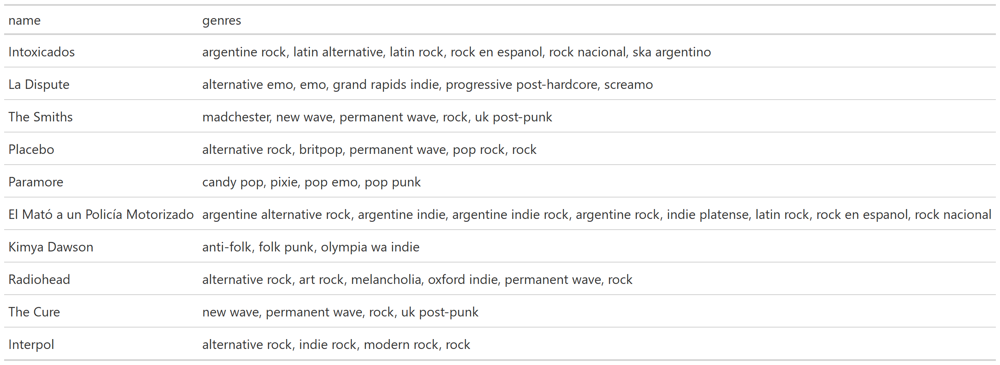
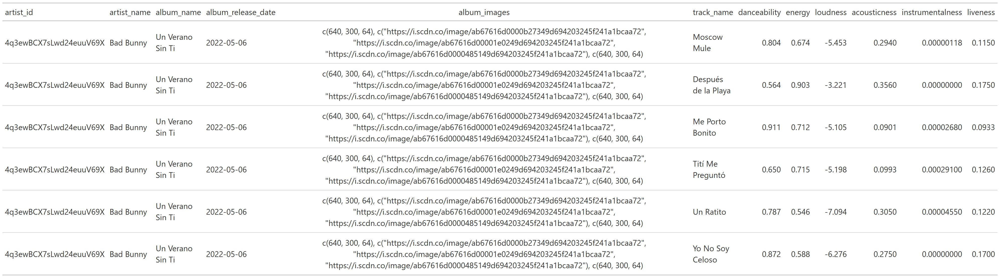
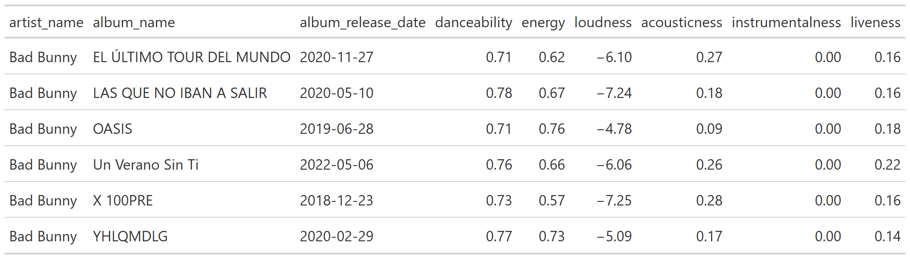
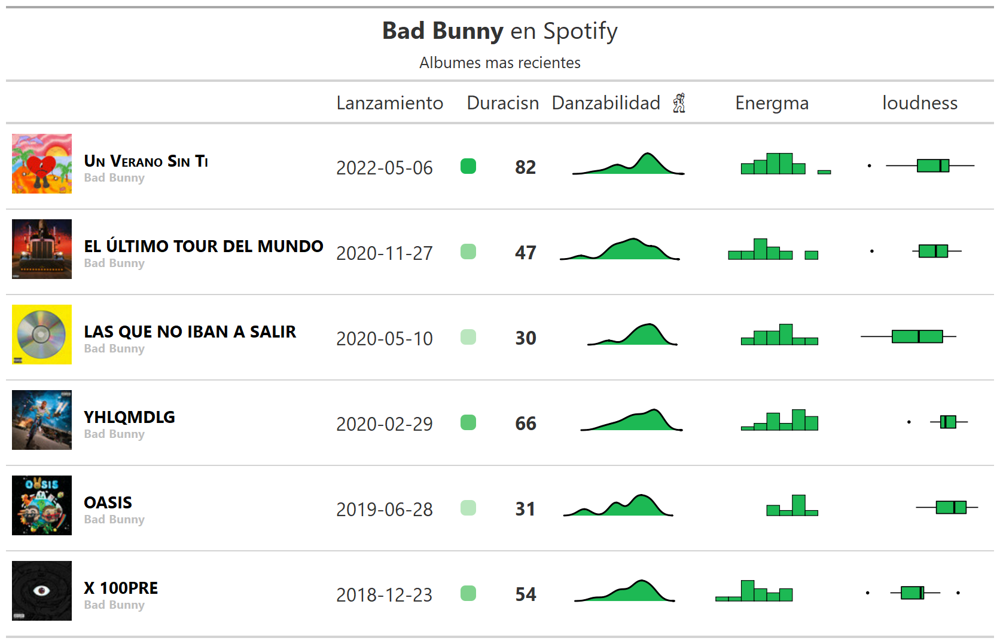
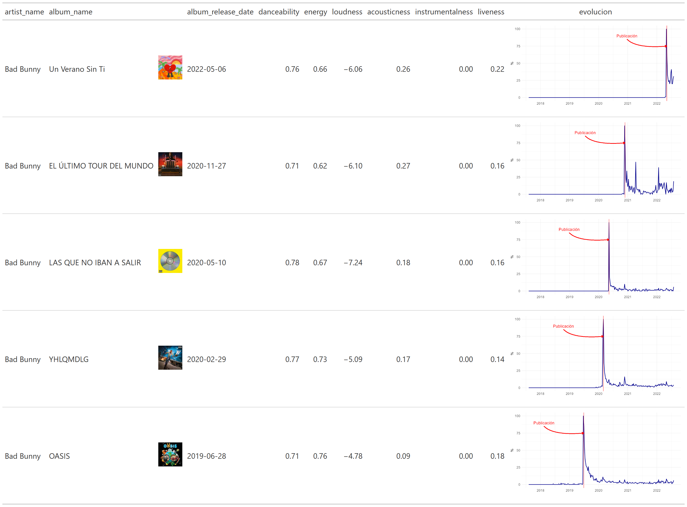

Tablas GT y Spotify
================
RLadies BA
2022-07-30

# Librerías

Se definen los paquetes :package: a utilizar:

``` r
library(tidyverse) # Manipulación de datos
library(gt)        # Tablas gt: grammar of tables
library(gtExtras)  # Extras de tablas gt
library(spotifyr)  # API de spotify
library(gtrendsR)  # Google trends API
library("rjson")
```

Se configura el token para conexión a la API de Spotify. El siguiente
chunk buscará las variables de entorno:

-   SPOTIFY_CLIENT_ID

-   SPOTIFY_CLIENT_SECRET

``` r
credentials <- fromJSON(file = "credentials.json")

Sys.setenv(SPOTIFY_CLIENT_ID = credentials$SPOTIFY_CLIENT_ID)
Sys.setenv(SPOTIFY_CLIENT_SECRET = credentials$SPOTIFY_CLIENT_SECRET)
```

Estas variables se obtienen con una cuenta en la página de
desarrolladores de Spotify:

``` r
access_token <- get_spotify_access_token()
```

Se puede acceder a los datos personales de artistas más escuchados:

``` r
tabla_user <- get_my_top_artists_or_tracks(
    type = 'artists', time_range = 'short_term', limit = 10) %>%
  select(name, genres) %>%
  rowwise() %>%
  mutate(genres = paste(genres, collapse = ', ')) %>%
  ungroup %>%
  gt()
```

``` r

```

<!-- -->

# Caso: análisis de un artista particular

Se define el artista a utilizar:

``` r
ARTISTA = 'bad bunny'
```

Para este artista, se genera una búsqueda de variables:

``` r
tracks_features <- get_artist_audio_features(artist = ARTISTA) %>%
  select(
    artist_id,
    artist_name,
    album_name,
    album_release_date,
    album_images,
    track_name,
    danceability,
    energy,
    loudness,
    acousticness,
    instrumentalness,
    liveness
  ) 
```

Se cuenta con un df de variables vinculadas a cada canción de cada álbum
del artista seleccionado:

``` r
tabla_tracks <- tracks_features %>% 
  head() %>% gt()
```

``` r

```

<!-- -->

Agregando los datos a nivel de cada álbum:

``` r
tabla <- tracks_features %>%
  group_by(artist_name, album_name, album_images, album_release_date) %>%
  summarise(across(
      where(is.numeric),
      ~ mean(.x))) %>% 
  ungroup()
```

``` r
tabla_albums <- tabla %>% 
  select(-album_images) %>% 
  head() %>% gt() %>% 
  fmt_number(columns=where(is.numeric))
```

``` r

```

<!-- -->

Se quiere añadir la imagen del álbum

``` r
get_imagen = function(album_images){
  album_images %>% 
    data.frame() %>% 
    filter(height==64) %>% 
    pull(url) %>% 
    as.character()
}
```

``` r
tabla_album <- tabla %>% 
  mutate(album_images = map(album_images, ~get_imagen(album_images=.x))) %>% 
  distinct()
```

``` r
tabla_album_2 <- tabla_album %>%  

  head() %>% 
  
  gt() %>% 
  
  text_transform(
    locations = cells_body(columns = c(album_images)),
    fn = function(album_images) {
      lapply(album_images, web_image, height = 50)
    }
  ) %>%
  
  cols_label(album_images = '') %>% 
  

  fmt_number(columns=where(is.numeric))
```

``` r

```

<!-- -->

# Tendencias

Se utiliza la API de Google trends para obtener la evolución de las
búsquedas realizadas para un álbum:

``` r
ALBUM = 'LAS QUE NO IBAN A SALIR'
RELEASE_DATE = '2020-05-10'

trends <- gtrends(
  keyword = paste0(ARTISTA, ' ', tolower(ALBUM)),
  geo = "",
  time = "all"
)
```

Visualmente:

``` r
trends %>%
  .$interest_over_time %>% 
  mutate(hits = ifelse(str_detect(hits, "<"),0,hits)) %>% 
  mutate(hits = as.numeric(hits)) %>% 
  ggplot(aes(x = date, y = hits)) +
  geom_line(colour = "darkblue", size = 0.7) +
  facet_wrap(~keyword) +
  theme_minimal()
```

<!-- -->

Se genera una función para realizar este gráfico:

``` r
gen_trend_ggplot <- function(.album, .artista, .release_date) {
  if (tolower(.album) == tolower(.artista)) {
    .album = 'self titled'
  }
  
  gtrends(
    keyword = paste0(.artista, ' ', .album),
    geo = "",
    time = "today+5-y"
  ) %>%
    .$interest_over_time %>%
    mutate(hits = ifelse(str_detect(hits, "<"), 0, hits)) %>%
    mutate(hits = as.numeric(hits)) %>%
    ggplot(aes(x = date, y = hits)) +
    geom_line(color = "darkblue", size = 1) +
    geom_vline(xintercept = as.POSIXct(.release_date),
               color = 'red') +
    annotate(
      geom = 'text',
      x = as.POSIXct(.release_date) - lubridate::days(500),
      y = 90,
      size = 6,
      label = paste0('Publicación'),
      color = 'red'
    ) +
    geom_curve(
      aes(
        x = as.POSIXct(.release_date) - lubridate::days(500) ,
        y = 85,
        xend = as.POSIXct(.release_date),
        yend = 75
      ),
      curvature = 0.3,
      angle = 40,
      color = 'red',
      size = 1,
      arrow = arrow(length = unit(0.3, "cm"))
    ) +
    labs(x = '', y = '%') +
    theme_minimal() +
    theme(axis.text = element_text(size = 14),
          title = element_text(size = 16))
}
```

``` r
p <- gen_trend_ggplot(.album = ALBUM,
                 .artista = ARTISTA,
                 .release_date = RELEASE_DATE)

p 
```

<!-- -->

# Tabla con ggplots

Se aplica esta función sobre los álbumes de la tabla:

``` r
tabla_plots <- tabla_album %>%  
  
  # Seleccionando los 5 álbumes más recientes, para no hacer tantas consultas a la API (podría dar error):
  arrange(desc(album_release_date)) %>% 
  
  head(5) %>% 
  
  mutate(evolucion = map2(
    album_name, album_release_date,
    ~gen_trend_ggplot(.album =.x, 
                      .artista=ARTISTA, 
                      .release_date=.y)))
```

Visualizando la tabla final:

``` r
tabla_final <- tabla_plots %>% 
  
 gt() %>% 
  
  text_transform(
    locations = cells_body(columns = c(album_images)),
    fn = function(album_images) {
      lapply(album_images, web_image, height = 50)
    }
  ) %>%
  
  cols_label(album_images = '') %>% 
    
  # Ggplots en formato gráfico (sino aparecen como texto)
  text_transform(
    locations = cells_body(columns = evolucion),
    fn = function(x) {
      map(
        tabla_plots$evolucion,
        gt::ggplot_image,
        height = px(180),
        aspect_ratio = 2
      )
    }
  ) %>% 
  
  fmt_number(columns=where(is.numeric))
```

``` r

```

<!-- -->
