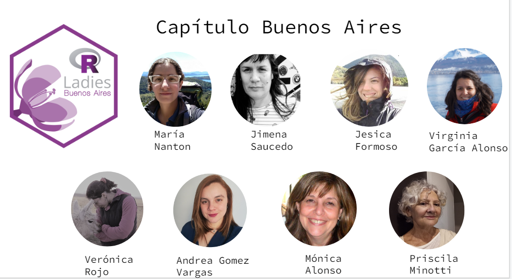
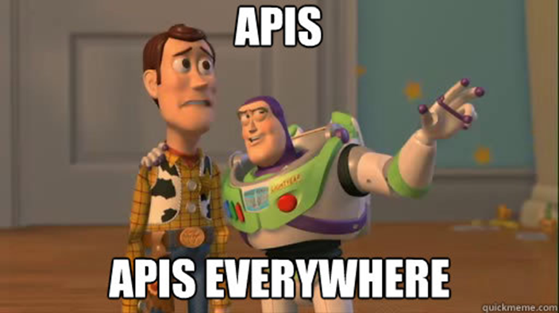

class: center, middle, big-font

# RLadies

```{r include=FALSE}
knitr::opts_chunk$set(comment = NA)

options(scipen=999)
options(reticulate.repl.quiet = TRUE)
options(servr.daemon = TRUE) # para infinite moon reader
```


```{r echo=FALSE}
xaringanExtra::use_panelset()
```

```{r echo=FALSE}
xaringanExtra::use_logo(
  image_url = 'https://raw.githubusercontent.com/karbartolome/rladies_charlas/main/01_r_python/02_slides/images/github.png', 
  link_url  = 'https://github.com/karbartolome/gt-spotify', 
  width     = '30px', 
  height    = '30px'
)
```

```{r include=FALSE}
image_link <- function(image,url,...){
  htmltools::a(
    href=url,
    htmltools::img(src=image,...)
    )
}
```

```{css, echo=FALSE}
/* Table width = 100% max-width */
.remark-slide table{
    width: 100%;
}

/* background-color blanco siempre */
.remark-slide thead, .remark-slide tr:nth-child(2n) {
    background-color: white;
}

/* Incremento en transparencia del color de highlight del código ya que lo uso mucho y así se lee mejor */
.remark-code-line-highlighted { 
    background-color: rgba(136, 57, 138, 0.1);
}

/* Big font size */
.big-font h1 {
  font-size: 100pt;
}
/* Tamaño letra contenido */
.remark-slide-content {
  font-size: 20pt;
}

h1, h2, h3 {
  font-weight: normal;
  color: #562457;
}

```


---

## Rladies Global


.pull-left[

```{r, out.width='50%', fig.align='center', echo=FALSE}
knitr::include_graphics('https://rladies.org/wp-content/uploads/2016/12/R-LadiesGlobal.png')
```

- 216 capítulos
- 61 países
- 100267 miembrxs

]

.pull-right[

```{r, out.width='100%', fig.align='center', echo=FALSE}
knitr::include_graphics('images/rladiesglobal.png')
```
]

---

## Rladies Buenos Aires

```{r, out.width='70%', fig.align='center', echo=FALSE}

```


---

## Sponsors


.pull-left[

```{r, out.width='70%', fig.align='center', echo=FALSE}
knitr::include_graphics('https://rladiesba.netlify.app/author/rladies-buenos-aires/avatar_huae50964fd4ece6c135015c99a5e9a56e_144270_270x270_fill_lanczos_center_2.png')
```

]

.pull-right[

```{r, out.width='70%', fig.align='center', echo=FALSE}
knitr::include_graphics('https://guide.rladies.org/images/horizontal-logo.png')
```

```{r, out.width='70%', fig.align='center', echo=FALSE}
knitr::include_graphics('https://www.r-consortium.org/wp-content/uploads/sites/13/2016/09/RConsortium_Horizontal_Pantone.png')
```

]

---
class: center, middle, big-font, inverse

```{r, out.width='70%', fig.align='center', echo=FALSE}
knitr::include_graphics('https://www.meetup.com/_next/image/?url=https%3A%2F%2Fsecure-content.meetupstatic.com%2Fimages%2Fclassic-events%2F508618435%2F676x380.webp&w=1920&q=75')
```

---

# ¿Quiénes somos?

```{r, out.width='20%', fig.align='center', echo=FALSE}
knitr::include_graphics('images/imagen1.PNG')
```


.pull-left[
### Andrea Gómez Vargas
- Socióloga
- Data Analyst en INDEC
- Fan de Bad Bunny 
]


.pull-right[
### Karina Bartolomé
- Economista
- Data Scientist en Ualá 
- Fan de {gt}
]

---

class: center, middle, inverse

# Antes de arrancar

```{r, out.width='50%', fig.align='center', echo=FALSE}
knitr::include_graphics('https://thepcosbible-com.exactdn.com/wp-content/uploads/2020/06/giphy-7.gif?strip=all&lossy=1&quality=80&resize=514%2C288&ssl=1')
```

---
class: left, middle
## Qué se necesita para este taller?

--

- Ganas de hacer tablas 

--

- Una cuenta en <a><i class="fa fa-spotify fa-fw"></i> Spotify</a>

--
  
- <a><i class="fa fa-registered fa-fw"></i></a> y RStudio instalados, con los siguientes paquetes:

```{r, echo=TRUE, warning=FALSE, message=FALSE}
library(tidyverse) # Manipulación de datos
library(gt)        # Tablas gt: grammar of tables
library(gtExtras)  # Extras de tablas gt
library(spotifyr)  # API de spotify
library(rjson)     # Leer jsons de credenciales
library(ggrepel)   # Textos en ggplot
```

---

background-position: 50% 50%
class: center, inverse, middle, big-font


# Ahora sí 🚀

---
class: left, middle

## ¿Qué vamos a ver hoy?

--

🔸 Cómo extraer datos de la **API de Spotify** 


🔸 Introducción a **The Grammar of Tables {gt}** 📦


🔸 Creación de **tablas en {gt} 📦 con datos de Spotify**

---

class: center, middle, inverse, big-font

# <a><i class="fa fa-spotify"></i>&nbsp; API de Spotify</a>

---

##  ¿Qué es una API?

--

Las API son mecanismos que `permiten a dos componentes de software comunicarse entre sí` mediante un conjunto de definiciones y protocolos. 

--

.pull-left[

```{r, echo=FALSE, out.width='70%', fig.align='center'}

```

]

.pull-right[


<a href="https://developer.twitter.com/en/docs/twitter-api/getting-started/about-twitter-api"><i class="fa fa-twitter fa-fw"></i>&nbsp; API de Twitter</a><br>


<a href="https://www.argentina.gob.ar/onti/software-publico/catalogo/apis"><i class="fa fa-globe"></i>&nbsp; APIs Argentina</a><br>

Etc. 


]

---


## <a href="https://developer.spotify.com/documentation/web-api/"><i class="fa fa-spotify"></i>&nbsp; API de Spotify</a><br>

--

Datos que se pueden obtener a partir de esta API:

--

🔸  Datos sobre artistas

--

🔸 Datos sobre álbumes

--

🔸 Datos sobre el usuario

--

🔸 Y más 😎

--

Para más información, visitar la <a href="https://developer.spotify.com/documentation/web-api/reference/#/">**documentación  de la API de Spotify**</a><br>

---

## <a><i class="fa fa-spotify"></i>&nbsp; Credenciales de Spotify</a><br> 

Para obtener credenciales que permitan consultar datos desde la API es necesario ingresar a <a href="https://developer.spotify.com/">**Spotify for developers**</a>

Compartimos un <a href="https://docs.google.com/document/d/1GpOBol3E-1hg6AIQyD2ZN5GYlrHkIRl-gGooGEdBm0A/edit">**documento con los pasos detallados para generar tus credenciales**</a>

⚠️ Recordá que tus credenciales son personales, no las compartas. ⚠️

### Autenticación 

Se utiliza la función **get_spotify_access_token()** de {spotifyr} 📦 para autenticarse con las credenciales:

```{r, echo=FALSE}
credentials <- fromJSON(file = here::here("02_caso_spotify/credentials.json"))

Sys.setenv(SPOTIFY_CLIENT_ID = credentials$SPOTIFY_CLIENT_ID)
Sys.setenv(SPOTIFY_CLIENT_SECRET = credentials$SPOTIFY_CLIENT_SECRET)
```

```{r, code_folding=TRUE}
access_token <- get_spotify_access_token()
```


---

## <a><i class="fa fa-spotify"></i>&nbsp; Consulta simple a la API</a><br>   

Consulta de los 2 artistas que más escuchaste en el corto plazo:

```{r, eval=TRUE}
df_artistas <- get_my_top_artists_or_tracks(
    type = 'artists', 
    time_range = 'short_term', 
    limit = 2
  ) %>% 
  select(name, followers.total, genres)
```


```{r, eval=TRUE}
df_artistas %>% 
  head() 
```


---

class: center, big-font, inverse

# Introducción a {gt}

```{r,  fig.align='center', echo=FALSE, out.width='40%'}

```


---

The grammar of tables (gt) se basa en la siguiente estructura: 

```{r, fig.align='center', echo=FALSE, fig.cap='Estructura de tablas gt, fuente: https://gt.rstudio.com'}
knitr::include_graphics('https://karbartolome-blog.netlify.app/posts/tablas-subte/images/gt_workflow_diagram.svg')
```


---

En donde las tablas tienen un formato específico, generado mediante capas:

```{r,  fig.align='center', echo=FALSE, fig.cap='Estructura de tablas gt, fuente: https://gt.rstudio.com'}
knitr::include_graphics('https://karbartolome-blog.netlify.app/posts/tablas-subte/images/gt_parts_of_a_table.svg')
```

---

class: center, inverse, middle, big-font

# Bad Bunny 🐰

---

Vamos a realizar una búsqueda de datos de Bad Bunny:

```{r}
ARTISTA = 'bad bunny'
```

Para este artista, se genera una búsqueda de variables:

```{r, eval=FALSE, code_folding=TRUE}
vars_audio = c(
  'danceability', 'energy', 'loudness', 'acousticness', 'instrumentalness'
)
```

```{r, eval=FALSE, code_folding=TRUE}
df_artist_features <- get_artist_audio_features(artist = ARTISTA) %>%
  select(
    artist_id, artist_name, album_id, album_name,
    album_release_date, album_images, track_name, duration_ms,
    all_of(vars_audio)       
  ) %>% 
  arrange(desc(album_release_date))
```

---

Realizamos una **agregación por álbum** para obtener la duración total y una lista de todos los valores de cada una de las variables de audio en cada uno de los álbumes:

```{r, eval=FALSE, code_folding=TRUE}
df_albums <- df_artist_features %>% 
  group_by(
    album_images, artist_name, album_id, album_name, album_release_date
  ) %>%
  summarise(
    duration_mins = sum(duration_ms/(1000*60)),
    across(all_of(vars_audio), ~ list(.x)),
  ) %>% 
  ungroup()
```

Estas listas luego serán utilizadas para visualizar la distribución de cada variable a nivel álbum.

---

Se cuenta con un df de variables vinculadas a cada canción de cada álbum del artista seleccionado:

```{r, echo=FALSE, message=FALSE}
vars_audio = c(
  'danceability', 'energy', 'loudness', 'acousticness', 'instrumentalness'
)

df_albums <- readRDS(here::here('02_caso_spotify/tracks_features.rds')) %>% 
   group_by(
    album_images, artist_name, album_id, album_name, album_release_date
  ) %>%
  summarise(
    duration_mins = sum(duration_ms/(1000*60)),
    across(all_of(vars_audio), ~ list(.x)),
  ) %>% 
  ungroup()
```

```{r, code_folding=TRUE}
df_albums %>% 
  glimpse()
```

---

Se seleccionan las columnas que no sean listas y se visualizan con **{gt}** 📦

```{r}
tabla <- df_albums %>% 
  select(artist_name, album_name, album_release_date, duration_mins) %>% 
  
  # Se convierte el df a the grammar of tables
  gt()

tabla
```

---

Siguiendo con la lógica de {gt} 📦 es posible añadir nuevas capas a la tabla. Por ejemplo, se añade título, subtítulo y colore

```{r}
tabla %>% 
  tab_header(
    title = md('**Bad Bunny** en Spotify'),
    subtitle = 'Álbumes más recientes'
  ) %>% 
  gt_color_box(
    columns = duration_mins, palette=c('white', 'green'), 
    domain=c(0,round(max(df_albums$duration_mins))+1))
```


---
Con **muchas** capas, es posible convertir el df original en la siguiente tabla:

```{r, echo=FALSE, out.width='80%', fig.align='center'}
knitr::include_graphics(here::here('02_caso_spotify/tablas/tabla_8.png'))
```
---

class: center, middle

```{r, echo=FALSE, out.width='30%', fig.align='center'}
knitr::include_graphics('https://i.pinimg.com/564x/9a/54/17/9a541707e8b87607f25091fbc4538598.jpg')
```


Veamos los detalles en el archivo .Rmd:

🔗 [Generando tablas de Bad Bunny a partir de datos de Spotify](https://github.com/karbartolome/gt-spotify/blob/main/02_caso_spotify/spotify_gt.Rmd)

---

class: center, middle

# Comentarios finales

---

# Cosas que queremos que se lleven de este workshop

```{r, echo=FALSE, out.width='20%', fig.align='center'}
knitr::include_graphics('https://acegif.com/wp-content/uploads/gifs/spongebob-rainbow-1.gif')
```

--

- Las tablas también son una forma de visualización de datos.

--

- {gt} 📦 simplifica la generación de tablas mediante una estructura similar a {ggplot2} 📦, utilizando capas.

--

- Las APIs son un método muy útil para acceder a datos que de otra forma sería muy complejo consultar.


---

# Comparte tu tabla en redes sociales 


Armar texto

---

# Links utiles

- 🔗 [Galería de tablas de RStudio](https://community.rstudio.com/c/table-gallery/64)
- gt
- spotifyr
- link charla jessi
- [Otro link (:](https://www.youtube.com/watch?v=dQw4w9WgXcQ&ab_channel=RickAstley)
---

class: inverse, center, middle

# Contacto


<a href="https://karbartolome-blog.netlify.com"><i class="fa fa-link fa-fw"></i>&nbsp; karbartolome-blog.netlify.com</a><br>
<a href="http://twitter.com/karbartolome"><i class="fa fa-twitter fa-fw"></i>&nbsp; @karbartolome</a><br>
<a href="http://github.com/karbartolome"><i class="fa fa-github fa-fw"></i>&nbsp; @karbartolome</a><br>

<a href="https://soyandrea.netlify.app"><i class="fa fa-link fa-fw"></i>&nbsp; Soyandrea.netlify.app</a><br>
<a href="http://twitter.com/me_andre"><i class="fa fa-twitter fa-fw"></i>&nbsp; @me_andre</a><br>
<a href="http://github.com/SoyAndrea"><i class="fa fa-github fa-fw"></i>&nbsp; @SoyAndrea</a><br>

---


class: center, middle, big-font, inverse

# Muchas gracias!!

Las slides fueron creadas con el paquete [**xaringan**](https://github.com/yihui/xaringan), utilizando el template de Rladies


