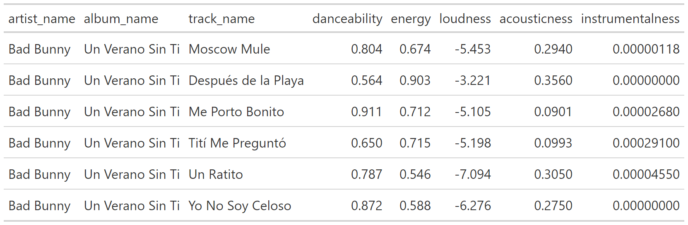
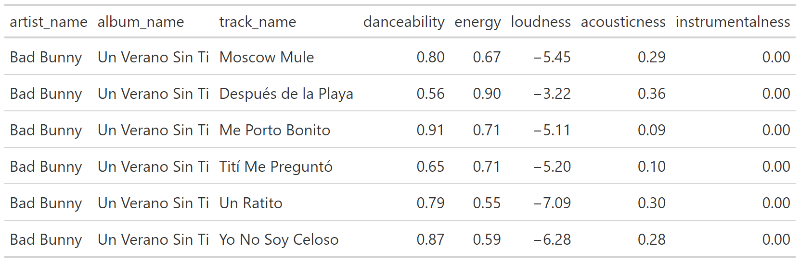
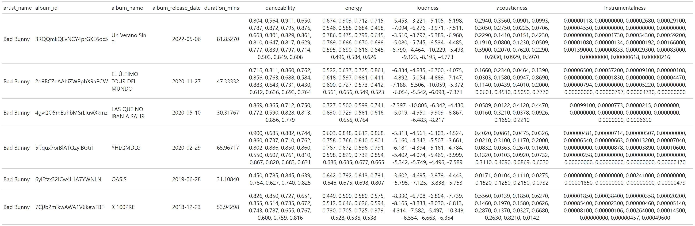
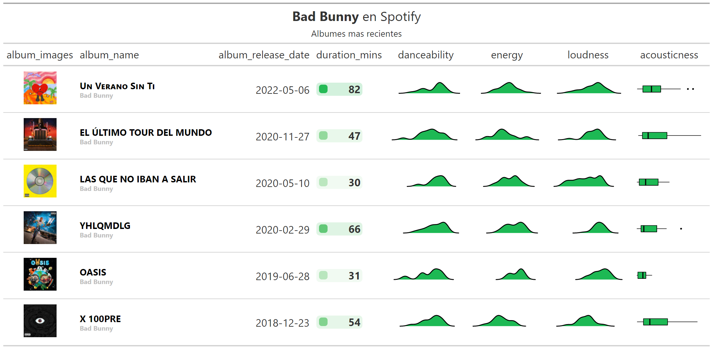
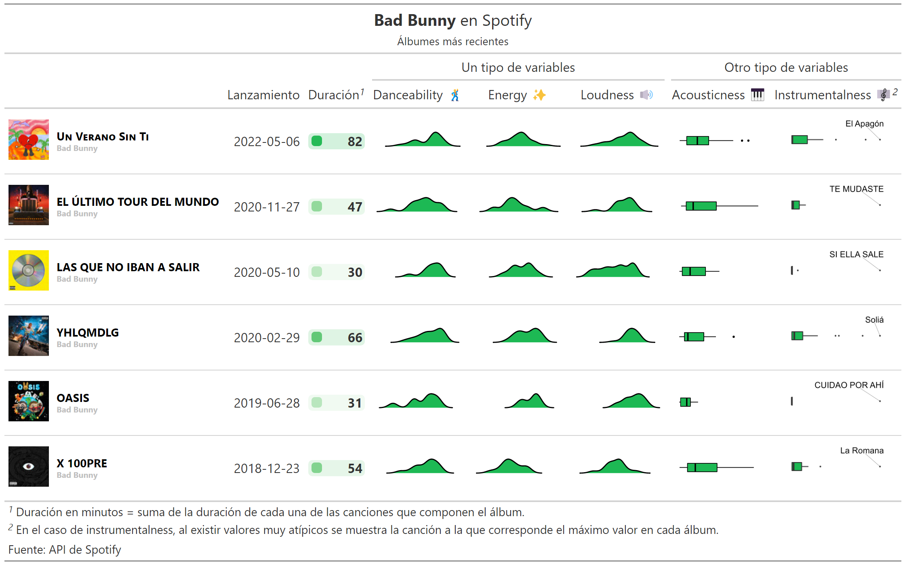
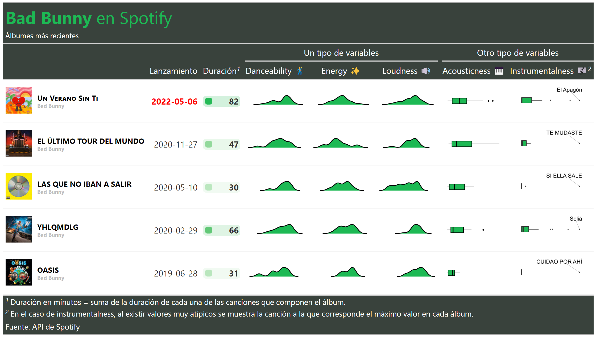

```{r setup, include=FALSE}
knitr::opts_chunk$set(echo = TRUE, 
                      eval = TRUE,
                      warning = FALSE, 
                      message = FALSE, 
                      code_folding=TRUE,
                      align='center')

options(scipen=999)

color_spotify = "#1DB954"
```

# 1. Librerías

Se definen los **paquetes** 📦 a utilizar:

```{r}
library(tidyverse) # Manipulación de datos
library(gt)        # Tablas gt: grammar of tables
library(gtExtras)  # Extras de tablas gt
library(spotifyr)  # Trabajar con la API de spotify
library(rjson)     # Lectura de archivo json
library(ggrepel)   # Para textos en ggplot
```

**⚠️ De no haber podido obtener las credenciales para consultar a la API de Spotify, pasar al punto 3, en donde se leen los datos de un dataframe almacenado en el repositorio.** **⚠️**

## 2. API Spotify - Credenciales

Se cuenta con un archivo **(credentials..json)**, que contiene las siguientes variables obtenidas de la página de desarrolladores de Spotify:

-   SPOTIFY_CLIENT_ID

-   SPOTIFY_CLIENT_SECRET

El formato del archivo **credentials.json** está incluido en el .gitignore del repositorio. Esto permite mantener las credenciales anónimas (sin publicar en repositorios), dado que son personales y no deben compartirse. A continuación se muestra el formato de este archivo:

```{r, eval=FALSE}
{
  "SPOTIFY_CLIENT_ID" : "SPOTIFY_CLIENT_ID",
  "SPOTIFY_CLIENT_SECRET" : "SPOTIFY_CLIENT_SECRET"

}
```

Se realiza la lectura de las credenciales mediante la función **fromJSON()**. Luego, se setean como variables de entorno:

```{r}
credentials <- fromJSON(file = "credentials.json")

Sys.setenv(SPOTIFY_CLIENT_ID = credentials$SPOTIFY_CLIENT_ID)
Sys.setenv(SPOTIFY_CLIENT_SECRET = credentials$SPOTIFY_CLIENT_SECRET)
```

Se utiliza la función **get_spotify_access_token**() del paquete {**spotifyr**} 📦para autenticarse a la API:

```{r}
access_token <- get_spotify_access_token()
```

Para verificar que la autenticación haya sido exitosa, se realiza una consulta de los artistas más escuchados:

```{r, eval=FALSE}
tabla_user <- get_my_top_artists_or_tracks(
    type = 'artists', 
    time_range = 'short_term', #'short_term', # 'medium_term', 'long_term' 
    limit = 5) %>%
  select(name, genres) %>%
  rowwise() %>%
  mutate(genres = paste(genres, collapse = ', ')) %>%
  ungroup %>%
  gt()
```

# Caso: análisis de un artista particular

Se define el artista a utilizar:

```{r}
ARTISTA = 'bad bunny'
```

La función **get_artist_audio_features()** del paquete {**spotifyr**} 📦 permite generar una búsqueda de variables vinculadas al audio de cada track.

```{r}
vars_audio = c(
  'danceability', 'energy', 'loudness', 'acousticness', 'instrumentalness'
)
```

```{r, eval=FALSE}
tracks_features <- get_artist_audio_features(artist = ARTISTA) %>%
  
  select(
    artist_id, artist_name, album_id, album_name,
    album_release_date, album_images, track_name, duration_ms,

    # Variables vinculadas al audio:
    all_of(vars_audio)       
  ) %>% 
  
  arrange(desc(album_release_date))
```

# 3. The grammar of tables (gt)

De no haber podido autenticarte con la API de Spotify, dejamos un archivo .rds con los datos necesarios para seguir con el resto del taller:

```{r}
# tracks_features %>% saveRDS('tracks_features.rds')
tracks_features <- readRDS('tracks_features.rds')
```

Se cuenta con un df de variables vinculadas a cada canción de cada álbum del artista seleccionado:

```{r}
tracks_features %>% 
  glimpse()
```

## 3.1 Intro a gt

```{r}
tabla <- tracks_features %>% 
  head() %>% 
  select(artist_name, album_name, track_name, all_of(vars_audio)) %>% 
  
  # En este paso se transforma el df en un objeto gt:
  gt()
```

```{r, eval=FALSE}
tabla
```

```{r, eval=FALSE, echo=FALSE, layout='l-page'}
gt::gtsave(tabla, 'tablas/tabla_1.png', vwidth = 2000, vheight = 3000)
```

```{r, echo=FALSE}

```

Notar que las variables numéricas aparecen con muchos decimales. Una forma sencilla de arreglar esto en {gt} es la siguiente:

```{r, eval=FALSE}
tabla %>% 
  fmt_number(columns = where(is.numeric), decimals=2)
```

```{r, eval=FALSE, echo=FALSE, layout='l-page'}
gt::gtsave(tabla %>% fmt_number(columns = where(is.numeric), decimals=2), 
           'tablas/tabla_1b.png', vwidth = 2000, vheight = 3000)
```

```{r, echo=FALSE}

```


## 3.2 Tabla a nivel álbumes

Se agregan los datos a nivel de cada álbum. Notar que, en el caso de las variables de audio, se decidió convertirlas en una lista (N observaciones numéricas que representan cada una de las canciones incluidas en el álbum). En los próximos pasos se explicará el por qué de la decisión:

```{r}
df_albums <- tracks_features %>%
  
  group_by(
    album_images, artist_name, album_id, album_name, album_release_date
  ) %>%
  
  summarise(
    # Duración del álbum: suma de duración de cada canción
    duration_mins = sum(duration_ms/(1000*60)),
    
    # Lista de cada variable de audio
    across(all_of(vars_audio), ~ list(.x)),
  ) %>% 
  
  ungroup()
```

```{r}
tabla_albums <- df_albums %>% 
  select(-album_images) %>% 
  gt() 
```

```{r, eval=FALSE}
tabla_albums
```

```{r, eval=FALSE, echo=FALSE, layout='l-page'}
gt::gtsave(tabla_albums, 'tablas/tabla_2.png', vwidth = 2000, vheight = 3000)
```

```{r, echo=FALSE}

```

## 3.3 Imágenes en tablas gt

Se quiere añadir la imagen del álbum. Para ello, se construye la siguiente función. Para cada álbum se cuenta con distintos tamaños de imágenes, donde cada imagen se encuentra representada por un url. Se decide seleccionar la imagen de tamaño=64, extrayendo el url:

```{r}
get_imagen = function(album_images){
  album_images %>% 
    data.frame() %>% 
    filter(height==64) %>% 
    pull(url) %>% 
    as.character()
}
```

Se aplica la función al dataframe. Para ello, se utiliza la función **map()** del paquete {purrr} 📦:

```{r}
df_albums <- df_albums %>% 
  mutate(album_images = map(album_images, ~get_imagen(album_images=.x))) %>% 
  distinct()
```

Para visualizar los urls como imagenes, se utiliza la función **text_transform()** de {gt}. Además, la función **tab_header()** permite añadir título y subtítulo.

```{r}
tabla_albums <- df_albums %>%  select(-album_id) %>% 

  gt() %>% 
  
  tab_header(
    title = md(glue::glue('**{str_to_title(ARTISTA)}** en Spotify')),
    subtitle = 'Álbumes más recientes'
  ) %>% 
  
  text_transform(
    locations = cells_body(columns = c(album_images)),
    fn = function(album_images) {
      lapply(album_images, web_image, height = 50)
    }
  ) 
```

```{r, eval=FALSE, echo=FALSE, layout='l-page'}
tabla_albums %>% cols_hide(all_of(vars_audio))
```

```{r, eval=FALSE, echo=FALSE, layout='l-page'}
gt::gtsave(tabla_albums %>% cols_hide(all_of(vars_audio)), 
  'tablas/tabla_3.png', vwidth = 2000, vheight = 3000)
```

```{r, eval=TRUE, echo=FALSE, layout='l-page'}
knitr::include_graphics('tablas/tabla_3.png')
```

Otra función útil para visualizar este tipo de información es **gt_merge_stack()** que permite concatenar dos variables en una única:

```{r}
tabla_albums <- tabla_albums %>%  

  gt_merge_stack(
    col1 = album_name, 
    col2 = artist_name
  ) 
```

```{r, eval=FALSE}
tabla_albums %>% cols_hide(all_of(vars_audio)) 
```

```{r, eval=FALSE, echo=FALSE, layout='l-page'}
gt::gtsave(tabla_albums %>% cols_hide(all_of(vars_audio)), 
  'tablas/tabla_4.png', vwidth = 2000, vheight = 3000)
```


```{r, eval=TRUE, echo=FALSE, layout='l-page'}
knitr::include_graphics('tablas/tabla_4.png')
```

Para visualizar las variables de audio, se utilizarán algunas funcionalidades del paquete **{gtExtras}** 📦:

```{r}
tabla_albums <- tabla_albums %>% 
  
  gt_color_box(columns = duration_mins, 
               palette=c('white', color_spotify), 
               domain=c(0,round(max(df_albums$duration_mins))+1)) %>% 
  
  gt_plt_dist(column = danceability, 
              type = "density", line_color = "black", 
              fill_color = color_spotify) %>% 
  
  gt_plt_dist(column = energy, 
              type = "density", line_color = "black", 
              fill_color = color_spotify) %>% 
  
  gt_plt_dist(column = loudness,
              type = "density", line_color = "black", 
              fill_color = color_spotify) %>% 
  
  gt_plt_dist(column = acousticness,
              type = "boxplot", line_color = "black", 
              fill_color = color_spotify)

```

```{r, eval=FALSE}
tabla_albums %>% cols_hide('instrumentalness')
```

```{r, eval=FALSE, echo=FALSE, layout='l-page'}
gt::gtsave(tabla_albums %>% cols_hide('instrumentalness'),
  'tablas/tabla_5.png', vwidth = 2000, vheight = 3000)
```


```{r, eval=TRUE, echo=FALSE, layout='l-page'}

```

## 3.4 Ggplot en gt

Notar que si se agregara el boxplot para el caso de la variable instrumentalness, se observa, para todos los álbumes, distribuciones con valores atípicos:

```{r, eval=FALSE}
tabla_albums %>%
  gt_plt_dist(column = instrumentalness,
              type = "boxplot", line_color = "black", 
              fill_color = color_spotify) 
```

Por esta razón, se utilizará el caso de esta variable para explicar cómo se podría identificar a estos valores atípicos mediante el uso de {ggplot2} 📦

```{r}
gen_outliers_plots<- function(.df, .variable, .font_size=22, .lwd=3){
  
  temp <- .df %>% 
    select(all_of(c('track_name',.variable))) %>% 
    pivot_longer(cols=-track_name) 
  
  track <- temp %>% 
    slice(which.max(value)) %>% 
    pull(track_name)
  
  temp %>% 
    mutate(
      is_outlier=ifelse(track_name==track, track_name, NA)
    ) %>% 
    
    ggplot(aes(y=value, x=name)) + 
    geom_boxplot(
      fill=color_spotify, width=0.2, lwd=.lwd, outlier.size=5
    ) + 
    geom_text_repel(aes(label=is_outlier), 
      na.rm=TRUE, nudge_x=0.4, size=.font_size)+
    coord_flip()+
    theme_void()
}
```

Realizando la prueba de la función, se observa el gráfico que genera:

```{r}
gen_outliers_plots(
  .df=tracks_features %>% filter(album_name=='X 100PRE'), 
  .variable='instrumentalness', .font_size=10, .lwd = 0.5)
```

Ahora se incluyen estos plots en la tabla. Primero, se mappea la función al df:

```{r}
df_albums <- df_albums %>% 
  mutate(instrumentalness=map(
    album_id, ~gen_outliers_plots(
      .df=tracks_features %>% filter(album_id==.x), 
      .variable='instrumentalness'
    )
  ))
```

Se visualiza la tabla completa:

```{r}
tabla_albums <- tabla_albums %>% 
  
    text_transform(
    locations = cells_body(columns = instrumentalness),
    fn = function(x) {
      map(
        df_albums$instrumentalness,
        gt::ggplot_image,
        height = px(60),
        aspect_ratio = 2
      )
    }
  ) 
```

```{r, eval=FALSE}
tabla_albums
```

```{r, eval=FALSE, echo=FALSE, layout='l-page'}
gt::gtsave(tabla_albums,
  'tablas/tabla_6.png', vwidth = 2000, vheight = 3000)
```


```{r, eval=TRUE, echo=FALSE, layout='l-page'}
knitr::include_graphics('tablas/tabla_6.png')
```

## Formato

```{r}
tabla_albums <- tabla_albums %>% 
  
  gt::tab_spanner(label='Un tipo de variables', 
                  columns=danceability:loudness) %>% 
  gt::tab_spanner(label='Otro tipo de variables', 
                  columns = c('acousticness','instrumentalness')) %>% 
  
  gt::tab_footnote(
    locations=cells_column_labels('duration_mins'), 
    footnote='Duraciòn en minutos = suma de la duración de cada una de las canciones que componen el álbum.') %>% 
  
  gt::tab_footnote(
    locations=cells_column_labels('instrumentalness'), 
    footnote='En el caso de instrumentalness, al existir valores muy atípicos se muestra la canción a la que corresponde el máximo valor en cada álbum.') %>% 
  
  gt::tab_source_note(source_note='Fuente: API de Spotify') %>% 
  
  cols_label(
    album_images = '',
    album_name = '',
    album_release_date = 'Lanzamiento',
    duration_mins = 'Duración',
    danceability = 'Danceability 🕺',
    energy = 'Energy ✨',
    loudness = 'Loudness 🔊',
    acousticness = 'Acousticness 🎹',
    instrumentalness = 'Instrumentalness 🎼'
  )  
```

```{r, eval=FALSE}
tabla_albums
```

```{r, eval=FALSE, echo=FALSE, layout='l-page'}
gt::gtsave(tabla_albums,
  'tablas/tabla_7.png', vwidth = 2000, vheight = 3000)
```

```{r, eval=TRUE, echo=FALSE, layout='l-page'}

```

Además, se añade un theme específico para asignarle colores y formatos adicionales:

```{r}
my_theme <- function(gt_object, ...){
  gt_object %>%
    tab_options(
      column_labels.background.color = "#39423c",
      footnotes.background.color = "#39423c",
      source_notes.background.color = "#39423c",
      heading.background.color = "#39423c",
      heading.align = "left",
      ...
    ) %>%
    tab_style(
      style = cell_text(color = color_spotify, size = px(32)),
      locations = cells_title("title")
    )
}
```

```{r}
tabla_albums <- tabla_albums %>% 
    my_theme()
```

```{r, eval=FALSE}
tabla_albums
```

```{r, eval=FALSE, echo=FALSE, layout='l-page'}
gt::gtsave(tabla_albums, 'tablas/tabla_8.png', 
           vwidth = 2000, vheight = 3000)
```

```{r, eval=TRUE, echo=FALSE, layout='l-page'}

```
