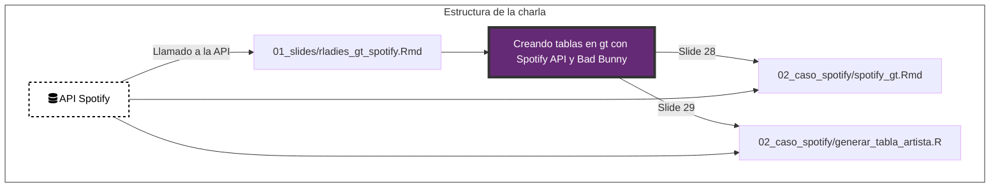

# 💜 Charla RLadies 💜 

**Repositorio para el taller de RLadies: Creando tablas en {gt} con Spotify API & Bad Bunny**

R-Ladies Buenos Aires

Andrea Gómez Vargas & Karina Bartolomé

2022-11-23

Se recomienda leer el [Documento de pasos previos antes de seguir el taller](https://github.com/karbartolome/gt-spotify/blob/main/Pasos%20previos%20al%20taller%20gt%20%2B%20spotify.pdf)

## **1. 01_slides/** 👉 [Creando tablas en {gt} con Spotify API & Bad Bunny](https://karbartolome.github.io/gt-spotify/01_slides/rladies_gt_spotify.html)

 Las slides fueron generadas con {xaringan} 📦. 

## **2. 02_caso_spotify/**

  - spotify_gt.Rmd
      [Archivo .Rmd para utilizar en el taller](https://github.com/karbartolome/gt-spotify/blob/main/02_caso_spotify/spotify_gt.Rmd)
      
  - spotify_gt_rendered.md
      [Archivo .Rmd renderizado en github para visualizar el paso a paso](https://github.com/karbartolome/gt-spotify/blob/main/02_caso_spotify/spotify_gt_rendered.md)
 
