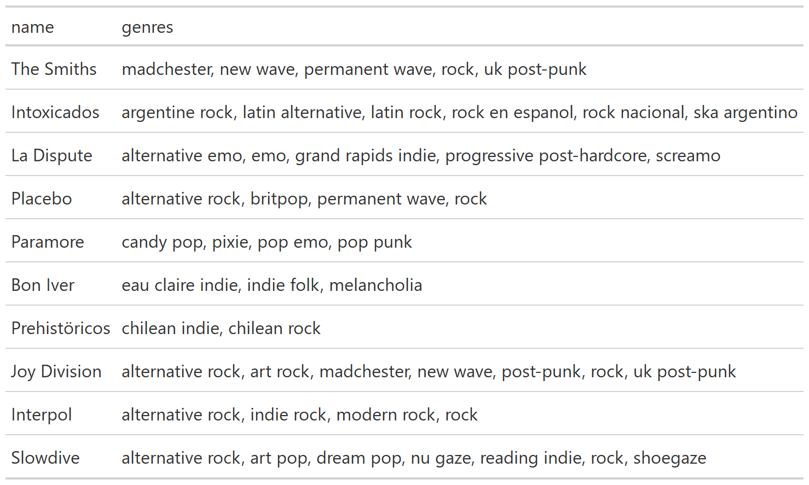

Tablas GT y Spotify
================
RLadies BA
2022-07-30

# Librerías

Se definen los paquetes :package: a utilizar:

``` r
library(tidyverse) # Manipulación de datos
library(gt)        # Tablas gt: grammar of tables
library(gtExtras)  # Extras de tablas gt
library(spotifyr)  # API de spotify
library(gtrendsR)  # Google trends API
library("rjson")
```

Se configura el token para conexión a la API de Spotify. El siguiente
chunk buscará las variables de entorno:

-   SPOTIFY_CLIENT_ID

-   SPOTIFY_CLIENT_SECRET

``` r
credentials <- fromJSON(file = "credentials.json")

Sys.setenv(SPOTIFY_CLIENT_ID = credentials$SPOTIFY_CLIENT_ID)
Sys.setenv(SPOTIFY_CLIENT_SECRET = credentials$SPOTIFY_CLIENT_SECRET)
```

Estas variables se obtienen con una cuenta en la página de
desarrolladores de Spotify:

``` r
access_token <- get_spotify_access_token()
```

Se puede acceder a los datos personales de artistas más escuchados:

``` r
tabla_user <- get_my_top_artists_or_tracks(
    type = 'artists', time_range = 'short_term', limit = 10) %>%
  select(name, genres) %>%
  rowwise() %>%
  mutate(genres = paste(genres, collapse = ', ')) %>%
  ungroup %>%
  gt()
```

``` r

```

<!-- -->

# Caso: análisis de un artista particular

Se define el artista a utilizar:

``` r
ARTISTA = 'bad bunny'
```

Para este artista, se genera una búsqueda de variables:

``` r
tracks_features <- get_artist_audio_features(artist = ARTISTA) %>%
  select(
    artist_id,
    artist_name,
    album_name,
    album_release_date,
    album_images,
    track_name,
    danceability,
    energy,
    loudness,
    acousticness,
    instrumentalness,
    liveness
  ) 
```

Se cuenta con un df de variables vinculadas a cada canción de cada álbum
del artista seleccionado:

``` r
tabla_tracks <- tracks_features %>% 
  head() %>% gt()
```

``` r
knitr::include_graphics('tabla_tracks.png')
```

<!-- -->

Agregando los datos a nivel de cada álbum:

``` r
tabla <- tracks_features %>%
  group_by(artist_name, album_name, album_images, album_release_date) %>%
  summarise(across(
      where(is.numeric),
      ~ mean(.x))) %>% 
  ungroup()
```

``` r
tabla_albums <- tabla %>% 
  select(-album_images) %>% 
  head() %>% gt() %>% 
  fmt_number(columns=where(is.numeric))
```

``` r
knitr::include_graphics('tabla_albums.png')
```

<!-- -->

Se quiere añadir la imagen del álbum

``` r
get_imagen = function(album_images){
  album_images %>% 
    data.frame() %>% 
    filter(height==64) %>% 
    pull(url) %>% 
    as.character()
}
```

``` r
tabla_album <- tabla %>% 
  mutate(album_images = map(album_images, ~get_imagen(album_images=.x))) %>% 
  distinct()
```

``` r
tabla_album %>%  

  head() %>% 
  
  gt() %>% 
  
  text_transform(
    locations = cells_body(columns = c(album_images)),
    fn = function(album_images) {
      lapply(album_images, web_image, height = 50)
    }
  ) %>%
  
  cols_label(album_images = '') %>% 
  

  fmt_number(columns=where(is.numeric))
```

<div id="wlsdsxstih" style="overflow-x:auto;overflow-y:auto;width:auto;height:auto;">
<style>html {
  font-family: -apple-system, BlinkMacSystemFont, 'Segoe UI', Roboto, Oxygen, Ubuntu, Cantarell, 'Helvetica Neue', 'Fira Sans', 'Droid Sans', Arial, sans-serif;
}

#wlsdsxstih .gt_table {
  display: table;
  border-collapse: collapse;
  margin-left: auto;
  margin-right: auto;
  color: #333333;
  font-size: 16px;
  font-weight: normal;
  font-style: normal;
  background-color: #FFFFFF;
  width: auto;
  border-top-style: solid;
  border-top-width: 2px;
  border-top-color: #A8A8A8;
  border-right-style: none;
  border-right-width: 2px;
  border-right-color: #D3D3D3;
  border-bottom-style: solid;
  border-bottom-width: 2px;
  border-bottom-color: #A8A8A8;
  border-left-style: none;
  border-left-width: 2px;
  border-left-color: #D3D3D3;
}

#wlsdsxstih .gt_heading {
  background-color: #FFFFFF;
  text-align: center;
  border-bottom-color: #FFFFFF;
  border-left-style: none;
  border-left-width: 1px;
  border-left-color: #D3D3D3;
  border-right-style: none;
  border-right-width: 1px;
  border-right-color: #D3D3D3;
}

#wlsdsxstih .gt_title {
  color: #333333;
  font-size: 125%;
  font-weight: initial;
  padding-top: 4px;
  padding-bottom: 4px;
  padding-left: 5px;
  padding-right: 5px;
  border-bottom-color: #FFFFFF;
  border-bottom-width: 0;
}

#wlsdsxstih .gt_subtitle {
  color: #333333;
  font-size: 85%;
  font-weight: initial;
  padding-top: 0;
  padding-bottom: 6px;
  padding-left: 5px;
  padding-right: 5px;
  border-top-color: #FFFFFF;
  border-top-width: 0;
}

#wlsdsxstih .gt_bottom_border {
  border-bottom-style: solid;
  border-bottom-width: 2px;
  border-bottom-color: #D3D3D3;
}

#wlsdsxstih .gt_col_headings {
  border-top-style: solid;
  border-top-width: 2px;
  border-top-color: #D3D3D3;
  border-bottom-style: solid;
  border-bottom-width: 2px;
  border-bottom-color: #D3D3D3;
  border-left-style: none;
  border-left-width: 1px;
  border-left-color: #D3D3D3;
  border-right-style: none;
  border-right-width: 1px;
  border-right-color: #D3D3D3;
}

#wlsdsxstih .gt_col_heading {
  color: #333333;
  background-color: #FFFFFF;
  font-size: 100%;
  font-weight: normal;
  text-transform: inherit;
  border-left-style: none;
  border-left-width: 1px;
  border-left-color: #D3D3D3;
  border-right-style: none;
  border-right-width: 1px;
  border-right-color: #D3D3D3;
  vertical-align: bottom;
  padding-top: 5px;
  padding-bottom: 6px;
  padding-left: 5px;
  padding-right: 5px;
  overflow-x: hidden;
}

#wlsdsxstih .gt_column_spanner_outer {
  color: #333333;
  background-color: #FFFFFF;
  font-size: 100%;
  font-weight: normal;
  text-transform: inherit;
  padding-top: 0;
  padding-bottom: 0;
  padding-left: 4px;
  padding-right: 4px;
}

#wlsdsxstih .gt_column_spanner_outer:first-child {
  padding-left: 0;
}

#wlsdsxstih .gt_column_spanner_outer:last-child {
  padding-right: 0;
}

#wlsdsxstih .gt_column_spanner {
  border-bottom-style: solid;
  border-bottom-width: 2px;
  border-bottom-color: #D3D3D3;
  vertical-align: bottom;
  padding-top: 5px;
  padding-bottom: 5px;
  overflow-x: hidden;
  display: inline-block;
  width: 100%;
}

#wlsdsxstih .gt_group_heading {
  padding-top: 8px;
  padding-bottom: 8px;
  padding-left: 5px;
  padding-right: 5px;
  color: #333333;
  background-color: #FFFFFF;
  font-size: 100%;
  font-weight: initial;
  text-transform: inherit;
  border-top-style: solid;
  border-top-width: 2px;
  border-top-color: #D3D3D3;
  border-bottom-style: solid;
  border-bottom-width: 2px;
  border-bottom-color: #D3D3D3;
  border-left-style: none;
  border-left-width: 1px;
  border-left-color: #D3D3D3;
  border-right-style: none;
  border-right-width: 1px;
  border-right-color: #D3D3D3;
  vertical-align: middle;
}

#wlsdsxstih .gt_empty_group_heading {
  padding: 0.5px;
  color: #333333;
  background-color: #FFFFFF;
  font-size: 100%;
  font-weight: initial;
  border-top-style: solid;
  border-top-width: 2px;
  border-top-color: #D3D3D3;
  border-bottom-style: solid;
  border-bottom-width: 2px;
  border-bottom-color: #D3D3D3;
  vertical-align: middle;
}

#wlsdsxstih .gt_from_md > :first-child {
  margin-top: 0;
}

#wlsdsxstih .gt_from_md > :last-child {
  margin-bottom: 0;
}

#wlsdsxstih .gt_row {
  padding-top: 8px;
  padding-bottom: 8px;
  padding-left: 5px;
  padding-right: 5px;
  margin: 10px;
  border-top-style: solid;
  border-top-width: 1px;
  border-top-color: #D3D3D3;
  border-left-style: none;
  border-left-width: 1px;
  border-left-color: #D3D3D3;
  border-right-style: none;
  border-right-width: 1px;
  border-right-color: #D3D3D3;
  vertical-align: middle;
  overflow-x: hidden;
}

#wlsdsxstih .gt_stub {
  color: #333333;
  background-color: #FFFFFF;
  font-size: 100%;
  font-weight: initial;
  text-transform: inherit;
  border-right-style: solid;
  border-right-width: 2px;
  border-right-color: #D3D3D3;
  padding-left: 5px;
  padding-right: 5px;
}

#wlsdsxstih .gt_stub_row_group {
  color: #333333;
  background-color: #FFFFFF;
  font-size: 100%;
  font-weight: initial;
  text-transform: inherit;
  border-right-style: solid;
  border-right-width: 2px;
  border-right-color: #D3D3D3;
  padding-left: 5px;
  padding-right: 5px;
  vertical-align: top;
}

#wlsdsxstih .gt_row_group_first td {
  border-top-width: 2px;
}

#wlsdsxstih .gt_summary_row {
  color: #333333;
  background-color: #FFFFFF;
  text-transform: inherit;
  padding-top: 8px;
  padding-bottom: 8px;
  padding-left: 5px;
  padding-right: 5px;
}

#wlsdsxstih .gt_first_summary_row {
  border-top-style: solid;
  border-top-color: #D3D3D3;
}

#wlsdsxstih .gt_first_summary_row.thick {
  border-top-width: 2px;
}

#wlsdsxstih .gt_last_summary_row {
  padding-top: 8px;
  padding-bottom: 8px;
  padding-left: 5px;
  padding-right: 5px;
  border-bottom-style: solid;
  border-bottom-width: 2px;
  border-bottom-color: #D3D3D3;
}

#wlsdsxstih .gt_grand_summary_row {
  color: #333333;
  background-color: #FFFFFF;
  text-transform: inherit;
  padding-top: 8px;
  padding-bottom: 8px;
  padding-left: 5px;
  padding-right: 5px;
}

#wlsdsxstih .gt_first_grand_summary_row {
  padding-top: 8px;
  padding-bottom: 8px;
  padding-left: 5px;
  padding-right: 5px;
  border-top-style: double;
  border-top-width: 6px;
  border-top-color: #D3D3D3;
}

#wlsdsxstih .gt_striped {
  background-color: rgba(128, 128, 128, 0.05);
}

#wlsdsxstih .gt_table_body {
  border-top-style: solid;
  border-top-width: 2px;
  border-top-color: #D3D3D3;
  border-bottom-style: solid;
  border-bottom-width: 2px;
  border-bottom-color: #D3D3D3;
}

#wlsdsxstih .gt_footnotes {
  color: #333333;
  background-color: #FFFFFF;
  border-bottom-style: none;
  border-bottom-width: 2px;
  border-bottom-color: #D3D3D3;
  border-left-style: none;
  border-left-width: 2px;
  border-left-color: #D3D3D3;
  border-right-style: none;
  border-right-width: 2px;
  border-right-color: #D3D3D3;
}

#wlsdsxstih .gt_footnote {
  margin: 0px;
  font-size: 90%;
  padding-left: 4px;
  padding-right: 4px;
  padding-left: 5px;
  padding-right: 5px;
}

#wlsdsxstih .gt_sourcenotes {
  color: #333333;
  background-color: #FFFFFF;
  border-bottom-style: none;
  border-bottom-width: 2px;
  border-bottom-color: #D3D3D3;
  border-left-style: none;
  border-left-width: 2px;
  border-left-color: #D3D3D3;
  border-right-style: none;
  border-right-width: 2px;
  border-right-color: #D3D3D3;
}

#wlsdsxstih .gt_sourcenote {
  font-size: 90%;
  padding-top: 4px;
  padding-bottom: 4px;
  padding-left: 5px;
  padding-right: 5px;
}

#wlsdsxstih .gt_left {
  text-align: left;
}

#wlsdsxstih .gt_center {
  text-align: center;
}

#wlsdsxstih .gt_right {
  text-align: right;
  font-variant-numeric: tabular-nums;
}

#wlsdsxstih .gt_font_normal {
  font-weight: normal;
}

#wlsdsxstih .gt_font_bold {
  font-weight: bold;
}

#wlsdsxstih .gt_font_italic {
  font-style: italic;
}

#wlsdsxstih .gt_super {
  font-size: 65%;
}

#wlsdsxstih .gt_two_val_uncert {
  display: inline-block;
  line-height: 1em;
  text-align: right;
  font-size: 60%;
  vertical-align: -0.25em;
  margin-left: 0.1em;
}

#wlsdsxstih .gt_footnote_marks {
  font-style: italic;
  font-weight: normal;
  font-size: 75%;
  vertical-align: 0.4em;
}

#wlsdsxstih .gt_asterisk {
  font-size: 100%;
  vertical-align: 0;
}

#wlsdsxstih .gt_slash_mark {
  font-size: 0.7em;
  line-height: 0.7em;
  vertical-align: 0.15em;
}

#wlsdsxstih .gt_fraction_numerator {
  font-size: 0.6em;
  line-height: 0.6em;
  vertical-align: 0.45em;
}

#wlsdsxstih .gt_fraction_denominator {
  font-size: 0.6em;
  line-height: 0.6em;
  vertical-align: -0.05em;
}
</style>
<table class="gt_table">
  
  <thead class="gt_col_headings">
    <tr>
      <th class="gt_col_heading gt_columns_bottom_border gt_left" rowspan="1" colspan="1">artist_name</th>
      <th class="gt_col_heading gt_columns_bottom_border gt_left" rowspan="1" colspan="1">album_name</th>
      <th class="gt_col_heading gt_columns_bottom_border gt_center" rowspan="1" colspan="1"></th>
      <th class="gt_col_heading gt_columns_bottom_border gt_left" rowspan="1" colspan="1">album_release_date</th>
      <th class="gt_col_heading gt_columns_bottom_border gt_right" rowspan="1" colspan="1">danceability</th>
      <th class="gt_col_heading gt_columns_bottom_border gt_right" rowspan="1" colspan="1">energy</th>
      <th class="gt_col_heading gt_columns_bottom_border gt_right" rowspan="1" colspan="1">loudness</th>
      <th class="gt_col_heading gt_columns_bottom_border gt_right" rowspan="1" colspan="1">acousticness</th>
      <th class="gt_col_heading gt_columns_bottom_border gt_right" rowspan="1" colspan="1">instrumentalness</th>
      <th class="gt_col_heading gt_columns_bottom_border gt_right" rowspan="1" colspan="1">liveness</th>
    </tr>
  </thead>
  <tbody class="gt_table_body">
    <tr><td class="gt_row gt_left">Bad Bunny</td>
<td class="gt_row gt_left">EL ÚLTIMO TOUR DEL MUNDO</td>
<td class="gt_row gt_center"></td>
<td class="gt_row gt_left">2020-11-27</td>
<td class="gt_row gt_right">0.71</td>
<td class="gt_row gt_right">0.62</td>
<td class="gt_row gt_right">&minus;6.10</td>
<td class="gt_row gt_right">0.27</td>
<td class="gt_row gt_right">0.00</td>
<td class="gt_row gt_right">0.16</td></tr>
    <tr><td class="gt_row gt_left">Bad Bunny</td>
<td class="gt_row gt_left">LAS QUE NO IBAN A SALIR</td>
<td class="gt_row gt_center"></td>
<td class="gt_row gt_left">2020-05-10</td>
<td class="gt_row gt_right">0.78</td>
<td class="gt_row gt_right">0.67</td>
<td class="gt_row gt_right">&minus;7.24</td>
<td class="gt_row gt_right">0.18</td>
<td class="gt_row gt_right">0.00</td>
<td class="gt_row gt_right">0.16</td></tr>
    <tr><td class="gt_row gt_left">Bad Bunny</td>
<td class="gt_row gt_left">OASIS</td>
<td class="gt_row gt_center"></td>
<td class="gt_row gt_left">2019-06-28</td>
<td class="gt_row gt_right">0.71</td>
<td class="gt_row gt_right">0.76</td>
<td class="gt_row gt_right">&minus;4.78</td>
<td class="gt_row gt_right">0.09</td>
<td class="gt_row gt_right">0.00</td>
<td class="gt_row gt_right">0.18</td></tr>
    <tr><td class="gt_row gt_left">Bad Bunny</td>
<td class="gt_row gt_left">Un Verano Sin Ti</td>
<td class="gt_row gt_center"></td>
<td class="gt_row gt_left">2022-05-06</td>
<td class="gt_row gt_right">0.76</td>
<td class="gt_row gt_right">0.66</td>
<td class="gt_row gt_right">&minus;6.06</td>
<td class="gt_row gt_right">0.26</td>
<td class="gt_row gt_right">0.00</td>
<td class="gt_row gt_right">0.22</td></tr>
    <tr><td class="gt_row gt_left">Bad Bunny</td>
<td class="gt_row gt_left">X 100PRE</td>
<td class="gt_row gt_center"></td>
<td class="gt_row gt_left">2018-12-23</td>
<td class="gt_row gt_right">0.73</td>
<td class="gt_row gt_right">0.57</td>
<td class="gt_row gt_right">&minus;7.25</td>
<td class="gt_row gt_right">0.28</td>
<td class="gt_row gt_right">0.00</td>
<td class="gt_row gt_right">0.16</td></tr>
    <tr><td class="gt_row gt_left">Bad Bunny</td>
<td class="gt_row gt_left">YHLQMDLG</td>
<td class="gt_row gt_center"></td>
<td class="gt_row gt_left">2020-02-29</td>
<td class="gt_row gt_right">0.77</td>
<td class="gt_row gt_right">0.73</td>
<td class="gt_row gt_right">&minus;5.09</td>
<td class="gt_row gt_right">0.17</td>
<td class="gt_row gt_right">0.00</td>
<td class="gt_row gt_right">0.14</td></tr>
  </tbody>
  
  
</table>
</div>

# Tendencias

Se utiliza la API de Google trends para obtener la evolución de las
búsquedas realizadas para un álbum:

``` r
ALBUM = 'LAS QUE NO IBAN A SALIR'
RELEASE_DATE = '2020-05-10'

trends <- gtrends(
  keyword = paste0(ARTISTA, ' ', tolower(ALBUM)),
  geo = "",
  time = "all"
)
```

Visualmente:

``` r
trends %>%
  .$interest_over_time %>% 
  mutate(hits = ifelse(str_detect(hits, "<"),0,hits)) %>% 
  mutate(hits = as.numeric(hits)) %>% 
  ggplot(aes(x = date, y = hits)) +
  geom_line(colour = "darkblue", size = 0.7) +
  facet_wrap(~keyword) +
  theme_minimal()
```

<!-- -->

Se genera una función para realizar este gráfico:

``` r
gen_trend_ggplot <- function(.album, .artista, .release_date) {
  if (tolower(.album) == tolower(.artista)) {
    .album = 'self titled'
  }
  
  gtrends(
    keyword = paste0(.artista, ' ', .album),
    geo = "",
    time = "today+5-y"
  ) %>%
    .$interest_over_time %>%
    mutate(hits = ifelse(str_detect(hits, "<"), 0, hits)) %>%
    mutate(hits = as.numeric(hits)) %>%
    ggplot(aes(x = date, y = hits)) +
    geom_line(color = "darkblue", size = 1) +
    geom_vline(xintercept = as.POSIXct(.release_date),
               color = 'red') +
    annotate(
      geom = 'text',
      x = as.POSIXct(.release_date) - lubridate::days(500),
      y = 90,
      size = 6,
      label = paste0('Publicación'),
      color = 'red'
    ) +
    geom_curve(
      aes(
        x = as.POSIXct(.release_date) - lubridate::days(500) ,
        y = 85,
        xend = as.POSIXct(.release_date),
        yend = 75
      ),
      curvature = 0.3,
      angle = 40,
      color = 'red',
      size = 1,
      arrow = arrow(length = unit(0.3, "cm"))
    ) +
    labs(x = '', y = '%') +
    theme_minimal() +
    theme(axis.text = element_text(size = 14),
          title = element_text(size = 16))
}
```

``` r
p <- gen_trend_ggplot(.album = ALBUM,
                 .artista = ARTISTA,
                 .release_date = RELEASE_DATE)

p 
```

<!-- -->

# Tabla con ggplots

Se aplica esta función sobre los álbumes de la tabla:

``` r
tabla_plots <- tabla_album %>%  
  
  # Seleccionando los 5 álbumes más recientes, para no hacer tantas consultas a la API (podría dar error):
  arrange(desc(album_release_date)) %>% 
  
  head(5) %>% 
  
  mutate(evolucion = map2(
    album_name, album_release_date,
    ~gen_trend_ggplot(.album =.x, 
                      .artista=ARTISTA, 
                      .release_date=.y)))
```

Visualizando la tabla final:

``` r
tabla_final <- tabla_plots %>% 
  
 gt() %>% 
  
  text_transform(
    locations = cells_body(columns = c(album_images)),
    fn = function(album_images) {
      lapply(album_images, web_image, height = 50)
    }
  ) %>%
  
  cols_label(album_images = '') %>% 
    
  # Ggplots en formato gráfico (sino aparecen como texto)
  text_transform(
    locations = cells_body(columns = evolucion),
    fn = function(x) {
      map(
        tabla_plots$evolucion,
        gt::ggplot_image,
        height = px(180),
        aspect_ratio = 2
      )
    }
  ) %>% 
  
  fmt_number(columns=where(is.numeric))
```

``` r
knitr::include_graphics('tabla_final.png')
```

<!-- -->
